# [AZ-900 Microsoft Azure Fundamentals 2020](https://learn.acloud.guru/course/az-900-microsoft-azure-fundamentals/dashboard) (Lars Klint)

## 1. Introduction

### [Introduction](https://learn.acloud.guru/course/az-900-microsoft-azure-fundamentals/learn/introduction/introduction/watch)

- Exam topics
  - Cloud concepts
  - Azure architecture
  - Compute
  - Networking
  - Storage
  - Authentication & Authorization

### [Introduction & Course Overview](https://learn.acloud.guru/course/az-900-microsoft-azure-fundamentals/learn/introduction/welcome/watch)

### [Course Overview](https://learn.acloud.guru/course/az-900-microsoft-azure-fundamentals/learn/introduction/course-overview/watch)

### [Azure Portal](https://learn.acloud.guru/course/az-900-microsoft-azure-fundamentals/learn/introduction/azure-portal/watch)

- From the portal, you can "Build, manage, and monitor everything from simple web apps to complex cloud applications in a single, unified console."

### [Azure CLI](https://learn.acloud.guru/course/az-900-microsoft-azure-fundamentals/learn/introduction/azure-cli/watch)

- Azure CLI commands start with `az`.
  - Commands are constant (vs. the dynamic nature of the the portal)
  - Structured
  - Cross-platform
  - Great for automation
  - Easy to log commands
- [Install via Homebrew](https://docs.microsoft.com/en-us/cli/azure/install-azure-cli-macos):

  ```sh
  brew update && brew install azure-cli
  ```

### [Azure PowerShell](https://learn.acloud.guru/course/az-900-microsoft-azure-fundamentals/learn/introduction/powershell/watch)

- PowerShell is based around cmdlets.
  - Small, lightweight groups of commands (scripts) to perform actions.
    - E.g., create a new virtual machine: `New-AzVm`
  - Azure talks to the Azure Resource Manager (just like console, CLI)
  - Azure professionals often use PowerShell to interact with Azure, since they'll often be using it elsewhere.
- [Install via Homebrew](https://docs.microsoft.com/en-us/powershell/scripting/install/installing-powershell-core-on-macos?view=powershell-7)

  ```sh
  brew cask install powershell
  # Start PowerShell:
  pwsh
  ```

### [Cloud Shell](https://learn.acloud.guru/course/az-900-microsoft-azure-fundamentals/learn/introduction/cloud-shell/watch)

- "Cloud Shell is an interactive, browser-accessible shell for managing Azure resources."
  - Like crossing portal, CLI, PowerShell.
- Can use stand-alone or in-portal.
- Features
  - Access to cloudshell from web or mobile app. Authenticated & secure.
  - Choose between Bash or PowerShell.
  - Tools included by default:
    - Azure tools
    - Node.js
    - .NET
    - Python
    - Interpreters, modules
  - Dedicated storage to persist data between sessions.
  - Integrated file editor.

### [Hands-on Lab: Feee Azure Account](https://learn.acloud.guru/course/az-900-microsoft-azure-fundamentals/learn/introduction/lab-free-account/watch)

- Recommendation: Use personal email (since a corporate account may already have access, and things might get complicated).
- azure.com > Start free
  - We _do_ need to put in a valid credit card.
  - portal.azure.com
    - The cloud shell:
      - 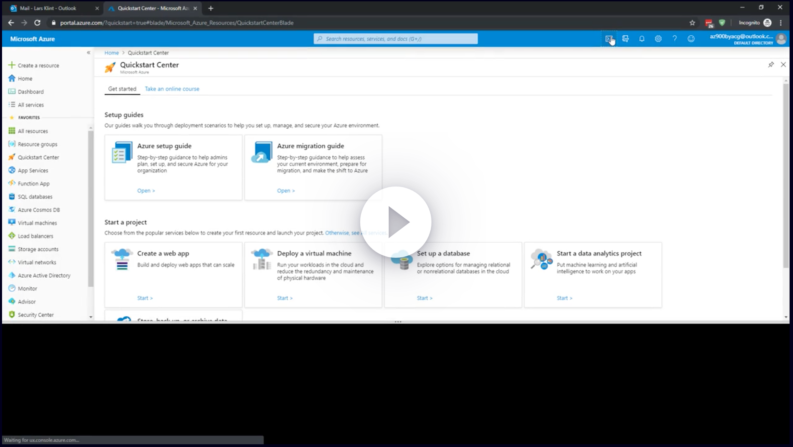

### [Summary](https://learn.acloud.guru/course/az-900-microsoft-azure-fundamentals/learn/introduction/summary/watch)

- 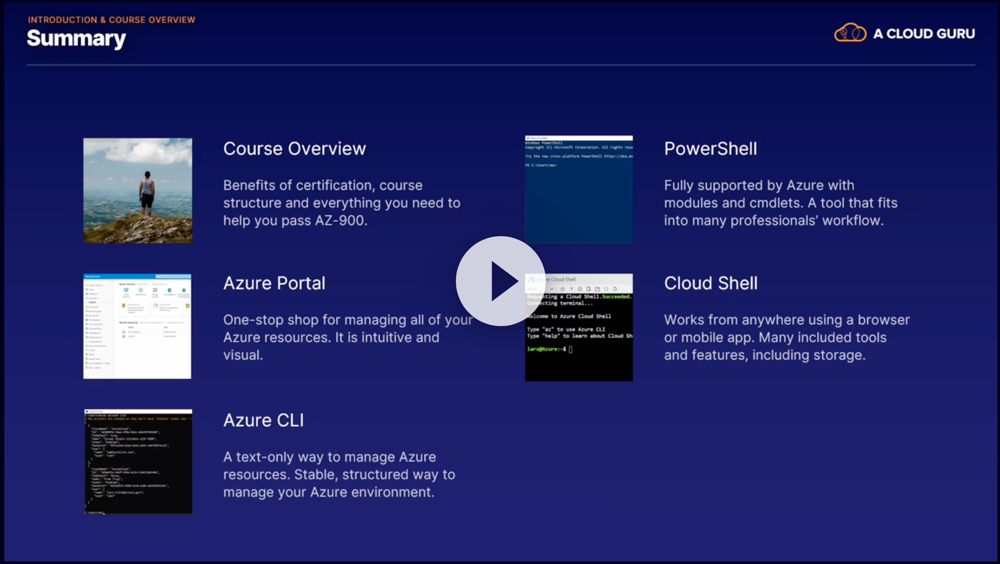

## 2. Cloud Concepts

### [Introduction](https://learn.acloud.guru/course/az-900-microsoft-azure-fundamentals/learn/cloud-concepts/introduction/watch)

### [The Language of Cloud Computing](https://learn.acloud.guru/course/az-900-microsoft-azure-fundamentals/learn/cloud-concepts/the-language-of-cloud-computing/watch)

- Resilience
  - High Availability
    - Traditional:
      - You own the hardware
      - Physical access
      - You can't "just add servers"
    - Cloud
      - You don't own the hardware
      - Add more servers with a click
      - If hardware fails, replace instantly
      - Uses clusters
  - Fault Tolerance
    - Resilient to outages
    - Zero down-time for services provided by Azure
  - Disaster Recovery
    - Catastrophic disaster
    - Complete plans to recover critical business systems
    - Configured with a time to recovery and recovery point
- Infinite(ish) resources
  - Scalability
    - Scala out, up, or down
    - Auto-scaling
  - Elasticity
    - Ability to quickly expand/shrink resources
  - Agility
    - Ability to rapidly develop, test, and launch applications to drive business growth

### [The Economy of Cloud Computing](https://learn.acloud.guru/course/az-900-microsoft-azure-fundamentals/learn/cloud-concepts/the-economy-of-cloud-computing/watch)

- Capital Expenditure (CapEx)
  - Money spent by an organization on acquiring/maintaining fixed assets (land, buildings, servers)
  - E.g., buying servers
  - Large upfront investments
- Operational Expenditure (OpEx)
  - An ongoing cost for running a product, business, or system
  - E.g., cost to run servers
  - Pay-as-you-go
- Switching to cloud: CapEx &rarr; OpEx
- Pricing models
  - Hourly pricing
    - Pay for time
  - Consumption-based pricing
    - Pay for resource used (per execution, per second, or a combination)
    - Low usage &rarr; low cost

### [Cloud Service Models](https://learn.acloud.guru/course/az-900-microsoft-azure-fundamentals/learn/cloud-concepts/cloud-services-models/watch)

- 3 models + 1 more
  - Infrastructure as a Service
    - IaaS
    - Infrastructure: Actual servers
    - Scaling is fast
    - No ownership of hardware
    - Examples
      - VMs & servers
      - Networks
      - Physical buildings
  - Platform as a Service
    - PaaS
    - A superset of IaaS
    - Supports complete web application life cycle
    - Avoids software license hell
    - Examples
      - Middleware
      - Tools
  - Software as a Service
    - SaaS
      - Implicitly includes IaaS and Paas
    - Provides a managed service
    - No maintenance; latest features.
    - Access fee.
    - Examples
      - Apps
  - Serverless
    - _You_ don't have to manage any servers.
    - Examples
      - Azure Functions
    - Takes PaaS to the most extreme, abstracting away the server.
- Service is the core of Azure.

### [Azure Marketplace](https://learn.acloud.guru/course/az-900-microsoft-azure-fundamentals/learn/cloud-concepts/azure-marketplace/watch)

- Large selection of solutions and services from Microsoft and partners
  - Apps, VMs, templates, services, etc.
- Like an Azure app store
- Easy to integrate; accessed from portal, CLI, PowerShell.
- Microsoft Partners can publish services.

### [Cloud Architecture Models](https://learn.acloud.guru/course/az-900-microsoft-azure-fundamentals/learn/cloud-concepts/cloud-architect-models/watch)

- 3 general models:
  - Private
    - An incarnation of Azure on your hardware in a location of your choice.
    - The services within the cloud are offered to selected users only.
    - An organization can create their own cloud, but get the benefits of public cloud.
    - Better security and privacy.
  - Cons
    - Organization's IT department is responsible for maintenance and staffing
  - Public
    - Pros
      - Azure, AWS, GCP, etc.
      - No purchase of hardware.
      - No upfront costs; low monthly fees.
    - Cons
      - No control over features and version.
      - No physical access
  - Hybrid
    - Mix of private and public
    - Pros
      - Avoids disruptions and outages
      - Adhere to regulation, governance, etc.
      - Data spans both public and private cloud.
      - Can alleviate some of the large CapEx investments for private cloud.
    - Cons
      - Can lead to complex infrastructure

### [Summary](https://learn.acloud.guru/course/az-900-microsoft-azure-fundamentals/learn/cloud-concepts/summary/watch)

- 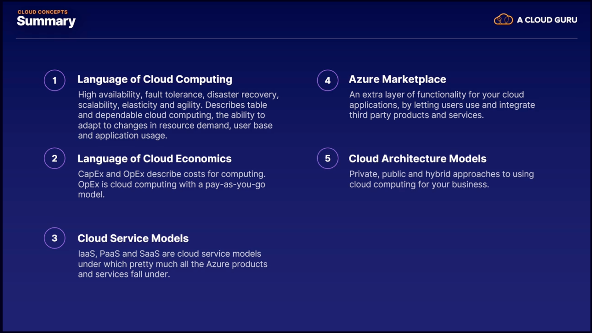

## Azure Architecture

### [Introduction](https://learn.acloud.guru/course/az-900-microsoft-azure-fundamentals/learn/azure-architecture/introduction/watch)

- Regions
  - Paired Regions
- Availability Zones
- Resource Groups
- Azure Resource Manager

### [Regions and Availability Zones](https://learn.acloud.guru/course/az-900-microsoft-azure-fundamentals/learn/azure-architecture/regions-and-availability-zones/watch)

- "A region is a set of datacenters deployed within a latency-defined perimeter and connected through a dedicated regional low-latency network."
  - Each region has more than 1 datacenter.
  - Not too far from each other
  - A fiber connection between data centers in the region.
  - &rarr; Two or more data centers not too far from each other connected via fiber.
- How to choose a region?
  - Location
    - Closest to users (to minimize latency)
  - Features
    - More recent regions are less likely to have all features
  - Price
    - Varies by region (e.g., 20-30% different).
- Each region is paired with another region within the same geographic area
  - 1 exception: Brazil South, paired with South-Central US
  - If the primary region experiences an outage, you can failover to secondary region.
  - Across region pairs, Azure serializes updates: Only 1 paired region is updated at a time.
  - Some replication across pairs.
- Availability Zones
  - Unique physical locations within a region
  - Independent: 1 or more data center, with unique power, cooling, and networking.
  - Each region (that supports AZs - not all do) has a minimum of 3 zones.
- For VMs, you need to select how many zones you want to be in.
  - Zone-redundant storage, on the other hand, is automatically replicated across zones.

### [Resource Groups and Azure Resource Manager](https://learn.acloud.guru/course/az-900-microsoft-azure-fundamentals/learn/azure-architecture/resource-groups-and-azure-resource-manager/watch)

- Resource Groups
  - Essential to architecture on Azure.
  - _Everything_ (no exceptions) on Azure is inside a Resource Group.
  - A Resource Group is _not_ a resource.
    - Think of it like a container.
  - Key facts
    - Each resource can only exist in 1 resource group.
      - No exceptions.
    - Can add/remove resources to/from a Resource Group at any time.
    - Can move a resource from one Resource Group to another.
    - Can contain resources located in different regions.
    - Can be used to manage access control.
    - A resource can interact with resources in other Resrouce Groups.
    - A Resource Group does need a location (for storing metadata).
- Azure Resource Manager (ARM)
  - The underpinning of everything on Azure, in terms of creating/updating/deleting resources.
  - When interacting with any resources, it goes through the ARM (portal, CLI, PowerShell, SDKs, etc.).
  - Benefits
    - Can deploy/manage/monitor resources as a group.
    - Deploying from various tools results in a consistent state.
    - Built-in access control.
    - Can logically organize resource via tags.
    - Tagging can group billing.
- 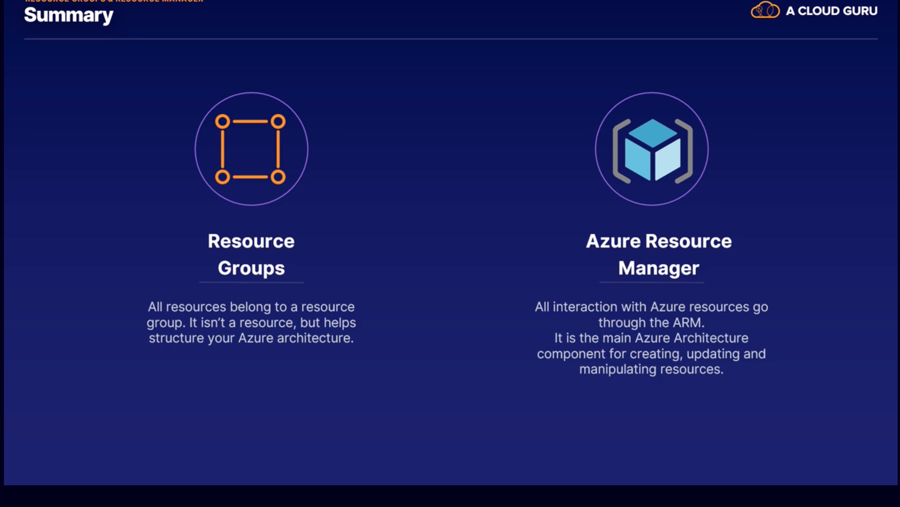

### [Lab: Creating Azure Resources](https://learn.acloud.guru/course/az-900-microsoft-azure-fundamentals/learn/azure-architecture/creating-azure-resources/watch)

- Ways to create a resource
  - `+ Create a Resource` &rarr; virtual machine
  - Or by search bar &rarr; virtual machine
  - Or from favorites
- First: Create a resource group
  - A container holding other resources.
  - `+ Add`
    - Select a subscription, provide a resource group, and select a region
  - We can now place resources in the resource group
- Create a virtual machine
  - Select our resource group
  - Give it a name
  - Place it in a region
  - Select an image
  - Give it an admin username & password
  - (Many more options; none additional needed right now.)
  - Can `Go to resource`
    - VM overview
      - Status
      - Location
      - Public/private IP addresses
- Then delete to prevent using up credits.
  - Note how many resources were created as part of the VM.
- And delete the resource group.

### Quiz

- When a resource group is removed or deleted, all of the resources within it are deleted with it. You can remove resource groups at any time.

## Compute

### [Introduction](https://learn.acloud.guru/course/az-900-microsoft-azure-fundamentals/learn/compute/introduction/watch)

- Any service that enables a computation in the cloud.
  - Virtual Machines
  - Scale Sets
  - App Services
  - Container Instances
  - Kubernetes Service
  - Functions

### [Virtual Machines](https://learn.acloud.guru/course/az-900-microsoft-azure-fundamentals/learn/compute/virtual-machines/watch)

- VMs were the first service to take off in the cloud.
- VM: A server/computer that you have exclusive access to - but that doesn't have its own hardware.
  - Virtualized hardware.
  - Part of IaaS.
  - Blueprints (templates for creating VMs) can be used to ensure compliance with company guidelines.
- Pricing
  - Calculated hourly, based on resources.
- Use cases:
  - When you need to control all aspects of an environment or machine.
  - When you want to install specific applications on your Windows or Linux machines.
  - When you want to move existing resources and VMs to Azure from on-prem or another cloud provider.
- Cons:
  - Requires maintenance.

### [Scale Sets](https://learn.acloud.guru/course/az-900-microsoft-azure-fundamentals/learn/compute/scale-sets/watch)

- Scale Sets let you manage a group of _identical_ load-balanced VMs.
  - Based on a baseline VM.
- Benefits
  - Managing multiple VMs in a scale set is simple via a load balancer.
  - If one VM fails or stops, the others in the scale set keep working.
  - Can auto-scale to match demand.
  - Can run up to 1k VMs in a single set.
  - No extra costs for the scale set itself.

### [App Service](https://learn.acloud.guru/course/az-900-microsoft-azure-fundamentals/learn/compute/app-service/watch)

- Part of the PaaS part of Azure.
  - App Services are a fully-managed platform: servers, network, and storage are handled by Azure
- 3 categories
  - Web Apps
    - Windows or Linux
    - .NET, Java, Node.js, PHP, Python, Ruby
    - Easy integration with other Azure tools
    - Auto-scaling & load balancing
  - Web Apps for Containers
    - Deploy & run containerized applications on Azure
    - All dependencies are shipped inside the container: Deploy an image anywhere with a consistent experience.
    - Reliability between environments.
  - API Apps
    - Expose and connect backend data

### [Azure Container Instances](https://learn.acloud.guru/course/az-900-microsoft-azure-fundamentals/learn/compute/073df3cc-6a38-14dd-741a-7643d465935e/watch)

- Containers:
  - Provide a simplified way to manage dependencies
  - Require less overhead
  - Increase portability
  - Enhance efficiency
  - Ensure consistency
- Can publish to something like Azure Container Instances (ACI)
  - The primary service on Azure for hosting/running workloads in a container.
  - Can run containers on-demand: no management of VMs required.
  - Can use Portal, CLI, PowerShell.

### [Azure Kubernetes Service](https://learn.acloud.guru/course/az-900-microsoft-azure-fundamentals/learn/compute/39f7c614-6a31-f743-026c-125a01473815/watch)

- Greek: "governor" or "captain" (thus, the wheel symbol)
  - K8s
- "Kubernetes is an open-source container orchestration system for automating application deployment, scaling, and management."
- Benefits
  - Can reuse your container architecture
  - Managed service (with IAM, elastic provisioning, etc.)
  - Global Reach via Azure Stack
- The images come from the Azure Container Registry (ACR)
  - Keeps track of current valid images
  - Manages files and artifacts for containers
    - Managed service
  - Feeds container images to ACI and AKS.
- A cluster: A set of machines (nodes) that run containerized applications managed by K8s.
  - A pod is a group of 1 or more containers, with a shared storage network and a specification for how to run the containers.
  - 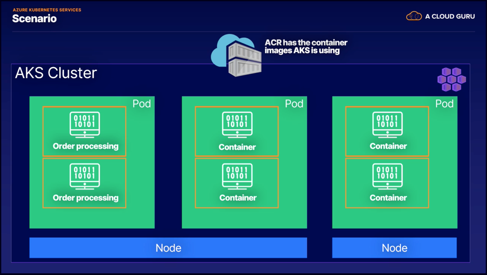

### [Function](https://learn.acloud.guru/course/az-900-microsoft-azure-fundamentals/learn/compute/functions/watch)

- The smallest compute service on Azure.
- A single function of compute that happens when its address (URL) is hit.
- The function runs once, processes the request, and stops.
- Functions still use a VM, but this is abstracted away.
- Benefits
  - Only runs when there is data to process &rarr; saves money.
  - Failures are isolated to the run on which it fails.

### [Lab: Azure App Services](https://learn.acloud.guru/course/az-900-microsoft-azure-fundamentals/learn/compute/lab-azure-app-services/watch)

- Add a (Web App) `App Service`
  - Create a resource group
  - Give it a name
    - Must be globally unique (for URL)
  - .NET core
  - We'll use defaults
  - App Service Plan
    - An App Service is always within an App Service Plan. Think of the App Service Plan as being like the server.
      - Can change size (throughput).
      - Can select `Dev/Test` (a free option on shared infrastructure) or `Production`.
- Can `Go to resource`
  - 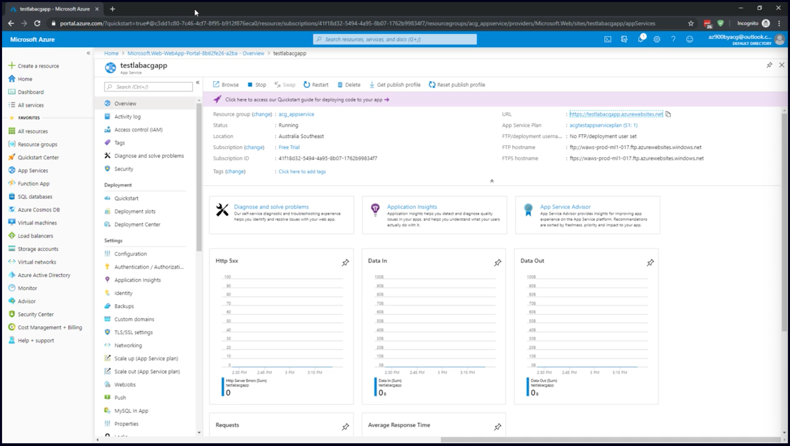
  - Note: `URL`
    - https://<name>.azurewebsites.net
    - Default website
- Delete resource group

### [Summary](https://learn.acloud.guru/course/az-900-microsoft-azure-fundamentals/learn/compute/summary/watch)

- 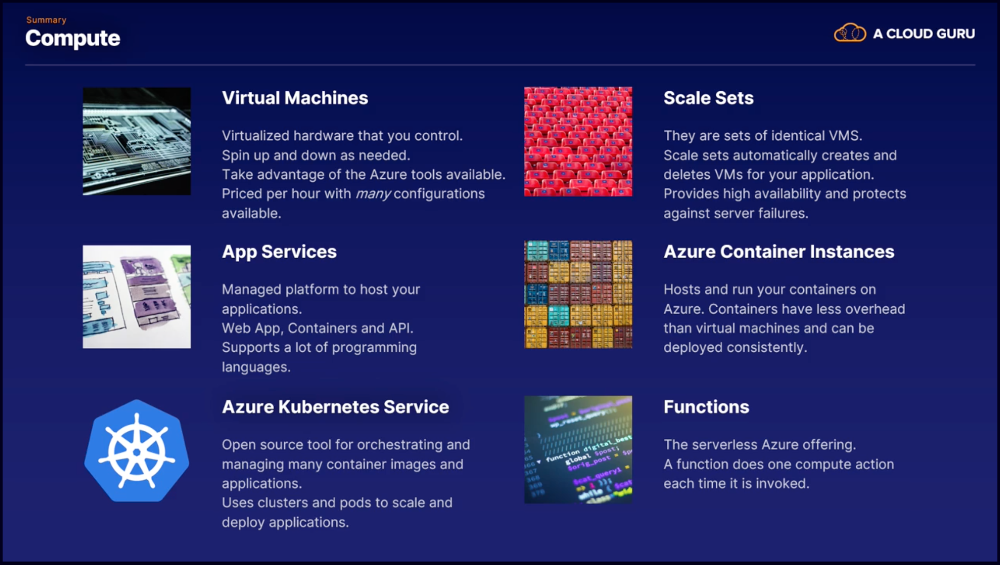

## Networking

### [Introduction](https://learn.acloud.guru/course/az-900-microsoft-azure-fundamentals/learn/networking/introduction/watch)

### [Virtual Network](https://learn.acloud.guru/course/az-900-microsoft-azure-fundamentals/learn/networking/59630503-b6a1-c098-c843-85ace8707b36/watch)

- Most fundamental part of Azure networking.
- Often called a VNet
- Enables resources to communicate with each other and the Internet.
- Physical hardware is abstracted.
- A VNet is similar to a traditional network
  - Address space
    - Range of IP addresses available
    - Each service or resource connected will get its own unique IP address
  - Subnets
    - Enable segmenting the VNet into multiple portions.
    - Enables multiple networks on a single VNet.
      - Groups resources
      - Enables more efficient address space allocation.
      - Can use subnet security groups.
  - Each VNet belongs to a single region.
    - All resources must be in that region.
    - They can communicate across regions if need be.
  - A VNet belongs to just one subscription (though a subscription can have multiple VNets).
- Cloud advantages
  - Scalability (VNets or addresses)
  - High availability for resources
    - E.g., peering VNets through a load balancer, or a VPN gateway
  - Isolation

### [Load Balancer](https://learn.acloud.guru/course/az-900-microsoft-azure-fundamentals/learn/networking/8bdfa276-ae9d-713b-2787-eaf61b8e64ee/watch)

- A "Load Balancer distributes new inbound flows that arrive on the Load Balancer's frontend to backend pool instances, according to rules and health probes."
  - Inbound flows
    - Traffic from the Internet or local network
  - Frontend
    - The access point for the load balancer. All traffic goes here first.
  - Backend pool
    - VM instances receiving the traffic
  - Rules & health probes
    - Checks to ensure the backend instances can receive the data
- Scenarios
  - Incoming Internet traffic
  - Incoming traffic from internal networks
  - Port forwarding
  - Outbound connectivity for backend pool VMs

### [VPN Gateway](https://learn.acloud.guru/course/az-900-microsoft-azure-fundamentals/learn/networking/dcaddb12-3a0c-64a1-04a6-bddd86075de5/watch)

- A Virtual Network Gateway is 1 or more VMs deployed to a Gateway Subnet.
- A VPN Gateway is a specific type of VNet Gateway, used to send encrypted traffic between an Azure VNet and an on-prem location across the public Internet.
  - A core part of a hybrid solution.
- Main components: A Site-to-Site Connection (or can have a multi-site connection)
  - An Azure VNet with an VPN Gateway attached (will have its own public IP address)
  - Tunnel
    - A secure, encrypted connection
  - On-Prem network with a gateway that can accept the encrypted data
- 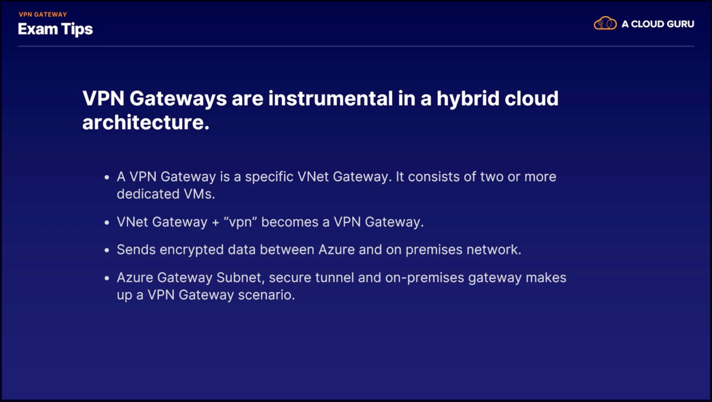

### [Application Gateway](https://learn.acloud.guru/course/az-900-microsoft-azure-fundamentals/learn/networking/a5b8496d-4af7-8ad6-eef8-9ec04f34103c/watch)

- Vs. a load balancer
  - 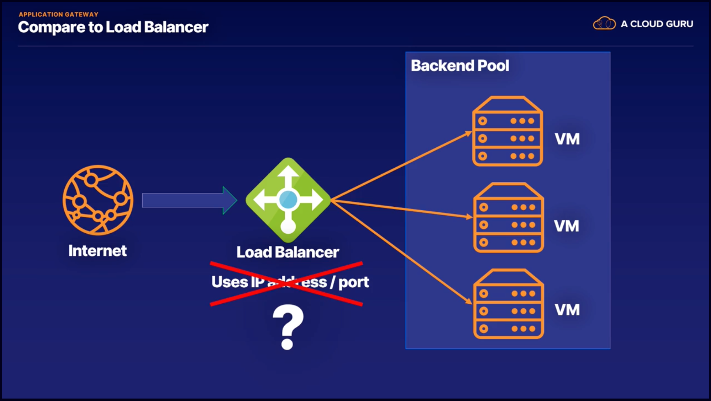
    - Routes based on IP address & port number
  - 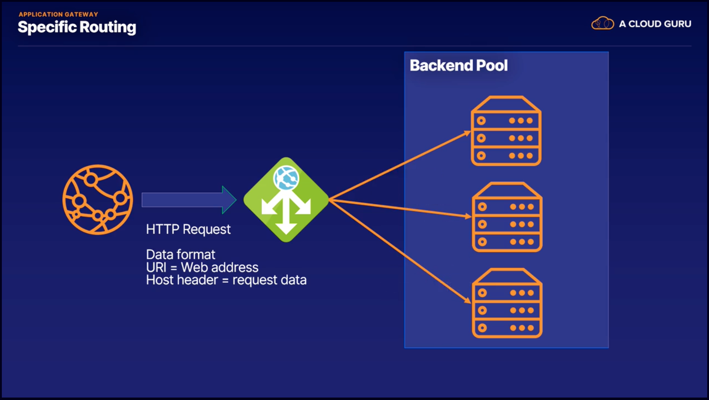
    - Can route based on additional criteria
- Benefits
  - Can scale up/down based on traffic
  - End-to-end encryption for all traffic
    - Can disable encryption to backend tool to speed up processing
  - Zone redundancy
  - Multi-site hosing for up to 100 websites.
- An application gateway is a higher level load balancer.
  - Works on HTTP request (vs. IP address and port).
  - Traffic from a specific web address can go to a specific machine.

### [Content Delivery Network](https://learn.acloud.guru/course/az-900-microsoft-azure-fundamentals/learn/networking/a432a83c-34ce-e8a3-7434-a8824b738e78/watch)

- CDN: A distributed network of servers that can deliver web content close to users.
  - Content can be cached on edge nodes (locations closer to users).
    - Expiration & cache invalidation
- Benefits
  - Better performance, especially with multiple round trips.
  - Scaling, and it protects your backend.
  - Distribution of user requests & serving of content.
- Cache
  - A collection of temporary copies of original files.
  - Primary purpose: Speed things up.
- Origin Server
  - Master copy.

### [Lab: Create a Virtual Network Connection](https://learn.acloud.guru/course/az-900-microsoft-azure-fundamentals/learn/networking/lab-virtual-network-connection/watch)

- Portal > Virtual networks > Add
  - Name
  - Address space
    - 192.168.0.0/24
      - &rarr; 192.168.0.0 - 192.168.0.255
        - We can have 256 resources attached to this network.
      - Don't need to know CIDR notation right now.
  - Create a resource groupo
  - Location
  - Subnet
    - Name
    - Address range
      - 192.168.0.0/28
        - &rarr; 192.168.0.0 - 192.168.0.15
- Add resources to the VNet
  - Virtual machines > Add
    - Resource group
      - Normally, when you create a VM, it creates a VNet for you.
      - Here, we'll specify the VNet.
    - Windows
    - Admin Username & PW
    - Next: Disks
    - Next: Networking
      - Virtual network
      - Use the subnet we created
      - Create a new public IP address
      - Use defaults
- Everything on Azure is part of a VNet (so the service can talk to each other and to the Internet).
- Delete resource group.
- Delete VNet.

### [Summary](https://learn.acloud.guru/course/az-900-microsoft-azure-fundamentals/learn/networking/06b44b42-ba1c-e4d4-dba2-2f54714a27ba/watch)

- 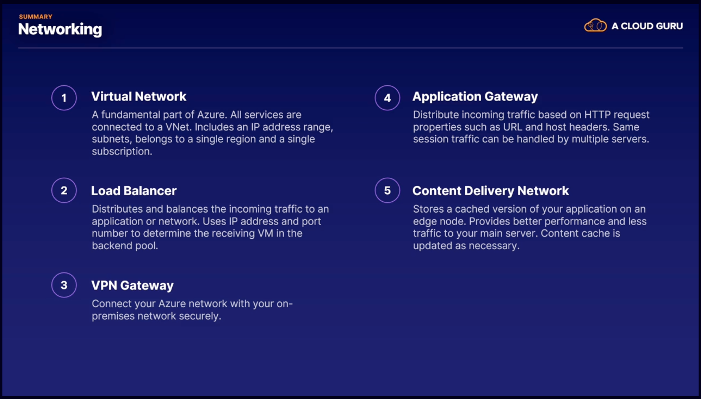

### Quiz

- A Virtual Network connects Azure services to allow them to communicate with each other and with the outside world. Some resources, such as Virtual Machines, must have a Virtual network connection, where others, such as App Services, are not required to. The type of Azure subscription has no influence on how a Virtual Network is used.

## Storage

### [Introduction](https://learn.acloud.guru/course/az-900-microsoft-azure-fundamentals/learn/storage/introduction/watch)

- An Azure Storage Account: A unique Azure namespace
  - Each object in Azure has its own web address
    - E.g., `acloudguru.<storagetype>.core.windows.net`

### [Blob](https://learn.acloud.guru/course/az-900-microsoft-azure-fundamentals/learn/storage/a221d327-720c-b36f-c3ab-7c6e44da8ed4/watch)

- Blob: Binary Large Object
  - Pretty much anything
  - _Blobs_ are stored in _containers_ in a _storage account_.
  - Use cases
    - Images
    - Files
    - Streaming content
    - Log files
    - Data store
  - 3 types of blobs
    - Block
      - Up to 4.7 TB
      - Made up of blocks that can be managed individually
    - Append
      - Optimized for append operations (e.g., logs)
    - Page
      - Up to 8 TB
      - Any part of the file can be accessed at any time (e.g., virtual hard drive)
  - 3 pricing tears
    - Hot
      - For frequently-accessed files.
      - Lowest access times.
      - Highest access costs.
    - Cool
      - Intended for data that will remain in the cool tier for at least 30 days.
      - Lower storage costs.
      - Higher access times.
    - Archive
      - Lowest cost.
      - Highest access times.

### [Disk](https://learn.acloud.guru/course/az-900-microsoft-azure-fundamentals/learn/storage/e720bc20-99cb-e818-5c62-11e6cb38253d/watch)

- A _managed_ disk is what you attach to your VMs.
  - Azure manages backups and uptime
  - Azure guarantees size and performance.
  - Can easily upgrade disk size and disk type.
  - 4 main disk types:
    - HDD
      - Old-school spinning hard drive.
      - Low cost.
      - Good for infrequent access.
        - Backups, development.
    - Standard SSD
      - For production environments
    - Premium SSD
      - Super fast, high performance.
      - Recommended for databases.
    - Ultra Disk
      - For the most demanding, data-intensive workloads.
        - Transactions, analytics, gaming, rendering, etc.
      - Up to 64 TB

### [File](https://learn.acloud.guru/course/az-900-microsoft-azure-fundamentals/learn/storage/34b96e05-93e0-8ea6-6c31-31acb1e22e54/watch)

- Typical issues with fileshares
  - Constraints (e.g., size)
  - Backups
  - Security
  - Extending access to other teams, etc.
- Benefits with a File Storage Account on Azure
  - Can share across multiple machines
  - Fully-managed
  - Resilient
- Scenarios
  - Hybrid with on-prem (such as to expand space, or replace on-prem)
  - Lift & shift
    - Move all infrastructure to Azure

### [Archive](https://learn.acloud.guru/course/az-900-microsoft-azure-fundamentals/learn/storage/e003f503-30df-a142-73aa-376548a6242c/watch)

- Use case: For policies, legislation, and recovery
- Lowest-priced storage tier within Azure (e.g., TBs for a few dollars per month)
- Azure Archive provides durable, encrypted, and stable data storage.
- Can be used to free-up more valuable storage (e.g., on-prem).
- Archive Storage is a blob storage tier.

### [Lab: Creating a Storage Account](https://learn.acloud.guru/course/az-900-microsoft-azure-fundamentals/learn/storage/lab-creating-storage-account/watch)

- Azure Portal &rarr; Storage Accounts &rarr; Add
  - Choose a subscription
  - Create (or select) a resource group
  - Provide a `Storage account name`
    - All lower-case, no special characters.
  - Location
  - Performance
    - Standard or premium
  - Defaults for others
  - Create
  - Go to resource
    - 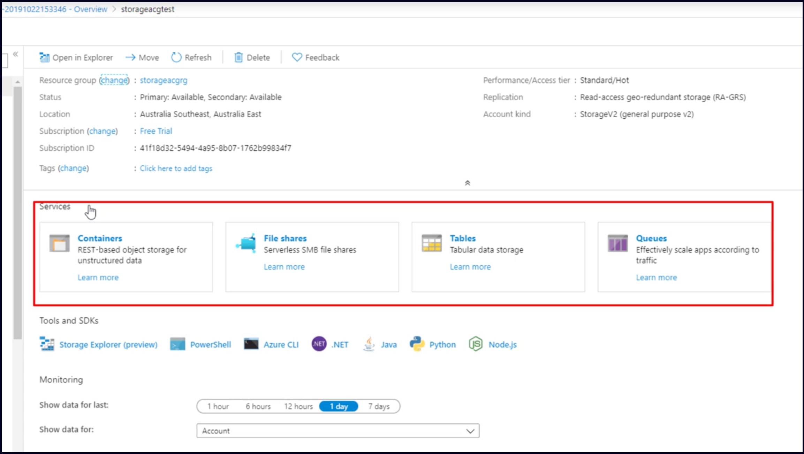
    - Containers
      - `+ Container`
        - Name
        - Public access level
      - Upload a file
      - If we change it to `Blob (anonymous read access for blobs only)`, the file is accessible on the Internet.
        - 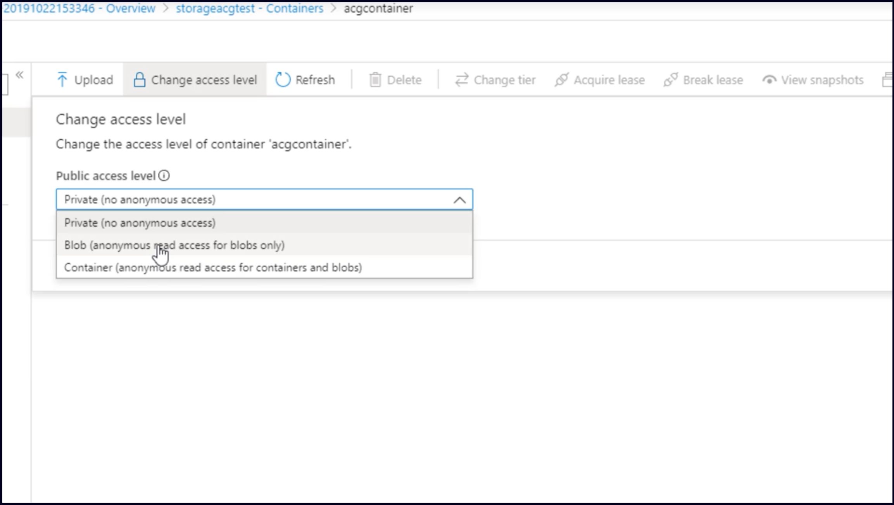
        - 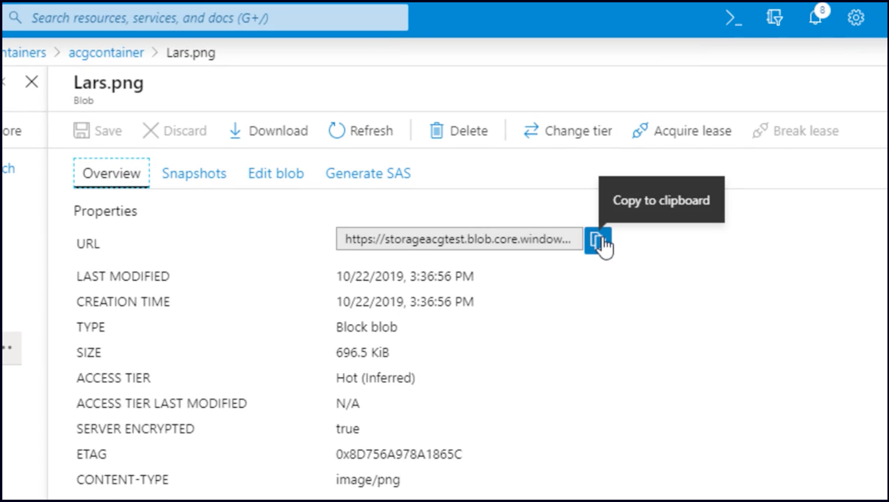
          - storageacgtest.blog.core.windows.net/acgcontainer/Lars.png
- Clean up resources (delete resource group)

### [Summary](https://learn.acloud.guru/course/az-900-microsoft-azure-fundamentals/learn/storage/d66b9bf1-2fc4-1120-be59-6a6491aa7be6/watch)

- 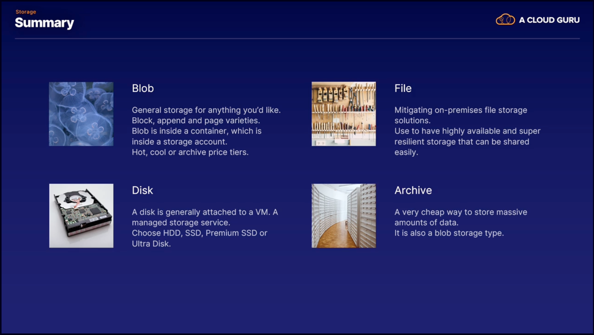

## Database

### [Introduction](https://learn.acloud.guru/course/az-900-microsoft-azure-fundamentals/learn/database/introduction/watch)

### [Cosmos DB](https://learn.acloud.guru/course/az-900-microsoft-azure-fundamentals/learn/database/9a1b830a-ea75-00b4-e6cb-3023e92dccfb/watch)

- Cosmos is global (from the start, with the click of a button)
  - Traditional databases are notoriously bad at distribution and synchronization
  - With Cosmos, it's one click to add a region. Azure takes care of the rest.
- Cosmos DB promises single-digit millisecond latency anywhere in the world.
- Cosmos DB can be set to automatically scale.
- 'Infinite' resources.
- You only pay for what you use.
- Connectivity
  - Cosmos supports a wide range of ways to work with it (SDKs and APIs).
  - Support for most modern languages.
  - Support for a variety of platforms
    - SQL
    - MongoDB
    - Cassandra
- Warning
  - It can get quite expensive (as Cosmos scales up)

### [Azure SQL](https://learn.acloud.guru/course/az-900-microsoft-azure-fundamentals/learn/database/579b4230-fe11-3bc8-4115-0ba488607dac/watch)

- Microsoft's SQL database was launched in 1989.
- Azure SQL
  - A database as a service
    - Azure handles your hardware and IaaS needs.
- On-prem SQL Server instances can be seamlessly migrated to Azure SQL.
- Built-in machine learning
  - Optimization
  - Warnings (e.g., degradation or anomalies)
- Cloud benefits
  - Scalability
  - Space
    - Up to 100 TB
  - Security
    - Built-in Azure security

### [Azure Database for MySQL](https://learn.acloud.guru/course/az-900-microsoft-azure-fundamentals/learn/database/2fcd0912-e8c5-3649-11ee-bb2ada82ba92/watch)

- Context
  - Open source
  - Relational
  - Mature and stable
- Azure advantages
  - Paas: The infrastructure is managed by Azure
  - Can focus on development (instead of managing servers and networks)
  - Choice of language and framework (e.g., PHP and WordPress)
  - High availability and scalability
  - Azure security features
    - Treat detection, identity management, monitoring
  - Automatic patching, backups, etc.

### [Azure Database for PostgreSQL](https://learn.acloud.guru/course/az-900-microsoft-azure-fundamentals/learn/database/770ce200-697b-7a43-11b9-c57f6347867f/watch)

- Name: Because the first version was based on Ingres.
- Free & stable (since 1996).
  - Default database for MacOS
- Lots of extensions
  - JSONB
  - Geospatial functions
  - Indexing
  - Integration with VS Code
- Horizontal scaling with hyperscale
  - Can scale easily to hundreds of nodes
- Performance recommendations based on usage
- Fully-managed cloud capabilities
- Use cases
  - Financial applications
    - Can be integrated with Matlab and R
  - PostGIS
  - Automated failover and full redundancy

### [Database Migration Services](https://learn.acloud.guru/course/az-900-microsoft-azure-fundamentals/learn/database/d19abb9b-9683-1cbe-e631-080b49d43838/watch)

- One-step migration from Microsoft SQL to Azure SQL
- Comprehensive guides
  - Including for migrating from non-MS databases.

### [Lab: Creating Cosmos DB](https://learn.acloud.guru/course/az-900-microsoft-azure-fundamentals/learn/database/lab-creating-cosmos-db/watch)

- Azure portal &rarr; Cosmos DB &rarr; Add
  - Subscription & resource group
  - Account name
    - For the DB
  - Location, etc.
  - Create
  - Go to resource
    - Note URI
      - 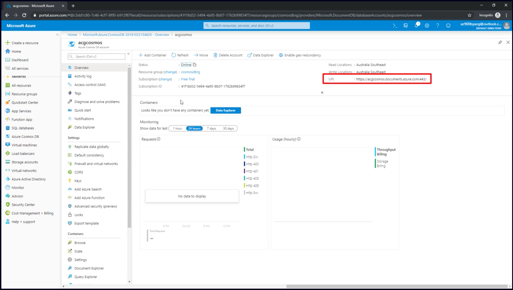
    - Note: `Replicate Data Globally`
      - Can enable more data centers with a click.
        - 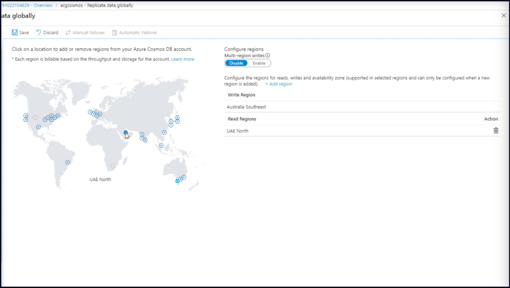
- Clean up resources

### [Summary](https://learn.acloud.guru/course/az-900-microsoft-azure-fundamentals/learn/database/75aea0f1-552b-69b9-9630-3954ce4cae3f/watch)

- 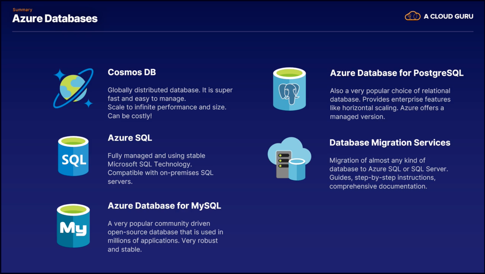

## Authentication and Authorization

## Azure Solutions

## Security

## Privacy, Compliance and Trust

## Pricing

## Support

## Exam Preparation
