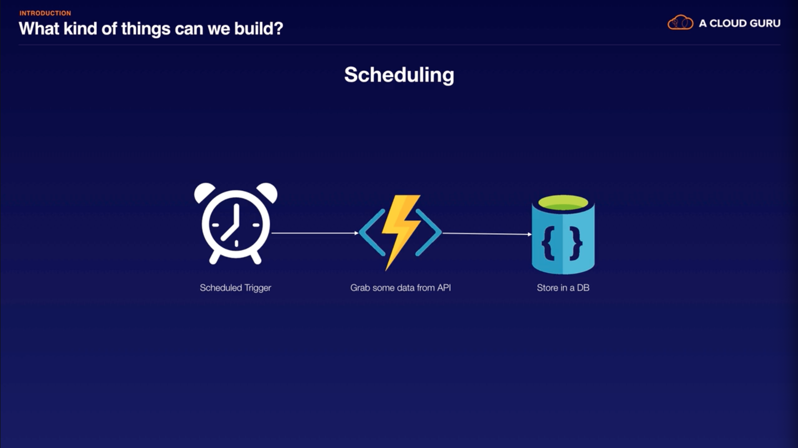

# [Introduction to Serverless on Azure](https://acloud.guru/learn/azure-intro-serverless) (A Cloud Guru, Dean Bryen)

## Introduction

### [Introduction](https://acloud.guru/course/azure-intro-serverless/learn/11f9f04a-c8a8-b34d-e1db-851947d532c6/c13aaace-f3a0-1719-22a3-0bbe9ad04f17/watch)

### [What is Serverless?](https://acloud.guru/course/azure-intro-serverless/learn/11f9f04a-c8a8-b34d-e1db-851947d532c6/ed45fec6-7496-86f6-2d19-db8adf56ba97/watch)

- What is Serverless?
  - Event-based
  - Managed/scalable
  - Pay per use
- Serverless services
  - Comprised of the services that meet the 3 characteristics above.
- Serverless patterns
  - Comprised of both truly serverless services adn complimentary managed services to make 'serverless apps'.

### [Azure Serverless Offering](https://acloud.guru/course/azure-intro-serverless/learn/11f9f04a-c8a8-b34d-e1db-851947d532c6/c7607a4d-cb49-712a-b9c5-9f66337657b3/watch)

- 3 truly serverless Azure services
  - Azure Functions
    - FaaS
  - Event Grid
    - Serverless event router (pub/sub)
  - Logic Apps
    - Graphically design workflows
      - Workflows as a service.
    - Integrate with 3rd party services
- Complimentary services
  - CosmosDB
    - Multi-model, scalable, NoSQL
  - IoT Hub
    - IoT broker for receiving telemetry data from IoT devices
  - Queues
    - Decouple asynchronous services
  - Azure Storage
    - Static content, media assets
  - Event Hubs
    - Managed service for streaming/telemetry data into Azure
  - Azure AD
    - Authentication & authorization

### [Serverless Patterns](https://acloud.guru/course/azure-intro-serverless/learn/11f9f04a-c8a8-b34d-e1db-851947d532c6/3238edf7-8bc1-7de6-62a5-d28f0ff46755/watch)

- 
- 
- 
- 

### [What We're Building](https://acloud.guru/course/azure-intro-serverless/learn/11f9f04a-c8a8-b34d-e1db-851947d532c6/b7625ba2-808f-001a-0907-3665dbc88653/watch)

- 

## Getting Set Up

### [Before We Start](https://acloud.guru/course/azure-intro-serverless/learn/6da8bd80-5988-cd0e-e9d2-4580d1b21ad3/e9076f44-d110-3c6d-02d4-b20e85230a34/watch)

### [Getting Your Azure Account](https://acloud.guru/course/azure-intro-serverless/learn/6da8bd80-5988-cd0e-e9d2-4580d1b21ad3/e8f6cb59-c8a1-a4c0-a526-4f6ab3324882/watch)

- [https://azure.microsoft.com/en-us/free/](https://azure.microsoft.com/en-us/free/)
- Sign up with Microsoft account.
- Sign in at [https://portal.azure.com/](https://portal.azure.com/#home)

### [Installing Node.js and NPM](https://acloud.guru/course/azure-intro-serverless/learn/6da8bd80-5988-cd0e-e9d2-4580d1b21ad3/4da92ede-363a-373a-82c9-bd28d28de738/watch)

- Download LTS from [https://nodejs.org/en/](https://nodejs.org/en/)
- Note: Had to `nvm use 12`.

### [Azure Functions Core Tools](https://acloud.guru/course/azure-intro-serverless/learn/6da8bd80-5988-cd0e-e9d2-4580d1b21ad3/e31ab6ed-9365-e08c-5b70-2d097862d736/watch)

- .NET Core & Azure Function Core Tools
- [https://docs.microsoft.com/en-us/azure/azure-functions/functions-run-local?tabs=macos%2Ccsharp%2Cbash](https://docs.microsoft.com/en-us/azure/azure-functions/functions-run-local?tabs=macos%2Ccsharp%2Cbash)
  - There are 2 versions. We'll be using version 2.x.
  - Follow steps for macOS
    - Install .NET Core 2.1 for macOS.
      - May be able to use [extension bundles](https://docs.microsoft.com/en-us/azure/azure-functions/functions-bindings-register#extension-bundles) instead?
    - Install Core Tools

```sh
brew tap azure/functions
brew install azure-functions-core-tools
```

### [VSCode and Extensions](https://acloud.guru/course/azure-intro-serverless/learn/6da8bd80-5988-cd0e-e9d2-4580d1b21ad3/7e48fe79-adf9-4fa2-6987-f27f0aec8e29/watch)

- [https://code.visualstudio.com/](https://code.visualstudio.com/)
- Extensions:
  - Azure Functions
    - `ms-azuretools.vscode-azurefunctions`
  - Azure Cosmos DB
    - `ms-azuretools.vscode-cosmosdb`
- Extension are now visible in the Azure side panel.
- Sign in to Azure.

### [Git and GitHub Repo](https://acloud.guru/course/azure-intro-serverless/learn/6da8bd80-5988-cd0e-e9d2-4580d1b21ad3/ac36c399-cad3-e1e1-9e8e-973193edce7e/watch)

- Create repo (or directory): `acloudguru-serverless-azure`

  ```sh
  mkdir acloudguru-serverless-azure
  cd acloudguru-serverless-azure
  ```

## Building a Web API

### [Reminder of What We're Building](https://acloud.guru/course/azure-intro-serverless/learn/f9771d34-046b-7d06-bad0-8d1fe80da26b/d250d155-1797-4f53-468b-226228bd6bf9/watch)

### [Getting the Code from GitHub](https://acloud.guru/course/azure-intro-serverless/learn/f9771d34-046b-7d06-bad0-8d1fe80da26b/fb736801-7aa8-f73c-24e4-c126a5c1c952/watch)

- [https://github.com/acloudguru-resources/Course-Introduction_to_Serverless_on_Azure](https://github.com/acloudguru-resources/Course-Introduction_to_Serverless_on_Azure)
- Copy code for `frontend/index.html` and `frontend/constants.js`:

  ```sh
  mkdir frontend
  touch frontend/index.html
  touch frontend/constants.js
  ```

- Install and run `lite-server`

  ```sh
  npm init
  npm install lite-server
  ```

- Add script to `package.json`: `"dev": "lite-server --baseDir=\"frontend\"",`
- Run `npm run dev`

### [Overview of Azure Functions](https://acloud.guru/course/azure-intro-serverless/learn/f9771d34-046b-7d06-bad0-8d1fe80da26b/b1b388bf-9516-f7a7-5898-b965e90c2fa0/watch)

- [https://portal.azure.com/](https://portal.azure.com/)
- The steps below may be out of date. Consider [Create you first function in the Azure portal](https://docs.microsoft.com/en-us/azure/azure-functions/functions-create-first-azure-function)
- Go to `App Services`
  - `Add`
  - Search for `function`
  - Create a `Function App`
  - On the right, `Create`
    - `App name`
      - Provide one.
      - Must be globally-unique.
    - `Subscription`
      - Pick one.
    - `Resource Group`
      - Create new.
      - Everything in Azure is in a resource group.
    - `OS`
      - Windows is fine for now.
    - `Hosting Plan`
      - `Consumption Plan`
        - Pay-as-you-go.
        - 1 million requests per month for free.
        - We'll pick this one.
      - `App Service Plan`
        - Allocate a set number of resources.
        - A set fee per month based on tier.
    - `Location`
      - Pick one.
    - `Storage`
      - Can create new.
    - `Application Insights`
      - Native integration: Monitoring
    - `Application Insights Location`
      - Pick one
  - We're creating a _container_ our functions will reside in.
  - `Create`
- Now go to `Function App`
  - Should see function app created earlier.
  - Add a function
    - `Choose scenario`
      - `Webook + API`
        - We'll use this one.
      - `Timer`
      - `Data processing`
    - `Choose a language`
      - `CSharp`
      - `JavaScript`
        - We'll use this one.
      - `FSharp`
      - `Java`
  - `Create this function`
- `index.js`

  ```js
  module.exports = async function (context, req) {
    context.log("JavaScript HTTP trigger function processed a request.");

    if (req.query.name || (req.body && req.body.name)) {
      context.res = {
        // status: 200, /* Defaults to 200 */
        body: "Hello " + (req.query.name || req.body.name),
      };
    } else {
      context.res = {
        status: 400,
        body: "Please pass a name on the query string or in the request body",
      };
    }
  };
  ```

  - Two variables are passed to the function:
    - `context`
      - Contains information about environment, etc.
      - Call `context.done()` when complete.
    - `req`
      - The request.
  - Save as-is.
  - Can test in the browser (`> Run`).
  - To log anything in an Azure Function:
    - `context.log("foo")`
  - Integrations
    - `Triggers`
      - What invokes the function.
    - `Inputs`
      - These are evaluated before the function.
    - `Outputs`
      - Provides the ability to perform an action upon completion of the function.

- Clean up resources
  - Go to `Resource groups`
  - Select the one we created.
  - `Delete resource group`

### [Creating the First Function](https://acloud.guru/course/azure-intro-serverless/learn/f9771d34-046b-7d06-bad0-8d1fe80da26b/6639c0f5-ef79-9b99-a8e4-fcd4982fac30/watch)

- Make `backend` directory.

  ```sh
  mkdir backend
  ```

- Note:
  - After much troubleshooting, eventually had to open up a new VS Code window for the `backend` directory and create functions from there. Otherwise, they would not show up in the Azure Functions section.
- From the VS Code Azure tab:
  - `Create New Project`
    - Direct it to the `backend` folder via `Browse`.
    - `JavaScript`
    - `Open in current window`
  - What did it do?
    - Created a few files:
      - `.vscode/`
      - `.gitignore`
      - `host.json`
        - We can define some parameters here for our Azure function.
      - `local.settings.json`
        - Referenced from the Azure Function's runtime when running locally.
        - So we'll be adding a Cosmos DB connection string here.
- From the VS Code Azure tab:

  - `Create Function`
    - Select our `backend` directory.
    - `HTTP trigger`
    - `createSpeaker`
    - `Anonymous` authorization level
  - What did this do?

    - Added `createSpeaker/` (each function will get its own directory)

      - `index.js`
        - The code we'll be running when our function is executed (similar to when we created the function via the portal).
      - `function.json`

        ```json
        {
          "bindings": [
            {
              "authLevel": "anonymous",
              "type": "httpTrigger",
              "direction": "in",
              "name": "req",
              "methods": ["get", "post"]
            },
            {
              "type": "http",
              "direction": "out",
              "name": "res"
            }
          ]
        }
        ```

        - Configuration for the function.
          - `httpTrigger` is an input (`in`) binding &rarr; `req`.
          - And we have an output (`out`) binding &rarr; `res`.
          - We can delete the `get`.

      - `sample.dat`

- Run:

  ```sh
  cd backend
  func start
  ```

  - Shows us we have 1 available HTTP function: `createSpeaker: [POST] http://localhost:7071/api/createSpeaker`

- From Postman: POST to `http://localhost:7071/api/createSpeaker?name=Eric`
  - Note: Had to change to Node 12 for `func start` to work.
- Copy `backend/createSpeaker/index.js` from [https://github.com/ACloudGuru-Resources/Course-Introduction_to_Serverless_on_Azure/blob/master/backend/createSpeaker/index.js](https://github.com/ACloudGuru-Resources/Course-Introduction_to_Serverless_on_Azure/blob/master/backend/createSpeaker/index.js).

  - Note that our Costmos DB will use Mongo as an API.

    ```sh
    cd backend
    npm init
    npm install mongodb
    ```

  - `index.js` connects to the database, inserts the body from the request, closes the connection, and tells Azure Functions that it has completed.

### [Setting Up our CosmosDB](https://acloud.guru/course/azure-intro-serverless/learn/f9771d34-046b-7d06-bad0-8d1fe80da26b/0a75da09-c9f3-309a-ea24-d7ad250da306/watch)

- We need an `acloudguru` database with a `speakers` collection, and we need to provide a `speakers_COSMODB` connection string.
- Note:
  - Got error when trying to create DB via Azure tab (multiple days, multiple regions).
    - Error:
  - Eventually succeeded via the portal (maybe a version issue?):
    - `ehelanderacloudguru202004300937`
    - Azure portal > Cosmos DB > Connection String > Primary Connection String.
    - VS Code > Azure tab > Attach Database Accounts > paste primary connection string
- Azure tab > Cosmos DB extension
  - Create Cosmos DB account
  - Provide subscription
  - Name: `acloudguru`
    - Used `ehelander-acloudguru-20200428`
  - API: `MongoDB`
  - Resource group: `acloudguru-serverless-course`
  - Location:
    - Choose one
- This creates a Cosmos DB in the cloud.
- Create database
  - Right click on Cosmos account > `Create Database`
  - Database name: `acloudguru`
  - Collection name: `speakers`
- Get connection string
  - Right click on Cosmos account > `Copy Connection String`
- Add `speakers_COSMOSDB` to `local.settings.json` and configure CORS for development:

  ```json
  {
    "IsEncrypted": false,
    "Values": {
      "AzureWebJobsStorage": "",
      "FUNCTIONS_WORKER_RUNTIME": "node",
      "speakers_COSMOSDB": "PASTE_CONNECTION_STRING_HERE"
    },
    "Host": {
      "LocalHttpPort": 7071,
      "CORS": "*"
    }
  }
  ```

  - If the connection string contains `==`, these need to be encoded: `%3D%3D`
  - This file is excluded from our git repo.
  - We can access these values from `process.env` when running locally.

- POST to `http://localhost:7071/api/createSpeaker` with a raw body:

  ```json
  {
    "id": 1,
    "name": "Eric Helander",
    "title": "Software Engineer Consultant",
    "location": "MN",
    "skills": ["web", "data", "cloud"]
  }
  ```

- Azure tab > Cosmos DB
  - Refresh
  - Should see the item under the `speakers` collection.

### [Creating the Rest of our API](https://acloud.guru/course/azure-intro-serverless/learn/f9771d34-046b-7d06-bad0-8d1fe80da26b/fd06515c-6f1d-cb43-e272-445fa8442200/watch?backUrl=~2Fcourses)

- We need to create the following functions:
  - `createSpeaker` (created previously)
  - `getSpeakers`
    - VS Code
    - Azure tab
    - Create function
    - `backend`
      - `HTTP trigger`
      - `getSpeakers`
      - `Anonymous`
      - Copy code from [Github](https://github.com/ACloudGuru-Resources/Course-Introduction_to_Serverless_on_Azure/blob/master/backend/getSpeakers/index.js).
    - Remove `post` from `function.json` `methods`.
  - `getSpeaker`
    - [Github](https://github.com/ACloudGuru-Resources/Course-Introduction_to_Serverless_on_Azure/blob/master/backend/getSpeaker/index.js)
    - Remove `post` from `function.json` `methods`.
  - `updateSpeaker`
    - [Github](https://github.com/ACloudGuru-Resources/Course-Introduction_to_Serverless_on_Azure/blob/master/backend/updateSpeaker/index.js)
    - Remove `get` and `post` from `function.json` `methods`; add `put`.
  - `deleteSpeaker`
    - [Github](https://github.com/ACloudGuru-Resources/Course-Introduction_to_Serverless_on_Azure/blob/master/backend/deleteSpeaker/index.js)
    - Remove `get` and `post` from `function.json` `methods`; add `delete`.
- Test from Postman
  - GET `localhost:7071/api/getSpeakers`
  - GET `localhost:7071/api/getSpeaker?id=1`
- Test from frontend

  - Terminate & restart function process.
  - Should see list of 5 functions.
  - Open new terminal.

    ```sh
    # cd frontend
    # lite-server
    npm run dev
    ```

  - Add a new speaker.
  - Verify from VS Code Cosmos extension that the new speaker appears.
  - Edit speaker.
  - Delete speaker.

### [Publishing our API to Azure](https://acloud.guru/course/azure-intro-serverless/learn/f9771d34-046b-7d06-bad0-8d1fe80da26b/34bed681-9898-7093-ecc1-fe7ace0b40b8/watch?backUrl=~2Fcourses)

- In VS Code `backend`, Azure tab > Functions > Deploy to Azure
  - `backend`
    - It zips it up and deploys it
    - Use same subscription as earlier
    - Create a new function app
      - Because we don't have one in the cloud yet
      - `acloudguru-serverless-course-ehelander`
    - Select a resource group
      - `acloudguru-serverless-course`
    - Create a new storage account
      - Use auto-populated name
    - Select location
- VS Code > Azure tab > Functions
  - Should see cloud-based function
  - Note, though, that `local.settings.json` were not uploaded. So we don't have a connection to the DB yet.
    - Application Settings > Add New Setting
      - `speakers_COSMOSDB`: connection string from `local.settings.json`
    - Right click on function in VS Code > Copy URL > Postman
      - E.g., `https://acloudguru-serverless-course-ehelander.azurewebsites.net/api/getSpeakers`
      - May be slow with cold start.
- Update our frontend
  - Open new VS Code window for `frontend`
  - In `constants.js`, change `API_URL` to the new URL
    - E.g., `https://acloudguru-serverless-course-ehelander.azurewebsites.net`
- And we need to set our CORS settings in Azure
  - Azure portal > Function apps > select the one we created > Platform features > API > CORS
  - Add a `*` allowed origin and delete the others.
- Azure tab > functions > right click on a function > start stream logs

### [Hosting our Static Website](https://acloud.guru/course/azure-intro-serverless/learn/f9771d34-046b-7d06-bad0-8d1fe80da26b/919ccd23-c306-b68c-851a-1cdba8419282/watch?backUrl=~2Fcourses)

- Azure portal > storage accounts > select subscription
  - Add a new storage account
  - Name: 24 characters max
    - `acgehelander`
  - Deployment model: `Resource manager`
  - Account kind: `StorageV2 (general purpose v2)`
  - Location
  - Replication: `Locally-redundant storage (LRS)`
  - Performance: `Standard`
  - Access tier: `Hot`
  - Secure transfer required: `Enabled`
  - Resource group
  - Create
- Navigate to storage account
  - Settings > Static website > Enabled
  - Index document name: `index.html`
  - Error document: `index.html`
- Primary endpoint: This is publicly-accessible.
  - Click on `$web`.
  - Upload files.
  - Navigate to primary endpoint.

## Event Grid

## Logic Apps

## Summary
