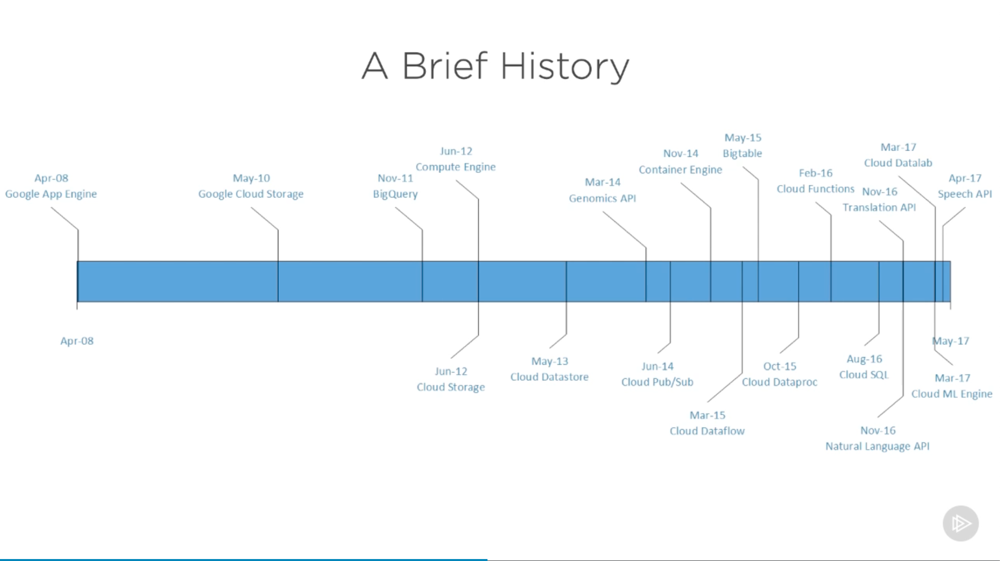

# [Google Cloud Platform Fundamentals](https://app.pluralsight.com/library/courses/google-cloud-platform-fundamentals/table-of-contents), Howard Dierking, 2018-12-18

## Course Overview

### Course Overview

## Understanding Google Cloud Platform

### Introduction to This Course, This Module, and Cloud Computing

- Howard Dierking has a background in Azure and AWS prior to GCP.
- GCP
  - Started in 2008
  - 

### How Google Cloud Platform Is Different

### Demonstrating the Cost Calculator

### Technology Innovation on Google Cloud Platform

## Core Building Blocks

### Introduction to Core Building Blocks

### Compute Services

### Google's Layered Storage Model

### Storage Services

### Networking Services

### Enabling "Cloud 3.0"

## Security and Tools

### Infrastructure Security

### Security Services

### Management and Billing Services

### Developer Tooling

## Building for Cloud 3.0

### From Cloud 2.0 to Cloud 3.0

### Optimizing Computation Using Events and Serverless

### Introducing and Incorporating Analytics

### Introducing and Incorporating Machine Learning

### Module and Course Conclusions
