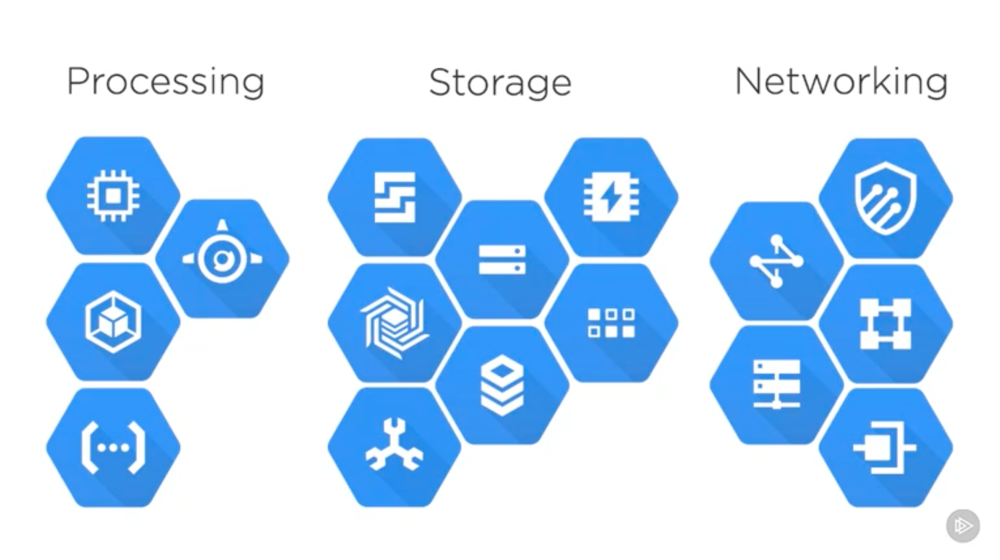
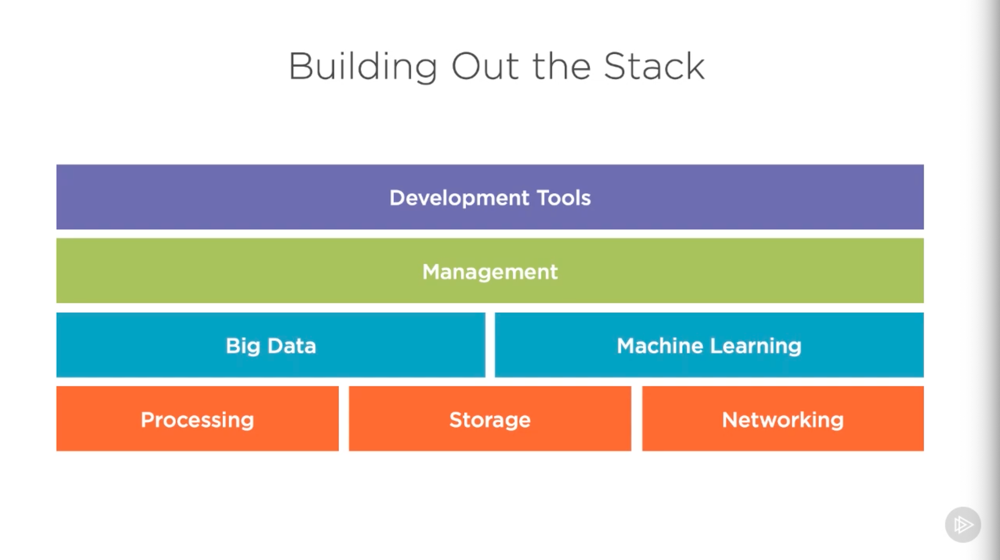
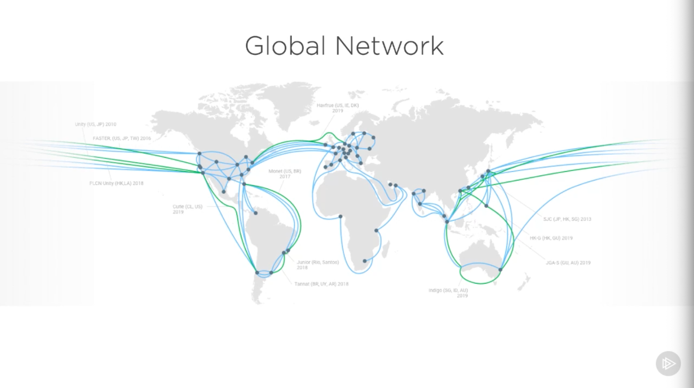
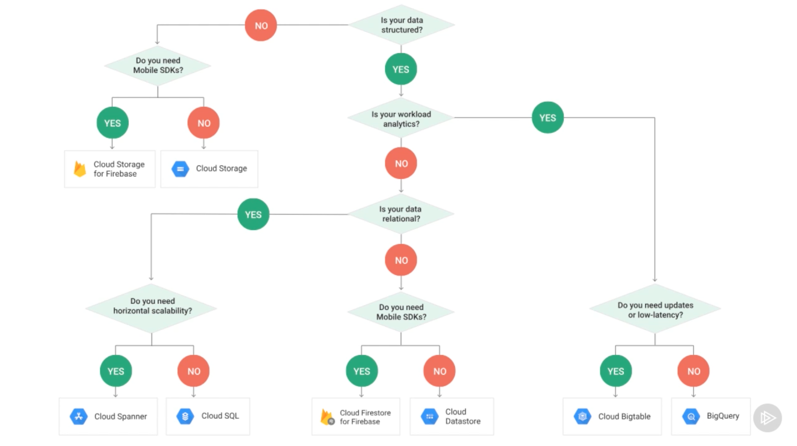

# [Google Cloud Platform Fundamentals](https://app.pluralsight.com/library/courses/google-cloud-platform-fundamentals/table-of-contents), Howard Dierking, 2018-12-18

## Course Overview

### Course Overview

## Understanding Google Cloud Platform

### Introduction to This Course, This Module, and Cloud Computing

- Howard Dierking has a background in Azure and AWS prior to GCP.
- GCP
  - Started in 2008
  - 

### How Google Cloud Platform Is Different

- 
  - GCP services differ in functionality and level of abstraction.
  - 
  - GCP differs in 3 main ways
    - Networking
      - Google's private fiberoptic backbone, optimized for distributed systems.
      - 
    - Pricing
      - Sustained use discounts
        - The longer-running a compute workload, the greater the discount.
        - Given automatically: No need to reserve instances.
        - Can save up to 30%.
      - Committed use discounts
        - Discounts beyond sustained use discounts.
        - Up to 70%.
      - Preemptible VMs
        - Useful for time-insensitive, batch workloads.
        - Result of excess compute capacity.
        - Can be terminated (preempted) by other workloads.
      - Flexible machine configurations
        - Can custom-tailor CPUs, GPUs, and memory.
    - Technology & Innovation

### Demonstrating the Cost Calculator

- https://cloud.google.com/products/calculator

### Technology Innovation on Google Cloud Platform

- Many modern cloud technologies originated at Google
  - Map Reduce &rarr; Hadoop
  - "Borg" &rarr; Mesos
  - Kubernetes
  - Tensforflow
- Because these originated at Google, Google likely knows how to run them better than anywhere else.
- Service offerings are scenario-focused
  - But one service may cover what would require multiple services elsewhere
  - Google Cloud Storage coverage S3, Glacier, CloudFront, etc., on AWS.
- Everything is an API.
- Creating a GCP Account
  - Sign in with a Google account and navigate to https://console.cloud.google.com/
  - Can activate & sign up for trial.

## Core Building Blocks

### Introduction to Core Building Blocks

- IAAS optimizes for control
- PAAS optimizes for agility

### Compute Services

- Options
  - IAAS
    - Compute Engine
      - Highly configurable VMs
      - Pre-defined and custom images (including importing images)
      - Cost optimization options
      - Sole tenant option
      - Storage disk, network, and security options
      - Instance groups and autoscaling
  - CAAS
    - Kubernetes Engine
      - Google-hosted K8s clusters
      - Abstracts configuration (including multi-cluster)
      - Container image registry
      - Requires some infrastructure knowledge
  - PAAS
    - App Engine
      - Includes a rich set of features for a full application stack (NoSQL database, email functions, etc.).
      - App Engine Flexible for broader language support.
    - Cloud Functions

### Google's Layered Storage Model

- RDBMS
  - Cloud SQL
- Blob
  - Cloud Storage
- Technology layering: New services can be built on top of existing services without causing ripples of change.
  - Practically every service built at Google relies on Borg.
  - Colossus is the successor of GFS.
    - Partitioning, replicating, and handling access.

### Storage Services

- Cloud SQL
  - Managed Postgres and MySQL
  - Scalable for most OLTP workloads.
  - Benefits from Compute Engine cost optimization
  - Runtime and management configuration
  - Data in encrypted in transit and at rest
- Persistent Disks
  - Block storage for VMs (but independent of VMs)
  - Can attach multiple Persistent Disks to a VM (or multiple VMs to a Persistent Disk, via read only)
  - Highly configurable
  - Can resize anytime
- Cloud Filestore
  - Managed NAS (Network Attached Storage)
- Cloud Bigtable
  - High performance at scale
  - Managed infrastructure
  - Library support for multiple languages
  - Each table has 1 indexed column (row key)
    - Ordered by row key
  - No transactional row keys
  - Optimized for sparsely-populated rows
  - Supported extension for HBase
- Cloud Storage
  - Global blob storage
  - Automatic edge caching
  - Different storage classes
    - And easily moved between
    - Consistent time-to-first-byte across all
    - Priced based on storage and cost to access
  - Versioning, lifecycle policies, automatic migration
  - PubSub notifications; Cloud Function triggers
- Cloud Spanner
  - Horizontally-scalable, managed RDBMS
  - Distributed transaction support
    - Uses TrueTime (addresses CAP Theorem)
  - Built for Google's own applications
- Cloud Datastore
  - Requires an App Engine environment (currently)
  - Used for managing structured data
  - Organized into entities and entity groups
    - But schema-less.
  - Limited transaction support (within an entity group; otherwise, eventually consistently)
  - Scales based on size of result set.
  - Rebranded: Cloud Firestore
    - Brings together Datastore and Firebase
    - Supports offline scenarios
    - Changes data model and storage model
      - Document (vs. entity)
      - Full transaction support (not just in an entity group)
  - 3 modes
    - Cloud Datastore
    - Cloud Firestore in Datastore mode
    - Cloud Firestore in native mode
- Cloud Memorystore
  - In-memory database
  - Ideal for caching
  - Supports Redis protocol
  - Managed infrastructure
- 

### Networking Services

- Perhaps the key differentiator for GCP.
  - Size & scale
  - Agility
  - Performance
- Layered
  - Data center network
    - WAN
  - Edge Points of Presence (PoPs) - peering
  - Edge caching nodes (GGC)
    - Google Global Cache nodes
    - Hardware is remotely managed by Google
- Software Defined Networking (SDN)
  - B4
  - Andromeda
  - Jupiter
  - Espresso
- Core networking services
  - Virtual Private Cloud (VPC)
    - Private network space
    - Less emphasis on segmenting network into subnets
    - Preferred approach: Maintain flat network space, create routes and firewall rules independently, and apply these based on metadata.
    - Allows Shared VPCs for large, federated systems
  - Cloud Load Balancing
    - Enables a single, load-balanced IP address
    - Uses anycast IP addresses
  - Cloud Armor and Telemetry
    - Protection against DDoS attacks
    - Applies policy an top of Cloud Load Balancer
    - Telemetry provides detailed inspection of all VPC ingress/egress
  - Content Delivery Network (CDN)
    - Extends caching beyond peering edge
    - Caches content on Google Global Cache nodes
  - Cloud DNS
    - One of the fastest DNS hosts
    - Flexible DNS configuration management
  - Cloud Interconnect
    - Connect existing network infrastructure to Google network
    - VPNs, peering, direct, partner-mediated
  - Network Service Tiers
    - Base & premium tiers
      - How long traffic stays in Google's network
        - Basic: Hot potato routing
          - Traffic leaves Google's network relatively quickly
        - Premium: Cold potato routing
          - Keeps traffic in Google network as long as possible

### Enabling "Cloud 3.0"

- Raising the level of abstraction from Cloud 2.0
  - Much of Google's innovation focuses on 'applications and functions', not VMs
  - Storage disaggregation, not disks
  - SLAs, not load balancing and scheduling
  - Intelligence, not data processing
  - Policy, not "middle boxes"

## Security and Tools

### Infrastructure Security

### Security Services

### Management and Billing Services

### Developer Tooling

## Building for Cloud 3.0

### From Cloud 2.0 to Cloud 3.0

### Optimizing Computation Using Events and Serverless

### Introducing and Incorporating Analytics

### Introducing and Incorporating Machine Learning

### Module and Course Conclusions
