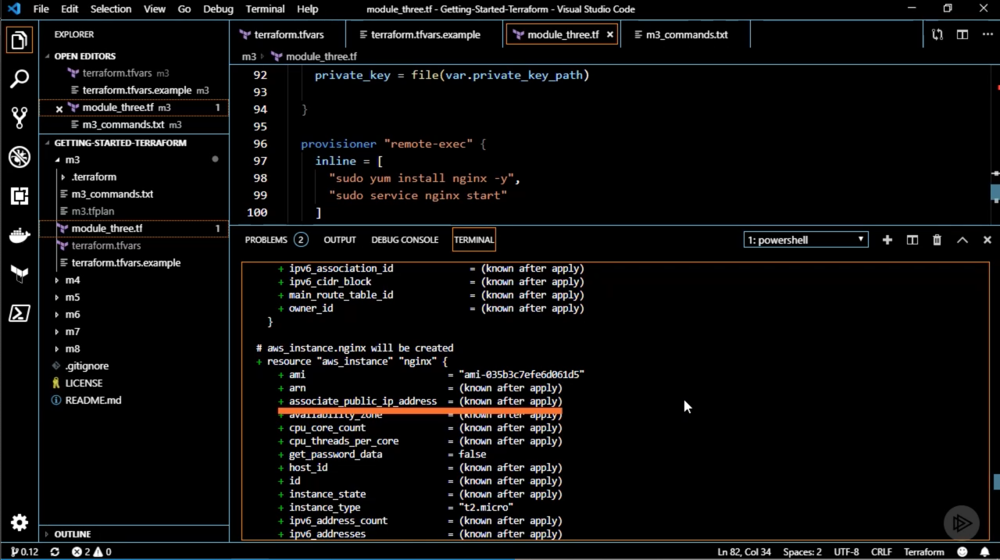
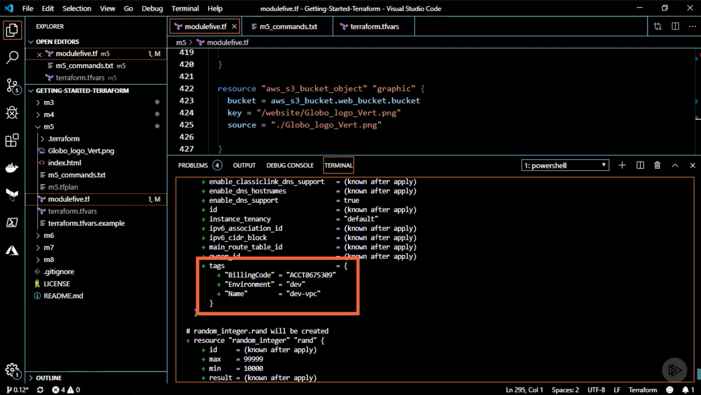

# [Terraform - Getting Started](https://app.pluralsight.com/course-player?courseId=cc6552b7-fc1c-4dfe-a3f3-635c8a0c4528), Ned Bellavance, 2019-10-02

## Course Overview

### [Course Overview](https://app.pluralsight.com/course-player?clipId=199606ac-3578-4699-99ea-f9ff88255d2c)

## What You Need to Know About Infrastructure as Code

### [Overview](https://app.pluralsight.com/course-player?clipId=4ffc60c2-9f03-40d8-a6df-b7668efe8466)

### [Infrastructure as Code Defined](https://app.pluralsight.com/course-player?clipId=b34394c1-d8d9-4a18-90ca-3827e5bd6355)

- Infrastructure as Code:
  - Provisioning infrastructure through software to achieve consistent and predictable environments.
    - Software: Not a manual process
- Core concepts of Iac:
  - Defined in code
  - Stored in source control
  - 2 approaches:
    - Declarative
    - Imperative
  - Idempotent & consistent
  - Push or pull
    - Terraform is a push model
    - Pull: E.g., a running agent that pull from a central source.

### [Declarative vs. Imperative](https://app.pluralsight.com/course-player?clipId=b13f5368-0050-4740-8999-db3b051f0192)

### [Idempotence and Consistency](https://app.pluralsight.com/course-player?clipId=72b97ae7-2a61-4c7f-9433-3a290dcb63a4)

### [Push or Pull](https://app.pluralsight.com/course-player?clipId=eab60448-8849-44a6-872a-17104d35c59c)

### [IaC Benefits](https://app.pluralsight.com/course-player?clipId=48775898-6b30-4b77-b8b1-937dd4667e7f)

- Automated deployment
- Consistent environments
- Repeatable process
- Reusable components
- Documented architecture

### [Summary](https://app.pluralsight.com/course-player?clipId=8e138525-577a-4482-99c5-232210097165)

- Manual processes are the enemy.

## Deploying Your First Terraform Configuration

### [Overview](https://app.pluralsight.com/course-player?clipId=6ee9f344-c758-468e-b262-924da39b3388)

### [Provisioning Resources](https://app.pluralsight.com/course-player?clipId=ac05cb56-b5f0-468e-b379-cd41e999ee8e)

- Provisioning resources
- Planning updates
- Using source control
- Reusing templates

### [Our Scenario](https://app.pluralsight.com/course-player?clipId=a337fa58-4e12-4c9f-80e8-89ed9f8c051b)

### [Terraform Components](https://app.pluralsight.com/course-player?clipId=cb1fa927-4f1c-4e28-adbd-a2dc335c5541)

- Terraform components
  - Terraform executable
    - Self-contained
    - Written in Go
    - Available for any major OS
  - Terraform files
    - Typically use `.tf` extension
    - Terraform stitches together all `.tf` files from a directory.
  - Terraform plugins
    - To interact with providers (e.g., AWS)
  - Terraform state
    - Keep track of resources
    - A state file, tracking the current state
    - When you want to do an update, Terraform compares the update to the current state and figures out what changes are necessary.
- What we'll need:

  - AWS credentials

    - Terraform provides the ability to store this type of information in variables:

      ```tf
      variable "aws_access_key" {}
      variable "aws_secret_key" {}

      variable "aws_region" {
        default = "us-east-1"
      }
      ```

    - Credentials are a required property for a provider:

      ```tf
      provider "aws" {
        access_key = "var.access_key"
        secret_key = "var.secret_key"
        region = "var.aws_region"
      }
      ```

      - See documentation for required and optional properties.

    - Data from a provider (e.g., get all available AWS Linux AMIs):

      ```tf
      data "aws_ami" "alx" {
        most_recent = true
        owners = ["amazon"]
        filters = {}
      }
      ```

    - Resource (e.g., create an instance):

      ```tf
      resource "aws_instance" "ex" {
        # Passin the AMI we got from our data source:
        ami = "data.aws_ami.alx.id"
        # Hard-coding the instance type:
        instance_type = "t2.micro"
      }
      ```

    - Output (e.g., get the public IP from an instance)

      ```tf
      output "aws_public_ip" {
        value = "aws_instance.ex.public_dns"
      }
      ```

### [Demo Prep](https://app.pluralsight.com/course-player?clipId=6fb3864b-37a5-4ad3-844d-5db189a557c8)

- Prerequisites

  - AWS account
  - Demo files: https://github.com/ned1313/Getting-Started-Terraform

    ```sh
    git clone https://github.com/ned1313/Getting-Started-Terraform.git
    ```

### [Examining the Configuration](https://app.pluralsight.com/course-player?clipId=98bd02b2-f22d-48eb-8d2b-68e0f15a73fe)

- Our module: [demo/m3/module_three.tf](demo/m3/module_three.tf)

  ```tf
  ##################################################################################
  # VARIABLES
  ##################################################################################

  # Define our variables.
  variable "aws_access_key" {}
  variable "aws_secret_key" {}
  variable "private_key_path" {}
  variable "key_name" {}
  variable "region" {
    default = "us-east-1"
  }

  ##################################################################################
  # PROVIDERS
  ##################################################################################

  provider "aws" {
    access_key = var.aws_access_key
    secret_key = var.aws_secret_key
    region     = var.region
  }

  ##################################################################################
  # DATA
  ##################################################################################

  data "aws_ami" "aws-linux" {
    most_recent = true
    owners      = ["amazon"]

    filter {
      name   = "name"
      values = ["amzn-ami-hvm*"]
    }

    filter {
      name   = "root-device-type"
      values = ["ebs"]
    }

    filter {
      name   = "virtualization-type"
      values = ["hvm"]
    }
  }

  ##################################################################################
  # RESOURCES
  ##################################################################################

  #This uses the default VPC.  It WILL NOT delete it on destroy.
  resource "aws_default_vpc" "default" {

  }

  resource "aws_security_group" "allow_ssh" {
    name        = "nginx_demo"
    description = "Allow ports for nginx demo"
    # A frequent pattern, known as the 'triplet': The resource type, the resource name, and the resource property.
    vpc_id      = aws_default_vpc.default.id

    ingress {
      from_port   = 22
      to_port     = 22
      protocol    = "tcp"
      cidr_blocks = ["0.0.0.0/0"]
    }
    ingress {
      from_port   = 80
      to_port     = 80
      protocol    = "tcp"
      cidr_blocks = ["0.0.0.0/0"]
    }
    egress {
      from_port   = 0
      to_port     = 0
      protocol    = -1
      cidr_blocks = ["0.0.0.0/0"]
    }
  }

  resource "aws_instance" "nginx" {
    # Use the ID from the AMI resource defined above.
    ami                    = data.aws_ami.aws-linux.id
    instance_type          = "t2.micro"
    key_name               = var.key_name
    # Brackets indicate a list.
    vpc_security_group_ids = [aws_security_group.allow_ssh.id]

    connection {
      type        = "ssh"
      # `self`: Refers to the resource being defined.
      host        = self.public_ip
      user        = "ec2-user"
      # `file()` is a function, reading the contents of that private key file.
      private_key = file(var.private_key_path)

    }

    # We want to remotely execute an inline script
    provisioner "remote-exec" {
      inline = [
        "sudo yum install nginx -y",
        "sudo service nginx start"
      ]
    }
  }

  ##################################################################################
  # OUTPUT
  ##################################################################################

  # What we want Terraform to output to us after the configuration has been instantiated.
  output "aws_instance_public_dns" {
    value = aws_instance.nginx.public_dns
  }
  ```

- We didn't give values to all of the variables.

### [Working with Variables](https://app.pluralsight.com/course-player?clipId=9cf9f115-9f32-4605-b5c9-269c7b49ca36)

- A number of ways to define Terraform variables.

  - One way: Use a `.tfvars` file (can use double or single quotes).
  - [demo/m3/terraform.tfvars.example](demo/m3/terraform.tfvars.example)

    ```tfvars
    aws_access_key = ""

    aws_secret_key = ""

    key_name = "name_of_existing_key_pair"

    private_key_path = "private_key_path\private_key_file.pem"
    ```

### [Deploying the Configuration](https://app.pluralsight.com/course-player?clipId=8e2af742-18fc-450a-ba04-3026bb98d4f2)

```sh
cd demo/m3/
ls

# Shows potential commands.
terraform

# Check version.
terraform version

# Because we're using AWS, we need to get the AWS provider plugin.
# We do this by init.
terraform init

# Look at the files in the working directory and load the variables in the same directory.
# Store the plan in m3.tfplan so we can reference it when we want to create the resources.
terraform plan -out m3.tfplan
# Console output shows resources that would be added, changed, destroyed.

# Apply the plan.
terraform apply "m3.tfplan"
# Console output shows public DNS.

# Note that the current state is now stored in `terraform.tfstate` (stored in the same directory, by default)

# Destroy the configuration (which references the state file).
terraform destroy
# `yes` to confirm.
```

- Note that some resource attributes are known at plan time; others are unknown until apply:
  - 

### [Summary](https://app.pluralsight.com/course-player?clipId=6cb34662-488b-4a71-9e68-56a19a33270d)

## Updating Your Configuration with More Resources

### [Overview](https://app.pluralsight.com/course-player?clipId=ed544c39-df4a-406d-ad75-0077b2840f8a)

- We have provisioned resources. Now it's time to plan updates.

### [Terraform State](https://app.pluralsight.com/course-player?clipId=ea9a1aa7-04fb-44d5-a96e-c09c2b047dcd)

- Terraform needs a way to track what's going on with a deployment: It state.
- The format of a Terraform state file is JSON.
  - Do _not_ manually edit this file. Terraform is responsible for it.
  - The file contains resource mappings and metadata.
  - Depending on where the state file is stored, it _may_ support locking.
    - Locking indicates things are in flux and no changes should be made until the current changes complete.
  - Location:
    - Terraform state can be stored:
      - Locally
        - Current working directory
        - Default setting
        - Good for getting started and messing around; not good for production.
      - Remote
        - AWS (S3), Azure (Blob), NFS, Terraform Cloud
        - Refer to backend documentation
      - Workspaces
        - Each workspace within TF has its own separate state file.
        - When you switch contexts between workspaces, it switches which state file it's reviewing for configuration.
- State file
  - JSON format
  - Metadata
    - "version"
    - "terraform_version"
      - TF verifies the version; it will not allow alterations to be performed by older TF versions.
    - "serial"
      - Incremented every time there's a change to the state file.
      - Plans are run against a specific serial number. If the serial number for the plan and the current state serial number differ, it won't allow the plan to be applied (because something has changed).
    - "lineage"
      - HashiCorp doesn't publish the format and all the info for the state file.
    - "outputs"
      - The output information you see when a configuration has completed.
    - "resources"
      - List of resource generated by the configuration or data sources that pull information during the configuration.
  - According to TF, the state file is the source of truth.
- First rule of TF: Make all changes in TF.
  - TF isn't aware of anything not under its management.

### [Terraform Plan](https://app.pluralsight.com/course-player?clipId=5f29dd4f-690c-402a-9464-81b4d43f4f5a)

- Inspect state
- Dependency graph
  - Helps determine creation order.
- Calculates additions, updates, and deletions.
- Parallel execution
  - Apply is executed in parallel whenever possible.
- One piece of advice: Save the plan file out to a `tfplan`.
  - For example, someone may have to approve the plan file before it's applied.

### [The Scenario, Part 1](https://app.pluralsight.com/course-player?clipId=125ab4f7-34a7-4423-a1d0-9296da6d452d)

- Provision a new VPC to host the application. Deploy an EC2 instance with a DNS record in a subnet.
  - So we'll need the following new resources:
    - `resource "aws_vpc" "vpc" {}`
      - Our custom VPC.
    - `resource "aws_internet_gateway" "igw" {}`
      - Give EC2 instances a way to get out of the VPC.
    - `resource "aws_subnet" "subnet1" {}`
      - Provide a place for the instance to live in the VPC.
    - `resource "aws_route_table" "rtb" {}`
      - Provide a way for the instance to get out of the VPC.
    - `resource "aws_route_table_association" "rta-subnet1" {}`
      - Associate the routes with the subnet.

### [Deploying a VPC](https://app.pluralsight.com/course-player?clipId=f54237fc-cd20-4ddd-96c6-10db684b9367)

- [demo/m4/m4_commands.txt](demo/m4/m4_commands.txt)
  - List of commands.
- [demo/m4/modulefour-start.tf](demo/m4/modulefour-start.tf)
  - Starting configuration
- [demo/m4/modulefour-update.tf.rename](demo/m4/modulefour-update.tf.rename)
  - We'll get to this later.
    - `.rename` is included so TF doesn't think it's part of the module.
- [demo/m4/variables.tf](demo/m4/variables.tf)
  - Our variables.
- [demo/m4/terraform.tfvars.example](demo/m4/terraform.tfvars.example)
  - Example values to fill out.
- Run commands:

```sh
#First run
# Download provider.
terraform init
# Picks up on variables defined in the file; save the plan.
terraform plan -out m4.tfplan
# This creates a `terraform.tfstate` (and, temporarily, a `.terraform.tfstate.lock.info`) file.
terraform apply "m4.tfplan"

terraform show
terraform output
```

### [The Scenario, Part 2](https://app.pluralsight.com/course-player?clipId=48bec880-cd1a-48ab-b2d9-7ae2ba327310)

- Add multiple instances across multiple AZs, with a load balancer.

### [Updating Resources](https://app.pluralsight.com/course-player?clipId=ceb89e56-8ebe-411e-b9f9-0c861b180504)

- Rename (swap) files:
  - modulefour-start.tf &rarr; modulefour-start.tf.rename
  - modulefour-start.tf.rename &rarr; modulefour-start.tf
- [demo/m4/modulefour-update.tf.rename](demo/m4/modulefour-update.tf.rename)
  - We now have a `subnet2`
    - And we're pulling `.names[1]`
  - We're associating the existing route table with the new subnet.
  - We're adding an ELB, and a SG for it.
  - And we've updated our nginx security group to only allow access from the internal network address space of the VPC.
- Since the configuration has already been initialized, we don't need to run `terraform init` first; we can go right to `plan`.
  - Note that TF removes all ingress rules before adding new ones.
- We now have a `terraform.tfstate.backup` file for falling back if something got corrupted.

### [Summary](https://app.pluralsight.com/course-player?clipId=8a046ca0-02c4-4d54-a80c-05dd94c6f3a3)

## Configuring a Resource After Creation

### [Overview](https://app.pluralsight.com/course-player?clipId=ecd9703b-544b-4531-be54-6f12f858f55b)

### [Terraform Syntax](https://app.pluralsight.com/course-player?clipId=910db9c4-3d6e-4db5-ac0f-dc2e98920cb5)

- HashiCorp configuration language
  - A domain specific language that HasiCorp designed for a number of products under its umbrella.
  - Configuration syntax and expressions.
  - Supports conditionals, functions, and templates (similar to Jinja templates).

### [Blocks](https://app.pluralsight.com/course-player?clipId=8ca5bdbf-16c0-4590-90a6-6f848df8f2cf)

```tf
# Basic block
block_type label_one label_two {
  # Key-value pairs are based off of resource attributes.
  key = value

  embedded_block {
    key = value
  }
}
```

```tf
# Example block
# Create a resource.
# Of type aws_route_table.
# And give it a label of route-table so we can use it elsewhere in the configuration.
resource "aws_route_table" "route-table" {
  vpc_id = "id928310928"
  route {
    cird_block = "0.0.0.0/0"
    gateway_id = "id128073987"
  }
}
```

```tf
# Object types
string = "taco"
number = 5
bool = true
# Sometimes called a tuple. Referenced by position in list (0-referenced).
list = ["bean-taco", "beef-taco"]
map = { name = "Ned", age = 42, loves_tacos = true }
```

### [References](https://app.pluralsight.com/course-player?clipId=ebd4b31b-9a86-432a-8cd5-c9ab6415debb)

```tf
# Keyword reference:
# `var`
var.taco_day
# Resource:
aws_instance.taco_truck.name
# Locally-defined values in a configuration:
local.taco_toppings.cheeses
# A module we've instantiated:
module.taco_hut.locations

# Interpolation (used more heavily before .12; now just used for concatenation):
taco_name = "neds-${var.taco_type}"
```

```tf
# Strings, numbers, and bools
local.taco_count # Returns the number, string, or bool.

# Lists and maps
local.taco_toppings[2] # Returns element 3.
local.taco_maps["likes-tacos"] # Returns value at keyname.

# Resource values
var.region # Returns us-east-1
data.aws_availability_zones.azs.names[1] # Returns second AZ
```

### [Updated Scenario](https://app.pluralsight.com/course-player?clipId=b657306b-719f-4ff3-a857-37817b6fd9e5)

- Previous:
  - 2 EC2 instances in separate AZs with a load balancer that has a DNS record.
- Updated:
  - Host website files in S3 bucket. (Read permissions)
  - Ship EC2 logs to S3 bucket. (Write permissions)
  - Tag all resources.

### [Provisioners](https://app.pluralsight.com/course-player?clipId=6df89869-59df-4020-ae61-82970536519e)

- Provisioners: Used for post-deployment configuration.
  - HasiCorp recommends using something else for post-deployment configuration (e.g., configuration management software such as Puppet or Chef).
  - But provisioners are available as a last resort.
    - Terraform doesn't have a way track the internal state of something like an EC2 instance - so, once it's deployed, it breaks the immutable deployment model that TF likes.
- Provisioners can:
  - Be:
    - Local
      - Executes on local machine
    - Remote
      - On the remote instance.
  - Fire on:
    - Creation
    - Destruction
      - E.g., gracefully remove an instance.
- Multiple provisioners can be added to a resource.
- What if it all goes wrong?
  - TF will not destroy the resource if provisioners didn't execute properly, but it sill make a note that an error happened.
- Example

  - File provisioner:

    ```tf
    provisioner "file" {
      connection {
        type = "ssh" # Or winrm
        user = "root"
        private_key = var.private_key # Or PW.
        host = var.hostname
      }
      source = "/local/path/to/file.txt"
      destination = "/path/to-file.txt"
    }
    ```

  - Local & remote exec provisioners:

    ```tf
    provisioner "local-exec" {
      command = "local command here"
    }

    provisioner "remote-exec" {
      # If a list, will be run in sequence.
      scripts = ["list", "of", "local", "scripts"]
    }
    ```

### [Variables and Tags](https://app.pluralsight.com/course-player?clipId=18af1c10-93b3-4c10-9291-2ddc989dcb69)

- Module 5 files
  - Website files:
    - [index.html](demo/m5/index.html)
    - [Globo_logo_Vert.png](demo/m5/Globo_logo_Vert.png)
  - Commands
    - [m5_commands.txt](demo/m5/m5_commands.txt)
  - Terraform configuration
    - [modulefive.tf](demo/m5/modulefive.tf)
  - Variables
    - [terraform.tfvars.example](demo/m5/terraform.tfvars.example)

### [Instance Configuration](https://app.pluralsight.com/course-player?clipId=ba2cfc8d-52c8-4611-ac3a-7bbf4f2e177d)

### [S3 Configuration](https://app.pluralsight.com/course-player?clipId=7ac3eab0-69ee-4a0f-b9c6-b4a4de4764ab)

### [Configuration Deployment](https://app.pluralsight.com/course-player?clipId=e9b09b57-8834-4adb-93bb-6b98b3f1a9aa)

```sh
terraform init
# Pulls down plugins: providers.aws and providers.random.

terraform plan -out m5.tfplan
# Will create 19 resources.
# Note that tags have been applied.

terraform apply "m5.tfplan"
# Provision the resources.

# Navigate to DNS entry.
```



### [Summary](https://app.pluralsight.com/course-player?clipId=85b75d18-e2b3-43ad-b388-5b5dc4e8b682)

- Remember, HashiCorp isn't a big fan of provisioners and would prefer you'd use something like Puppet or chef.

## Adding a New Provider to Your Configuration

### [Overview](https://app.pluralsight.com/course-player?clipId=ba2743b7-8991-406b-a2d0-271365864e09)

- One of the major strengths of Terraform is its support for multiple providers (AWS, Azure, GCP, etc.).

### [Sally Sue Strikes Again](https://app.pluralsight.com/course-player?clipId=5f31f041-8418-4119-ac67-b603966b4647)

- Updated scenario
  - Increase the robustness of our deployment by adding EC2 instances.
  - Use an official DNS entry.
    - The zone happens to be hosted in Azure.

### [Terraform Functions](https://app.pluralsight.com/course-player?clipId=982e5f69-91be-4715-8bb7-95468c1c883f)

- Support for inline functions was a primary driver of HCL.
- Basic function syntax: `func_name(arg1, arg2, arg3, ...)`
  - Arguments are positional.
  - Arguments can be optional.
- Functions (and other expressions) can be tested in terraform console - more efficient than doing everything in a configuration.
- Several broad categories
  - Common categories
    - Numeric
      - Functions to manipulate numbers
      - Example
        - `min(42, 13, 7)`
    - String
      - Example
        - Force Azure storage account to lowercase (since uppercase letters are not supported):
          - `lower("TACOS")`
    - Collection
      - Lists & maps
      - Example
        - Merge 2 maps into 1
          - `merge(map1, map2)`
    - Filesystem
      - Deal with the filesystem.
      - Example
        - Read the contents of the file, returning a string.
        - `file(path`)
    - IP networking
      - Standard numeric functions don't work very well for IP networking.
      - Example
        - Carve off a subnet in the provided range:
          - `cidrsubnet()`
    - Date & time
      - Example
        - `timestamp()`

### [Function Examples](https://app.pluralsight.com/course-player?clipId=e604b378-cd6c-49bb-a734-c251c1019e36)

- Break a network range into subnets:

  ```tf
  # Configure networking
  variable network_info {
    default = "10.1.0.0/16"
  }

  # Arguments: Network range, number of bits to add to the mask, which number subnet we want
  # Returns 10.1.0.0/24
  cird_block = cidrsubnet(var.network_info, 8, 0)

  # Takes a network range, and returns the 6th host IP in the network range of the first argument.
  # Returns 10.1.0.5
  host_ip = cidrhost(var.network_info, 5)
  ```

- Look up a value in a map

  ```tf
  # Create ami map
  variable "amis" {
    type = "map"
    default = {
      us-east-1 = "ami-1234"
      us-west-1 = "ami-5678"
    }
  }

  # Look up the key in the map.
  # Could use var.amis["us-east-1"], but the lookup function provides safety if the key doesn't exist.
  ami = lookup(var.amis, "us-east-1", "error")
  ```

### [Terraform Console](https://app.pluralsight.com/course-player?clipId=ba259a66-6562-4a88-a7ef-33348a319fd8)

- Module 6 files
  - Website files:
    - [index.html](demo/m6/index.html)
    - [Globo_logo_Vert.png](demo/m6/Globo_logo_Vert.png)
  - Commands
    - [m5_commands.txt](demo/m6/m6_commands.txt)
  - Terraform configuration
    - [modulefive.tf](demo/m6/modulesix.tf)
  - Variables
    - [terraform.tfvars.example](demo/m6/terraform.tfvars.example)
- Open Terraform console:

```sh
# Need to run init before console.
terraform init
terraform console

min(42,5,16)
# 5

cidrsubnet(var.network_address_space, 8, 0)
# 10.1.0.0/24

cidrhost(cidrsubnet(var.network_address_space, 8, 0),5)
# 10.1.0.5

lookup(local.common_tags, "BillingCode", "Unknown")
lookup(local.common_tags, "Missing", "Unknown")

local.s3_bucket_name
# The random integer hasn't been generated yet, so we receive an error
```

### [Terraform CLI](https://app.pluralsight.com/course-player?clipId=d3057ec1-af50-4576-9941-38f0722811c8)

- If we run `terraform`, we see a list of commands:
  - `apply`
  - `console`
  - `destroy`
  - `fmt`
    - Formats .tf and .tfvars files in directory.
  - `init`
  - `output`
    - Gives output of what's in the state file (such as after apply).
  - `plan`
  - `show`
    - Shows current contents of TF state, or TF plan.
  - `taint`
    - Marks the resource to be recreated (such as if we know something is wrong with an instance).
  - `untaint`
    - Such as if TF has marked it as tainted, and we beg to differ.
  - `validate`
    - Validates the overall syntax of the file, but doesn't guarantee successful plan/apply.
  - `workspace`
    - Used for managing workspaces.

### [Terraform Providers](https://app.pluralsight.com/course-player?clipId=159d815e-9452-4104-bb5e-204ce4fbd609)

- Providers can be community- and HashiCorp-created.
- All providers are open source.
  - It's all written in Go.
- Providers are a collection of defined resources and data sources.
- Multiple instances can be created of the same provider.
  - For instance, multiple AWS providers for multiple regions.
- AzureRM (Resource Manager) Provider example:

  ```tf
  provider "asurerm" {
    subscription_id = "subscription-id"
    client_id = "principal-used-for-access"
    client_secret = "password of principal"
    tenant_id = "tenant-id"
    # Useful when defining multiple azurerm providers.
    alias = "arm-1"
  }

  resource "asurerm_resource_group" "azure_tacos" {
    name = "resource-group-name"
    location = "East US"
    # If we want to specify a provider:
    provider = azurerm.arm-1
  }
  ```

### [Adding the AzureRM Provider]()

### [Resource Arguments]()

### [Using the Count Argument]()

### [Deploying the Configuration]()

### [Summary]()

## Using Variables and Functions

### [Overview]()

### [Sally Sue Is Back, Again]()

### [Working with Variables]()

### [Updating the Configuration Variables]()

### [Adding Multiple Environments]()

### [Using Terraform Workspaces]()

### [Deploying the Lower Environments]()

### [Managing Secrets]()

### [Using Environment Variables in Production]()

### [Summary]()

## Using a Module for Common Configurations

### [Overview]()

### [The Scenario Expands]()

### [Modules]()

### [Using the VPC Module]()

### [Using the S3 Module]()

### [Deploying the Configuration]()

### [Summary]()
