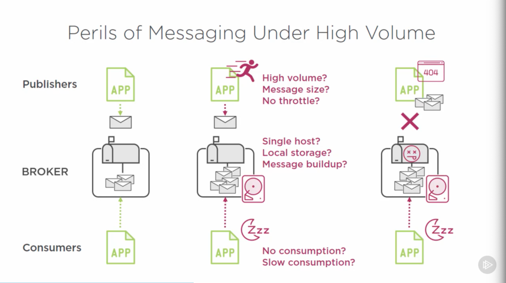
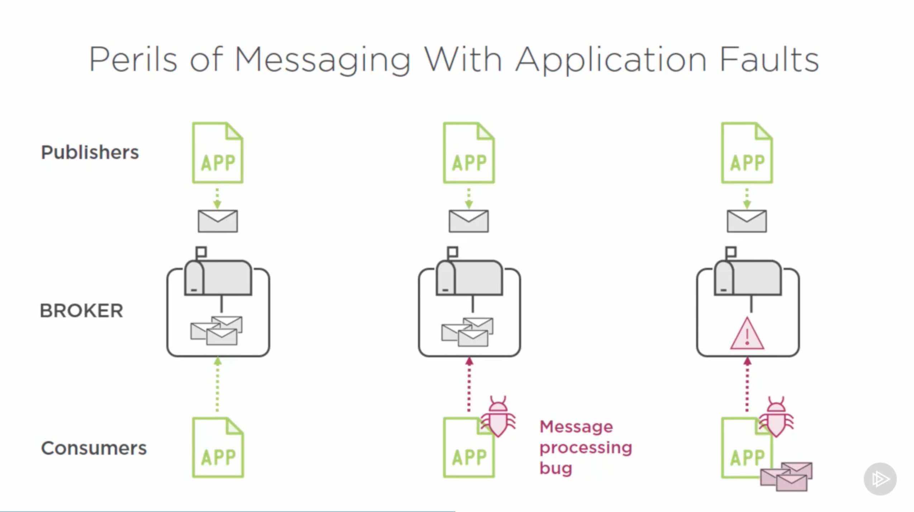
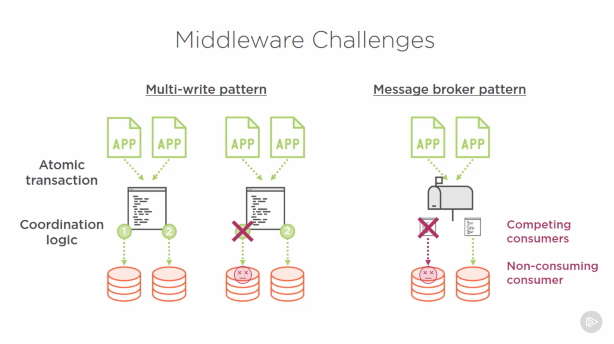
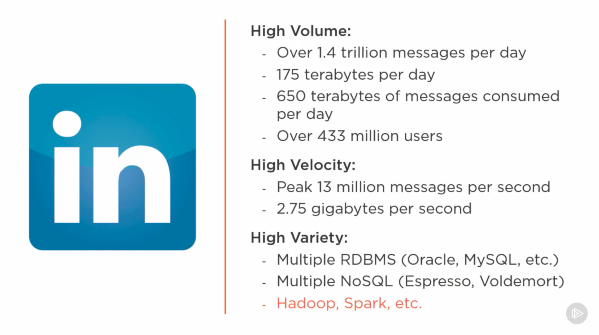
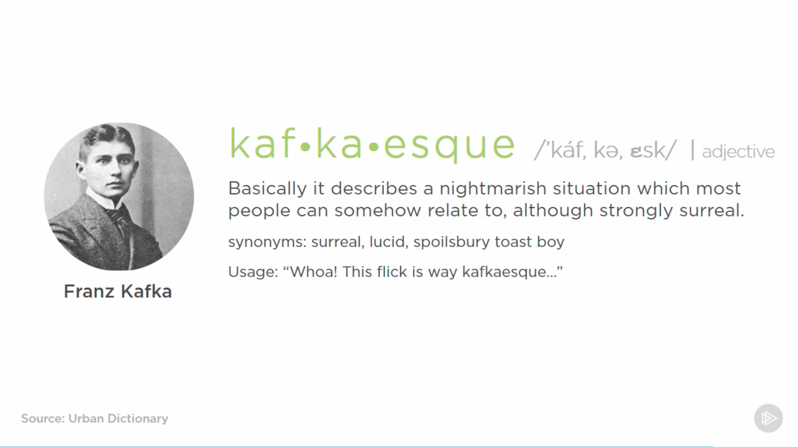

# [Getting Started with Apache Kafka, Ryan Plant, 2016-10-14](https://app.pluralsight.com/library/courses/apache-kafka-getting-started/table-of-contents)

## Course Overview

### Course Overview

## Getting Started with Apache Kafka

### Enterprise Challenges with Data

- Apache Kafka: A high-throughput distributed messaging system.
  - Helps avoid a complex web of point-to-point data movement.
- Traditional solutions to this problem:
  - Database replication & log shipping
    - Limited to RDBMS-to-RDBMS
    - Database-specific
    - Tight coupling to schemas
    - Performance challenges for log shipping
    - Cumbersome to manage subscriptions
  - ETL
    - Typically proprietary and costly, though some open source options are available
    - Lots of custom development
    - Scalability is challenged
    - Performance challenges
    - Often, multiple instances are required
  - Messaging
    - A fairly simple paradigm for moving data between applications and data stores
    - Scalability can be challenging: messaging broker can be a bottleneck
    - Message size impacts reliability and performance\
    - Requires rapid consumption
    - Non-fault-tolerant.
    - Technically, a form of middleware.
  - Custom middleware magic
    - Code needs to have intimate knowledge of every data store.
    - Requires distributed coordination logic, multiphase commits, and complex error handling.
    - Seems simple on a whiteboard; becomes prohibitively complex.
    - Consistency challenges.
    - Potentially expensive.
    - Vendors' solutions may or may not work, and can be expensive.

### Messaging Limitations and Challenges

- 
  - Depending on error handling, a croaking broker can lead to a complete denial of service for publishing applications.
- 
- 

### LinkedIn's Search for a Better Solution

- Goal: Find a better way to move data around:
  - Cleanly
  - Reliably
    - Reduce impact of a single unavailable component.
  - Quickly
    - For real-time use cases.
  - Autonomously
    - With reduced coupling between components, allowing us to make changes without cascading changes.
- LinkedIn asked this same question in 2010.
  - Founded in 2003.
  - 
  - 

### Apache Kafka as a Viable Solution

- Next-generation messaging goals:
  - High throughput
  - Horizontally scalable
  - Reliable and durable
  - Loosely-coupled producers and consumers &rarr; common data exchanges
  - Flexible publish-subscribe semantics
- 
- LinkedIn started developing Kafka in 2009, started using it in 2010, and open sourced Kafka in 2011.

## Getting to Know Apache Kafka's Architecture

### Apache Kafka as a Messaging System

### The Apache Kafka Cluster

### Principles of Distributed Systems

### Reliable Work Distribution

### Distributed Consensus with Apache Zookeeper

## Understanding Topics, Partitions, and Brokers

### Introduction and Apache Kafka Setup Demo

### Apache Kafka Topics in Detail

### The Consumer Offset and Message Retention Policy

### Demo: Starting Apache Kafka and Producing and Consuming Messages

### Apache Kafka as a Distributed Commit Log

### Apache Kafka Partitions in Detail

### Distributed Partition Management in Apache Kafka

### Achieving Reliability with Apache Kafka Replication

### Demo: Fault-tolerance and Resiliency in Apache Kafka

### Module 3 Summary

## Producing Messages with Kafka Producers

### Introduction and Setting up an Apache Kafka Development Environment

### Basics of Creating an Apache Kafka Producer

### Creating and Preparing Apache Kafka Producer Records

### Apache Kafka Producer Record Properties

### The Process of Sending Messages, Part One

### The Process of Sending Messages, Part Two

### Message Buffering and Micro-batching

### Message Delivery and Ordering Guarantees

### Demo: Creating and Running an Apache Kafka Producer Application in Java

### Advanced Topics and Module 4 Summary

## Consuming Messages with Kafka Consumers and Consumer Groups

### Introduction and Apache Kafka Consumer Overview

### Subscribing and Unsubscribing to Topics

### Comparing Subscribe and Assign APIs

### Single Consumer Subscriptions and Assignments

### The Poll Loop

### Demo: Simple Kafka Consumer

### Walkthrough: Consumer Polling

### Walkthrough: Message Processing

### The Consumer OFfset in Detail

### Offset Behavior and Management

### CommitSync and CommitAsync for Manual Offset Management

### When to Manager Your Own Offsets Altogether

### Scaling out with Consumer Groups

### Consumer Group Coordinator

### Demo: Consumer Groups

### Configuration and Advanced Topics

### Summary

## Exploring the Kafka Ecosystem and Its Future

### Apache Kafka's Success and Challenges

### Challenges and Solutions for Data Governance

### Challenges and Solutions for Consistency and Productivity

### Challenges and Solutions for Fast Data

### Apache Kafka's Ecosystem and Summary
