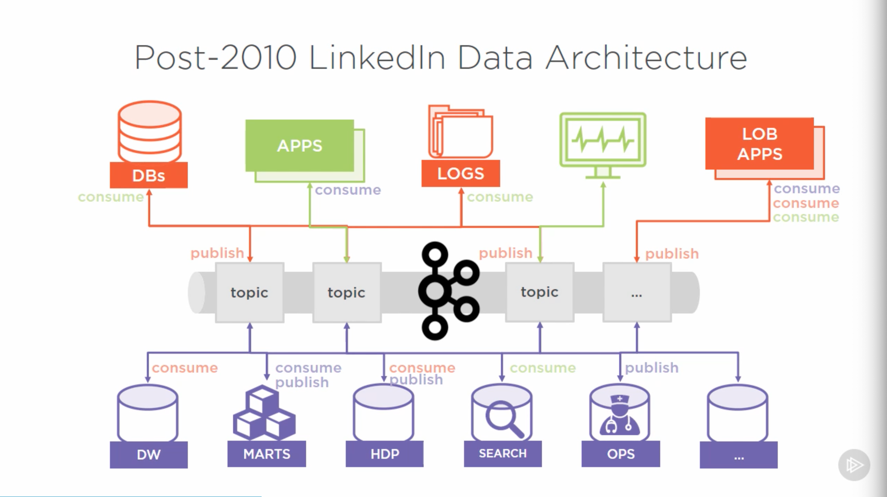
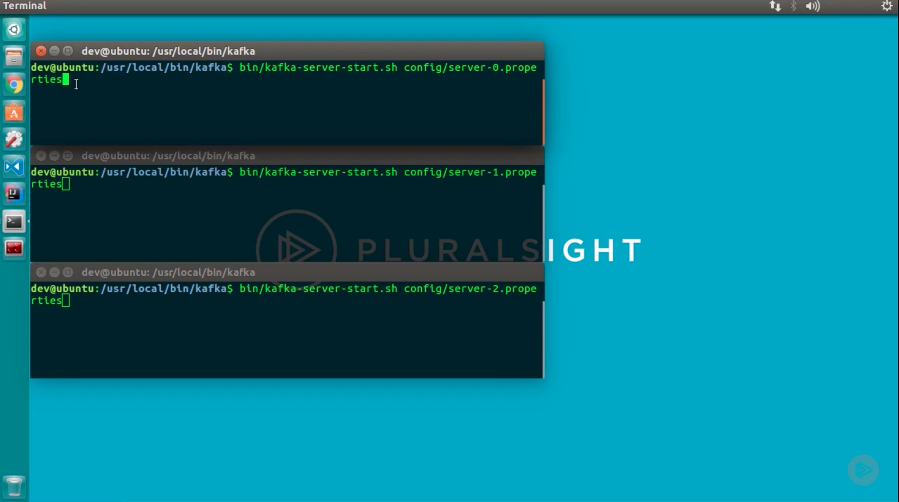
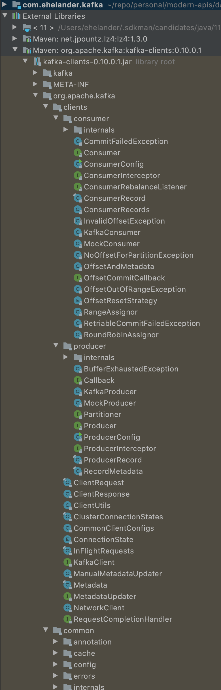
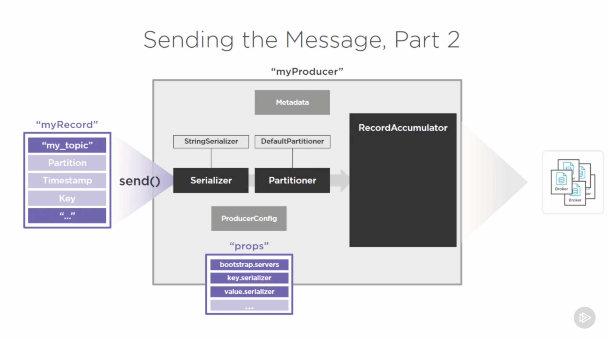

# [Getting Started with Apache Kafka, Ryan Plant, 2016-10-14](https://app.pluralsight.com/library/courses/apache-kafka-getting-started/table-of-contents)

## Course Overview

### Course Overview

## Getting Started with Apache Kafka

### Enterprise Challenges with Data

- Apache Kafka: A high-throughput distributed messaging system.
  - Helps avoid a complex web of point-to-point data movement.
- Traditional solutions to this problem:
  - Database replication & log shipping
    - Limited to RDBMS-to-RDBMS
    - Database-specific
    - Tight coupling to schemas
    - Performance challenges for log shipping
    - Cumbersome to manage subscriptions
  - ETL
    - Typically proprietary and costly, though some open source options are available
    - Lots of custom development
    - Scalability is challenged
    - Performance challenges
    - Often, multiple instances are required
  - Messaging
    - A fairly simple paradigm for moving data between applications and data stores
    - Scalability can be challenging: messaging broker can be a bottleneck
    - Message size impacts reliability and performance\
    - Requires rapid consumption
    - Non-fault-tolerant.
    - Technically, a form of middleware.
  - Custom middleware magic
    - Code needs to have intimate knowledge of every data store.
    - Requires distributed coordination logic, multiphase commits, and complex error handling.
    - Seems simple on a whiteboard; becomes prohibitively complex.
    - Consistency challenges.
    - Potentially expensive.
    - Vendors' solutions may or may not work, and can be expensive.

### Messaging Limitations and Challenges

- 
  - Depending on error handling, a croaking broker can lead to a complete denial of service for publishing applications.
- 
- 

### LinkedIn's Search for a Better Solution

- Goal: Find a better way to move data around:
  - Cleanly
  - Reliably
    - Reduce impact of a single unavailable component.
  - Quickly
    - For real-time use cases.
  - Autonomously
    - With reduced coupling between components, allowing us to make changes without cascading changes.
- LinkedIn asked this same question in 2010.
  - Founded in 2003.
  - 
  - 

### Apache Kafka as a Viable Solution

- Next-generation messaging goals:
  - High throughput
  - Horizontally scalable
  - Reliable and durable
  - Loosely-coupled producers and consumers &rarr; common data exchanges
  - Flexible publish-subscribe semantics
- 
- LinkedIn started developing Kafka in 2009, started using it in 2010, and open sourced Kafka in 2011.

## Getting to Know Apache Kafka's Architecture

### Apache Kafka as a Messaging System

- Kafka: A pub/sub (producer/consumer) messaging system.
- Messages are sent to topics.
- Kafka keeps and maintains topics in the broker.
  - The broker is an executable process or daemon. Could be called a 'server'.

### The Apache Kafka Cluster

- With Kafka, brokers can scaled out as much as is necessary.
  - LinkedIn: 1400 brokers (as of recording).
- Kafka cluster: A grouping of multiple Kafka brokers across 1 or more machines.
  - Apache Zookeeper comes into play for managing grouping of brokers.

### Principles of Distributed Systems

- A system is a collection of resources that have instructions to achieve a specific goal or function.
- A distributed system involves multiple workers or nodes.
  - Coordination is required to ensure consistency and progress toward a common goal.
- Controller: A worker node, elected to officiate in the lead capacity.
  - Often the oldest node.
  - Responsibilities
    - Maintain an inventory of available workers.
    - Maintain a list of work items.
    - Maintain a status of workers and tasks.

### Reliable Work Distribution

- Controller needs to consider worker available and health and must consider the risk policy in effect (replication factor).
  - Leaders & followers.
- "Work" in Kafka:
  - Receiving messages.
  - Categorizing messages into topics.
  - Persisting messages for eventual retrieval.
- Components
  - Producers
  - Consumers
- Consumers add a more substantial load than producers.

### Distributed Consensus with Apache Zookeeper

- Distributed systems require a consensus.
  - Worker node membership and naming
  - Configuration management
  - Leader election
  - Health status
- Apache Zookeeper
  - Used in a variety of distributed systems.
  - Serves as a centralized service for maintaining metadata about a cluster of distributed nodes:
    - Configuration information
    - Health status
    - Group membership
  - A distributed system itself; to run reliably, require multiple nodes (an "ensemble")
- 

## Understanding Topics, Partitions, and Brokers

### Introduction and Apache Kafka Setup Demo

- Basic Apache Kafka installation
- Prerequisites

  - Familiarity with Linux
  - JDK 8 installed
    <!-- - `sdk list java`
    - `sdk install java 8.0.265.hs-adpt`
    - `sdk use java 8.0.265.hs-adpt` -->
    <!-- - `brew tap adoptopenjdk/openjdk` -->
    - `brew cask install homebrew/cask-versions/adoptopenjdk8`
  - Scala (2.11.x) installed
    - `sdk install scala`
      - https://sdkman.io/sdks#scala
  - Kafka

    ```sh
    # https://gist.github.com/jarrad/3528a5d9128fe693ca84#gistcomment-2323553
    # Install java 1.8, zookeeper, and kafka
    brew install kafka

    # Start Zookeeper & Kafka:
    brew services start zookeeper
    brew services start kafka

    # Stop Kafka:
    brew services stop kafka
    brew services stop zookeeper
    ```

- `/usr/local/Cellar/kafka/2.6.0/libexec`
  - `libs`
    - Note that Zookeeper is included among `libs`, allowing a standalone installation (not requiring a separate Zookeeper installation).
  - `config`
    - All the files we'll use to configure Kafka.
    - `server.properties`: The broker properties.
  - `bin`
    - All the programs to get Kafka up and running.

### Apache Kafka Topics in Detail

- A messaging topis is the primary abstraction of Kafka.
  - A topic is a named feed or category of messages that producers produce to, and consumers consume from.
  - Topics are logical entities that span the entire cluster of brokers.
    - Behind the scenes, Kafka physically represents a topic as 1 or more logs.
- Messages are appended to a time-ordered, sequential stream.
- Each message represents an event or "fact".
- Messages are immutable.
  - If an incorrect/outdated message is sent, the only correction option is for the producer to publish a new event with the updated information.
    - It's up to consumers to digest these appropriately.
- Event sourcing
  - An architectural style or approach to maintaining an application's state by capturing all changes as a sequence of time-ordered, immutable events.
- (Logical) message content
  - Timestamp
    - When the message was received.
  - ID
    - Referenceable by the consumers.
  - Data content
    - Binary payload.
- Consumers simply read messages from a topic.
  - Messages can be read by a theoretically unlimited number of autonomous consumers.
  - Each consumer maintains its own operational boundary. A consumer's error or crash doesn't affect other consumers.

### The Consumer Offset and Message Retention Policy

- How do consumers maintain their autonomy?
  - The message offset.
  - Allows consumers to read messages at their own pace and process them independently.
  - Basically a bookmark: The last read message.
  - Established and maintained by the consumer.
  - Corresponds to a message identifier.
- When a consumer decides to read from a topic (that it either has not read from previously, or for which it wants to start over), it starts from the beginning ('offset: 0').
- The consumer chooses to advance its position, stay put, or re-read a previous message.
- When a new message arrives, consumers receive an event that a new message is available.
- Kafka is immune from a major challenge with messaging systems: slow consumers.
  - Message retention period is configurable (in hours).
    - Default: 168 hours (7 days).
    - After the retention period, old messages fall off.
    - Retention period is set on a per-topic basis.
  - All published Kafka messages are retained, regardless of consumption.

### Demo: Starting Apache Kafka and Producing and Consuming Messages

- Demo:

  - Set up a simple Kafka cluster.
  - Create a topic.
  - Publish some messages.
  - Consume the message.

- Change into Kafka directory (though we'll be using Homebrew for some services)

  ```sh
  cd /usr/local/Cellar/kafka/2.6.0/
  ```

- Start Zookeeper (standalone: 1 instance)

  - 

    ```sh
    bin/zookeeper-server-start.sh config/zookeeper.properties
    ```

- Using Homebrew instead:

  ```sh
  brew services start zookeeper
  ```

- Test that Zookeeper is running:

```sh
# Install telnet, since MacOS removed it.
brew install telnet
telnet localhost 2181
stat
```

- https://osxdaily.com/2018/07/18/get-telnet-macos/
- `telnet towel.blinkenlights.nl`

- 

  - With Homebrew:

    ```sh
    brew services start kafka
    ```

- Create a topic:

  ```sh
  # bin/kafka-topics.sh
  bin/kafka-topics --create --topic my_topic --zookeeper localhost:2181 --replication-factor 1 --partitions 1
  ```

  - We need to specify the Zookeeper-managed cluster.
  - Note the replication factor and partition flags.

- Logs are accessible at `/usr/local/var/lib/kafka-logs`:
  - See https://stackoverflow.com/questions/40369238/which-directory-does-apache-kafka-store-the-data-in-broker-nodes
  - 
- Inquire which topics are available:

  ```sh
  # bin/kafka-topics.sh --list --zookeeper localhost:2181
  bin/kafka-topics --list --zookeeper localhost:2181
  ```

  - 

- Instantiate a producer

  ```sh
  # bin/kafka-console-producer.sh
  # bin/kafka-console-producer --broker-list localhost:9092 --topic my_topic
  bin/kafka-console-producer --bootstrap-server localhost:9092 --topic my_topic
  ```

  - Everything we type (and follow by 'enter') becomes a message that the producer sends to the broker.

- Instantiate a consumer

  ```sh
  # bin/kafka-console-consumer.sh
  # bin/kafka-console-consumer --zookeeper localhost:2181 --topic my_topic --from-beginning
  # bin/kafka-console-consumer --bootstrap-server localhost:2181 --topic my_topic --from-beginning
  bin/kafka-console-consumer --bootstrap-server localhost:9092 --topic my_topic --from-beginning
  ```

  - See also https://medium.com/@at_ishikawa/getting-started-with-kafka-on-mac-f6aa8924fcda

### Apache Kafka as a Distributed Commit Log

- The simple-yet-powerful concept upon which Kafka is built: The commit (or transaction) log.
  - The source of truth.
  - Physically stored & maintained.
  - Higher-order data structures derive from the log (tables, indexes, view, etc.).
    - Useful for point-of-recovery: Can replay past events.
    - Basis for replication & distribution (redundancy, fault-tolerance, and scalability).
- What Kafka really is, at its heart, is a _distributed commit log_.

### Apache Kafka Partitions in Detail

- A topic, as a logical concept, is represented by 1 or more physical log files.
- The number of partitions per topic is highly configurable.
- Partitions enable:
  - Scalability
  - Fault-tolerance
  - High throughput
- Each partition is maintained on 1 or more brokers.
- When we created a topic topic, we specified 1 partition and a replication factor of 1.
- At a minimum, each topic must have at least 1 topic.
- The partition's logs are on the broker's file system at `/tmp/kafka-logs/{topic}-{partition}` (by default).
- Tradeoffs related to the number of partitions:
  - Scalability
    - Eventually, scaling out requires multiple partitions.
  - Each partition must fit on a single machine.
- If we had created our topic with 3 partitions, we would be splitting our topic across 3 log files (ideally, across multiple machines). This enables each partition to share the burden of the message load.
  - But the logs are still a time-ordered sequence or events.
    - A partitioning scheme can be specified.

### Distributed Partition Management in Apache Kafka

- Zookeeper looks at the available brokers and establishes leaders for a topic.
- Each broker creates a log for the new partition.
- As partition assignments are broadcast, each broker maintains a subset of the metadata from Zookeeper (enabling each broker to direct producers to the correct broker).
- A producer must have knowledge of at least 1 broker in each topic so it can find the leaders.
- A consumer inquires of Zookeeper to determine which brokers own which topic.
- Consumers working with multiple partitions are likely going to consumer messages in a different order (and will be responsible for handling the messages in the different orders).
- Partitioning trade-offs:
  - More partitions
    - Greater Zookeeper overhead
      - I.e., ensure proper Zookeeper ensemble provisioning.
    - Message ordering can become complex.
      - There will not be a global order to messages across partitions.
      - To get a global order (without forcing consumers to manage the ordering), a single partition would be required.
    - Longer leader fail-over time.

### Achieving Reliability with Apache Kafka Replication

- What about fault tolerance?
  - Broker failure
  - Network issue
  - Disk failure
- When Zookeeper determines that a broker is down, it will find another broker to take its place.
  - But without redundancy between brokers, there could be data loss.
- Replication factor
  - We had set this to 1 in our demo.
  - Enables reliable work distribution
    - Ensures redundancy of messages
    - Enhances system resiliency and fault-tolerance
  - Guarantees
    - Up to n-1 broker failure tolerance
      - Minimum of 2 or 3
  - Configured on a per-topic basis
  - It is the leader's job to get the peer brokers to participate in a quorum for the purposes of replicating the log to achieve the intended redundancy level.
  - ISR: In-sync replicas
    - When the ISR is equal to the replication factor, the topic, and each partition within that topic, is considered to be in a healthy state.
- View topic's state:

  - PartitionCount
  - ReplicationFactor

  ```sh
  bin/kafka-topics --describe --topic my_topic --zookeeper localhost:2181
  ```

### Demo: Fault-tolerance and Resiliency in Apache Kafka

- Multi-broker (3) Kafka setup with a single partition and a replication factor of 3.
- To configure a multi-broker setup on a single machine, create a new `server.properties` file for each broker you want to instantiate:

  - 

- 
- 
- 
- 
- Simulate a broker failure (by ending the terminal process for the leader)
  - 
    - The leader changed.
    - There are still 3 replicas.
    - But note that there are only 2 ISRs.
  - If another broker were available, Kafka would have replaced the one we killed.
- The producer doesn't indicate anything happened; the consumer shows WARNs - but it didn't cause the consumer to fail.
  - 
  - 
    - Nothing was lost, due to the replication factor.

### Module 3 Summary

## Producing Messages with Kafka Producers

### Introduction and Setting up an Apache Kafka Development Environment

- Prerequisites:
  - IDE
  - Java 8 JDK
  - Maven
  - Access to a test Kafka cluster (at least 1 running broker)
- Create new project
  - Maven
- Add Kafka dependency:

  ```xml
  <dependencies>
      <dependency>
          <groupId>org.apache.kafka</groupId>
          <artifactId>kafka-clients</artifactId>
          <version>0.10.0.1</version>
      </dependency>
  </dependencies>
  ```

- Note the `clients` libraries. These are the objects we'll be working with directly.
  - 
  - In particular: `KafkaProducer` and `KafkaProducerRecord`.
- So far, we've covered Kafka's externals:
  - 
- Next, we'll start looking at what goes on inside a producer:
  - 

### Basics of Creating an Apache Kafka Producer

- When creating a KafkaProducer client application, you'll first need an object to represent the required configuration properties to start up a producer.
  - 3 properties are required
    - `bootstrap.servers`
      - The producer connects to the first available broker, which it then uses to discover the full membership of the cluster. This list is used to determine the partition owners (leaders) so it can send messages immediately when needed.
        - Best practice: Supply more than 1 broker in this list so that messages can be sent if 1 is unavailable.
    - `key.serializer` & `value.serializer`
      - Classes used for message serialization & deserialization.
      - StringSerializer is the most common.
  - Full list: https://kafka.apache.org/documentation/#producerconfigs
  - 
  - Creating a producer (with the simplest approach):
    - 
    - In the implementation, the properties instantiate an instance of ProducerConfig.
      - Establishing a type-safe contract that extends to the consumer.
      - 

### Creating and Preparing Apache Kafka Producer Records

- From the point of view of a Kafka Producer, it doesn't really send "messages". Instead, it sends Records.
  - Important class: `ProducerRecord`.
    - Only 2 required values:
      - `Topic`
      - `Value`
    - Optional values
      - Partition
      - Timestamp
      - Key
    - 
    - 
    - KafkaProducer instances can only send ProducerRecords that match the key and value serializer's types it is configured with.

### Apache Kafka Producer Record Properties

- `ProducerRecord` optional properties
  - `partition`
    - Can set to a specific partition you want messages to be sent to.
  - `timestamp`
    - Allows for explicit setting of a timestamp to the `ProducerRecord`, submitted with the record.
      - Carries an additional 8 bytes, which can affect performance.
    - The actual timestamp logged is based on `server.properties`:
      - 
  - `key`
    - A value used as the basis for determining the partitioning strategy to be employed by the Kafka Producer.
    - Best practice: Define a key.
      - 2 purposes
        - Can be used as additional information in the message, used for processing decisions later.
        - Can determine the manner in which messages are routed to partitions.
      - Possible downsides
        - Introduces additional payload overhead
          - Depends on serializer type used

### The Process of Sending Messages, Part One

- 
  - The send operation can be unsuccessful.
- Metadata is used to instantiate a `Metadata` object, which it keeps up to date with information about the cluster.
- 
- The partition routing step is determined by 4 strategies
  - 

### The Process of Sending Messages, Part Two

- 
  - RecordAccumulator: A queue-like, fairly low-level object.
- 
- The RecordAccumulator enables batching/sending messages.
  - 

### Message Buffering and Micro-batching

- Each `RecordBatch` has a buffering limit: `batch.size` (the max bytes that can be buffered per batch).
  - Across all buffers, the `buffer.memory` establishes a ceiling for how much memory can be used to buffer records waiting to be sent to the brokers.
    - If the ceiling is reached, then the `max.block.ms` setting determines for how many milliseconds the send method will be blocked.
  - 
  - When records are sent to a RecordBatch, they wait until either:
    - A RecordAccumulation occurs and the total buffer size reaches the per buffer batch size limit, the records are sent immediately in a batch &rarr; optimizing the overhead in transferring the page cache bytes to the network socket.
      - New records are dispatched to other accumulators and other record buffers.
    - `linger.ms`: The number of milliseconds a not-full buffer should wait before transmitting.
  - 
- When the batched records get transmitted to the brokers, the result of the transmission is sent as a gets sent as a `RecordMetadata` object (containing information about records that were successfully or unsuccessfully received).
  - 

### Message Delivery and Ordering Guarantees

- To ensure the best chance of delivery, additional producer settings can be used.
  - `acks`
    - What level of acknowledgement the producer expects from the broker.
    - Options:
      - `0`
        - Fire and forget
        - Fastest.
        - Not very reliable.
      - `1`
        - Producer asks for the leader broker to confirm receipt (rather than waiting for all replicas).
        - Good balance of performance & reliability.
      - `2`
        - Replication quorum acknowledged.
        - Highest assurance, but lowest performance.
- When an error is sent back, the producer needs to decide what to do.
  - Options:
    - `retries`
      - Producer retries
    - `retry.backoff.ms`
      - Wait time in milliseconds before retrying.
- Ordering guarantees
  - Message order is only preserved _within_ a given partition.
  - Errors can complicate ordering.
    - E.g., `retries` with `retry.backoff.ms`
      - Such as a second message getting sent during a retry for the first one.
      - Only way to avoid: setting `max.in.flight.request.per.connection` to `1`.
        - Note that this has a high cost to throughput, however.
  - Based on delivery semantics (configured at producer, broker, and the consumer), we can achieve:
    - At-most-once
    - At-least-once
    - Only-once

### Demo: Creating and Running an Apache Kafka Producer Application in Java

- 
- 

```java
import org.apache.kafka.clients.producer.KafkaProducer;
import org.apache.kafka.clients.producer.ProducerRecord;

import java.util.Properties;
import java.util.stream.IntStream;

public class KafkaProducerApp {
    public static void main(String[] args) {
        Properties props = new Properties();
        props.put("bootstrap.servers", "localhost:9092,localhost:9093");
        props.put("key.serializer", "org.apache.kafka.common.serialization.StringSerializer");
        props.put("value.serializer", "org.apache.kafka.common.serialization.StringSerializer");

        // Important: Close resource to avoid memory leak.
        try (KafkaProducer<String, String> producer = new KafkaProducer<>(props)) {
            IntStream.range(0, 150).forEachOrdered(i -> {
                ProducerRecord<String, String> record = new ProducerRecord<>("my-topic", Integer.toString(i), "MyMessage: " + Integer.toString(i));
                producer.send(record);
            });
        } catch (Exception e) {
            e.printStackTrace();
        }
    }
}
```

- Approximate setup:

  ```sh
  cd /usr/local/Cellar/kafka/2.6.0/
  /usr/local/Cellar/kafka/2.6.0/libexec/config

  # Create 2 new server.properties files:
  cp libexec/config/server.properties libexec/config/server-1.properties
  cp libexec/config/server.properties libexec/config/server-2.properties

  # Second terminal - start broker:
  cd /usr/local/Cellar/kafka/2.6.0/
  bin/kafka-server-start libexec/config/server.properties
  # Third terminal - start broker:
  cd /usr/local/Cellar/kafka/2.6.0/
  bin/kafka-server-start libexec/config/server-1.properties
  # Fourth terminal - start broker:
  cd /usr/local/Cellar/kafka/2.6.0/
  bin/kafka-server-start libexec/config/server.properties

  # Create topic
  bin/kafka-topics --zookeeper localhost:2181 --create --topic my-topic --partitions 3 --replication-factor 3
  # View topics
  bin/kafka-topics --describe --topic my_topic --zookeeper localhost:2181
  # Create consumer
  bin/kafka-console-consumer --bootstrap-server localhost:9092 --topic my-topic --from-beginning
  ```

- Note that messages are not ordered, due to (default, based on key) partitioning.

### Advanced Topics and Module 4 Summary

- Custom serializers
- Custom partitioners
- Asynchronous (callback & future) send
- Compression
- Advanced settings

## Consuming Messages with Kafka Consumers and Consumer Groups

### Introduction and Apache Kafka Consumer Overview

### Subscribing and Unsubscribing to Topics

### Comparing Subscribe and Assign APIs

### Single Consumer Subscriptions and Assignments

### The Poll Loop

### Demo: Simple Kafka Consumer

### Walkthrough: Consumer Polling

### Walkthrough: Message Processing

### The Consumer OFfset in Detail

### Offset Behavior and Management

### CommitSync and CommitAsync for Manual Offset Management

### When to Manager Your Own Offsets Altogether

### Scaling out with Consumer Groups

### Consumer Group Coordinator

### Demo: Consumer Groups

### Configuration and Advanced Topics

### Summary

## Exploring the Kafka Ecosystem and Its Future

### Apache Kafka's Success and Challenges

### Challenges and Solutions for Data Governance

### Challenges and Solutions for Consistency and Productivity

### Challenges and Solutions for Fast Data

### Apache Kafka's Ecosystem and Summary
