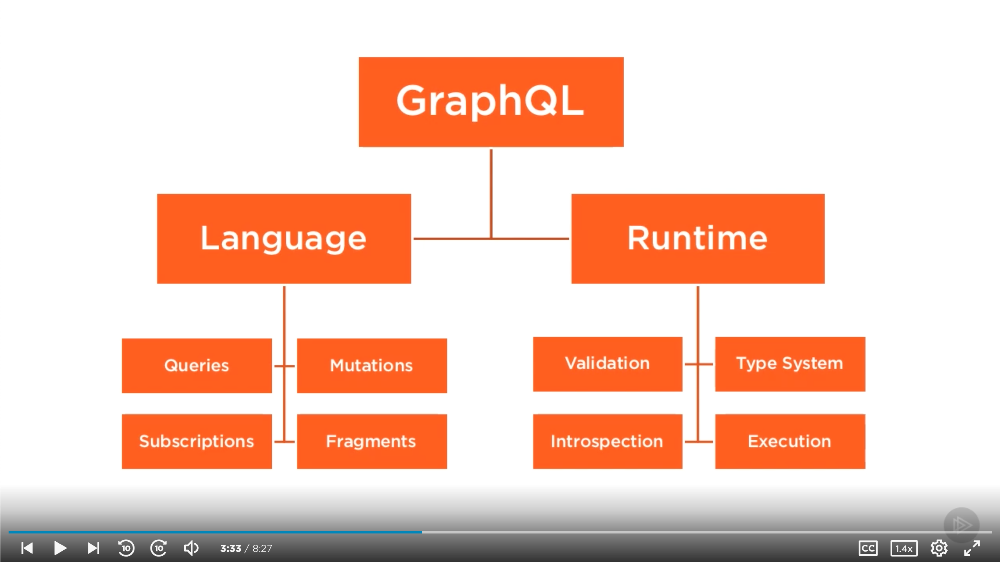
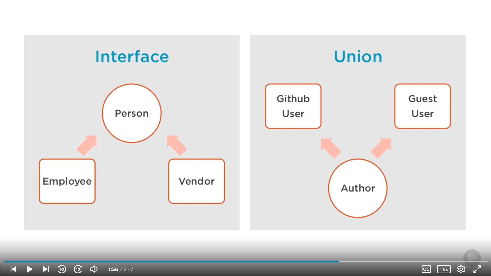
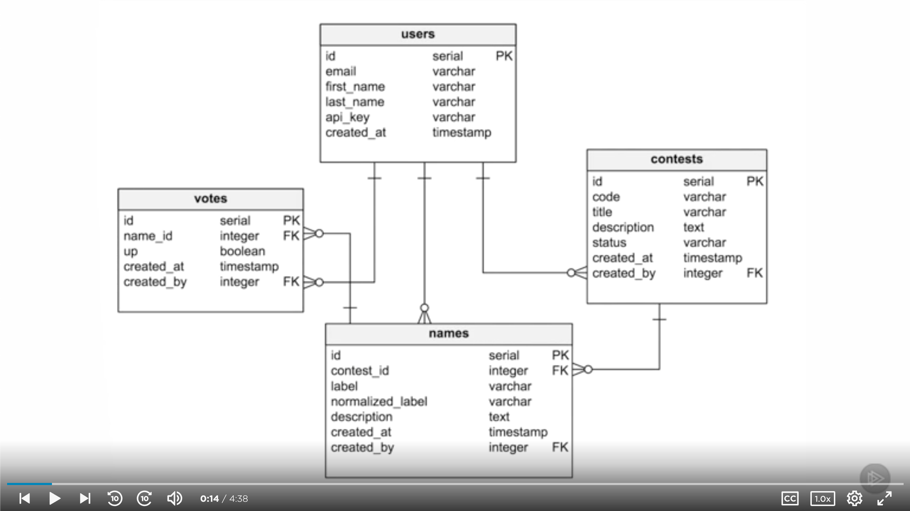

# [Building Scalable APIs with GraphQL](https://app.pluralsight.com/library/courses/graphql-scalable-apis) (Samer Buna, 2016-08-19)

## Introduction to GraphQL

### [Introduction](https://app.pluralsight.com/course-player?clipId=6068c2d8-3b2e-45cd-8c71-81737d41797c)

### [GraphQL Is a Language and a Runtime](https://app.pluralsight.com/course-player?clipId=c79873cf-af11-4701-8c7a-c90866e2658c)

- 
- Can send GraphQL request over HTTP (`/graphql?query=...&variables=...`), or sockets, or SSH, or a custom CLI.
- GraphQL runtime translates GraphQL queries to retrieve data.
- GraphQL request process:
  - Read input from an interface
  - Parse into AST
  - Execute resolver function for nodes
  - Execute resolver functions for children nodes
  - Ask data services
  - Merge data returned from services
  - Send response

### [The GraphQL Editor](https://app.pluralsight.com/course-player?clipId=43ceee02-1779-4a31-9acb-5c416624ae68)

- [https://www.graphqlhub.com](https://www.graphqlhub.com)
  - Editor: GraphiQL

### [GraphQL Language Basics](https://app.pluralsight.com/course-player?clipId=8dfc9ae3-4a2a-4c47-bbe1-9b8a2fc53865)

```gql
query TestQuery {
  graphQLHub
  github {
    user(username: "samerbuna") {
      id
      company
      avatar_url
      repos {
        name
      }
    }
  }
}

query ListOfCommits {
  github {
    repo(name: "graphql", ownerUsername: "facebook") {
      commits {
        date
        message
      }
    }
  }
}
```

### [Summary](https://app.pluralsight.com/course-player?clipId=8a75b9f9-e868-4538-abb6-0b9428310f96)

## GraphQL Query Language

### [Introduction](https://app.pluralsight.com/course-player?clipId=682ea265-7614-4757-a364-a11a8fa08ea7)

### [Fields](https://app.pluralsight.com/course-player?clipId=6c4a9834-2c75-41b6-933e-ad8c47b7c798)

- GraphQL fields are modeled after functions: They accept arguments and they return something in response.
  - We'll write JavaScript resolver functions on the server.
- Types:
  - `GraphQLInt`
  - `GraphQLFloat`
  - `GraphQLString`
  - `GraphQLBoolean`
  - `GraphQLID`
- Spaces, commas, and newlines are optional.

### [Variables](https://app.pluralsight.com/course-player?clipId=d08785fb-f1a2-4fe9-933c-192c1a35ca0f)

```gql
query TestQuery($currentUserName: String!) {
  github {
    user(username: $currentUserName) {
      id
      company
      avatar_url
      repos {
        name
      }
    }
  }
}
```

```json
{
  "currentUserName": "leebyron"
}
```

### [Directives](https://app.pluralsight.com/course-player?clipId=e90f3c56-e04c-4532-ae7c-40a977db4020)

```gql
query TestQuery($currentUserName: String!, $includeRepos: Boolean!) {
  graphQLHub
  github {
    user(username: $currentUserName) {
      id
      company
      avatar_url
      repos @include(if: $includeRepos) {
        name
      }
    }
  }
}
```

```json
{
  "currentUserName": "leebyron",
  "includeRepos": true
}
```

### [Aliases](https://app.pluralsight.com/course-player?clipId=7d369eaa-9e4b-4dd8-acbc-b7d3f71d451a)

```gql
query TestQuery($userName1: String!, $userName2: String!) {
  graphQLHub
  github {
    user1: user(username: $userName1) {
      id
      company
      avatar_url
    }
    user2: user(username: $userName2) {
      id
      company
      avatar_url
    }
  }
}
```

```json
{
  "userName1": "leebyron",
  "userName2": "dschafer"
}
```

### [Fragments](https://app.pluralsight.com/course-player?clipId=bbd34733-a053-4d42-93af-f4b88f248698)

- `...`: Spread operator
- Typically, a fragment maps to a UI component, allowing the components to own the part of the data they care about.
- Pluralsight: Building Data-driven React Applications with Relay, GraphQL, and Flux (Samer Buna, 2016-01-08)

```gql
query TestQuery($userName1: String!, $userName2: String!) {
  graphQLHub
  github {
    user1: user(username: $userName1) {
      ...UserInfo
    }
    user2: user(username: $userName2) {
      ...UserInfo
    }
  }
}

fragment UserInfo on GithubUser {
  id
  company
  avatar_url
}
```

```json
{
  "userName1": "leebyron",
  "userName2": "dschafer"
}
```

### [Inline Fragments](https://app.pluralsight.com/course-player?clipId=7b10f3c3-b594-462e-b084-c7b61e0209bf)

- Inline fragments are useful when we query a field that has multiple types (interfaces, unions).
  - 

```gql
query TestQuery {
  github {
    repo(name: "graphql", ownerUsername: "facebook") {
      commits {
        message
        author {
          ... on GithubUser {
            login
          }
          ... on GithubCommitAuthor {
            email
          }
        }
      }
    }
  }
}
```

### [Mutations](https://app.pluralsight.com/course-player?clipId=f95ff194-acab-4470-9645-a3e5a54fdfd0)

- A mutation is similar to a query, except with runtime awareness that resolving it will have side-effects on some elements of the data.
- We need to read something from the mutation payload.
- In the example below:
  - It will persist the input via the `createLink` function.
  - It will then return the data-base generated info.

```gql
mutation AddResource($input: CreateLinkInput!) {
  createLink(input: $input) {
    linkEdge {
      node {
        id
      }
    }
  }
}
```

```json
{
  "input": {
    "title": "GraphQLHub",
    "url": "https://www.graphqlhub.com",
    "clientMutationId": 42
  }
}
```

### [Summary](https://app.pluralsight.com/course-player?clipId=525beaff-917c-4978-b05f-7791ca806674)

## GraphQL Runtime

### [Introduction](https://app.pluralsight.com/course-player?clipId=d657ca37-412f-4f62-8bc1-dcf550087578)

- Prerequesites:

  - PostgreSQL ([postgres-brew.md](https://gist.github.com/ibraheem4/ce5ccd3e4d7a65589ce84f2a3b7c23a3); [Getting Started with PostgreSQL on Mac OSX](https://www.codementor.io/@engineerapart/getting-started-with-postgresql-on-mac-osx-are8jcopb))

    ```sh
    brew install postgresql
    ln -sfv /usr/local/opt/postgresql/*.plist ~/Library/LaunchAgents
    brew services start postgresql
    psql postgres
    ```

  - MongoDB ([Wiring up to MongoDB](https://github.com/ehelander/modern-apis/blob/master/introduction/restful-web-services-with-nodejs-and-express/README.md#wiring-up-to-mongodb))

    ```sh
    brew tap mongodb/brew
    brew install mongodb-community@4.2
    brew services start mongodb-community@4.2
    ```

  - Node ([Use nvm to install node, not homebrew](https://stackoverflow.com/a/50266406))

    ```sh
    curl -o- https://raw.githubusercontent.com/nvm-sh/nvm/v0.35.3/install.sh | bash
    export NVM_DIR="$([ -z "${XDG_CONFIG_HOME-}" ] && printf %s "${HOME}/.nvm" || printf %s "${XDG_CONFIG_HOME}/nvm")"
    [ -s "$NVM_DIR/nvm.sh" ] && \. "$NVM_DIR/nvm.sh" # This loads nvm
    nvm install --lts
    ```

### [Loading Some Test Data](https://app.pluralsight.com/course-player?clipId=540cc1c3-650f-4336-9987-d3fad8c59992)

- Clone `name-contests` repo

  ```sh
  git clone https://github.com/jscomplete/name-contests
  cd name-contests/
  git checkout m3-02
  ```

- Run `npm i`
- `package.json`:
  - `nodemon` will help us monitor the node process for changes while we develop our server.
  - Our starting point is `lib/index`. Currently, this is just an empty file that logs the environment.
    - Run `node lib/index.js`. Should see `Running in development mode...`
- `util.js`
  - We'll put generic utility functions here. Currently, it only exposes `nodeEnv`.
- `config/`
  - `mongo.js`
  - `pg.js`
- `database/`
  - `loadTestMongoData.js`
    - Collections:
    - `users`
  - `test-pg-data.js`
    - Tables:
      - `users`
      - `contests`
      - `names`
      - `votes`
- Test `psql` and `mongod`, and `mongo`
- Create `contests` table; verify it's empty

  ```txt
  createdb contests
  psql contests
  \dt
  \q
  ```

- Load test data into `contests` database. (Note that script can be used for resetting data.)

  ```sh
  psql contests < database/test-pg-data.sql
  ```

- Connect to `contests` db; verify tables exist and that tables contain data

  ```txt
  psql contests
  \dt
  select * from users;
  ```

- Load Mongo data

```sh
node database/loadTestMongoData.js
```

- Verify Mongo data loaded:

  ```txt
  mongo
  show dbs
  use contests
  show collections
  db.contests.find().pretty()
  ```

### [Your First GraphQL Schema](https://app.pluralsight.com/course-player?clipId=b4ac5a35-55e8-497c-879b-adf8bd675e0f)

- Hello world.

```sh
mkdir schema && touch schema/index.js
```

- `schema/index.js`:

```js
const { GraphQLSchema, GraphQLObjectType, GraphQLString } = require("graphql");

// All the fields we define here will be available at the top-level query selection scope.
const RootQueryType = new GraphQLObjectType({
  name: "RootQueryType",

  fields: {
    hello: {
      type: GraphQLString,
      resolve: () => "world",
    },
  },
});

const ncSchema = new GraphQLSchema({
  query: RootQueryType,
  // mutation:
});

module.exports = ncSchema;
```

- `lib/index.js`:

```js
const { nodeEnv } = require("./util");
console.log(`Running in ${nodeEnv} mode...`);

// Read the query from the command line arguments.
const query = process.argv[2];

const ncSchema = require("../schema");
const { graphql } = require("graphql");

// Execute and run the query against the defined server schema.
graphql(ncSchema, query).then((result) => {
  console.log(result);
});
```

- Run `npm i graphql`
- Run `node lib/index.js {hello}`
  - Response: `{ data: [Object: null prototype] { hello: 'world' } }`

### [Setting up a GraphQL HTTP Endpoint](https://app.pluralsight.com/course-player?clipId=b67849d8-b4fb-4d3a-b0b5-e0a48f666a8a)

- Branch for current lesson: `git checkout m3-04`.
- Add an HTTP endpoint in `lib/index.js`:

  ```js
  const { nodeEnv } = require("./util");
  console.log(`Running in ${nodeEnv} mode...`);

  // Create an Express app to provide an HTTP endpoint.
  const app = require("express")();

  // Users will be sending queries as HTTP requests, not as command line arguments.
  // const query = process.argv[2];

  const ncSchema = require("../schema");
  <!-- const { graphql } = require("graphql"); -->
  // Import a helper library to for handling an HTTP request, processing it according to our schema, and responding to the user.
  const graphqlHTTP = require("express-graphql");

  // We won't execute the query here, but in response to the endpoint being called.
  // graphql(ncSchema, query).then((result) => {
  //   console.log(result);
  // });

  // We define an endpoint route via middleware: `.use(path, function)`
  app.use(
    "/graphql",
    graphqlHTTP({
      schema: ncSchema,
      graphiql: true, // Gives us the GraphiQL editor on our local server. Strongly recommended for dev servers.
    })
  );

  // Retrieve the port from our env, with a fallback to 3000.
  const PORT = process.env.PORT || 3000;
  // Listen on the specified port.
  app.listen(PORT, () => {
    console.log(`Server is listening on port ${PORT}.`);
  });
  ```

- Install new dependencies: `npm i express express-graphql && npm i -D nodemon`
- Run `node lib/index.js`.
- Navigate to `localhost:3000/graphql`.

  - Should see GraphiQL editor.
  - Submit query:

    ```gql
    {
      hello
    }
    ```

- We'll be making a lot of changes in our `schema`. We can use `nodemon` to avoid needing to manually restart our app with every change.
  - Install
  - Add script to package.json: `"dev": "nodemon --exec node lib/index.js"`
- Documentation explorer in GraphiQL.
  - Note: Only a `RootQueryType`.
  - `Search Schema` for `hello`. Click `hello`.
- Add a description in `schema/index.js`.

  - Can use Markdown.
  - `description` is optional, but it's a best practice to always include it.

  ```js
  const {
    GraphQLSchema,
    GraphQLObjectType,
    GraphQLString,
  } = require("graphql");

  const RootQueryType = new GraphQLObjectType({
    name: "RootQueryType",

    fields: {
      hello: {
        type: GraphQLString,
        description: "The *mandatory* hello world example. GraphQL style.",
        resolve: () => "world",
      },
    },
  });

  const ncSchema = new GraphQLSchema({
    query: RootQueryType,
  });

  module.exports = ncSchema;
  ```

### [Defining Custom GraphQL Types](https://app.pluralsight.com/course-player?clipId=a8e7f5f7-ca64-4127-80c1-6f58d763f161)

- PostgreSQL data model:
  - 
- We want to be able to look up a user (`email`) by `api_key`:

  ```gql
  {
    me(key: "4242") {
      email
    }
  }
  ```

- Change our `RootQueryType` to support the query above:

```js
const { GraphQLNonNull, GraphQLObjectType, GraphQLSchema, GraphQLString } = require("graphql");

// Import MeType.
const MeType = require('./types/me');

const RootQueryType = new GraphQLObjectType({
  name: "RootQueryType",

  fields: {
    me: {
      type: MeType,
      description: "The current user identified by an API key.",
      args: {
        // Use the GraphQLNonNull type modifier helper to make this a required argument.
        key: { type: new GraphQLNonNull(GraphQLString)}
      }
      resolve: () => {
        // Read user information from database.
      },
    },
  },
});

const ncSchema = new GraphQLSchema({
  query: RootQueryType,
});

module.exports = ncSchema;
```

- Create `schema/types/me`: `mkdir types && touch types/me.js`

```js
const {
  GraphQLID
  GraphQLNonNull
  GraphQLObjectType,
  GraphQLString
} = require('graphql');

module.exports = new GraphQLObjectType({
  name: 'MeType',

  fields: {
    id: { type: GraphQLID },
    email: { type: GraphQLNonNull(GraphQLString) }
  }
})
```

### [Using the Context Object](https://app.pluralsight.com/course-player?clipId=fb352117-8ba5-4fbb-8952-bec6d279e19d)

- In `lib/index.js`:

```js
const { nodeEnv } = require("./util");
console.log(`Running in ${nodeEnv} mode...`);

// Import the Node PostgreSQL driver.
const pg = require("pg");
// Create a connection pool using the configuration object for the current environment.
const pgConfig = require("../config/pg")[nodeEnv];
// Create a pgPool object based on the configuration object.
// We want this to be available throughout the app so that any resolvers that need to access PostgreSQL can use it.
// Use the context object, which is passed to all resolver functions as the third argument.
const pgPool = new pg.Pool(pgConfig);

const app = require("express")();

const ncSchema = require("../schema");
const graphqlHTTP = require("express-graphql");

app.use(
  "/graphql",
  graphqlHTTP({
    schema: ncSchema,
    graphiql: true,
    // Global context object
    context: {
      pgPool,
    },
  })
);

const PORT = process.env.PORT || 3000;
app.listen(PORT, () => {
  console.log(`Server is listening on port ${PORT}.`);
});
```

- In `schema/index.js`:

```js
const {
  GraphQLNonNull,
  GraphQLObjectType,
  GraphQLSchema,
  GraphQLString,
} = require("graphql");

const pgdb = require("../database/pgdb");
const MeType = require("./types/me");

const RootQueryType = new GraphQLObjectType({
  name: "RootQueryType",

  fields: {
    me: {
      type: MeType,
      description: "The current user identified by an API key.",
      args: {
        key: { type: new GraphQLNonNull(GraphQLString) },
      },
      /*
        Arguments:
          obj:  The parent object we're representing. (Null for a root field.)
          args: The value of the field args passed in from the user.
          ctx:  Context object. Can be passed down from the executor.
      */
      resolve: (obj, args, { pgPool }) => {
        return pgdb(pgPool).getUser(args.key);
      },
    },
  },
});

const ncSchema = new GraphQLSchema({
  query: RootQueryType,
});

module.exports = ncSchema;
```

- Create `pgdb.js`: `touch database/pgdb.js`:

```js
module.exports = (pgPool) => {
  return {
    // Note that retrieving the user data from the database is an asynchronous operation. As long as return a promise that will resolve to the expected object, GraphQL resolvers are ok with that. The pg Node driver we're using returns promises for all of its objects.
    getUser(apiKey) {
      return pgPool
        .query(
          `
      select * from users
      where api_key = $1
      `,
          [apiKey]
        )
        .then((res) => {
          // The query returns a promise that resolves to an object that _has information about_ the rows returned. Chain a `.then()` to return just the row (or no rows).
          return res.rows[0];
        });
    },
  };
};
```

### [Reusable Field Definitions](https://app.pluralsight.com/course-player?clipId=34f28657-b509-4bb5-80be-93281913c4aa)

- In `schema/types/me.js`:

```js
const {
  GraphQLID,
  GraphQLNonNull,
  GraphQLObjectType,
  GraphQLString,
} = require("graphql");

module.exports = new GraphQLObjectType({
  name: "MeType",

  fields: {
    id: { type: GraphQLID },
    firstName: {
      type: GraphQLString,
      // We can force it to resolve to the snake_case field. Without specifying this, it currently returns `null` due to the camelCase/snake_case mismatch.
      resolve: obj => obj.first_name
    }
    email: { type: GraphQLNonNull(GraphQLString) },
  },
});
```

- Option 1: Use a `fromSnakeCase()` helper function.
  - `schema/types/me.js`:

```js
const {
  GraphQLID,
  GraphQLNonNull,
  GraphQLObjectType,
  GraphQLString,
} = require("graphql");

const { fromSnakeCase } = require("../../lib/util");

module.exports = new GraphQLObjectType({
  name: "MeType",

  fields: {
    id: { type: GraphQLID },
    firstName: fromSnakeCase(GraphQLString),
    lastName: fromSnakeCase(GraphQLString),
    email: { type: GraphQLNonNull(GraphQLString) },
    createdAt: fromSnakeCase(GraphQLString),
  },
});
```

- `lib/util.js`:

```js
const humps = require('humps');

module.exports = {
  nodeEnv: process.env.NODE_ENV || 'development'

  fromSnakeCase(GraphQLType) {
    return {
      type: GraphQLType,
      // The fourth (optional) argument includes information about the current execution state.
      resolve: (obj, args, ctx, { fieldName }) {
        return obj[humps.decamelize(fieldName)]
      }
    }
  }
};
```

- Now we should be able to query for the following:

```gql
{
  me(key: "4242") {
    id
    email
    firstName
    lastName
    createdAt
  }
}
```

### [camelCase allTheThings]()

### [Modeling a One-to-many Relationship]()

### [Reading Counts from MongoDB]()

### [Summary]()

## Data Loader and GraphQL Mutations

### [Introduction]()

### [Node's Cycling Module Dependency]()

### [The N+1 Queries Problem]()

### [Using Database Views with GraphQL]()

### [Working with Mutations]()

### [Working with Unions]()

### [Summary]()
