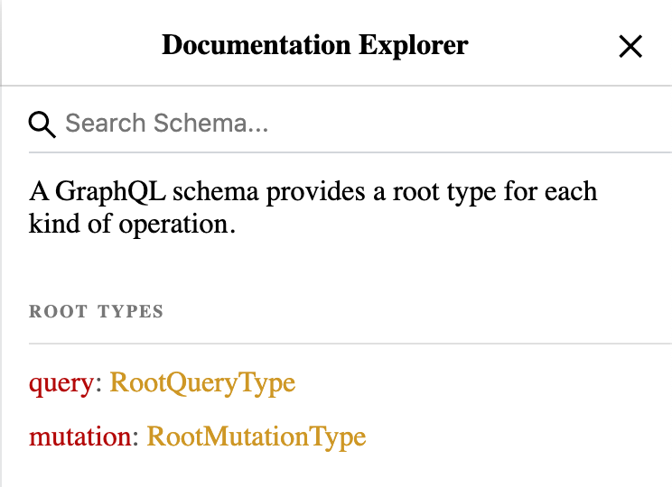
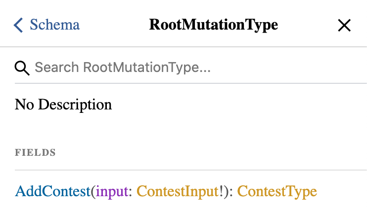

# [Building Scalable APIs with GraphQL](https://app.pluralsight.com/library/courses/graphql-scalable-apis) (Samer Buna, 2016-08-19)

## Introduction to GraphQL

### [Introduction](https://app.pluralsight.com/course-player?clipId=6068c2d8-3b2e-45cd-8c71-81737d41797c)

### [GraphQL Is a Language and a Runtime](https://app.pluralsight.com/course-player?clipId=c79873cf-af11-4701-8c7a-c90866e2658c)

- 
- Can send GraphQL request over HTTP (`/graphql?query=...&variables=...`), or sockets, or SSH, or a custom CLI.
- GraphQL runtime translates GraphQL queries to retrieve data.
- GraphQL request process:
  - Read input from an interface
  - Parse into AST
  - Execute resolver function for nodes
  - Execute resolver functions for children nodes
  - Ask data services
  - Merge data returned from services
  - Send response

### [The GraphQL Editor](https://app.pluralsight.com/course-player?clipId=43ceee02-1779-4a31-9acb-5c416624ae68)

- [https://www.graphqlhub.com](https://www.graphqlhub.com)
  - Editor: GraphiQL

### [GraphQL Language Basics](https://app.pluralsight.com/course-player?clipId=8dfc9ae3-4a2a-4c47-bbe1-9b8a2fc53865)

```gql
query TestQuery {
  graphQLHub
  github {
    user(username: "samerbuna") {
      id
      company
      avatar_url
      repos {
        name
      }
    }
  }
}

query ListOfCommits {
  github {
    repo(name: "graphql", ownerUsername: "facebook") {
      commits {
        date
        message
      }
    }
  }
}
```

### [Summary](https://app.pluralsight.com/course-player?clipId=8a75b9f9-e868-4538-abb6-0b9428310f96)

## GraphQL Query Language

### [Introduction](https://app.pluralsight.com/course-player?clipId=682ea265-7614-4757-a364-a11a8fa08ea7)

### [Fields](https://app.pluralsight.com/course-player?clipId=6c4a9834-2c75-41b6-933e-ad8c47b7c798)

- GraphQL fields are modeled after functions: They accept arguments and they return something in response.
  - We'll write JavaScript resolver functions on the server.
- Types:
  - `GraphQLInt`
  - `GraphQLFloat`
  - `GraphQLString`
  - `GraphQLBoolean`
  - `GraphQLID`
- Spaces, commas, and newlines are optional.

### [Variables](https://app.pluralsight.com/course-player?clipId=d08785fb-f1a2-4fe9-933c-192c1a35ca0f)

```gql
query TestQuery($currentUserName: String!) {
  github {
    user(username: $currentUserName) {
      id
      company
      avatar_url
      repos {
        name
      }
    }
  }
}
```

```json
{
  "currentUserName": "leebyron"
}
```

### [Directives](https://app.pluralsight.com/course-player?clipId=e90f3c56-e04c-4532-ae7c-40a977db4020)

```gql
query TestQuery($currentUserName: String!, $includeRepos: Boolean!) {
  graphQLHub
  github {
    user(username: $currentUserName) {
      id
      company
      avatar_url
      repos @include(if: $includeRepos) {
        name
      }
    }
  }
}
```

```json
{
  "currentUserName": "leebyron",
  "includeRepos": true
}
```

### [Aliases](https://app.pluralsight.com/course-player?clipId=7d369eaa-9e4b-4dd8-acbc-b7d3f71d451a)

```gql
query TestQuery($userName1: String!, $userName2: String!) {
  graphQLHub
  github {
    user1: user(username: $userName1) {
      id
      company
      avatar_url
    }
    user2: user(username: $userName2) {
      id
      company
      avatar_url
    }
  }
}
```

```json
{
  "userName1": "leebyron",
  "userName2": "dschafer"
}
```

### [Fragments](https://app.pluralsight.com/course-player?clipId=bbd34733-a053-4d42-93af-f4b88f248698)

- `...`: Spread operator
- Typically, a fragment maps to a UI component, allowing the components to own the part of the data they care about.
- Pluralsight: Building Data-driven React Applications with Relay, GraphQL, and Flux (Samer Buna, 2016-01-08)

```gql
query TestQuery($userName1: String!, $userName2: String!) {
  graphQLHub
  github {
    user1: user(username: $userName1) {
      ...UserInfo
    }
    user2: user(username: $userName2) {
      ...UserInfo
    }
  }
}

fragment UserInfo on GithubUser {
  id
  company
  avatar_url
}
```

```json
{
  "userName1": "leebyron",
  "userName2": "dschafer"
}
```

### [Inline Fragments](https://app.pluralsight.com/course-player?clipId=7b10f3c3-b594-462e-b084-c7b61e0209bf)

- Inline fragments are useful when we query a field that has multiple types (interfaces, unions).
  - 

```gql
query TestQuery {
  github {
    repo(name: "graphql", ownerUsername: "facebook") {
      commits {
        message
        author {
          ... on GithubUser {
            login
          }
          ... on GithubCommitAuthor {
            email
          }
        }
      }
    }
  }
}
```

### [Mutations](https://app.pluralsight.com/course-player?clipId=f95ff194-acab-4470-9645-a3e5a54fdfd0)

- A mutation is similar to a query, except with runtime awareness that resolving it will have side-effects on some elements of the data.
- We need to read something from the mutation payload.
- In the example below:
  - It will persist the input via the `createLink` function.
  - It will then return the data-base generated info.

```gql
mutation AddResource($input: CreateLinkInput!) {
  createLink(input: $input) {
    linkEdge {
      node {
        id
      }
    }
  }
}
```

```json
{
  "input": {
    "title": "GraphQLHub",
    "url": "https://www.graphqlhub.com",
    "clientMutationId": 42
  }
}
```

### [Summary](https://app.pluralsight.com/course-player?clipId=525beaff-917c-4978-b05f-7791ca806674)

## GraphQL Runtime

### [Introduction](https://app.pluralsight.com/course-player?clipId=d657ca37-412f-4f62-8bc1-dcf550087578)

- Prerequesites:

  - PostgreSQL ([postgres-brew.md](https://gist.github.com/ibraheem4/ce5ccd3e4d7a65589ce84f2a3b7c23a3); [Getting Started with PostgreSQL on Mac OSX](https://www.codementor.io/@engineerapart/getting-started-with-postgresql-on-mac-osx-are8jcopb))

    ```sh
    brew install postgresql
    ln -sfv /usr/local/opt/postgresql/*.plist ~/Library/LaunchAgents
    brew services start postgresql
    psql postgres
    ```

  - MongoDB ([Wiring up to MongoDB](https://github.com/ehelander/modern-apis/blob/master/introduction/restful-web-services-with-nodejs-and-express/README.md#wiring-up-to-mongodb))

    ```sh
    brew tap mongodb/brew
    brew install mongodb-community@4.2
    brew services start mongodb-community@4.2
    ```

  - Node ([Use nvm to install node, not homebrew](https://stackoverflow.com/a/50266406))

    ```sh
    curl -o- https://raw.githubusercontent.com/nvm-sh/nvm/v0.35.3/install.sh | bash
    export NVM_DIR="$([ -z "${XDG_CONFIG_HOME-}" ] && printf %s "${HOME}/.nvm" || printf %s "${XDG_CONFIG_HOME}/nvm")"
    [ -s "$NVM_DIR/nvm.sh" ] && \. "$NVM_DIR/nvm.sh" # This loads nvm
    nvm install --lts
    ```

### [Loading Some Test Data](https://app.pluralsight.com/course-player?clipId=540cc1c3-650f-4336-9987-d3fad8c59992)

- Clone `name-contests` repo

  ```sh
  git clone https://github.com/jscomplete/name-contests
  cd name-contests/
  git checkout m3-02
  ```

- Run `npm i`
- `package.json`:
  - `nodemon` will help us monitor the node process for changes while we develop our server.
  - Our starting point is `lib/index`. Currently, this is just an empty file that logs the environment.
    - Run `node lib/index.js`. Should see `Running in development mode...`
- `util.js`
  - We'll put generic utility functions here. Currently, it only exposes `nodeEnv`.
- `config/`
  - `mongo.js`
  - `pg.js`
- `database/`
  - `loadTestMongoData.js`
    - Collections:
    - `users`
  - `test-pg-data.js`
    - Tables:
      - `users`
      - `contests`
      - `names`
      - `votes`
- Test `psql` and `mongod`, and `mongo`
- Create `contests` table; verify it's empty

  ```txt
  createdb contests
  psql contests
  \dt
  \q
  ```

- Load test data into `contests` database. (Note that script can be used for resetting data.)

  ```sh
  psql contests < database/test-pg-data.sql
  ```

- Connect to `contests` db; verify tables exist and that tables contain data

  ```txt
  psql contests
  \dt
  select * from users;
  ```

- Load Mongo data

```sh
node database/loadTestMongoData.js
```

- Verify Mongo data loaded:

  ```txt
  mongo
  show dbs
  use contests
  show collections
  db.users.find().pretty()
  ```

### [Your First GraphQL Schema](https://app.pluralsight.com/course-player?clipId=b4ac5a35-55e8-497c-879b-adf8bd675e0f)

- Hello world.

```sh
mkdir schema && touch schema/index.js
```

- `schema/index.js`:

  ```js
  const {
    GraphQLSchema,
    GraphQLObjectType,
    GraphQLString,
  } = require('graphql');

  // All the fields we define here will be available at the top-level query selection scope.
  const RootQueryType = new GraphQLObjectType({
    name: 'RootQueryType',

    fields: {
      hello: {
        type: GraphQLString,
        resolve: () => 'world',
      },
    },
  });

  const ncSchema = new GraphQLSchema({
    query: RootQueryType,
    // mutation:
  });

  module.exports = ncSchema;
  ```

- `lib/index.js`:

  ```js
  const { nodeEnv } = require('./util');
  console.log(`Running in ${nodeEnv} mode...`);

  // Read the query from the command line arguments.
  const query = process.argv[2];

  const ncSchema = require('../schema');
  const { graphql } = require('graphql');

  // Execute and run the query against the defined server schema.
  graphql(ncSchema, query).then((result) => {
    console.log(result);
  });
  ```

- Run `npm i graphql`
- Run `node lib/index.js {hello}`
  - Response: `{ data: [Object: null prototype] { hello: 'world' } }`

### [Setting up a GraphQL HTTP Endpoint](https://app.pluralsight.com/course-player?clipId=b67849d8-b4fb-4d3a-b0b5-e0a48f666a8a)

- Branch for current lesson: `git checkout m3-04`.
- Add an HTTP endpoint in `lib/index.js`:

  ```js
  const { nodeEnv } = require('./util');
  console.log(`Running in ${nodeEnv} mode...`);

  // Create an Express app to provide an HTTP endpoint.
  const app = require('express')();

  // Users will be sending queries as HTTP requests, not as command line arguments.
  // const query = process.argv[2];

  const ncSchema = require('../schema');
  // const { graphql } = require("graphql");
  // Import a helper library to for handling an HTTP request, processing it according to our schema, and responding to the user.
  const graphqlHTTP = require('express-graphql');

  // We won't execute the query here, but in response to the endpoint being called.
  // graphql(ncSchema, query).then((result) => {
  //   console.log(result);
  // });

  // We define an endpoint route via middleware: `.use(path, function)`
  app.use(
    '/graphql',
    graphqlHTTP({
      schema: ncSchema,
      graphiql: true, // Gives us the GraphiQL editor on our local server. Strongly recommended for dev servers.
    }),
  );

  // Retrieve the port from our env, with a fallback to 3000.
  const PORT = process.env.PORT || 3000;
  // Listen on the specified port.
  app.listen(PORT, () => {
    console.log(`Server is listening on port ${PORT}.`);
  });
  ```

- Install new dependencies: `npm i express express-graphql && npm i -D nodemon`
- Run `node lib/index.js`.
- Navigate to `localhost:3000/graphql`.

  - Should see GraphiQL editor.
  - Submit query:

    ```gql
    {
      hello
    }
    ```

- We'll be making a lot of changes in our `schema`. We can use `nodemon` to avoid needing to manually restart our app with every change.
  - Install
  - Add script to package.json: `"dev": "nodemon --exec node lib/index.js"`
- Documentation explorer in GraphiQL.
  - Note: Only a `RootQueryType`.
  - `Search Schema` for `hello`. Click `hello`.
- Add a description in `schema/index.js`.

  - Can use Markdown.
  - `description` is optional, but it's a best practice to always include it.

  ```js
  const {
    GraphQLSchema,
    GraphQLObjectType,
    GraphQLString,
  } = require('graphql');

  const RootQueryType = new GraphQLObjectType({
    name: 'RootQueryType',

    fields: {
      hello: {
        type: GraphQLString,
        description:
          'The *mandatory* hello world example. GraphQL style.',
        resolve: () => 'world',
      },
    },
  });

  const ncSchema = new GraphQLSchema({
    query: RootQueryType,
  });

  module.exports = ncSchema;
  ```

### [Defining Custom GraphQL Types](https://app.pluralsight.com/course-player?clipId=a8e7f5f7-ca64-4127-80c1-6f58d763f161)

- PostgreSQL data model:
  - 
- We want to be able to look up a user (`email`) by `api_key`:

  ```gql
  {
    me(key: "4242") {
      email
    }
  }
  ```

- Change our `RootQueryType` to support the query above:

  ```js
  const { GraphQLNonNull, GraphQLObjectType, GraphQLSchema, GraphQLString } = require("graphql");

  // Import MeType.
  const MeType = require('./types/me');

  const RootQueryType = new GraphQLObjectType({
    name: "RootQueryType",

    fields: {
      me: {
        type: MeType,
        description: "The current user identified by an API key.",
        args: {
          // Use the GraphQLNonNull type modifier helper to make this a required argument.
          key: { type: new GraphQLNonNull(GraphQLString)}
        }
        resolve: () => {
          // Read user information from database.
        },
      },
    },
  });

  const ncSchema = new GraphQLSchema({
    query: RootQueryType,
  });

  module.exports = ncSchema;
  ```

- Create `schema/types/me`: `mkdir types && touch types/me.js`

  ```js
  const {
    GraphQLID
    GraphQLNonNull
    GraphQLObjectType,
    GraphQLString
  } = require('graphql');

  module.exports = new GraphQLObjectType({
    name: 'MeType',

    fields: {
      id: { type: GraphQLID },
      email: { type: GraphQLNonNull(GraphQLString) }
    }
  })
  ```

### [Using the Context Object](https://app.pluralsight.com/course-player?clipId=fb352117-8ba5-4fbb-8952-bec6d279e19d)

- In `lib/index.js`:

  ```js
  const { nodeEnv } = require('./util');
  console.log(`Running in ${nodeEnv} mode...`);

  // Import the Node PostgreSQL driver.
  const pg = require('pg');
  // Create a connection pool using the configuration object for the current environment.
  const pgConfig = require('../config/pg')[nodeEnv];
  // Create a pgPool object based on the configuration object.
  // We want this to be available throughout the app so that any resolvers that need to access PostgreSQL can use it.
  // Use the context object, which is passed to all resolver functions as the third argument.
  const pgPool = new pg.Pool(pgConfig);

  const app = require('express')();

  const ncSchema = require('../schema');
  const graphqlHTTP = require('express-graphql');

  app.use(
    '/graphql',
    graphqlHTTP({
      schema: ncSchema,
      graphiql: true,
      // Global context object
      context: {
        pgPool,
      },
    }),
  );

  const PORT = process.env.PORT || 3000;
  app.listen(PORT, () => {
    console.log(`Server is listening on port ${PORT}.`);
  });
  ```

- In `schema/index.js`:

  ```js
  const {
    GraphQLNonNull,
    GraphQLObjectType,
    GraphQLSchema,
    GraphQLString,
  } = require('graphql');

  const pgdb = require('../database/pgdb');
  const MeType = require('./types/me');

  const RootQueryType = new GraphQLObjectType({
    name: 'RootQueryType',

    fields: {
      me: {
        type: MeType,
        description: 'The current user identified by an API key.',
        args: {
          key: { type: new GraphQLNonNull(GraphQLString) },
        },
        /*
          Arguments:
            obj:  The parent object we're representing. (Null for a root field.)
            args: The value of the field args passed in from the user.
            ctx:  Context object. Can be passed down from the executor.
        */
        resolve: (obj, args, { pgPool }) => {
          return pgdb(pgPool).getUser(args.key);
        },
      },
    },
  });

  const ncSchema = new GraphQLSchema({
    query: RootQueryType,
  });

  module.exports = ncSchema;
  ```

- Create `pgdb.js`: `touch database/pgdb.js`:

  ```js
  module.exports = (pgPool) => {
    return {
      // Note that retrieving the user data from the database is an asynchronous operation. As long as return a promise that will resolve to the expected object, GraphQL resolvers are ok with that. The pg Node driver we're using returns promises for all of its objects.
      getUser(apiKey) {
        return pgPool
          .query(
            `
        select * from users
        where api_key = $1
        `,
            [apiKey],
          )
          .then((res) => {
            // The query returns a promise that resolves to an object that _has information about_ the rows returned. Chain a `.then()` to return just the row (or no rows).
            return res.rows[0];
          });
      },
    };
  };
  ```

### [Reusable Field Definitions](https://app.pluralsight.com/course-player?clipId=34f28657-b509-4bb5-80be-93281913c4aa)

- In `schema/types/me.js`:

  ```js
  const {
    GraphQLID,
    GraphQLNonNull,
    GraphQLObjectType,
    GraphQLString,
  } = require("graphql");

  module.exports = new GraphQLObjectType({
    name: "MeType",

    fields: {
      id: { type: GraphQLID },
      firstName: {
        type: GraphQLString,
        // We can force it to resolve to the snake_case field. Without specifying this, it currently returns `null` due to the camelCase/snake_case mismatch.
        resolve: obj => obj.first_name
      }
      email: { type: GraphQLNonNull(GraphQLString) },
    },
  });
  ```

- Option 1: Use a `fromSnakeCase()` helper function.

  - `schema/types/me.js`:

    ```js
    const {
      GraphQLID,
      GraphQLNonNull,
      GraphQLObjectType,
      GraphQLString,
    } = require('graphql');

    const { fromSnakeCase } = require('../../lib/util');

    module.exports = new GraphQLObjectType({
      name: 'MeType',

      fields: {
        id: { type: GraphQLID },
        firstName: fromSnakeCase(GraphQLString),
        lastName: fromSnakeCase(GraphQLString),
        email: { type: GraphQLNonNull(GraphQLString) },
        createdAt: fromSnakeCase(GraphQLString),
      },
    });
    ```

  - `lib/util.js`:

    ```js
    const humps = require('humps');

    module.exports = {
      nodeEnv: process.env.NODE_ENV || 'development'

      fromSnakeCase(GraphQLType) {
        return {
          type: GraphQLType,
          // The fourth (optional) argument includes information about the current execution state.
          resolve: (obj, args, ctx, { fieldName }) {
            return obj[humps.decamelize(fieldName)]
          }
        }
      }
    };
    ```

  - Now we should be able to query for the following:

    ```gql
    {
      me(key: "4242") {
        id
        email
        firstName
        lastName
        createdAt
      }
    }
    ```

### [camelCase allTheThings](https://app.pluralsight.com/course-player?clipId=b2b7bb93-f618-4842-98b8-e0da429addd4)

- Option 1 worked, but it's a bit fragile.
- Option 2: Camelize every field retrieved from the database.

  - Revert `lib/util.js`:

    ```js
    module.exports = {
      nodeEnv: process.env.NODE_ENV || 'development',
    };
    ```

  - `database/pgdb.js`

  ```js
  const humps = require('humps');

  module.exports = (pgPool) => {
    return {
      getUser(apiKey) {
        return pgPool
          .query(
            `
          SELECT  *
          FROM    users
          WHERE   api_key = $1
        `,
            [apiKey],
          )
          .then((res) => {
            return humps.camelizeKeys(res.rows[0]);
          });
      },
    };
  };
  ```

  - `schema/types/me.js`:

    ```js
    const {
      GraphQLID,
      GraphQLNonNull,
      GraphQLObjectType,
      GraphQLString,
    } = require('graphql');

    module.exports = new GraphQLObjectType({
      name: 'MeType',

      fields: {
        id: { type: GraphQLID },
        firstName: { type: GraphQLString },
        lastName: { type: GraphQLString },
        email: { type: GraphQLNonNull(GraphQLString) },
        createdAt: { type: GraphQLString },
      },
    });
    ```

### [Modeling a One-to-many Relationship](https://app.pluralsight.com/course-player?clipId=bb7348eb-9bc1-4003-98e8-dcd9798c12a9)

- Add a nested property inside of `me` to list all the contests created by the current user.

  ```js
  // ...
  const ContestType = require('./contest');
  // ...

  module.exports = new GraphQLObjectType({
    // ...
    fields: {
      // ...
      contests: {
        type: new GraphQLList(ContestType),
        resolve() {
          // Read contests from database.
        },
      },
    },
  });
  ```

- Create `contest.js`: `touch schema/types/contest.js`:

  ```js
  const { GraphQLObjectType } = require('graphql');

  const ContestStatusType = require('./contest-status-type');

  module.exports = new GraphQLObjectType({
    name: 'ContestType',

    fields: {
      id: { type: GraphQLID },
      code: { type: new GraphQLNonNull(GraphQLString) },
      title: { type: new GraphQLNonNull(GraphQLString) },
      description: { type: GraphQLString },
      status: { type: new GraphQLNonNull(ContestStatusType) },
      createdAt: { type: new GraphQLNonNull(GraphQLString) },
    },
  });
  ```

- Create `schema/types/contest-status.js`: `touch schema/types/contest-status.js`

  ```js
  const { GraphQLEnumType } = require('graphql');

  module.exports = new GraphQLEnumType({
    name: 'ContestStatusType',

    values: {
      DRAFT: { value: 'draft' },
      PUBLISHED: { value: 'published' },
      ARCHIVED: { value: 'archived' },
    },
  });
  ```

- In `schema/types/me.js`:

  ```js
  // ...
  const pgdb = require('../../database/pgdb');
  const ContestType = require('./contest');
  // ...

  module.exports = new GraphQLObjectType({
    // ...
    fields: {
      // ...
      contests: {
        type: new GraphQLList(ContestType),
        resolve(obj, args, { pgPool }) {
          return pgdb(pgPool).getContests(obj);
        },
      },
    },
  });
  ```

- In `database/pgdb.js`:

  ```js
  module.exports = pgPool => {
    // ...
    getContests(user) {
      return pgPool.query(`
        SELECT  *
        FROM    contests
        WHERE   created_by = $1
      `, [user.id]).then(res => {
        // `camelizeKeys` works for arrays.
        return humps.camelizeKeys(res.rows);
      })
    }
  }
  ```

- The following query should return a list of contests:

  ```gql
  query MyContests {
    me(key: "4242") {
      id
      email
      fullName
      contests {
        id
        code
        title
        description
        status
        createdAt
      }
    }
  }
  ```

### [Reading Counts from MongoDB](https://app.pluralsight.com/course-player?clipId=c48f8ff3-6aed-4a9f-a32b-595b08638275)

- We want to be able to retrieve the following:

  ```gql
  query MyContests {
    me(key: "4242") {
      id
      email
      fullName
      contestsCount
      namesCount
      votesCount
    }
  }
  ```

- Prepare `lib/index.js`:

  ```js
  const { nodeEnv } = require('./util');
  console.log(`Running in ${nodeEnv} mode...`);

  const pg = require('pg');
  const pgConfig = require('../config/pg')[nodeEnv];
  const pgPool = new pg.Pool(pgConfig);

  const app = require('express')();

  const ncSchema = require('../schema');
  const graphqlHTTP = require('express-graphql');

  // Import the Node driver.
  const { MongoClient } = require('mongodb');
  // Import assert (part of the Node library).
  const assert = require('assert');
  // Create a Mongo config object, based on our nodeEnv.
  const mConfig = require('../config/mongo')[nodeEnv];

  // Connect to the MongoClient.
  MongoClient.connect(mConfig.url, (err, mPool) => {
    // Throw an error if Mongo encounters an error.
    assert.equal(err, null);

    app.use(
      '/graphql',
      graphqlHTTP({
        schema: ncSchema,
        graphiql: true,
        context: {
          pgPool,
          mPool,
        },
      }),
    );
  });

  const PORT = process.env.PORT || 3000;
  app.listen(PORT, () => {
    console.log(`Server is listening on port ${PORT}.`);
  });
  ```

- Create `mdb.js`: `touch database/mdb.js`:

  ```js
  module.export = (mPool) => {
    return {
      // Parameterize the `countsField` so that we can use the same function for contestCount, namesCount, votesCount.
      getCounts(user, countsField) {
        return mPool
          .collection('users')
          .findOne({ userId: user.id })
          .then((userCounts) => userCounts[countsField]);
      },
    };
  };
  ```

- In `schema/types/me.js`:

  - Note, however, that we're making 3 separate connections to Mongo. This can be a major challenge in GraphQL. We'll address this in the next module.

  ```js
  // ...
  const mdb = require('../../database/mdb');
  // ...
  module.exports = new GraphQLObjectType({
    name: 'MeType',

    fields: {
      // ...
      contestsCount: {
        type: GraphQLInt,
        resolve(obj, args, { mPool }, { fieldName }) {
          return mdb(mPool).getCounts(obj, fieldName);
        },
      },
      namesCount: {
        type: GraphQLInt,
        resolve(obj, args, { mPool }, { fieldName }) {
          return mdb(mPool).getCounts(obj, fieldName);
        },
      },
      votesCount: {
        type: GraphQLInt,
        resolve(obj, args, { mPool }, { fieldName }) {
          return mdb(mPool).getCounts(obj, fieldName);
        },
      },
    },
  });
  ```

### [Summary](https://app.pluralsight.com/course-player?clipId=ef0ac007-7e27-42d0-a2f9-10e54778671d)

## Data Loader and GraphQL Mutations

### [Introduction](https://app.pluralsight.com/course-player?clipId=089c552a-8d6c-43bb-b53a-1624cc5d1c08)

### [Node's Cyclic Module Dependency](https://app.pluralsight.com/course-player?clipId=7bd1f1e5-7996-41f3-b06a-372ca712346f)

- Create `schema/types/name.js`: `touch schema/types/name.js`:

  ```js
  const { GraphQLObjectType } = require('graphql');

  const UserType = require('./user');

  module.exports = new GraphQLObjectType({
    name: 'Name',

    fields: {
      id: { type: GraphQLID },
      label: { type: new GraphQLNonNull(GraphQLString) },
      description: { type: GraphQLString },
      createdAt: { type: new GraphQLNonNull(GraphQLString) },
      // We'll expose the user object instead of the createdBy id: Override the type -> UserType.
      createdBy: { type: new GraphQLNonNull(UserType) },
    },
  });
  ```

- Rename `MeType` to `UserType` (`me.js` &rarr; `user.js`).
- In `contest.js`:

  ```js
  const {
    GraphQLID,
    GraphQLList,
    GraphQLNonNull,
    GraphQLObjectType,
    GraphQLString,
  } = require('graphql');

  const pgdb = require('../../database/pgdb');
  const NameType = require('./name');
  const ContestStatusType = require('./contest-status');

  module.exports = new GraphQLObjectType({
    name: 'ContestType',

    fields: {
      id: { type: GraphQLID },
      code: { type: new GraphQLNonNull(GraphQLString) },
      title: { type: new GraphQLNonNull(GraphQLString) },
      description: { type: GraphQLString },
      status: { type: new GraphQLNonNull(ContestStatusType) },
      createdAt: { type: new GraphQLNonNull(GraphQLString) },
      // A list of names associated with the contest.
      names: {
        type: new GraphQLList(NameType),
        resolve(obj, args, { pgPool }) {
          return pgdb(pgPool).getNames(obj);
        },
      },
    },
  });
  ```

- In `pgdb.js`:

  ```js
  const humps = require('humps');

  module.exports = (pgPool) => {
    return {
      getUser(apiKey) {
        return pgPool
          .query(
            `
          SELECT  *
          FROM    users
          WHERE   api_key = $1
        `,
            [apiKey],
          )
          .then((res) => {
            return humps.camelizeKeys(res.rows[0]);
          });
      },

      getContests(user) {
        return pgPool
          .query(
            `
          SELECT  *
          FROM    contests
          WHERE   created_by = $1
        `,
            [user.id],
          )
          .then((res) => {
            return humps.camelizeKeys(res.rows);
          });

      // Add getNames().
          getNames(contest) {
        return pgPool
          .query(
            `
          SELECT  *
          FROM    names
          WHERE   contest_id = $1
        `,
            [contest.id],
          )
          .then((res) => {
            return humps.camelizeKeys(res.rows);
          });
      },
    };
  };
  ```

- In `schema/types/name.js`::

  ```js
  const { GraphQLObjectType } = require('graphql');

  const pgdb = require('../../database/pgdb');
  const UserType = require('./user');

  module.exports = new GraphQLObjectType({
    name: 'Name',

    fields: {
      id: { type: GraphQLID },
      label: { type: new GraphQLNonNull(GraphQLString) },
      description: { type: GraphQLString },
      createdAt: { type: new GraphQLNonNull(GraphQLString) },
      createdBy: {
        type: new GraphQLNonNull(UserType),
        // Return an object, not a number (as it's stored in the DB).
        resolve(obj, args, { pgPool }) {
          return pgdb(pgPool).getUserById(obj.createdBy);
        },
      },
    },
  });
  ```

- In `database.pgdb`,

  ```js
  const humps = require('humps');

  module.exports = (pgPool) => {
    return {
      // Add `getUserById()`.
      getUserById(userId) {
        return pgPool
          .query(
            `
          SELECT  *
          FROM    users
          WHERE   id = $1
        `,
            [userId],
          )
          .then((res) => {
            return humps.camelizeKeys(res.rows[0]);
          });
      },
      // Rename `getUser()` to `getUserByApiKey()`.
      getUserByApiKey(apiKey) {
        return pgPool
          .query(
            `
          SELECT  *
          FROM    users
          WHERE   api_key = $1
        `,
            [apiKey],
          )
          .then((res) => {
            return humps.camelizeKeys(res.rows[0]);
          });
      },

      getContests(user) {
        return pgPool
          .query(
            `
          SELECT  *
          FROM    contests
          WHERE   created_by = $1
        `,
            [user.id],
          )
          .then((res) => {
            return humps.camelizeKeys(res.rows);
          });

      getNames(contest) {
        return pgPool
          .query(
            `
          SELECT  *
          FROM    names
          WHERE   contest_id = $1
        `,
            [contest.id],
          )
          .then((res) => {
            return humps.camelizeKeys(res.rows);
          });
      },
    };
  };
  ```

- But we have a cyclic module dependency.
  - NameType depends on UserType
  - UserType depends on ContestType
  - ContestType depends on NameType.
- Instead of using a plain JavaScript object for the `fields` of `name.js`, we can use a function that returns the fields; and we can move the `UserType` import inside the function so that we're not immediately using it.

  - This is also a useful technique when dealing with a field that references its own parent type (e.g., an employee's boss is also an employee). In fact, we should _default to using this syntax_.
  - In `schema/types/name.js`:

    ```js
    const { GraphQLObjectType } = require('graphql');

    const pgdb = require('../database/pgdb');

    module.exports = new GraphQLObjectType({
      name: 'Name',

      fields: () => {
        const UserType = require('./user');
        return {
          id: { type: GraphQLID },
          label: { type: new GraphQLNonNull(GraphQLString) },
          description: { type: GraphQLString },
          createdAt: { type: new GraphQLNonNull(GraphQLString) },
          createdBy: {
            type: new GraphQLNonNull(UserType),
            // Return an object, not a number (as it's stored in the DB).
            resolve(obj, args, { pgPool }) {
              return pgdb(pgPool).getUserById(obj.createdBy);
            },
          },
        };
      },
    });
    ```

- Now we can query the following:

  ```gql
  query MyContests {
    me(key: "4242") {
      id
      email
      fullName
      contestsCount
      namesCount
      votesCount
      contests {
        title
        names {
          label
          createdBy {
            fullName
          }
        }
      }
    }
  }
  ```

- But we have an N+1 problem: Too many database queries.

### [The N+1 Queries Problem](https://app.pluralsight.com/course-player?clipId=e5fff204-25d9-4ea8-ab7e-1b8d07dda913)

- The query above results in 9 PostgreSQL calls.
  - 3 `names` queries, plus 1 for `contests`.
    - We have 3 contests, and we're reading names for each contest. Thus, N+1.
  - And 4 `users` calls, onc for each name in the return data.
- Caching (same-session) is our friend.
  - This helps if the query is asking for the _same_ user repeatedly.
  - But if we're querying for _different_ users, we need more than caching. We need batching.
  - With batching, we delay the query for a particular resource until we know all the IDs we'll be querying for. Then query for a list of IDs.
  - Managing caching and batching is a pain. Thankfully we have `dataloader` from facebook.
- `dataloader`
  - DataLoader is a function that takes an array of keys, and returns an array of values.
  - Then `dataloader` internallly applies caching & batching when it can.
- To prepare for `dataloader`, we need to convert `database/pgdb.js` gets to take lists.

  - But 2 considerations:
    - If an ID is not found in the database, we could end up with fewer output items than input items. Dataloader would complain.
    - The order of items in the output array must match the order of items in the input array, or Dataloader would complain.

  ```js
  const humps = require('humps');
  const _ = require('lodash');

  module.exports = (pgPool) => {
    const orderedFor = (rows, collection, field) => {
      /*
        Make sure:
          - We have an output item for each input item.
          - The order of output items matches the order of input items.
      */
      const data = humps.camelizeKeys(rows);
      const inGroupsOfField = _.groupBy(data, field);
      return collection.map((element) => {
        const elementArray = inGroupsOfField[element];
        if (elementArray) {
          // If the array contains multiple row matches, just return the first one.
          return elementArray[0];
        }
        return {};
      });
    };

    return {
      // getUserById(userId) {
      getUsersByIds(userIds) {
        return (
          pgPool
            //   .query(
            //     `
            //   SELECT  *
            //   FROM    users
            //   WHERE   id = $1
            // `,
            .query(
              `
          SELECT  *
          FROM    users
          WHERE   id = ANY($1)
        `,
              // [userId],
              [userIds],
            )
            .then((res) => {
              // return humps.camelizeKeys(res.rows[0]);
              // return humps.camelizeKeys(res.rows);
              return orderedFor(res.rows, userIds, 'id');
            })
        );
      },

      getUserByApiKey(apiKey) {
        return pgPool
          .query(
            `
          SELECT  *
          FROM    users
          WHERE   api_key = $1
        `,
            [apiKey],
          )
          .then((res) => {
            return humps.camelizeKeys(res.rows[0]);
          });
      },

      getContests(user) {
        return pgPool
          .query(
            `
          SELECT  *
          FROM    contests
          WHERE   created_by = $1
        `,
            [user.id],
          )
          .then((res) => {
            return humps.camelizeKeys(res.rows);
          });
      },

      getNames(contest) {
        return pgPool
          .query(
            `
            SELECT  *
            FROM    names
            WHERE   contest_id = $1
          `,
            [contest.id],
          )
          .then((res) => {
            return humps.camelizeKeys(res.rows);
          });
      },
    };
  };
  ```

- Set up DataLoader in `lib/index.js` (because we want the dataloaders to be initialized _per request_, not globally for all requests: we want to minimize the number of queries per request; not maintain a global cache, which gets more complicated):

  ```js
  const { nodeEnv } = require('./util');
  console.log(`Running in ${nodeEnv} mode...`);

  const DataLoader = require('dataloader');
  const pg = require('pg');
  const pgConfig = require('../config/pg')[nodeEnv];
  const pgPool = new pg.Pool(pgConfig);
  const pgdb = require('../database/pgdb')(pgPool);

  const app = require('express')();

  const ncSchema = require('../schema');
  const graphqlHTTP = require('express-graphql');

  const { MongoClient } = require('mongodb');
  const assert = require('assert');
  const mConfig = require('../config/mongo')[nodeEnv];

  MongoClient.connect(mConfig.url, (err, mPool) => {
    assert.equal(err, null);

    // app.use(
    //   '/graphql',
    //   graphqlHTTP({
    //     schema: ncSchema,
    //     graphiql: true,
    //     context: {
    //       pgPool,
    //       mPool,
    //     },
    //   }),
    // );
    // Use Express's callback:
    app.use(
      '/graphql', (req, res) => {
        // Anything we write in the callback will have the lifetime of the request.
        const loaders = {
          // Create a DataLoader object.
          usersByIds: new DataLoader(pgdb.getUsersByIds)
        }
        graphqlHTTP({
          schema: ncSchema,
          graphiql: true,
          context: {
            pgPool,
            mPool,
            // Make the loaders available in the context.
            loaders
          },
        })(req, res),
      }
    );
  });

  const PORT = process.env.PORT || 3000;
  app.listen(PORT, () => {
    console.log(`Server is listening on port ${PORT}.`);
  });
  ```

- Install new dependencies: `npm i dataloader lodash`
- Convert `schema/types/names.js` to use the dataloader:

  ```js
  const {
    GraphQLID,
    GraphQLNonNull,
    GraphQLObjectType,
    GraphQLString,
  } = require('graphql');

  // const pgdb = require('../../database/pgdb');
  const UserType = require('./user');

  module.exports = new GraphQLObjectType({
    name: 'Name',

    fields: () => {
      const UserType = require('./user');
      return {
        id: { type: GraphQLID },
        label: { type: new GraphQLNonNull(GraphQLString) },
        description: { type: GraphQLString },
        createdAt: { type: new GraphQLNonNull(GraphQLString) },
        createdBy: {
          type: new GraphQLNonNull(UserType),
          // resolve(obj, args, { pgPool }) {
          //   return pgdb(pgPool).getUserById(obj.createdBy);
          resolve(obj, args, { loaders }) {
            return loaders.usersByIds.load(obj.createdBy);
          },
        },
      };
    },
  });
  ```

- Now we're down to 6 queries, only calling `users` 1 time.
- DataLoader is an essential tool for a GraphQL server.
- Convert remaining getters in `database/pgdb.js`:

  ```js
  const humps = require('humps');
  const _ = require('lodash');

  module.exports = (pgPool) => {
    const orderedFor = (rows, collection, field, singleObject) => {
      const data = humps.camelizeKeys(rows);
      const inGroupsOfFields = _.groupBy(data, field);
      return collection.map((element) => {
        const elementArray = inGroupsOfFields[element];
        if (elementArray) {
          return singleObject ? elementArray[0] : elementArray;
        }
        return singleObject ? {} : [];
      });
    };

    return {
      getUsersByIds(userIds) {
        return pgPool
          .query(
            `
          SELECT  *
          FROM    users
          WHERE   id = ANY($1)
        `,
            [userIds],
          )
          .then((res) => {
            return orderedFor(res.rows, userIds, 'id', true);
          });
      },

      getUsersByApiKeys(apiKeys) {
        return pgPool
          .query(
            `
          SELECT  * 
          FROM    users
          WHERE   api_key = ANY($1)
        `,
            [apiKeys],
          )
          .then((res) => {
            return orderedFor(res.rows, apiKeys, 'apiKey', true);
          });
      },

      getContestsForUserIds(userIds) {
        return pgPool
          .query(
            `
          SELECT  *
          FROM    contests
          WHERE   created_by = ANY($1)
        `,
            [userIds],
          )
          .then((res) => {
            return orderedFor(res.rows, userIds, 'createdBy', false);
          });
      },

      getNamesForContestIds(contestIds) {
        return pgPool
          .query(
            `
            SELECT  *
            FROM    names
            WHERE   contest_id = ANY($1)
          `,
            [contestIds],
          )
          .then((res) => {
            return orderedFor(
              res.rows,
              contestIds,
              'contestId',
              false,
            );
          });
      },
    };
  };
  ```

- Create loaders in `lib/index.js`:

  ```js
  const { nodeEnv } = require('./util');
  console.log(`Running in ${nodeEnv} mode...`);

  const DataLoader = require('dataloader');
  const pg = require('pg');
  const pgConfig = require('../config/pg')[nodeEnv];
  const pgPool = new pg.Pool(pgConfig);
  const pgdb = require('../database/pgdb')(pgPool);

  const app = require('express')();

  const ncSchema = require('../schema');
  const graphqlHTTP = require('express-graphql');

  const { MongoClient } = require('mongodb');
  const assert = require('assert');
  const mConfig = require('../config/mongo')[nodeEnv];

  MongoClient.connect(mConfig.url, (err, mPool) => {
    assert.equal(err, null);

    app.use('/graphql', (req, res) => {
      const loaders = {
        usersByIds: new DataLoader(pgdb.getUsersByIds),
        usersByApiKeys: new DataLoader(pgdb.getUsersByApiKeys),
        namesForContestIds: new DataLoader(
          pgdb.getNamesForContestIds,
        ),
        contestsForUserIds: new DataLoader(
          pgdb.getContestsForUserIds,
        ),
      };
      graphqlHTTP({
        schema: ncSchema,
        graphiql: true,
        context: {
          pgPool,
          mPool,
          loaders,
        },
      })(req, res);
    });

    const PORT = process.env.PORT || 3000;
    app.listen(PORT, () => {
      console.log(`Server is listening on port ${PORT}.`);
    });
  });
  ```

- Replace database calls to PostgreSQL:

  - `schema/index.js`:

    ```js
    const {
      GraphQLNonNull,
      GraphQLObjectType,
      GraphQLSchema,
      GraphQLString,
    } = require('graphql');

    const MeType = require('./types/user');

    const RootQueryType = new GraphQLObjectType({
      name: 'RootQueryType',

      fields: {
        me: {
          type: MeType,
          description: 'The current user identified by an API key.',
          args: {
            key: { type: new GraphQLNonNull(GraphQLString) },
          },
          resolve: (obj, args, { loaders }) => {
            return loaders.usersByApiKeys.load(args.key);
          },
        },
      },
    });

    const ncSchema = new GraphQLSchema({
      query: RootQueryType,
    });

    module.exports = ncSchema;
    ```

  - `schema/types/user.js`:

    ```js
    const {
      GraphQLID,
      GraphQLInt,
      GraphQLList,
      GraphQLNonNull,
      GraphQLObjectType,
      GraphQLString,
    } = require('graphql');

    // const pgdb = require('../../database/pgdb');
    const mdb = require('../../database/mdb');
    const ContestType = require('./contest');

    module.exports = new GraphQLObjectType({
      name: 'UserType',

      fields: {
        id: { type: GraphQLID },
        firstName: { type: GraphQLString },
        lastName: { type: GraphQLString },
        fullName: {
          type: GraphQLString,
          resolve: (obj) => `${obj.firstName} ${obj.lastName}`,
        },
        email: { type: GraphQLNonNull(GraphQLString) },
        createdAt: { type: GraphQLString },
        contests: {
          type: new GraphQLList(ContestType),
          // resolve(obj, args, { pgPool }) {
          //   return pgdb(pgPool).getContestsForUserIds(obj);
          resolve(obj, args, { loaders }) {
            return loaders.contestsForUserIds.load(obj.id);
          },
        },
        contestsCount: {
          type: GraphQLInt,
          resolve(obj, args, { mPool }, { fieldName }) {
            return mdb(mPool).getCounts(obj, fieldName);
          },
        },
        namesCount: {
          type: GraphQLInt,
          resolve(obj, args, { mPool }, { fieldName }) {
            return mdb(mPool).getCounts(obj, fieldName);
          },
        },
        votesCount: {
          type: GraphQLInt,
          resolve(obj, args, { mPool }, { fieldName }) {
            return mdb(mPool).getCounts(obj, fieldName);
          },
        },
      },
    });
    ```

  - `schema/types/contest.js`:

    ```js
    const {
      GraphQLID,
      GraphQLList,
      GraphQLNonNull,
      GraphQLObjectType,
      GraphQLString,
    } = require('graphql');

    // const pgdb = require('../../database/pgdb');
    const NameType = require('./name');
    const ContestStatusType = require('./contest-status');

    module.exports = new GraphQLObjectType({
      name: 'ContestType',

      fields: {
        id: { type: GraphQLID },
        code: { type: new GraphQLNonNull(GraphQLString) },
        title: { type: new GraphQLNonNull(GraphQLString) },
        description: { type: GraphQLString },
        status: { type: new GraphQLNonNull(ContestStatusType) },
        createdAt: { type: new GraphQLNonNull(GraphQLString) },
        names: {
          type: new GraphQLList(NameType),
          // resolve(obj, args, { pgPool }) {
          //   return pgdb(pgPool).getNames(obj);
          resolve(obj, args, { loaders }) {
            return loaders.namesForContestIds.load(obj.id);
          },
        },
      },
    });
    ```

- We're down to 4 queries: 1 for each loader.
  - The `names` query is now querying for a list: So instead of N+1, we now have 2.
- For a complex query with aliases, we still only make 4 queries.

  ```gql
  query MyContests {
    me(key: "4242") {
      id
      email
      fullName
      contestsCount
      namesCount
      votesCount
      c1: contests {
        title
        names {
          label
          createdBy {
            fullName
          }
        }
      }
      c2: contests {
        title
        names {
          label
          createdBy {
            fullName
          }
        }
      }
      c3: contests {
        title
        names {
          label
          createdBy {
            fullName
          }
        }
      }
    }
  }
  ```

### [Avoiding Extra MongoDB Connections](https://app.pluralsight.com/course-player?clipId=aa6b1093-ec47-4bf8-807c-50a201fd3595)

- We can also use DataLoader with Mongo, since there are multiple connections for `contestsCount`, `namesCount`, and `votesCount`. (Not an N+1 problem, but a multiple connections problem).
- Enable Mongo logging:

  ```js
  const { nodeEnv } = require('./util');
  console.log(`Running in ${nodeEnv} mode...`);

  const DataLoader = require('dataloader');
  const pg = require('pg');
  const pgConfig = require('../config/pg')[nodeEnv];
  const pgPool = new pg.Pool(pgConfig);
  const pgdb = require('../database/pgdb')(pgPool);

  const app = require('express')();

  const ncSchema = require('../schema');
  const graphqlHTTP = require('express-graphql');

  const { MongoClient, Logger } = require('mongodb');
  const assert = require('assert');
  const mConfig = require('../config/mongo')[nodeEnv];

  MongoClient.connect(mConfig.url, (err, mPool) => {
    assert.equal(err, null);

    Logger.setLevel('debug');
    Logger.filter('class', ['Server']);

    app.use('/graphql', (req, res) => {
      const loaders = {
        usersByIds: new DataLoader(pgdb.getUsersByIds),
        usersByApiKeys: new DataLoader(pgdb.getUsersByApiKeys),
        namesForContestIds: new DataLoader(
          pgdb.getNamesForContestIds,
        ),
        contestsForUserIds: new DataLoader(
          pgdb.getContestsForUserIds,
        ),
      };
      graphqlHTTP({
        schema: ncSchema,
        graphiql: true,
        context: {
          pgPool,
          mPool,
          loaders,
        },
      })(req, res);
    });

    const PORT = process.env.PORT || 3000;
    app.listen(PORT, () => {
      console.log(`Server is listening on port ${PORT}.`);
    });
  });
  ```

- We can see 3 Mongo server connections with our query, even though they're all asking for the same information.
- Caching will help here.
- In `database/mdb.js`:

  ```js
  module.exports = (mPool) => {
    return {
      // getCounts(user, countsField) {
      //   // For some reason, passing the database name with the `url` didn't seem to work.
      //   return mPool
      //     .db('contests')
      //     .collection('users')
      //     .findOne({ userId: user.id })
      //     .then((userCounts) => userCounts[countsField]);
      // },
      getUsersByIds(userIds) {
        // For some reason, passing the database name with the `url` didn't seem to work.
        return mPool
          .db('contests')
          .collection('users')
          .find({ userId: { $in: userIds } })
          .toArray();
      },
    };
  };
  ```

- But we're not handling ordering or IDs that aren't found in Mongo.

  - Example: `lib/index.js`:

  ```js
  const { nodeEnv } = require('./util');
  console.log(`Running in ${nodeEnv} mode...`);

  const DataLoader = require('dataloader');
  const pg = require('pg');
  const pgConfig = require('../config/pg')[nodeEnv];
  const pgPool = new pg.Pool(pgConfig);
  const pgdb = require('../database/pgdb')(pgPool);

  const app = require('express')();

  const ncSchema = require('../schema');
  const graphqlHTTP = require('express-graphql');

  const { MongoClient, Logger } = require('mongodb');
  const assert = require('assert');
  const mConfig = require('../config/mongo')[nodeEnv];

  MongoClient.connect(mConfig.url, (err, mPool) => {
    assert.equal(err, null);

    Logger.setLevel('debug');
    Logger.filter('class', ['Server']);

    const mdb = require('../database/mdb')(mPool);

    mdb.getUsersByIds([2, 3, 1]).then((res) => console.log(res));

    /*
      Output:
      [
        {
          _id: 5ea3a641bf31bd526278a138,
          userId: 1,
          contestsCount: 3,
          namesCount: 0,
          votesCount: 4
        },
        {
          _id: 5ea3a641bf31bd526278a139,
          userId: 2,
          contestsCount: 0,
          namesCount: 4,
          votesCount: 4
        }
      ]
    */

    app.use('/graphql', (req, res) => {
      const loaders = {
        usersByIds: new DataLoader(pgdb.getUsersByIds),
        usersByApiKeys: new DataLoader(pgdb.getUsersByApiKeys),
        namesForContestIds: new DataLoader(
          pgdb.getNamesForContestIds,
        ),
        contestsForUserIds: new DataLoader(
          pgdb.getContestsForUserIds,
        ),
      };
      graphqlHTTP({
        schema: ncSchema,
        graphiql: true,
        context: {
          pgPool,
          mPool,
          loaders,
        },
      })(req, res);
    });

    const PORT = process.env.PORT || 3000;
    app.listen(PORT, () => {
      console.log(`Server is listening on port ${PORT}.`);
    });
  });
  ```

- `database/mdb.js`:

  ```js
  const { orderedFor } = require('../lib/util');

  module.exports = (mPool) => {
    return {
      getUsersByIds(userIds) {
        // For some reason, passing the database name with the `url` didn't seem to work.
        return mPool
          .db('contests')
          .collection('users')
          .find({ userId: { $in: userIds } })
          .toArray()
          .then((rows) => {
            return orderedFor(rows, userIds, 'userId', true);
          });
      },
    };
  };
  ```

- Move `orderedFor` from `database/pgdb.js` to `lib/util.js`:

  ```js
  const humps = require('humps');
  const _ = require('lodash');

  module.exports = {
    nodeEnv: process.env.NODE_ENV || 'development',

    orderedFor: (rows, collection, field, singleObject) => {
      const data = humps.camelizeKeys(rows);
      const inGroupsOfFields = _.groupBy(data, field);
      return collection.map((element) => {
        const elementArray = inGroupsOfFields[element];
        if (elementArray) {
          return singleObject ? elementArray[0] : elementArray;
        }
        return singleObject ? {} : [];
      });
    },
  };
  ```

- Add a Mongo DataLoader to `lib/index.js`:

  ```js
  const { nodeEnv } = require('./util');
  console.log(`Running in ${nodeEnv} mode...`);

  const DataLoader = require('dataloader');
  const pg = require('pg');
  const pgConfig = require('../config/pg')[nodeEnv];
  const pgPool = new pg.Pool(pgConfig);
  const pgdb = require('../database/pgdb')(pgPool);

  const app = require('express')();

  const ncSchema = require('../schema');
  const graphqlHTTP = require('express-graphql');

  const { MongoClient, Logger } = require('mongodb');
  const assert = require('assert');
  const mConfig = require('../config/mongo')[nodeEnv];

  MongoClient.connect(mConfig.url, (err, mPool) => {
    assert.equal(err, null);

    Logger.setLevel('debug');
    Logger.filter('class', ['Server']);

    const mdb = require('../database/mdb')(mPool);

    app.use('/graphql', (req, res) => {
      const loaders = {
        usersByIds: new DataLoader(pgdb.getUsersByIds),
        usersByApiKeys: new DataLoader(pgdb.getUsersByApiKeys),
        namesForContestIds: new DataLoader(
          pgdb.getNamesForContestIds,
        ),
        contestsForUserIds: new DataLoader(
          pgdb.getContestsForUserIds,
        ),
        mdb: {
          usersByIds: new DataLoader(mdb.getUsersByIds),
        },
      };
      graphqlHTTP({
        schema: ncSchema,
        graphiql: true,
        context: {
          pgPool,
          mPool,
          loaders,
        },
      })(req, res);
    });

    const PORT = process.env.PORT || 3000;
    app.listen(PORT, () => {
      console.log(`Server is listening on port ${PORT}.`);
    });
  });
  ```

- Replace calls in `schema/types/user.js`:

  ```js
  const {
    GraphQLID,
    GraphQLInt,
    GraphQLList,
    GraphQLNonNull,
    GraphQLObjectType,
    GraphQLString,
  } = require('graphql');

  // const mdb = require('../../database/mdb');
  const ContestType = require('./contest');

  module.exports = new GraphQLObjectType({
    name: 'UserType',

    fields: {
      id: { type: GraphQLID },
      firstName: { type: GraphQLString },
      lastName: { type: GraphQLString },
      fullName: {
        type: GraphQLString,
        resolve: (obj) => `${obj.firstName} ${obj.lastName}`,
      },
      email: { type: GraphQLNonNull(GraphQLString) },
      createdAt: { type: GraphQLString },
      contests: {
        type: new GraphQLList(ContestType),
        resolve(obj, args, { loaders }) {
          return loaders.contestsForUserIds.load(obj.id);
        },
      },
      contestsCount: {
        type: GraphQLInt,
        // resolve(obj, args, { mPool }, { fieldName }) {
        //   return mdb(mPool).getUsersByIds(obj, fieldName);
        resolve(obj, args, { loaders }, { fieldName }) {
          return loaders.mdb.usersByIds
            .load(obj.id)
            .then((res) => res[fieldName]);
        },
      },
      namesCount: {
        type: GraphQLInt,
        // resolve(obj, args, { mPool }, { fieldName }) {
        //   return mdb(mPool).getUsersByIds(obj, fieldName);
        resolve(obj, args, { loaders }, { fieldName }) {
          return loaders.mdb.usersByIds
            .load(obj.id)
            .then((res) => res[fieldName]);
        },
      },
      votesCount: {
        type: GraphQLInt,
        // resolve(obj, args, { mPool }, { fieldName }) {
        //   return mdb(mPool).getUsersByIds(obj, fieldName);
        resolve(obj, args, { loaders }, { fieldName }) {
          return loaders.mdb.usersByIds
            .load(obj.id)
            .then((res) => res[fieldName]);
        },
      },
    },
  });
  ```

- We're now making a single call to the MongoDB server.

### [Using Database Views with GraphQL](https://app.pluralsight.com/course-player?clipId=8850b577-4238-4a9d-a979-008f752ba233)

- We want to be able to return `totalVotes`:

  ```gql
  query MyContests {
    me(key: "4242") {
      id
      email
      fullName
      contestsCount
      namesCount
      votesCount
      contests {
        title
        names {
          label
          createdBy {
            fullName
          }
          totalVotes {
            up
            down
          }
        }
      }
    }
  }
  ```

- Create TotalVotes type: `touch schema/types/total-votes.js`:

  ```js
  const { GraphQLObjectType, GraphQLInt } = require('graphql');

  module.exports = new GraphQLObjectType({
    name: 'TotalVotes',

    fields: () => ({
      up: { type: GraphQLInt },
      down: { type: GraphQLInt },
    }),
  });
  ```

- Add `totalVotes` to `schema/types/name.js`:

  ```js
  const {
    GraphQLID,
    GraphQLNonNull,
    GraphQLObjectType,
    GraphQLString,
  } = require('graphql');

  const UserType = require('./user');

  module.exports = new GraphQLObjectType({
    name: 'Name',

    fields: () => {
      const UserType = require('./user');
      const TotalVotes = require('./total-votes');
      return {
        id: { type: GraphQLID },
        label: { type: new GraphQLNonNull(GraphQLString) },
        description: { type: GraphQLString },
        createdAt: { type: new GraphQLNonNull(GraphQLString) },
        createdBy: {
          type: new GraphQLNonNull(UserType),
          resolve(obj, args, { loaders }) {
            return loaders.usersByIds.load(obj.createdBy);
          },
        },
        totalVotes: {
          type: TotalVotes,
          resolve(obj, args, { loaders }) {
            return loaders.totalVotesByNameIds.load(obj.id);
          },
        },
      };
    },
  });
  ```

- Add `totalVotesByNameIds` to `lib/index.js`:

  ```js
  const { nodeEnv } = require('./util');
  console.log(`Running in ${nodeEnv} mode...`);

  const DataLoader = require('dataloader');
  const pg = require('pg');
  const pgConfig = require('../config/pg')[nodeEnv];
  const pgPool = new pg.Pool(pgConfig);
  const pgdb = require('../database/pgdb')(pgPool);

  const app = require('express')();

  const ncSchema = require('../schema');
  const graphqlHTTP = require('express-graphql');

  const { MongoClient } = require('mongodb');
  const assert = require('assert');
  const mConfig = require('../config/mongo')[nodeEnv];

  MongoClient.connect(mConfig.url, (err, mPool) => {
    assert.equal(err, null);

    const mdb = require('../database/mdb')(mPool);

    app.use('/graphql', (req, res) => {
      const loaders = {
        usersByIds: new DataLoader(pgdb.getUsersByIds),
        usersByApiKeys: new DataLoader(pgdb.getUsersByApiKeys),
        namesForContestIds: new DataLoader(
          pgdb.getNamesForContestIds,
        ),
        contestsForUserIds: new DataLoader(
          pgdb.getContestsForUserIds,
        ),
        totalVotesByNameIds: new DataLoader(
          pgdb.getTotalVotesByNameIds,
        ),
        mdb: {
          usersByIds: new DataLoader(mdb.getUsersByIds),
        },
      };
      graphqlHTTP({
        schema: ncSchema,
        graphiql: true,
        context: {
          pgPool,
          mPool,
          loaders,
        },
      })(req, res);
    });

    const PORT = process.env.PORT || 3000;
    app.listen(PORT, () => {
      console.log(`Server is listening on port ${PORT}.`);
    });
  });
  ```

- Add `getTotalVotesByNameIds()` to `database/pgdb.js`:

  ```js
  const { orderedFor } = require('../lib/util');

  module.exports = (pgPool) => {
    return {
      getUsersByIds(userIds) {
        return pgPool
          .query(
            `
          SELECT  *
          FROM    users
          WHERE   id = ANY($1)
        `,
            [userIds],
          )
          .then((res) => {
            return orderedFor(res.rows, userIds, 'id', true);
          });
      },

      getUsersByApiKeys(apiKeys) {
        return pgPool
          .query(
            `
          SELECT  * 
          FROM    users
          WHERE   api_key = ANY($1)
        `,
            [apiKeys],
          )
          .then((res) => {
            return orderedFor(res.rows, apiKeys, 'apiKey', true);
          });
      },

      getContestsForUserIds(userIds) {
        return pgPool
          .query(
            `
          SELECT  *
          FROM    contests
          WHERE   created_by = ANY($1)
        `,
            [userIds],
          )
          .then((res) => {
            return orderedFor(res.rows, userIds, 'createdBy', false);
          });
      },

      getNamesForContestIds(contestIds) {
        return pgPool
          .query(
            `
            SELECT  *
            FROM    names
            WHERE   contest_id = ANY($1)
          `,
            [contestIds],
          )
          .then((res) => {
            return orderedFor(
              res.rows,
              contestIds,
              'contestId',
              false,
            );
          });
      },

      getTotalVotesByNameIds(nameIds) {
        return pgPool
          .query(
            `
          SELECT  name_id,
                  up,
                  down
          FROM    total_votes_by_name
          WHERE   name_id = ANY($1)
        `,
            [nameIds],
          )
          .then((res) => {
            return orderedFor(res.rows, nameIds, 'nameId', true);
          });
      },
    };
  };
  ```

- Create `total_votes_by_name` database view:

  ```sql
  CREATE VIEW total_votes_by_name AS
  SELECT
    n.id AS name_id,
    (
      SELECT
        COUNT(up)
      FROM
        votes v
      WHERE
        v.name_id = n.id
        AND up = true
    ) AS up,
    (
      SELECT
        COUNT(up)
      FROM
        votes v
      WHERE
        v.name_id = n.id
        AND up = false
    ) AS down
  FROM
    names n;
  ```

- Consider using database views when then logic of the query is unlikely to change and to join multiple tables together (to limit the number of connections to the database).

### [Working with Mutations](https://app.pluralsight.com/course-player?clipId=ffe5a0d0-840e-4440-b871-3925cc11806f)

- We want to give a user with a valid API key the ability to create a new naming contest.
- Define our `RootMutationType` in `schema/index.js`:

  ```js
  const {
    GraphQLNonNull,
    GraphQLObjectType,
    GraphQLSchema,
    GraphQLString,
  } = require('graphql');

  const MeType = require('./types/user');

  const RootQueryType = new GraphQLObjectType({
    name: 'RootQueryType',

    fields: {
      me: {
        type: MeType,
        description: 'The current user identified by an API key.',
        args: {
          key: { type: new GraphQLNonNull(GraphQLString) },
        },
        resolve: (obj, args, { loaders }) => {
          return loaders.usersByApiKeys.load(args.key);
        },
      },
    },
  });

  const AddContestMutation = require('./mutations/add-contest');

  const RootMutationType = new GraphQLObjectType({
    name: 'Root MutationType',

    fields: () => ({
      AddContest: AddContestMutation,
      // AddName: AddNameMutation
    }),
  });

  const ncSchema = new GraphQLSchema({
    query: RootQueryType,
    mutation: RootMutationTYpe,
  });

  module.exports = ncSchema;
  ```

- Create `add-contest.js`: `mkdir schema/mutations && touch schema/mutations/add-contest.js`:

  ```js
  const {
    GraphQLInputObjectType, // A new helper. Similar to ObjectType, but with some restrictions to make it suitable for handling input.
    GraphQLNonNull,
    GraphQLString,
  } = require('graphql');

  // Note that we're not using DataLoader here; DataLoader is only for database reads, not writes.
  const pgdb = require('../../database/pgdb');
  const ContestType = require('../types/contest');

  const ContestInputType = new GraphQLInputObjectType({
    name: 'ContestInput',

    // List all the values we need from the user in order to be able to create a contest.
    fields: {
      // Identify the user.
      apiKey: { type: new GraphQLNonNull(GraphQLString) },

      title: { type: new GraphQLNonNull(GraphQLString) },
      description: { type: GraphQLString },
    },
  });

  module.exports = {
    // The type we want to enable the users to read after they've done their mutation. Should match the resolved value from `resolve()`.
    type: ContestType,
    // Where we define the arguments for a GraphQL mutation.
    args: {
      input: {
        type: new GraphQLNonNull(ContestInputType),
      },
    },
    resolve(obj, { input }, { pgPool }) {
      /*
        In mutations, resolve() does 2 operations:
        - Persist the contest to the database.
        - Resolve a newly-persisted contest.
      */
      return pgdb(pgPool).addNewContest(input);
    },
  };
  ```

- Add a setter to `database/pgdb.js`:

  ```js
  const { orderedFor } = require('../lib/util');
  const humps = require('humps');
  const { slug } = require('../lib/util');

  module.exports = (pgPool) => {
    return {
      getUsersByIds(userIds) {
        return pgPool
          .query(
            `
          SELECT  *
          FROM    users
          WHERE   id = ANY($1)
        `,
            [userIds],
          )
          .then((res) => {
            return orderedFor(res.rows, userIds, 'id', true);
          });
      },

      getUsersByApiKeys(apiKeys) {
        return pgPool
          .query(
            `
          SELECT  * 
          FROM    users
          WHERE   api_key = ANY($1)
        `,
            [apiKeys],
          )
          .then((res) => {
            return orderedFor(res.rows, apiKeys, 'apiKey', true);
          });
      },

      getContestsForUserIds(userIds) {
        return pgPool
          .query(
            `
          SELECT  *
          FROM    contests
          WHERE   created_by = ANY($1)
        `,
            [userIds],
          )
          .then((res) => {
            return orderedFor(res.rows, userIds, 'createdBy', false);
          });
      },

      getNamesForContestIds(contestIds) {
        return pgPool
          .query(
            `
            SELECT  *
            FROM    names
            WHERE   contest_id = ANY($1)
          `,
            [contestIds],
          )
          .then((res) => {
            return orderedFor(
              res.rows,
              contestIds,
              'contestId',
              false,
            );
          });
      },

      getTotalVotesByNameIds(nameIds) {
        return pgPool
          .query(
            `
          SELECT  name_id,
                  up,
                  down
          FROM    total_votes_by_name
          WHERE   name_id = ANY($1)
        `,
            [nameIds],
          )
          .then((res) => {
            return orderedFor(res.rows, nameIds, 'nameId', true);
          });
      },

      // Use PostgreSQL `returning` keyword to get a return value.
      // If the `api_key` is not found, the operation will be rejected.
      addNewContest({ apiKey, title, description }) {
        return pgPool
          .query(
            `
          INSERT INTO
            contests(code, title, description, created_by)
          VALUES
            (
              $1,
              $2,
              $3,
              SELECT
                id
              FROM
                users
              WHERE
                api_key = $4
            )
          )
          RETURNING *
        `,
            [slug(title), title, description, apiKey],
          )
          .then((res) => {
            return humps.camelizeKeys(res.rows[0]);
          });
      },
    };
  };
  ```

- Add `slug()` to `lib/util.js`:

  ```js
  const humps = require('humps');
  const _ = require('lodash');

  module.exports = {
    nodeEnv: process.env.NODE_ENV || 'development',

    orderedFor: (rows, collection, field, singleObject) => {
      const data = humps.camelizeKeys(rows);
      const inGroupsOfFields = _.groupBy(data, field);
      return collection.map((element) => {
        const elementArray = inGroupsOfFields[element];
        if (elementArray) {
          return singleObject ? elementArray[0] : elementArray;
        }
        return singleObject ? {} : [];
      });
    },

    slug: (str) => {
      // Lower-case and replace all spaces and non-word characters with a dash.
      return str.toLowerCase().replace(/[\s\W-]+/, '-');
    },
  };
  ```

- In the documentation explorer, we should see the new `RootMutationType`:

  - 
  - 

- Add a contest:

  ```gql
  mutation AddNewContest($input: ContestInput!) {
    AddContest(input: $input) {
      id
      code
      title
      description
      status
    }
  }
  ```

  ```json
  {
    "input": {
      "apiKey": "0000",
      "title": "Course about GraphQL",
      "description": "An advanced course about GraphQL"
    }
  }
  ```

- Add a `ProposeName` mutation to propose a name on a contest:

  ```gql
  mutation ProposeName($input: NameInput!) {
    AddName(input: $input) {
      id
      label
      description
      totalVotes {
        up
        down
      }
    }
  }
  ```

  ```json
  {
    "input": {
      "apiKey": "0000",
      "contestId": "4",
      "label": "GraphQL Deep Dive",
      "description": "A deep dive into GraphQL"
    }
  }
  ```

  ```json
  {
    "data": {
      "AddName": {
        "id": "7",
        "label": "GraphQL Deep Dive",
        "description": "A deep dive into GraphQL",
        "totalVotes": {
          "up": 0,
          "down": 0
        }
      }
    }
  }
  ```

### [Working with Unions]()

### [Summary]()
