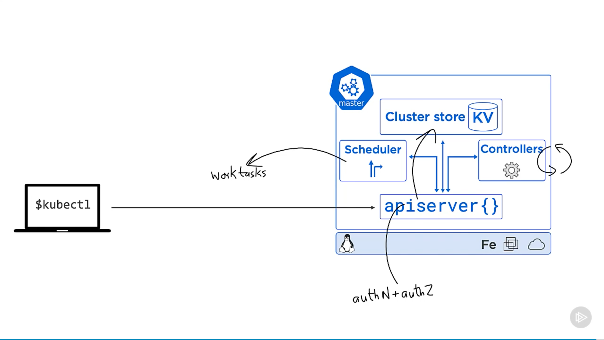

# [Getting Started with Kubernetes](https://app.pluralsight.com/library/courses/kubernetes-getting-started/table-of-contents), Neil Poulton (2020-07-30)

## Course Overview

### [Course Overview](https://app.pluralsight.com/course-player?courseId=3794d6de-7050-40ae-8e10-d245efeb7a0c)

## Course Introduction

### [Course Outline](https://app.pluralsight.com/course-player?clipId=f43296c4-421c-4f77-8a86-fbae328f2424)

- Code and examples: https://github.com/nigelpoulton/getting-started-k8s
- Standard K8s icons for diagrams: http://github.com/kubernetes/community/tree/master/icons

## What Is Kubernetes?

### [What Is Kubernetes?](https://app.pluralsight.com/course-player?clipId=480131d8-12b5-4c6a-93e4-eed069f4b6c0)

- Kubernetes came from Google
- It was opensourced in 2014 and handed over to the Cloud Native Computing Foundation
- Written in Go
- http://github.com/kubernetes/kubernetes
- Google churns through billions of containers each week.
  - The internal Borg and Omega proprietary projects were created to manage this.
    - Borg grew into Omega, which spawned K8s (which was built from scratch)
- Version 1: July 2015
- Kubernetes: Greek for 'helmsman' (the person who steers a ship)
- Was named 'Seven of Nine'

### [Kubernetes What and Why](https://app.pluralsight.com/course-player?clipId=905584bc-3c80-4eae-8770-2a6ccebe8841)

- Containers and microservices bring a whole new set of management challenges.
- Containers are like a cloud OS - abstracting away the hardware.

### [Quick Jargon Busting](https://app.pluralsight.com/course-player?clipId=864df46e-d05a-42d6-9215-5d3a32cec75f)

## Kubernetes Architecture

### [Module Overview](https://app.pluralsight.com/course-player?clipId=24bfc59c-9c0d-4aa2-ac68-de2b366a642a)

### [Kubernetes Big Picture View](https://app.pluralsight.com/course-player?clipId=65a5161a-b32b-424d-8f1d-7c76de06731f)

- Microservices are like players on a soccer team, with a Kubernetes coach organizing everything into a useful application: Orchestration.
- K8s masters are in charge
  - Masters comprise the control plane
- Nodes run the business applications
- We package our app code as a container. We wrap the container in a pod. We then wrap the pod in a deployment.
- This is all defined in a K8s YAML file, which we give to the master and the master makes it happen.

### [Kubernetes Masters](https://app.pluralsight.com/course-player?clipId=bca23a3c-5aba-4e97-a8ed-e9686c3f7205)

- Masters are also known as head nodes or the control plane.
  - Multi-master control planes (spread across multiple failure domains) are critical for production workloads.
    - 3 is a magic number. 5 is ok. More than 5 can increase latency.
    - Even cluster numbers can lead to split brain.
    - If we have 3 masters, one becomes the leader and the others are followers.
- K8s masters need to be Linux machines.
- In a hosted K8s, the controle plane is hidden.
  - This is 'Kubernetes as a service': Outsourcing the control plane to a cloud provider (for a fee)
- Best practice: Don't run business applications on the masters (allowing the masters to just look after the cluster).
- 
  - `kube-apiserver`
    - The front-end to the control plane.
    - Exposes a REST API; consumes JSON/YAML.
    - The only master component that anything should be talking to.
    - Usually connected to via `kubectl`
  - Cluster store
    - The only persistent component: Persists cluster state and config.
    - Based on `etcd`
    - Performance is critical.
      - Probably the first bottleneck in a cluster.
      - If you expect large/busy clusters, look at splitting out the store.
  - Kube-controller-manager
    - Controller of controllers
      - Node controller
      - Deployment controller
      - Endpoint/EndpointSlice controller
    - Each basically runs as a reconciliation loop: Reconciles observed with desired state of the cluster.
  - Kube-scheduler
    - Watches API Server for new work and assigns it to cluster nodes.
      - Affinity/anti-affinity
      - Constraints
      - Resources
      - Etc.

### [Kubernetes Nodes](https://app.pluralsight.com/course-player?clipId=c10a58c4-861b-4743-be3b-0416b53cede7)

- 3 components:
  - Kubelet
    - Main K8s agent running on every cluster.
      - Sometimes, 'node' and 'Kubelet' are used interchangeably.
      - A node can be Linux or Windows.
    - Registers node with cluster
    - Runs Pods.
      - Work on a K8s cluster comes in the form of a pod:
        - 1 or more containers packaged together as a unit.
    - Watches API Server for new work assignments
    - Reports back to Masters.
  - Container runtime
    - Often Docker
      - But pluggable via the CRI (Container Runtime Interface)
      - Can be Docker, containerd, CRI-O, Kata, etc.
      - See gVisor and katacontainers
  - Kube-proxy
    - Networking component
    - Makes sure every Pod gets its own IP
      - So in a multi-container pod, each container uses the same IP. So we'd need to use ports.
    - Does lightweight load balancing for all of the pods behind a service (e.g., hiding multiple pods behind a single name/IP).
- Some cloud services provide Nodeless Kubernetes
  - No more paying for nodes when work isn't running on them.
  - K8s YAML configurations are uploaded and the cloud runs them.

### [The Declarative Model and Desired State](https://app.pluralsight.com/course-player?clipId=c1f31995-8921-4aea-819b-0976d4cea2d2)

- Essential to K8s:
  - Declarative model
    - We give the API server a manifest file that describes how we want the cluster and apps to look.
  - Desired state
    - A _description_ of _what_ we want.
    - It's up to K8s to do whatever's necessary to get to the desired state.
    - When the observed state (e.g., node failure) diverges from the desired state, K8s brings the observed state back in sync.
    - The master (API server) is basically in a watch loop, making sure the nodes match the desired state.

### [Kubernetes Pods](https://app.pluralsight.com/course-player?clipId=5f01feda-ac53-4b53-8fbe-bd251ead12c1)

- Atomic units of deployment (and scheduling):
  - VMware
    - Virtual machine
  - Docker
    - Container
  - Kubernetes
    - Pod
      - A container without a pod in K8s is a naked container. K8s has strict rules about 'nudity'.
      - You can run multiple containers in a pod.
        - E.g., Pluralsight course: _Kubernetes for Developers: Integrating Volumes and Using Multi-container Pods_
      - What is a pod?
        - A thin wrapper that every container needs.
        - A _shared execution environment_.
        - If there are two containers running in a pod, they share an IP address.
          - So we'd use unique ports to access each container individually (via IP from outside, or localhost from inside the pod).
          - If containers don't absolutely need this tight coupling, use separate pods to loosely couple them.
        - Unit of scaling in K8s: Add/remove pods (_not_ adding containers to an existing pod).
        - Common example: A service mesh
          - Injecting an additional (mesh) container into each deployed pod, sitting between the app container and the network.
      - Pod deployment is an atomic operation.
        - The pod is only running and available once all containers inside are up and running.
        - Containers in a pod are always scheduled to the same node.
      - Pods are mortal: They're pending, running, or succeeded/failed.
        - When the deployment controller spins up a new pod to replace a failed one, it's _a new pod_. They don't self-heal.
      - We usually deploy pods via some higher level concept, like a deployment or stateful set.
        - Pods let K8s:
          - Handle annotations and labels
          - Apply policies and resource constraints

### [Stable Networking with Kubernetes Services](https://app.pluralsight.com/course-player?clipId=39f1ba60-e538-4510-9c7a-bb3ef5195bf8)

- When new pods are created (scaled, replacing failed ones, etc.), they get different IPs.
  - We can't rely on IPs.
  - This is where K8s service objects come into their own.
    - The service provides a _stable DNS name and IP_, load balancing requests it receives based on its list of healthy pods.
    - That's the job of a service: A higher-level, stable abstraction of multiple pods (with load balancing, etc.).
  - This is where labels come in.
    - Labels are very simple and powerful.
    - 
      - When deciding which pods to load balance traffic to, it looks for pods with the same label selector on the cluster.
  - A couple notes on services:
    - Only send traffic to healthy pods.
    - Can be configured for session affinity.
    - Can send traffic to endpoints outside the cluster.
    - Default to TCP but can do UDP.

### [Game Changing Deployments](https://app.pluralsight.com/course-player?clipId=1857f328-dbf6-4693-b1aa-3eec3070fc19)

- We don't usually work directly with pods. We normally deploy them via higher level controllers that provide load balancing, scaling, self-healing, rollbacks, etc.
  - These are all implemented as controllers (a reconciliation loop, watching the API Server for new deployments and comparing observed and desired states)
    - Stateless apps
    - Stateful apps
    - Daemon sets
    - Cron jobs
- The replica set controller manages the number of replicas.
  - The deployment sort of sits over/around the replica set, managing it.
  - 
  - Sample deployment object:
    - 
      - 5 pods
      - Running the specified image
      - On port 8080
- These are defined in the K8s manifest file (JSON/YAML), which we then throw at the API Server, which then makes sure the observed state matches the desired state.

### [The Kubernetes API and API Server](https://app.pluralsight.com/course-player?clipId=8e5e5b7f-a4ab-434f-be49-0fc1883895f3)

- Under the hood, K8s is a bunch of different components working together:
  - Pods
    - Atomic unit of scheduling
  - Deployments
    - Updates and rollbacks
  - Replica sets
    - Replica count
  - Services
    - Stable network abstraction
- Each of these is an object in the K8s API (as is pretty much everything). Think of the K8s API as a catalog of objects.
  - 
  - The API contains the definition and feature set of all K8s objects.
  - The API server is the way we communicate with the API.
    - E.g., we can use `kubectl` to interact with the API Server (make updates and query state).
  - It's versioned and divided into subgroups.
    - 

### [Epic Recap](https://app.pluralsight.com/course-player?clipId=1a7dd1c2-39fc-4d0d-a57b-47bb26eb72f9)

- 

## Getting Kubernetes

### [Module Overview](https://app.pluralsight.com/course-player?clipId=52cafc02-4ea0-46f4-9b68-0bb16c51ea0c)

### [Getting kubectl](https://app.pluralsight.com/course-player?clipId=c17148b7-1d71-4d3c-9421-2278fd19378e)

- Homebrew:

  ```sh
  brew install kubectl
  kubectl version --short
  ```

- Windows options:
  - 
- kubectl works with contexts.
  - There's a hidden file (e.g., `~/.kube/config`), such as the following:
    - 
  - It groups clusters and users into context.

### [Getting K8s on Your Laptop](https://app.pluralsight.com/course-player?clipId=bf421c1c-d767-408a-8c7e-ba5a122aee8c)

- Docker Desktop is perhaps the simplest way to get started
- Notes:
  - Any desktop install is for dev/test only (not production).
  - You'll need to enable virtualization in your BIOS/OS.
  - Some of these installation methods change over time.
- Can switch contexts via Docker Desktop:
  - 
  - Preferences
    - Ensure Kubernetes is enabled
      - 
- Recommendation: Use a client that's no more than 1 minor version above or below the cluster you're managing.

### [Getting K8s in the Cloud](https://app.pluralsight.com/course-player?clipId=a70f5169-311e-45a7-a63f-c748c99b9540)

- Linode Kubernetes Engine (LKE)

  - May be the easiest K8s cloud service available (and used for course examples).
  - cloud.linode.com
  - 
  - Very clear with pricing (e.g., \$30/month for 3 nodes).
  - Note config file for connecting kubectl to the cluster
    - 
    - Can rename context
    - Can download the full file or copy/paste the subjected into a larger config file.
  - See nodes:

    ```sh
    kubectl get nodes
    ```

- Google Kubernetes Engine (GKE)
  - 
  - Can enable Istio service mesh with the click of a button:
    - 

### [Recap](https://app.pluralsight.com/course-player?clipId=ec01d8be-3b53-44d1-bf1b-5532ab0929c4)

## Working with Pods

### [Module Overview](https://app.pluralsight.com/course-player?clipId=713a3492-3e28-4954-b83d-fe681010542b)

### [App Deployment Workflow](https://app.pluralsight.com/course-player?clipId=6e9ca383-d943-4138-91ec-f29534f0967d)

- Process
  1. Start with your app code.
     - E.g., A Node.js web app listening on port 8080 (https://github.com/nigelpoulton/getting-started-k8s/tree/master/App).
  2. Build app code into a container image.
  3. Store the image in an image registry.
  4. Create a K8s manifest file.
  5. POST it to the API Server.
- We'll focus primarily on 4 & 5. For more information on 1-3, check out Pluralsight courses:
  - Getting Started with Docker
  - Docker Deep Dive
- Clone repo:

  ```sh
  git clone https://github.com/nigelpoulton/getting-started-k8s.git
  cd getting-started-k8s/App
  ```

- `App/Dockerfile`:

  ```Dockerfile
  FROM node:current-slim

  LABEL MAINTAINER=nigelpoulton@hotmail.com

  # Copy source code to /src in container
  COPY . /src

  # Install app and dependencies into /src in container
  RUN cd /src; npm install

  # Document the port the app listens on
  EXPOSE 8080

  # Run this command (starts the app) when the container starts
  CMD cd /src && node ./app.js
  ```

- Ensure Docker is running:

  ```sh
  docker --version
  ```

- Build a Docker image:

  ```sh
  # Tag: ehelander/getting-started-k8s:1.0
  # Build the image using everything from the current directory.
  # Use your own Docker Hub account or private repository.
  docker image build -t ehelander/getting-started-k8s:1.0 .
  # Push it to a registry:
  docker image push ehelander/getting-started-k8s:1.0
  ```

- Can use from Docker Hub:

  - https://hub.docker.com/r/nigelpoulton/getting-started-k8s

  ```sh
  docker pull nigelpoulton/getting-started-k8s
  ```

### [Creating a Pod Manifest](https://app.pluralsight.com/course-player?clipId=18df36b4-2512-4516-82f4-4d49f8a6bfbe)

- Basic K8s manifest file (https://github.com/nigelpoulton/getting-started-k8s/blob/master/Pods/pod.yml):

  - 
    - `v1` indicates GA/stable (vs. `v1alpha1`, `v1alpha2`, `v1beta1`, `v1beta2`)

- Create `pods/pod.yaml`:

  ```yaml
  # A wrapper around our container.
  apiVersion: v1
  kind: Pod
  metadata:
    name: hello-pod
    labels:
      app: web
  spec:
    # The container running our app:
    containers:
      - name: web-ctr
        # By default, images are pulled from Dockerhub. (Otherwise, a DNS name is required.)
        image: nigelpoulton/getting-started-k8s:1.0
        ports:
          # This port must match the port the app listens on.
          - containerPort: 8080
  ```

  - Pods are so old, they're bundled in the original ('core') API group.
    - Newer features are in API sub-groups.
      - Workload APIs
        - `apps`
          - 
        - `batch`
          - 
      - `storage.k8s.io`
      - `networking.8s.io`
      - core (before there was grouping)
        - 
  - 
    - API object definition & Pod manifest

### [Deploying a Pod](https://app.pluralsight.com/course-player?clipId=d01fe61d-f8e9-4745-b41f-83a903e32fbd)

```sh
# See cluster info
kubectl cluster-info

cd Pods

# Apply the manifest file to the cluster.
# -f: Indicate we're using the declarative approach.
kubectl apply -f pod.yml
```

- Two commands we'll use a lot: `kubectl get` and `kubectl describe`

  - See basic info:

    ```sh
    kubectl get pods --watch
    # See more columns
    kubectl get pods -o wide
    ```

  - See detailed info:

```sh
kubectl describe pods hello-pod
```

### [Multi-container Pod Example](https://app.pluralsight.com/course-player?clipId=68cceebb-2e13-4301-a2b9-865fd0cbabdc)

- A bit of an advanced scenario: https://github.com/nigelpoulton/getting-started-k8s/blob/master/Pods/multi-pod.yml

  ```yaml
  apiVersion: v1
  kind: Pod
  metadata:
    name: nginx
  spec:
    containers:
      - name: main-ctr
        image: nigelpoulton/nginxadapter:1.0
        ports:
          - containerPort: 80
      - name: helper-ctr
        image: nginx/nginx-prometheus-exporter
        args: ['-nginx.scrape-uri', 'http://localhost/nginx_status']
        ports:
          - containerPort: 9113
  ```

- Sidenote:

  - Installed https://github.com/jonmosco/kube-ps1/ to show context in terminal.
    ```sh
    brew update
    brew install kube-ps1
    source "/usr/local/opt/kube-ps1/share/kube-ps1.sh"
    PROMPT='$(kube_ps1)'$PROMPT
    ```

- For cleaning up:

  - Option 1:

    ```sh
    kubectl delete <NAME OF POD>
    ```

    ```sh
    kubectl delete -f <MANIFEST FILE>
    ```

### [Recap](https://app.pluralsight.com/course-player?clipId=7de5349f-5e5c-4745-a855-194402333f32)

## Kubernetes Services

### [Module Overview](https://app.pluralsight.com/course-player?clipId=bc28033b-b135-4773-9f1e-06acb0390224)

- The K8s service object is the way to expose an application to the network and outside world.

### [Kubernetes Service Theory](https://app.pluralsight.com/course-player?clipId=1156a94e-eeb1-4658-915c-01009b81096d)

- Getting up to speed:

  ```sh
  cd pods
  kubectl apply -f pod.yaml
  ```

- Get pods

  ```sh
  kubectl get pods
  kubectl get pods -o wide
  ```

  - 
    - But this IP is an _internal_ IP address. And IPs aren't reliable.
    - How do we connect? Services.

- In K8s-speak, a service is a REST object in the API.
  - 
  - Services are an abstraction, providing a reliable endpoint.
    - 'Front' end of the service: Name, IP, and port
      - Guaranteed by K8s to never change.
    - ClusterIP is automatically assigned by K8s.
      - It's only for use within the cluster.
      - The name of the server gets registered with cluster DNS.
        - Behind the scenes: CoreDNS.
      - Every service name gets registered with DNS, and every container knows about the cluster DNS - so every container in every pod can resolve service names.
      - This is mainly about _labels_.
        - 
      - Whenever you create a service, K8s creates an endpoint object or endpoint slice (depending on k8s versino): A dynamic list of healthy pods that match the service's label selector.
        - 
- Types main of service
  - Cluster IP for internal access
    - Accessing a service from within the cluster (internal):
      - The pods needs to know the _name_ of the service (what you provide). The Cluster DNS service resolves this to an IP.
        - 
        - 
  - NodePort for external access
    - Accessing from outside the cluster (external):
      - A NodePort: Every node gets the port mapped:
        - 
  - LoadBalancer
    - K8s does all the heavy lifting.
      - 

### [Creating Services Imperatively](https://app.pluralsight.com/course-player?clipId=0ea334db-74e8-4579-b8df-5913a20bc481)

- We don't trust pods. We need to wrap them in a service.
- Simplest option (imperative):

  ```sh
  kubectl expose pod hello-pod --name=hello-svc --target-port=8080 --type=NodePort
  kubectl get services
  ```

  - 
    - `kubernetes` is a system service, exposing the API inside the cluster.
  - Resulting public IPs:
    - 
      - If running on Docker Desktop or minikube, try localhost + NodePort
    - Default allocation by k8s: 30000 to 32767

### [Creating Services Declaratively](https://app.pluralsight.com/course-player?clipId=1bb2e201-30da-4db3-b09f-7bb62c6c0836)

- Remove our previously-created service:

  ```sh
  kubectl get svc
  kubectl delete svc hello-svc
  # We still have our app running:
  kubectl get pods
  ```

- Define a service as `services/svc-nodeport.yaml`:

  ```yaml
  apiVersion: v1
  kind: Service
  metadata:
    # Name registered with DNS.
    name: ps-nodeport
  spec:
    type: NodePort
    ports:
      # The port the services listens on inside the cluster.
      - port: 80
        # The port the app is listening on.
        targetPort: 8080
        # The external port that would be mapped on every cluster node.
        nodePort: 31111
        # Default is TCP, so we could omit this.
        protocol: TCP
    selector:
      # The list of labels that has to match the labels on the pod we deployed earlier.
      app: web
  ```

  - Types of services (layered):
    - ClusterIp (default)
      - Internal cluster connectivity
      - How we access a set of pods from inside the cluster.
    - NodePort
      - External access via nodes
      - Allow access from outside the cluster.
    - LoadBalancer
      - External access via cloud load balancer
      - On top of a NodePort.
  - 

- Create the service:

  ```sh
  kubectl get pods
  kubectl get pods --show-labels
  cd services
  kubectl apply -f svc-nodeport.yaml
  kubectl describe svc ps-nodeport
  ```

  - 

### [Creating Internet LoadBalancer Services](https://app.pluralsight.com/course-player?clipId=e9deb057-c233-471a-9e18-a21bdbeec0cb)

- The easiest of the 3 service types.
  - But only on supported (cloud) platforms. Not Docker Desktop or minikube.
- 

  - Map traffic back to the app listening on port 80.
  - Use the same `app=web` selector.

  ```yaml
  apiVersion: v1
  kind: Service
  metadata:
    name: ps-lb
  spec:
    type: LoadBalancer
    ports:
      - port: 80
        targetPort: 8080
    selector:
      app: web
  ```

### [Recap](https://app.pluralsight.com/course-player?clipId=2c0e3e96-fc3e-442e-95b0-36ccb61d008e)

- 
- 

## Kubernetes Deployments

### [Module Overview](https://app.pluralsight.com/course-player?clipId=232497e4-aa41-4d72-992e-02732740cbf3)

- Here's where k8s starts to shine.

### [Kubernetes Deployment Theory](https://app.pluralsight.com/course-player?clipId=7d774153-2a43-42cf-b6f6-ac25132159a9)

- Deployments are objects in the k8s API.
  - 
- Purpose: A useful app.
  - Self-healing
    - (Actually handled by the Replica Set)
  - Scaling
    - (Actually handled by the Replica Set)
  - Rolling updates
  - Rollbacks
- 
  - We never deal directly with Replica Sets; Deployments wrap them, so it's easy to forget the Replica Sets even exist.
- Flow:
  - Create deployment YAML with the desired state of the app.
  - POST it as a request to the API Server.
  - Config is stored in the cluster store as a record of desired state.
  - Pods get scheduled for nodes i the cluster.
  - A Replica Set controller watches the cluster, ensuring there are always the desired number of pods of the right spec.
  - To make an update:
    - We change the same YAML file and POST it.
      - E.g., in a source code repository.
    - K8s creates a new Replica Set.
      - Though old Replica Sets don't get deleted. We can use them to revert to previous versions.
    - K8s starts up the new one and decomissions the old old (rolling update).
  - Rollback
    - Wind up the old Replica Set and wind down the new one.

### [Creating a Deployment YAML](https://app.pluralsight.com/course-player?clipId=167e2bb2-44c4-4a2c-895f-db32e56dd680)

```sh
# Keep the services; delete the pod
kubectl get svc
kubectl get pods
kubectl delete pod hello-pod
```

- `deployments/deploy.yaml`:

  ```yaml
  # Older versions may have extensions/v1beta1 or extensions/v1beta2
  apiVersion: apps/v1
  kind: Deployment
  metadata:
    name: web-deploy
    # This label isn't about selecting pods.
    labels:
      app: web
  # The spec for our deployment:
  spec:
    # Create 5 pods running the image specified below.
    replicas: 5
    # This is how the deployment knows which pods to work on (e.g., rolling updates).
    # This must match the labels in the template below. The deployment needs to know which pods it's managing.
    selector:
      matchLabels:
        app: web
    # The spec for our pod:
    template:
      metadata:
        labels:
          app: web
      spec:
        terminationGracePeriodSeconds: 1
        # The spec for our container (our app):
        containers:
          - name: hello-pod
            image: nigelpoulton/getting-started-k8s:1.0
            # Always pull the image from the registry. E.g., Docker Deep Dive.
            imagePullPolicy: Always
            ports:
              - containerPort: 8080
  ```

### [Deploying a Deployment](https://app.pluralsight.com/course-player?clipId=c107e4e3-e3b2-42d0-a296-0446817e4761)

```sh
cd deployments
kubectl apply -f deploy.yaml
# We now have 5 pods running our app:
kubectl get pods
kubectl get deploy
# RS is appended with a hash of the pod spec:
kubectl get rs
kubectl get svc
# If we're running a load balancer:
kubectl describe svc ps-lb
kubectl get pods --show-labels
# The new pods are added to the endpoints object:
kubectl describe ep ps-lb
# Get external IP, if running load balancer:
kubectl get svc
```

### [Self-healing and Scaling](https://app.pluralsight.com/course-player?clipId=b56d1285-fe88-47e2-b646-2be12e8cd07b)

```sh
# We have 5 pods managed by a deployment controller and a replica set controller.
kubectl get pods
# Delete one pod:
kubectl delete pod <POD NAME>
# We're back up to 5 via self-healing
kubectl get pods

# Can see which node pods are running on and delete a node, and the load balancer will heal.
kubectl get pods -o wide
```

- Scaling:
  - We can increase/decrease the `replicas`.
  - And autoscaling based on metrics (e.g, CPU and memory usage)
    - Horizontal Pod Autoscaler & Cluster Autoscaler

### [Rolling Updates and Rollbacks](https://app.pluralsight.com/course-player?clipId=2cdd96c2-61ae-4c8b-be6b-ad6ece11467e)

- Create `deployments/deploy-complete.yaml`:

  ```yaml
  apiVersion: apps/v1
  kind: Deployment
  metadata:
    name: web-deploy
    labels:
      app: web
  spec:
    # To help with demo: Increase replicas to `10`.
    replicas: 10
    selector:
      matchLabels:
        app: web

    # Add a new section:
    minReadySeconds: 5
    strategy:
      # When we update the image (or anything in the container spec), k8s will deploy one pod to the new version at a time.
      type: RollingUpdate
      rollingUpdate:
        # When doing an update, we can have, at most, 0 fewer than 10 replicas.
        maxUnavailable: 0
        # When doing an update, we can have, at most, 1 more than 10 replicas.
        maxSurge: 1

    template:
      metadata:
        labels:
          app: web
      spec:
        terminationGracePeriodSeconds: 1
        containers:
          - name: hello-pod
            # Bump up to `2.0`.
            image: nigelpoulton/getting-started-k8s:2.0
            imagePullPolicy: Always
            ports:
              - containerPort: 8080
  ```

```sh
# Terminal 1:
kubectl rollout status deploy web-deploy
# Terminal 2:
kubectl get pods --watch
# Terminal 3:
kubectl apply -f deployments/deploy-complete.yaml

# We still have the old Replica Set:
kubectl get rs
# Note which image it was managing replicas for:
kubectl describe rs <REPLICA SET NAME>
kubectl rollout history deploy web-deploy
# Roll back:
kubectl rollout undo deploy web-deploy --to-revision=1

kubectl get rs
```

## What Next?

### [What Next?](https://app.pluralsight.com/course-player?clipId=d93b0b93-9ba0-42ec-9ef5-7f53479229af)
