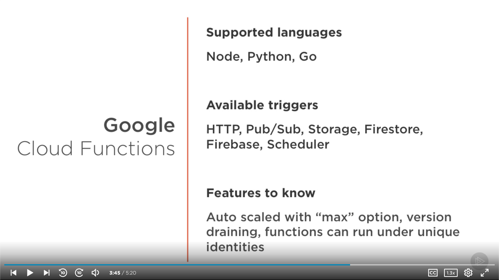
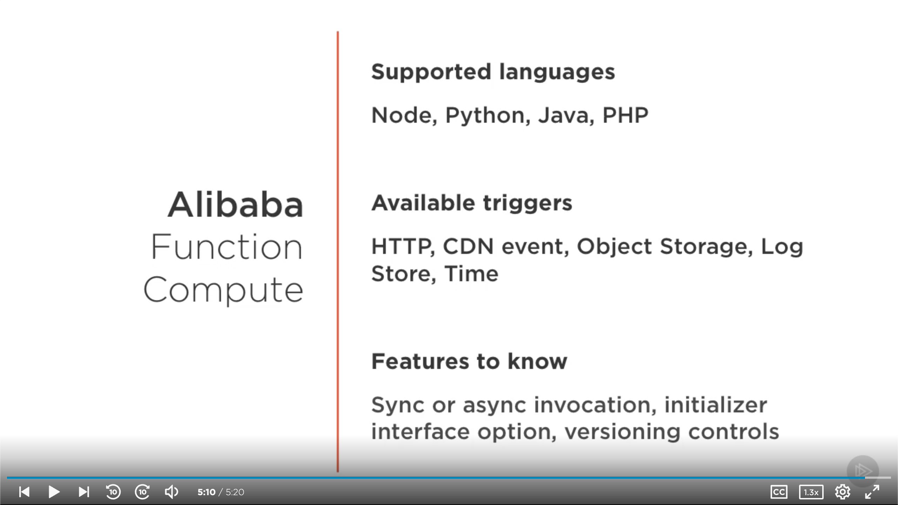
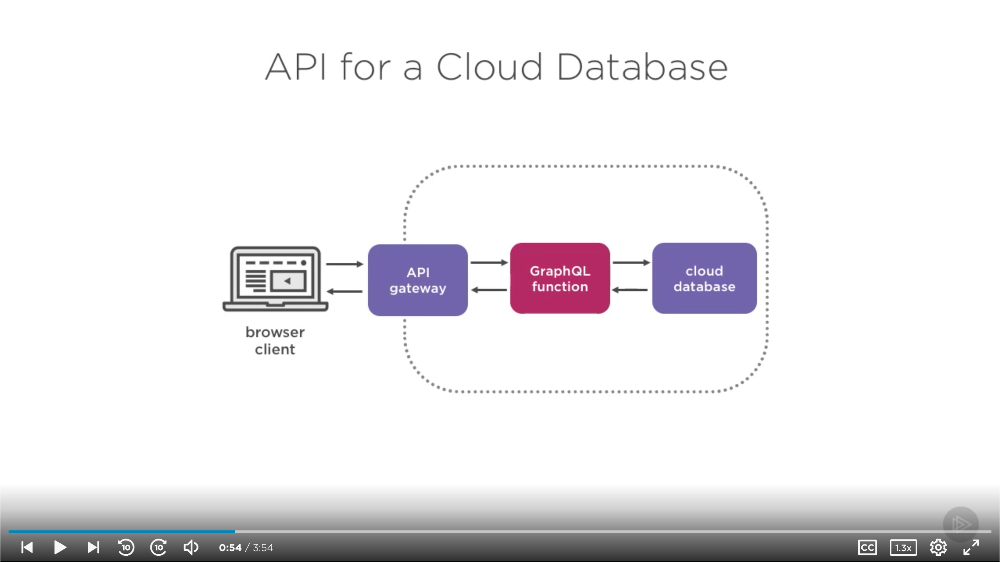

# [Serverless Computing: The Big Picture](https://app.pluralsight.com/library/courses/serverless-big-picture) (Richard Seroter, 2019-04-17)

## Course Overview

### [Course Overview](https://app.pluralsight.com/course-player?clipId=d462f9b9-3521-4bc6-b795-8a36ed2eb11b)

## Defining Serverless Computing

### [Introduction and How We Got Here](https://app.pluralsight.com/course-player?clipId=199eefa7-5076-4e6b-8769-9ea2309f6a1b)

- Eras
  - 1960s
    - Time sharing
  - 1970s
    - Microcomputers
  - 1980s
    - Client-server
  - 1989
    - Web era begins
  - 1999
    - Salesforce launched: SaaS goes mainstream
  - 2006
    - AWS EC2: IaaS era starts
  - 2008
    - Google App Engine: PaaS emerges
  - 2014
    - AWS Lambda: Serverless takes off
- Value from Cloud Abstractions
  - SaaS
    - Self-service with zero operations
  - IaaS
    - Agile, on-demand infrastructure
  - PaaS
    - Application-centric, integrated runtime
  - CaaS
    - Intelligent machinery for diverse workloads
  - FaaS
    - Pay-per-use code execution

### [What Does "Serverless" Mean](https://app.pluralsight.com/course-player?clipId=e2a4ca6c-0487-4e9f-899c-f539dbe60824)

- What is serverless?
  - Wikipedia
    - Serverless computing is a misnomer referring to a cloud-computing execution model in which the cloud provider runs the server, and dynamically manages the allocation of machine resources.
  - Tim Bray (AWS)
    - If you can't see the servers in the service, then it's serverless.
  - Paul D. Johnson
    - A Serverless solution is one that costs you nothing to run if nobody is using it.
  - Simon Wardley
    - [Serverless is] an event driven, utility based, stateless, code execution environment in which you write code and consume services.
  - Rachel Stephens (Redmonk)
    - Managed services that scale to zero.
- What responsibilities remain?
  - Write code.
    - As little as possible. Code is a liability.
  - Define triggers.
  - Connect managed services together.
  - Pay for consumption, not for allocation.
- What don't you do?
  - Pre-provision infrastructure.
  - Patch infrastructure.
  - Define scaling policies.
  - Store state alongside the compute.
- Paradigm changes for serverless
  - You are only responsible for your application itself.
    - Infrastructure is fully managed.
  - Your architecture depends on events and stateless computing.
    - You can't cheat. You have to re-architect.
  - When nothing's happening, you pay nothing.
    - When something does happen, you have fine-grained billing visibility.

| Serverless                           | Serverful                               |
| ------------------------------------ | --------------------------------------- |
| Program runs based on defined event  | Program runs continuously until stopped |
| Program state kept in storage        | Program state kept anywhere             |
| Max memory size of ~3 GB             | Max memory size > 10 TB                 |
| Maximum run time measured in minutes | No limit on run time                    |
| OS and machine selected by provider  | OS and instance selected by user        |
| Provider responsible for scaling     | User responsible for scaling            |

### [Challenges with Serverless Computing](https://app.pluralsight.com/course-player?clipId=cc82a464-6e0c-494b-9453-1206caedd705)

- FaaS needs managed services
  - A function on its own isn't of much use.
  - FaaS alone can increase complexity.
  - Serverless _isn't_ FaaS.
  - Non-managed services often are not optimized for FaaS platforms.
    - E.g., a traditional database could be overwhelmed by the number of connections.
- Limited lifetime of functions
  - An instance of a function is short-lived.
  - Startup involves layers of latency.
  - Batch jobs must conclude in a short time window.
- Dependency on remote storage
  - Storage may be from blob, cache, database, or event broker.
    - No context is shared, as in parallel execution.
  - Any state must be external.
  - Need to write to slow storage and read back in every instance.
    - Can rule-out data-intensive applications.
- I/O performance and generic hardware
  - Functions are densely packed & share network I/O.
    - A new form of time sharing: Can lead to bottlenecks.
  - Commodify hardware underpins public FaaS.
  - Limits exist for memory size, processor types.
- Vendor lock-in
  - Code is portable; architecture isn't
    - Migrating to a new vendor requires rearchitecture.
  - Value of FaaS comes from managed services.
  - Serverless is an emerging space: There's risk with picking winners too early.

### [Serverless Use Cases](https://app.pluralsight.com/course-player?clipId=6be39aae-8263-4c6c-8d14-c8439b3cddc3)

- Use cases
  - 3-tier web apps
  - Web APIs
  - Stream processing
  - Data pipelines
  - Batch processing
  - Infrastructure automating
    - Schedules, monitoring, etc.
- Serverless pairs well with:
  - Moving to microservices
  - Adopting DevOps practices
  - Continuous delivery
  - Event-driven (reactive) architectures
  - Mobile computing
  - ML/AI
- What are you optimizing for?

### [Summary](https://app.pluralsight.com/course-player?clipId=e4617131-4721-4074-b887-b98011c67fad)

## Serverless Technologies that Matter

### [Hosted FaaS Platforms](https://app.pluralsight.com/course-player?clipId=15940c21-a844-497e-90d2-294652e47d90)

- Options
  - AWS Lambda
    - 
  - Azure Functions
    - 
  - Google Cloud Functions
    - 
  - Cloudflare Workers
    - 
  - Alibaba Function Compute
    - 

### [Installable FaaS Platforms](https://app.pluralsight.com/course-player?clipId=e7f25d33-2a8a-44fa-bc46-a88f9801b25b)

- Why would you run your own FaaS platform?
  - Choice of underlying infrastructure.
    - Performance, regionality.
  - Access to underlying tuning parameters.
  - Standard FaaS dev/ops experience across public, private, and edge locations.
- Risks
  - Responsibility for platform maintenance.
  - Limited number of triggers and supported managed services may be limiting.
  - Rapidly-changing landscape may result in betting on a dead end.
- Options
  - Knative
  - Apache OpenWhisk
  - Kubeless
  - Pivotal Function Service
  - IBM Cloud Private
  - GitLab

### [Serverless Framework for Developers](https://app.pluralsight.com/course-player?clipId=5712978b-1ce6-4125-b9aa-b3d37e4d91a0)

- Developer & Operator Tools
  - Amplify Framework
    - Libraries, tools, components for AWS-powered cloud apps
  - Serverless Framework
    - Tool for building serverless apps
    - Enterprise version available
  - Spring Cloud Function
  - Claudia JS
    - Getting Node projects into Lambda
  - Jets for Ruby
    - Getting Ruby projects into Lambda
  - Stackery
  - IOpipe
  - Sigma IDE

### [Managed Services to Know](https://app.pluralsight.com/course-player?clipId=021e8fea-0d31-45c6-8193-500f21456244)

- Identity
- Database
  - Compute & storage are billed differently
- Routing
- Messaging
- Workflow
- Business

### [Summary](https://app.pluralsight.com/course-player?clipId=3161f535-d8c9-4c27-910b-714b9933a369)

## Serverless Architecture Patterns

### [Introduction and Major Architectural Considerations for Serverless](https://app.pluralsight.com/course-player?clipId=cd0e377b-a045-4aee-a431-af2aa7bee983)

- Business logic runs in stateless computing.
- Software runs on managed, elastic infrastructure.
- Managed services deliver commodity functionality.
- Triggers and events are first-class concepts.

### [Serverless Best Practices](https://app.pluralsight.com/course-player?clipId=1621db12-79e1-40e4-a565-9e8732cfcd6a)

- Create single-purpose functions.
  - Consider timeouts, infrastructure-like elements.
  - If you have lots of branching, refactor.
  - Goal: Have a smaller change surface. Lean into managed services.
- Use intermediaries for cross-function communication.
  - In general, avoid function-to-function invocations.
  - Use storage or queues (or distributed event logs) to transfer work.
  - Favor loose-coupling and composable systems
- Limit dependent packages.
  - More dependencies &rarr; slower startup time (especially cold starts).
  - Each dependency has other dependencies.
    - More dependencies &rarr; more risk.
  - The goal is to write and maintain as little code as possible.
- Create idempotent functions.
  - Want the same result if function is invoked multiple times.
  - Support partial failure cases (or FaaS platform auto-retries).
- Avoid connection-based systems.
  - Reconsider integrating with software that uses persistent connections.
  - Threat of connection pool exhaustion.
  - Aim for connecting to cloud-native service APIs.
- Avoid long-running functions.
  - May encounter unexpected timeouts if functions have potential for long lifecycles.
  - Factor in startup times (data fetching, etc.).
  - Refactor into smaller functions; coordinate as needed.
- Receive and send data in batches.
  - Better performance to instantiate function with batch data.
  - Querying managed services in batch may also prove beneficial (to avoid hitting limits).
  - Consider bandwidth charges, connection costs.
- Choose the right place for state.
  - Serverless systems sill have state.
  - Choose local scratch storage, cache, database, or even log, depending on need.
  - Consider workflow engines for stateful processing.
- Understand how the system scales.
  - Some platforms have certain scales, noteworthy triggers.
  - Watch out for SPOF or bottlenecks throughout the system as load increases.
  - Run chaos and load experiments.
- Invest in logging systems.
  - Can leverage built-in logging from cloud providers.
  - Augment log messages with correlation tokens as needed.
  - Consider ecosystem tools for robust tracing & troubleshooting.
- Continue to leverage CI/CD.
  - Don't fall back to manual steps, just because they're easy.
  - Do local testing where possible.
  - Automate no-downtime updates.

### [Serverless Design Patterns](https://app.pluralsight.com/course-player?clipId=a1a270b6-68f9-4b70-b628-9eb3ae6c07d4)

- Serverless systems involve far more than functions.
- Consider cross-cutting concerns: Security, authentication, encryption, scalability, manageability.
- Design patterns
  - API for a cloud database
    - 
  - Web App
    - 
  - Scheduled job
    - 
  - Data streaming
    - 
  - Throttled access to downstream system
    - 
  - Legacy system strangler
    - 
  - Batch processing
    - 

### [Summary](https://app.pluralsight.com/course-player?clipId=a8d236e2-ae69-4649-8313-65bf9979e95c)
