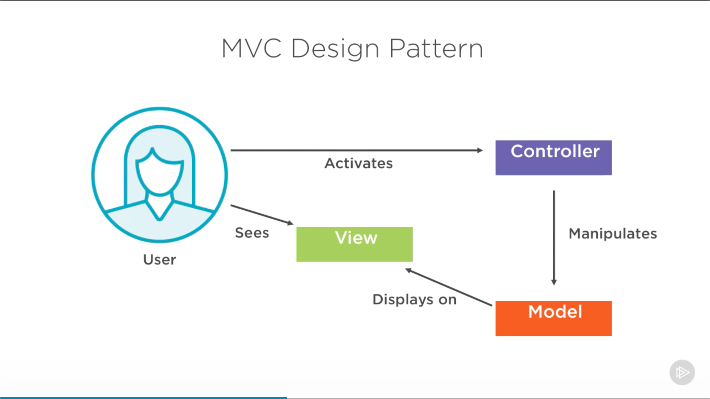

# [Spring Boot Fundamentals](https://app.pluralsight.com/library/courses/spring-boot-fundamentals) (Kesha Williams, 2019-07-11)

## Course Overview

### [Course Overview](https://app.pluralsight.com/course-player?clipId=71bb3c32-fe42-4a2c-922a-da46c1c0d413)

## Introducing Spring Boot and Its Benefits

### [Getting Started](https://app.pluralsight.com/course-player?clipId=7c927196-adfa-481d-8624-87910025aca4)

### [Learning Path](https://app.pluralsight.com/course-player?clipId=9d818f2c-bdae-484d-ae28-3d135aa620c3)

- Suggested courses on Pluralsight before beginning this one:
  - Spring Fundamentals
  - Spring: The Big Picture
  - Creating Your First Spring Boot Application
  - Getting Started with Spring Data JPA

### [Spring Boot Overview](https://app.pluralsight.com/course-player?clipId=cbb44c5e-d1d2-47e9-be7c-3aa9266eacdd)

- Spring Boot favors convention over configuration.

### [Features of Spring Boot](https://app.pluralsight.com/course-player?clipId=cec2ad0a-3409-4442-b716-a309ad20dae8)

- Automatic configuration
  - Configures application based on dependencies added to classpath.
- Starter dependencies
  - `spring-boot-starter-web`
    - This is the only dependency required for getting a Spring Boot application up and running.
    - Spring MVC
    - REST
    - Tomcat
    - Jackson
  - `spring-boot-starter-test`
    - JUnit
    - Mockito
    - Hamcrest
    - Spring Core
    - Spring Test
  - `spring-boot-starter-data-jpa`
    - Spring Data JPA with Hibernate
    - JDBC
    - Entity Manager
    - Transactional API
    - Spring Data JPA
    - Aspects
  - `spring-boot-starter-thymeleaf`
- Command line dependencies
  - An entire application can be written with Groovy scripts.
  - The CLI is often used for rapid prototyping.
- Actuator
  - Allows you to see inside the running application.
    - Health status
    - Metrics
    - Loggers
    - Audit events
    - HTTP trace
  - Can manage/monitor application via HTTP endpoints or JMX
- Repo: [https://gitlab.com/videolearning/spring-fundamentals](https://gitlab.com/videolearning/spring-fundamentals)

### [Summary](https://app.pluralsight.com/course-player?clipId=7df20ab5-54f3-48f5-8730-e9f3d637e945)

## Bootstrapping a Simple Application

### [Overview](https://app.pluralsight.com/course-player?clipId=0dd30120-25aa-44ff-8bea-abcefc5c7f65)

### [Demo: Spring Initializr](https://app.pluralsight.com/course-player?clipId=768e405d-4ffd-4855-b1de-abc477ba4349)

- Spring Initializr: [https://start.spring.io](https://start.spring.io)
  - Will generate base code and dependencies.
  - Maven
  - Java
  - Group: `com.pluralsight`
  - Artifact: `fundamentals`
  - Dependencies
    - Spring Web Starter
- Generate Project > Open in IDE

### [Demo: Spring Boot CLI](https://app.pluralsight.com/course-player?clipId=aef75247-2d14-4c7e-910b-a006ae190f9a)

- Can install via Homebrew.

```sh
# Check version.
spring --version

# Create a project.
spring init fundamentals2

# Create a project with dependencies.
spring init --dependencies=web,data-jpa fundamentals3
```

- The Spring Boot CLI is self-contained, without needing any external Groovy scripts.
- But Groovy scripts can be used:

  - `app.groovy`

  ```groovy
  @RestController
  class app{
    @RequestMapping("/")
    String home() {
      "Hello Pluralsight!"
    }
  }
  ```

  ```sh
  spring run app.groovy
  ```

  ```sh
  curl http://localhost:8080
  ```

### [Demo: Auto Configuration](https://app.pluralsight.com/course-player?clipId=2af408ea-79a2-46df-beaa-908c7ba8e9af)

- Auto-configuration finds JARs on the classpath and auto-configures the beans.
- Auto-configuration is always applied after user-supplied beans have been configured.
- Auto-configuration insights:
  - Start application with `--debug` switch.
  - Add property to `application.properties`
    - `logging.legel.org.springframework: DEBUG`
  - Use Spring Boot Actuator

### [Spring Boot Annotations](https://app.pluralsight.com/course-player?clipId=c6443ea2-f014-4dec-b5bb-5563baf1d2a6)

- `@SpringBootApplication`
  - Has to be added to the main application class to indicate it is a Spring Boot application.
  - Shortcut for 3 annotations:
    - `@SpringBootConfiguration`
      - Replaces `@Configuration` and annotates a class as a configuration.
    - `@EnableAutoConfiguration`
      - Tells Spring Boot to configure beans.
    - `@ComponentScan`
      - Tells Spring Boot to scan current package and subpackages.

### [Spring Boot Properties](https://app.pluralsight.com/course-player?clipId=3a1e843c-757f-4908-8c7b-0fb51fc8fc1f)

- `application.properties`
- [Common Application properties](https://docs.spring.io/spring-boot/docs/current/reference/html/appendix-application-properties.html)

### [Spring Boot Profiles](https://app.pluralsight.com/course-player?clipId=1e2da449-55c3-46d5-aade-e1109cdea884)

- Profiles are fundamental to the Spring framework for handling multiple environments.
- `spring.profiles.active` is used to define the current profile.
  - E.g., `spring.profiles.active = dev`
- Spring Boot brings profile-specific properties files:
  - `application-{profile}.properties`

### [Summary](https://app.pluralsight.com/course-player?clipId=cacd630c-29d6-4bd9-984c-dff3ed2d38f4)

## Accessing Data with Spring Boot and H2

### [Overview](https://app.pluralsight.com/course-player?clipId=3bf1296a-8a11-461d-84a8-f65356d9a874)

### [H2 Database](https://app.pluralsight.com/course-player?clipId=9ee5374c-df4f-407b-b0de-b39e467c6cc6)

- H2 is an in-memory database, not recommended for production environments.
- H2 dependency:

  ```xml
  <dependency>
    <groupId>com.h2database</groupId>
    <artifactId>h2</artifactId>
    <scope>runtime</scope>
  </dependency>
  ```

- H2 defaults:

  ```properties
  spring.datasource.url=jdbc:h2:mem:testdb
  spring.datasource.driverClassName=org.h2.Driver
  spring.datasource.username=sa
  spring.datasource.password=
  spring.h2.console.enabled=false
  ```

- We'll customize it:

  ```properties
  spring.h2.console.enabled=true
  spring.h2.console.path=/h2
  spring.datasource.url=jdbc:h2:mem:bugtracker
  ```

### [ORM with JPA](https://app.pluralsight.com/course-player?clipId=30deeb6d-5e8e-4794-8ebd-b59ccbfa2921)

- Object Relational Mapping
- Layers of abstraction:
  - Persistence layer
  - Java Database Connectivity (JDBC)
  - Java Persistence API (JPA)
  - JPA Implementation (or instance provider), e.g., Hibernate & Spring Data JPA
- Quick way to get started, including 3 libraries:

  - Hibernate
  - Spring Data JPA
  - Spring ORM

  ```xml
  <dependency>
    <groupId>org.springframework.boot</groupId>
    <artifactId>spring-boot-starter-data-jpa</artifactId>
  </dependency>
  ```

### [Entities](https://app.pluralsight.com/course-player?clipId=e1c0139d-f15d-4ba6-bfd9-a719d7756b23)

- Entities are objects that live in a database (and can be mapped to a database).
- Defined by `@Entity`.
- Traditionally, entity classes were specified in `persistence.xml`. With Spring Boot, this is not necessary due to entity scanning (by default, all below the main application class).
- Module4

  - Dependencies:
    - `spring-boot-starter`
    - `spring-boot-starter-test`
    - `h2`
    - `spring-boot-starter-data-jpa`
  - Trackzilla has 3 domain entities:

    - Application

      ```java
      package com.pluralsight.entity;

      import javax.persistence.*;

      // Indicates it is a JPA entity. No Table annotation: Assumes it is mapped to an `Application` table.
      @Entity
      public class Application {

          // ID
          @Id
          // Generate the ID automatically.
          @GeneratedValue(strategy = GenerationType.AUTO)
          @Column(name="application_id")
          private Integer id;

          @Column(name = "app_name", nullable = false)
          private String name;

          @Column(length = 2000)
          private String description;
          private String owner;

          public Application() {
          }

          public Application(String name, String owner,
                            String description) {
              this.name = name;
              this.owner = owner;
              this.description = description;
          }

          // getters & setters

          @Override
          public String toString() {
              return "Application{" +
                      "id=" + id +
                      ", name='" + name + '\'' +
                      ", owner=" + owner +
                      ", description='" + description + '\'' +
                      '}';
          }
      }
      ```

    - Ticket
    - Release

  - The Spring Data JPA Repository abstraction greatly reduces the boilerplate code for working with a database.
  - These 3 repositories are interfaces with no implementation. Spring Boot automatically provides the implementation.

    - `ApplicationRepository`

      ```java
      package com.pluralsight.repository;

      import com.pluralsight.entity.Application;
      import org.springframework.data.repository.CrudRepository;

      // We just need to extend `CrudRepository` and pass in the entity class to be managed and the ID of the domain class type.
      public interface ApplicationRepository extends CrudRepository<Application, Long> {
      }
      ```

- Run `FundamentalsApplication`.

### [Demo: H2 Integration](https://app.pluralsight.com/course-player?clipId=2c6732f6-cebb-4d64-bde6-f505005b9789)

### [Demo: H2 Console]()

- [http://localhost:8080/h2](http://localhost:8080/h2)

### [Summary]()

## Configuring a Spring MVC Application with Spring Boot

### [Overview](https://app.pluralsight.com/course-player?clipId=cf24786b-537b-481e-b073-4a926f5f55ff)

### [MVC Design Pattern](https://app.pluralsight.com/course-player?clipId=6046e1b4-f770-4f4f-afd9-fd7f975c5b76)

- Dependency: `spring-boot-starter-web`
  - Includes:
    - Dispatcher servlet
    - Default error page
    - Servlet container (default: Tomcat)
    - JARs
- 
  - Model
    - The representation of data in the system.
    - Also known as an entity or domain model.
  - View
    - Responsible for displaying data.
  - Controller
    - Responsible for directing user requests to the correct resource and sending responses back to the user.
- TymeLeaf
  - Fragments allow reusing chunks of code.

### [Demo: MVC in Action](https://app.pluralsight.com/course-player?clipId=6cbbb0aa-7dfc-41c9-a10f-b9d5d985d96b)

- Module5
- TzaController
  - Handles HTTP requests, mapping them to the service layer, which then retrieves data from the repositories.
  - `@Controller`
    - Spring will consider this class when handling incoming web requests.
  - `@GetMapping` provides routing information.
  - Typically, would add `@EnableWebMvc`; but Spring Boot adds this automatically when it sees the necessary dependencies on the classpath.
- TymeLeaf `spring-boot-starter-thymeleaf`) is a simple rendering engine that supports serving HTML.
- `application.properties`

  ```properties
  # ThymeLeaf
  spring.thymeleaf.template-loader-path: classpath:/templates
  spring.thymeleaf.suffix: .html
  spring.thymeleaf.cache: false
  ```

- http://localhost:8080/
  - Uses Bootstrap.

### [Packaging and Deployment](https://app.pluralsight.com/course-player?clipId=60320793-755e-495a-85c7-3fb6ef74099c)

- Spring Boot applications can be packaged as a traditional web application in a `.war` file or an executable `.jar`.
- Spring Boot Maven Plugin
  - Repackages `.jar` and `.war` files to make them executable.
  - Runs Spring Boot application, searching for public static main void.
  - Manages Spring Boot application lifecycle.

### [Demo: Uber Jar](https://app.pluralsight.com/course-player?clipId=98bf5704-9be1-4a35-80f6-49906aabd262)

- When the app is deployed, it's packaged as an uber JAR with an embedded Tomcat web server.

### [Summary](https://app.pluralsight.com/course-player?clipId=75be2f94-da7e-48a6-8f7b-075b3fa7a253)

## Building a RESTful Web Application with Spring Boot

### [Overview](https://app.pluralsight.com/player?course=spring-boot-fundamentals&author=kesha-williams&name=aa764da3-7531-4be2-8010-4175cb1dba55&clip=0&mode=live)

### [REST Architecture](https://app.pluralsight.com/course-player?clipId=56b992b5-5212-4322-b37e-6df37c7bf69c)

- 4 principles:
  - Data and functionality are considered resources and identified via the URI
  - Resources are manipulated using a fixed set of operations
  - Resources can be represented in multiple formats
  - Communication between the client and endpoint is stateless

### [Demo: RESTful Web Application](https://app.pluralsight.com/course-player?clipId=db35fd68-193a-4a7b-93a4-bfd6a66ffccf)

- Module 6
- TzaController
  - `@RestController`
    - Simplifies creating RESTful web services. It returns object data written as JSON.
    - A convenience annotation, adding `@Controller` and `@ResponseBody`.
    - Note that methods cannot return models because of `@ResponseBody`.
      - So we use `ResponseEntity<T>`.
        - This represents the entire HTTP response (including a status code, headers, and a response body)
  - `@RequestMapping`
    - Maps requests to the correct method.
  - `@GetMapping`
    - Specifically handles GET requests to the specified path.

### [Demo: Testing with cURL](https://app.pluralsight.com/course-player?clipId=02ec241e-edd3-440d-b6c3-4154ace9b155)

- Start Module6
- `curl http://localhost:8080/tza/applications`
- `curl http://localhost:8080/tza/application/1`
- `curl http://localhost:8080/tza/tickets`

### [Response Formats](https://app.pluralsight.com/course-player?clipId=f8ba722e-a989-497d-9a17-94d98e4f9b28)

### [Exception Handling](https://app.pluralsight.com/course-player?clipId=7c0e161e-490c-49c2-89fb-8bce59adcbfb)

- Options for customizing exception handling
- `ResponseStatusException`
  - A programmatic alternative to `@ResponseStatus`
  - Base class for exceptions, used for applying a status code to an HTTP response.
  - Provide an HttpStatus and an optional reason and cause.
  - Spring Boot provides a default error mapping.

### [Demo: Exception Handling](https://app.pluralsight.com/course-player?clipId=2a071c82-4733-44b9-8413-3585bbfb70f9)

- `ApplicationNotFoundException`

  ```java
  package com.pluralsight.exception;

  public class ApplicationNotFoundException extends RuntimeException {

      public ApplicationNotFoundException(String exception) {
          super(exception);
      }
  }
  ```

- `TzaController`:

  ```java
      @GetMapping("/application/{id}")
      public ResponseEntity<Application> getApplication(@PathVariable("id") long id) {
          try {
              return new ResponseEntity<Application>(applicationService.findApplication(id), HttpStatus.OK);
          } catch (ApplicationNotFoundException exception) {
              throw new ResponseStatusException(HttpStatus.NOT_FOUND, "Application Not Found");
          }
      }
  ```

- `ApplicationServiceImpl`

  ```java
  @Service
  public class ApplicationServiceImpl implements ApplicationService {
      @Autowired
      private ApplicationRepository applicationRepository;

      @Override
      public List<Application> listApplications() {
          return (List<Application>) applicationRepository.findAll();
      }

      @Override
      public Application findApplication(long id) {
          Optional<Application> optionalApplication = applicationRepository.findById(id);

          if(optionalApplication.isPresent())
              return optionalApplication.get();
          else
              throw new ApplicationNotFoundException("Application Not Found");
      }
  }
  ```

- `curl http://localhost:8080/tza/application/123`
  - `{"timestamp":"2020-07-16T20:23:39.733+0000","status":404,"error":"Not Found","message":"Application Not Found","path":"/tza/application/123"}%`

### [Summary](https://app.pluralsight.com/course-player?clipId=c334c897-6ba1-4ad3-939a-c1ff8dd295ac)

## Building a GraphQL Server with Spring Boot

### [Overview]()

### [GraphQL Overview]()

### [GraphQL Dependencies]()

### [GraphQL Schemas]()

### [Demo: Schemas]()

### [Query Operations]()

### [Mutations]()

### [Exceptions]()

### [Demo: GraphiQL]()

### [Summary]()

## Enabling Actuators, Metrics, and Health Indicators

### [Overview]()

### [Actuator]()

### [Custom Endpoints]()

### [Summary]()

## Testing with Spring Boot

### [Overview]()

### [Testing Overview]()

### [Unit Testing]()

### [Integration Tests]()

### [Course Recap]()
