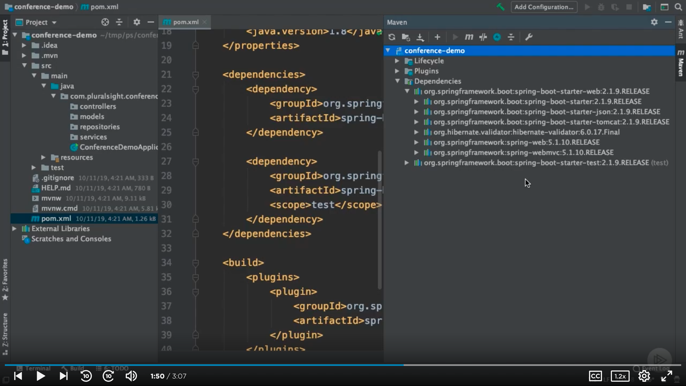
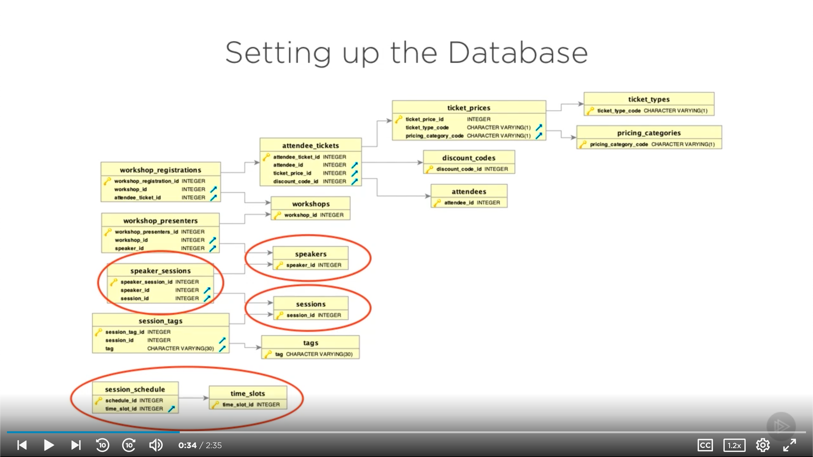
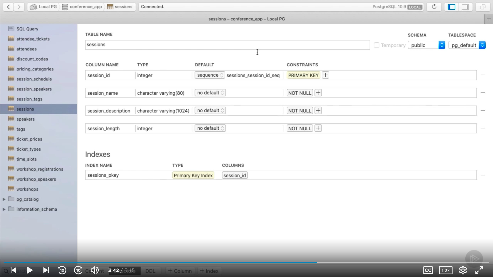
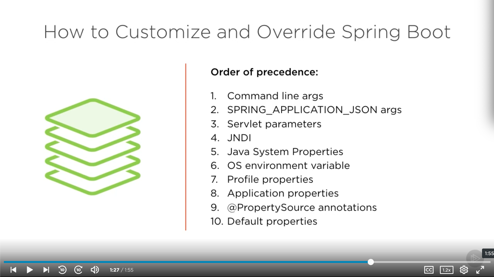
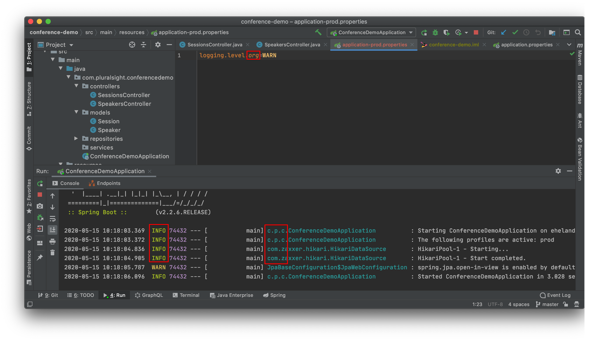
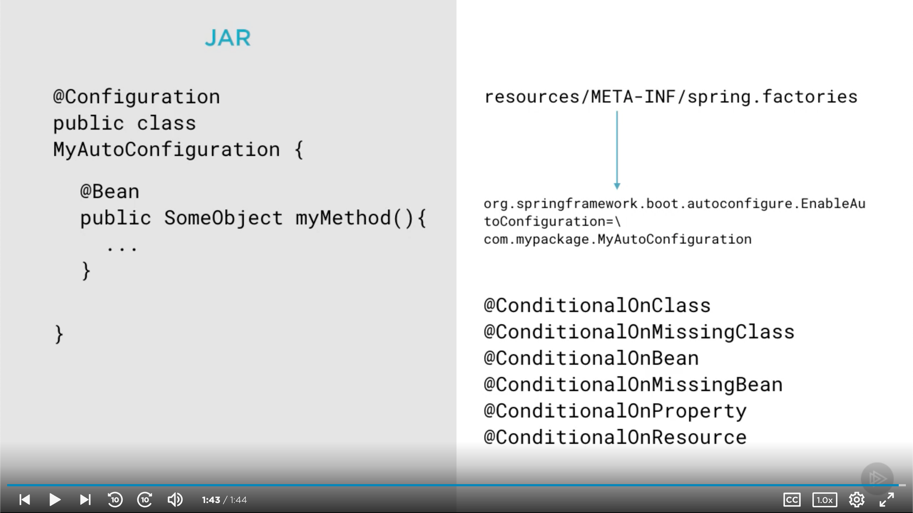

# [Spring Framework: Creating Your First Spring Boot Application](https://app.pluralsight.com/library/courses/creating-first-spring-boot-application) (Dan Bunker, 2019-10-31)

## Course Overview

### [Course Overview](https://app.pluralsight.com/player?course=creating-first-spring-boot-application&author=dan-bunker&name=93b7bf66-cc65-4884-803d-c159f169d0b6&clip=0&mode=live)

## Using Spring Boot to Create Applications

### [Introduction](https://app.pluralsight.com/player?course=creating-first-spring-boot-application&author=dan-bunker&name=1db3a0ad-cab9-46db-84fe-d7b033473655&clip=0&mode=live)

- Prerequisites
  - Java (at least Java 12)
  - IntelliJ (Community is alright)

### [What Is Spring Boot?](https://app.pluralsight.com/course-player?clipId=491b5cc0-bef1-4d46-90d9-7da8e777fa6d)

- Before Spring Boot, it could take days of development simply to get an app set up and talking to a database.
- Spring Boot
  - Opinionated framework
  - Rapid development
  - Stand alone app
    - Self-contained, suitable for cloud deployments

### [Demo: Creating a Spring Boot App with Spring Initializr](https://app.pluralsight.com/course-player?clipId=104fa981-df71-4342-9fd3-e748823e3ac4)

- One way to create a Spring Boot app:
  - [Spring Initializr](https://start.spring.io/)
- Example project
  - Maven Project
  - Java
  - Latest Spring Boot version
  - Group: `com.pluralsight`
  - Artifact: `conference-demo`
  - Dependencies: `Spring Web`
    - Spring MVC, REST API info
  - Click `Generate`: generates `conference-demo.zip`.

### [Demo: Importing and Setting up a Spring Boot App](https://app.pluralsight.com/course-player?clipId=b7bc9b61-098a-4bcc-84db-bee51013d9a2)

- Extract `conference-demo.zip`.
- Open IntelliJ.
  - Import `conference-demo`.
  - Maven project.
  - Leave defaults.
  - Choose or setup JDK.
  - Finish.

### [Demo: Overview of a Spring Boot App](https://app.pluralsight.com/course-player?clipId=b638e587-8ad0-475a-95b1-56f0023fcb64)

- Maven apps generally follow the same layout:
  - `pom.xml`
    - Dependencies (e.g., `org.springframework.boot`)
  - `src/main`
    - Java goes in `java`
      - `src/main/java/com.pluralsight.conferencedemo/ConferenceDemoApplication` is main entry point of application.
      - Note `@SpringBootApplication`
    - Property files, XML files, etc. go in `resources`
  - `src/test`
- Restructure our app and add some new files.
  - Right click on `com.pluralsight.conferencedemo` > `New` > `Package`
    - `com.pluralsight.conferencedemo.controllers`
      - Will hold API controllers
    - `com.pluralsight.conferencedemo.models`
      - Will hold JPA entities and other persistence info
    - `com.pluralsight.conferencedemo.repositories`
      - Will hold JPA repositories
    - `com.pluralsight.conferencedemo.services`
      - Will hold service- or logic-based code

### [Demo: Creating a Spring Boot App with IntelliJ](https://app.pluralsight.com/course-player?clipId=ac40d0a9-5570-42b3-8905-21d9834a650c)

- Alternate way to create a Spring Boot application (IntelliJ Ultimate)
  - Create New Project
  - Select `Spring Initializr` on the left menu

### [Demo: Using the Spring Boot CLI](https://app.pluralsight.com/course-player?clipId=c8d2df30-bff1-402a-bf90-7548ab984558)

- [Spring Boot CLI installation](https://docs.spring.io/spring-boot/docs/current/reference/html/getting-started.html#getting-started-installing-the-cli)

  - Suggested install: [sdkman](https://sdkman.io/)
    - `sdk install springboot`
  - Homebrew

    ```sh
    brew tap pivotal/tap
    brew install springboot
    ```

- Once installed

  ```sh
  spring
  spring help
  spring init # Another way to create a Spring Boot project
  spring run # Can run a Groovy-based Spring Boot project
  ```

### [Understanding Spring Boot Starters](https://app.pluralsight.com/course-player?clipId=90ec12ea-9d75-4acd-aa03-d879dbda8731)

- Starters are what make Spring Boot shine.
- A starter is a way to integrate a dependency on your project.
  - Simply declare a starter, and it will take care of getting all the right versions and dependencies in place.
- `pom.xml` > dependencies
  - 
  - We have 2 starters currently:
    - `spring-boot-starter-web`
    - `spring-boot-starter-test`
  - You don't have to specify a version when declaring a starter dependency.
    - The `spring-boot-starter-parent` declaration at the top declares the versions of all the possible dependencies.
      - Sometimes called the BOM (bill of materials).
      - Can see by right clicking > `Maven` > `Show Effective POM`

### [Summary](https://app.pluralsight.com/course-player?clipId=2e7c8e2a-6a08-41c8-a53b-aff752d920a7)

- What is Spring Boot? Simply, an opinionated rapid development framework.

## Building Apps with Spring Boot

### [Introduction](https://app.pluralsight.com/course-player?clipId=c2ec0a13-8324-466a-b309-0109a57f2c76)

- Our conference scheduling app will include:
  - Spring MVC
  - Spring Data JPA
  - JPA
  - A relational database (PostgreSQL)
- A full-stack Spring microservice app (though no GUI)

### [Application Overview](https://app.pluralsight.com/course-player?clipId=6759e7a8-d989-49e5-905b-20872aecbf97)

### [Setting up the Database](https://app.pluralsight.com/course-player?clipId=2e2b265c-fff4-497a-8d76-e5bfc0364761)

- Database ERD
  - 
- [github.com/dlbunker/ps-first-spring-boot-app](https://github.com/dlbunker/ps-first-spring-boot-app)

  - Can proceed with a local PostgreSQL instance or Docker.
  - Local PostgreSQL instance.

    - Note: Found this to work better in terms of port mapping, etc. Did _not_ need username or password specified in `application.properties`.

    ```sh
    # See https://github.com/ehelander/modern-apis/blob/master/frameworks/building-scalable-apis-with-graphql/building-scalable-apis-with-graphql.md#introduction-2
    # Start postgres.
    brew services start postgres
    # Create conference_app DB.
    createdb conference_app
    # Create tables & load data.
    psql conference_app < create_tables.sql
    psql conference_app < insert_data.sql
    # Begin psql shell.
    psql conference_app
    # Ensure data is in session table.
    select * from sessions;
    # Quit psql shell.
    \q
    ```

  - Docker:

    - Install Docker

      ```sh
      # Install Docker
      brew install cask docker
      # Open Docker to create symbolic links
      open /Applications/Docker.app
      ```

    - Create & run Docker container; create database.

      ```sh
      # Create Docker container with PostgreSQL database.
      docker create --name postgres-demo -e POSTGRES_PASSWORD=Welcome -p 5432:5432 postgres:11.5-alpine
      # Start container.
      docker start postgres-demo

      # Connect to psql prompt from Docker.
      docker exec -it postgres-demo psql -U postgres

      # Create database.
      create database conference_app;

      # List databases.
      \l

      # Use conference_app database.
      \c conference_app
      ```

    - Create tables & insert data

      ```sh
      cd ps-first-spring-boot-app/database/postgresql
      docker cp create_tables.sql postgres-demo:/create_tables.sql
      docker exec -it postgres-demo psql -d conference_app -f create_tables.sql -U postgres

      docker cp insert_data.sql postgres-demo:/insert_data.sql
      docker exec -it postgres-demo psql -d conference_app -f insert_data.sql -U postgres
      ```

    - Stop container

      ```sh
      # Stop container
      docker stop postgres-demo
      ```

    - Connection info:
      - JDBC URL: `jdbc:postgresql://localhost:5432/conference_app`
      - Username: `postgres`
      - Password: `Welcome`

- Recommended database client: [Postico](https://eggerapps.at/postico/)

  ```sh
  brew cask install postico
  ```

### [Demo: Connecting to the Database](https://app.pluralsight.com/course-player?clipId=1d370eee-b668-4cdc-abd9-1ba7f198544c)

- Need to add a starter dependency that will include the Spring Data JPA library, and then connect it to PostgreSQL.
- `pom.xml`

  - Add the following dependencies below `spring-boot-starter-web` (and import the Maven changes):

    ```xml
        <dependency>
          <groupId>org.springframework.boot</groupId>
          <artifactId>spring-boot-starter-data-jpa</artifactId>
        </dependency>

        <dependency>
          <groupId>org.postgresql</groupId>
          <artifactId>postgresql</artifactId>
          <scope>runtime</scope>
        </dependency>
    ```

- Tell Spring Boot the database connection string.

  - `src/main/resources/application.properties`

    ```properties
    spring.datasource.url=jdbc:postgresql://localhost:5432/conference_app
    spring.datasource.username=postgres
    spring.datasource.password=Welcome
    spring.jpa.database-platform=org.hibernate.dialect.PostgreSQLDialect
    spring.jpa.hibernate.ddl-auto=none
    spring.jpa.hibernate.show-sql=true
    ```

### [Demo: Creating JPA Models](https://app.pluralsight.com/course-player?clipId=d1dea5c6-6bae-41a0-88cf-752f27dd3519)

- Next step: Apply some JPA entities so we can talk to the database.
- Right click `src/main/java/com.pluralsight.conferencedemo/models` > New > Java Class

  - `Session.java`

    - Add annotation: `@Entity(name="sessions")`
    - Note that we're using plural `sessions` in the entity name because that is the name of our database table, whereas the class is singular because it will be one row or instance of that data.
    - 
    - Add default constructors to all entities.
      - Helps with serialization and deserialization (when plugging in controllers).
    - Add variables for our columns.
      - Keeping the case and spelling the same (i.e., snake_case vs. normal Java camelCase) as the database columns allows JPA to automatically bind to them.
        - Otherwise, we'd need to add an @Column annotation to each.
      - We need to add the `@Id` annotation to tell JPA which key is the primary key.
      - And `@GeneratedValue(strategy = GenerationType.IDENTITY)` tells JPA how the primary key gets populated on a new insert.
        - With `strategy = GenerationType.IDENTITY`, JPA will use the PostgreSQL-generated value.
      - Generate getters & setters.

    ```java
    package com.pluralsight.conferencedemo.models;

    import javax.persistence.Entity;
    import javax.persistence.GeneratedValue;
    import javax.persistence.GenerationType;
    import javax.persistence.Id;

    @Entity(name="sessions")
    public class Session {
        @Id
        @GeneratedValue(strategy = GenerationType.IDENTITY)
        private Long session_id;
        private String session_name;
        private String session_description;
        private Integer session_length;

        public Session() {}

        public Long getSession_id() {
            return session_id;
        }

        public void setSession_id(Long session_id) {
            this.session_id = session_id;
        }

        public String getSession_name() {
            return session_name;
        }

        public void setSession_name(String session_name) {
            this.session_name = session_name;
        }

        public String getSession_description() {
            return session_description;
        }

        public void setSession_description(String session_description) {
            this.session_description = session_description;
        }

        public Integer getSession_length() {
            return session_length;
        }

        public void setSession_length(Integer session_length) {
            this.session_length = session_length;
        }
    }
    ```

  - Add a `Speaker` entity:

    ```java
    package com.pluralsight.conferencedemo.models;

    import javax.persistence.Entity;
    import javax.persistence.GeneratedValue;
    import javax.persistence.GenerationType;
    import javax.persistence.Id;

    @Entity(name = "speakers")
    public class Speaker {
        @Id
        @GeneratedValue(strategy = GenerationType.IDENTITY)
        private Long speaker_id;

        private String first_name;
        private String last_name;
        private String title;
        private String company;
        private String speaker_bio;

        public Speaker() {}

        public Long getSpeaker_id() {
            return speaker_id;
        }

        public void setSpeaker_id(Long speaker_id) {
            this.speaker_id = speaker_id;
        }

        public String getFirst_name() {
            return first_name;
        }

        public void setFirst_name(String first_name) {
            this.first_name = first_name;
        }

        public String getLast_name() {
            return last_name;
        }

        public void setLast_name(String last_name) {
            this.last_name = last_name;
        }

        public String getTitle() {
            return title;
        }

        public void setTitle(String title) {
            this.title = title;
        }

        public String getCompany() {
            return company;
        }

        public void setCompany(String company) {
            this.company = company;
        }

        public String getSpeaker_bio() {
            return speaker_bio;
        }

        public void setSpeaker_bio(String speaker_bio) {
            this.speaker_bio = speaker_bio;
        }
    }
    ```

### [Demo: Working with JPA Relationships](https://app.pluralsight.com/course-player?clipId=5b55594b-84fe-43fd-9bd7-8a1158b0b1bc)

- Now we'll tie our Session and our Speaker together in a JPA relationship that will match their relationship in the database.
  - In the databse, they're connected by a union or join table. So we'll need a many-to-many relationship.
- We need to pick one side to be the owner or main definition point of the relationship. We'll use the `src/main/java/com.pluralsight.conference/models/Session` class.

  - Start by adding a `private List<Speaker> speakers;` list.
  - Add a getter and setter.
  - Then define the relationship.
    - `@ManyToMany`
      - Setting up a many-to-many relationship.
    - `@JoinTable`
      - Defines the join table and the foreign key columns.
  - Now JPA will set up the SQL the join automatically when calling the speakers attribute.

  ```java
  package com.pluralsight.conferencedemo.models;

  import javax.persistence.*;
  import java.util.List;

  @Entity(name = "sessions")
  public class Session {
      @Id
      @GeneratedValue(strategy = GenerationType.IDENTITY)
      private Long session_id;

      private String session_name;
      private String session_description;
      private Integer session_length;

      @ManyToMany
      @JoinTable(
              name = "session_speakers",
              joinColumns = @JoinColumn(name = "session_id"),
              inverseJoinColumns = @JoinColumn(name = "speaker_id")
      )
      private List<Speaker> speakers;

      public Session() {}

      public List<Speaker> getSpeakers() {
          return speakers;
      }

      public void setSpeakers(List<Speaker> speakers) {
          this.speakers = speakers;
      }

      public Long getSession_id() {
          return session_id;
      }

      public void setSession_id(Long session_id) {
          this.session_id = session_id;
      }

      public String getSession_name() {
          return session_name;
      }

      public void setSession_name(String session_name) {
          this.session_name = session_name;
      }

      public String getSession_description() {
          return session_description;
      }

      public void setSession_description(String session_description) {
          this.session_description = session_description;
      }

      public Integer getSession_length() {
          return session_length;
      }

      public void setSession_length(Integer session_length) {
          this.session_length = session_length;
      }
  }
  ```

- And in `Speaker`:

  - We need to define the many-to-many relationship here also (to make it bi-directional).
  - Since we defined the nature of the mapping on `Session`, we can just specify `@ManyToMany(mappedBy = "speakers")` here.

  ```java
  package com.pluralsight.conferencedemo.models;

  import javax.persistence.*;
  import java.util.List;

  @Entity(name = "speakers")
  public class Speaker {
      @Id
      @GeneratedValue(strategy = GenerationType.IDENTITY)
      private Long speaker_id;

      private String first_name;
      private String last_name;
      private String title;
      private String company;
      private String speaker_bio;

      @ManyToMany(mappedBy = "speakers")
      private List<Session> sessions;

      public Speaker() {}

      public List<Session> getSessions() {
          return sessions;
      }

      public void setSessions(List<Session> sessions) {
          this.sessions = sessions;
      }

      public Long getSpeaker_id() {
          return speaker_id;
      }

      public void setSpeaker_id(Long speaker_id) {
          this.speaker_id = speaker_id;
      }

      public String getFirst_name() {
          return first_name;
      }

      public void setFirst_name(String first_name) {
          this.first_name = first_name;
      }

      public String getLast_name() {
          return last_name;
      }

      public void setLast_name(String last_name) {
          this.last_name = last_name;
      }

      public String getTitle() {
          return title;
      }

      public void setTitle(String title) {
          this.title = title;
      }

      public String getCompany() {
          return company;
      }

      public void setCompany(String company) {
          this.company = company;
      }

      public String getSpeaker_bio() {
          return speaker_bio;
      }

      public void setSpeaker_bio(String speaker_bio) {
          this.speaker_bio = speaker_bio;
      }
  }
  ```

### [Demo: Working with Binary Data Types](https://app.pluralsight.com/course-player?clipId=81f08dde-217a-45ac-80c6-a7aaf8235039)

- In `Speaker` entity:

  - We need to handle binary photo data.
  - Add a `private byte[] speaker_photo;` property.
    - A byte array is well-suited for binary data in Java.
  - Generate getters and setters.
  - Add annotations:
    - `@Lob`
      - Large object. Binary data can get quite large. Providing this annotation helps JPA deal with the large data.
    - `@Type(type="org.hibernate.type.BinaryType")`
      - Helps Hibernate deal with binary data.
      - Hibernate is the JPA implementation we're using under the covers.
      - Without this annotation, we'd end up with an exception.

  ```java
  package com.pluralsight.conferencedemo.models;

  import org.hibernate.annotations.Type;

  import javax.persistence.*;
  import java.util.List;

  @Entity(name = "speakers")
  public class Speaker {
      @Id
      @GeneratedValue(strategy = GenerationType.IDENTITY)
      private Long speaker_id;

      private String first_name;
      private String last_name;
      private String title;
      private String company;
      private String speaker_bio;

      @Lob
      @Type(type="org.hibernate.type.BinaryType")
      private byte[] speaker_photo;

      @ManyToMany(mappedBy = "speakers")
      private List<Session> sessions;

      public Speaker() {}

      public byte[] getSpeaker_photo() {
          return speaker_photo;
      }

      public void setSpeaker_photo(byte[] speaker_photo) {
          this.speaker_photo = speaker_photo;
      }

      public List<Session> getSessions() {
          return sessions;
      }

      public void setSessions(List<Session> sessions) {
          this.sessions = sessions;
      }

      public Long getSpeaker_id() {
          return speaker_id;
      }

      public void setSpeaker_id(Long speaker_id) {
          this.speaker_id = speaker_id;
      }

      public String getFirst_name() {
          return first_name;
      }

      public void setFirst_name(String first_name) {
          this.first_name = first_name;
      }

      public String getLast_name() {
          return last_name;
      }

      public void setLast_name(String last_name) {
          this.last_name = last_name;
      }

      public String getTitle() {
          return title;
      }

      public void setTitle(String title) {
          this.title = title;
      }

      public String getCompany() {
          return company;
      }

      public void setCompany(String company) {
          this.company = company;
      }

      public String getSpeaker_bio() {
          return speaker_bio;
      }

      public void setSpeaker_bio(String speaker_bio) {
          this.speaker_bio = speaker_bio;
      }
  }
  ```

- Back in `src/main/resources/application.properties`, add `spring.jpa.properties.hibernate.jdbc.lob.non_contextual_creation=true`
  - Needed so the PostgreSQL JDBC driver can create Lob data correctly on the Java side.
  - Would encounter exceptions otherwise.

### [Demo: Creating JPA Repositories](https://app.pluralsight.com/course-player?clipId=813fea5b-eeaf-4b61-a98e-22d5a8f71395)

- Once entities are in place, we have a few options for how to handle our data access layer.
  - Spring Data JPA provides many out-of-the box benefits.
- `pom.xml`
  - Adding the `spring-boot-starter-data-jpa` pulls in the libraries necessary for us to get started with JPA repos.
- Add Java Interface: `src/main/java/com.pluralsight.conference/repositories/SessionRepository`.

  - To make it a JPA repository:
    - `extends JpaRepository<Session, Long>`
      - `Session`: Data type
      - `Long`: Primary key
    - So now we have find, update, save, delete, etc., set up on our Session JPA class.

  ```java
  package com.pluralsight.conferencedemo.repositories;

  import com.pluralsight.conferencedemo.models.Session;
  import org.springframework.data.jpa.repository.JpaRepository;

  public interface SessionRepository extends JpaRepository<Session, Long> {
  }
  ```

- Add Java Interface: `src/main/java/com.pluralsight.conference/repositories/SpeakerRepository`.

  ```java
  package com.pluralsight.conferencedemo.repositories;

  import com.pluralsight.conferencedemo.models.Speaker;
  import org.springframework.data.jpa.repository.JpaRepository;

  public interface SpeakerRepository extends JpaRepository<Speaker, Long> {
  }
  ```

### [Demo: Creating Spring API REST Controllers - Part 1](https://app.pluralsight.com/course-player?clipId=4715f7b8-c4f4-4854-8bac-8f427a17c8d1)

- Controllers will handle our API endpoints.
- New Java Class: `src/main/java/com.pluralsight.conference/controllers/SessionsController`

  - Add annotations to tell Spring this is a controller.
    - `@RestController`
      - This will respond to payloads incoming and outgoing as JSON REST endpoints.
    - `@RequestMapping("/api/v1/sessions")`
      - Tells the router what the mapping URL is.
  - Autowire `SessionRepository`: When a `SessionsController` is created, an instance of `SessionRepository` is created and added automatically.
  - By default, the REST controller will return 200s for all statuses.
    - One way to override: `@ResponseStatus(HttpStatus.CREATED)` &rarr; returns a 201 instead (but we'll just leave these all as the 200 defaults for now).
  - `list()`
    - `@GetMapping`
      - When a call is made to `/api/v1/sessions`, this maps the HTTP GET verb to this method.
    - We can call `findAll()` on `sessionRepository` because it's a JPA repository.
    - The method returns a `List` of `Session` objects.
      - Spring MVC will pass this to Jackson (a serialization library) which will turn these Session objects into JSON and return that back to the caller.
  - `get()`
    - Return a specific session.
    - `@GetMapping`
      - Map the GET verb to this method.
    - `@RequestMapping("{id}")`
      - In addition to the class-level request mapping.
        - So now we're actually mapping `/api/v1/sessions/{id}`
    - Since we have `Long` data types for our primary key, we'll marshall it into a `Long`.
    - Again, the `sessionRepository` has auto-built `getOne()`.
    - And with Spring MVC we can automarshall the return value into a `Session` that gets returned to the caller as a JSON payload.

  ```java
  package com.pluralsight.conferencedemo.controllers;

  import com.pluralsight.conferencedemo.models.Session;
  import com.pluralsight.conferencedemo.repositories.SessionRepository;
  import org.springframework.beans.factory.annotation.Autowired;
  import org.springframework.web.bind.annotation.*;

  import java.util.List;

  @RestController
  @RequestMapping("/api/v1/sessions")
  public class SessionsController {
      @Autowired
      private SessionRepository sessionRepository;

      @GetMapping
      public List<Session> list() {
          return sessionRepository.findAll();
      }

      @GetMapping
      @RequestMapping("{id}")
      public Session get(@PathVariable Long id) {
          return sessionRepository.getOne(id);
      }
  }
  ```

- New Java Class: `src/main/java/com.pluralsight.conference/controllers/SpeakerssController`

  ```java
  package com.pluralsight.conferencedemo.controllers;

  import com.pluralsight.conferencedemo.models.Speaker;
  import com.pluralsight.conferencedemo.repositories.SpeakerRepository;
  import org.springframework.beans.factory.annotation.Autowired;
  import org.springframework.web.bind.annotation.GetMapping;
  import org.springframework.web.bind.annotation.PathVariable;
  import org.springframework.web.bind.annotation.RequestMapping;
  import org.springframework.web.bind.annotation.RestController;

  import java.util.List;

  @RestController
  @RequestMapping("/api/v1/speakers")
  public class SpeakersController {
      @Autowired
      private SpeakerRepository speakerRepository;

      @GetMapping
      public List<Speaker> list() {
          return speakerRepository.findAll();
      }

      @GetMapping
      @RequestMapping("{id}")
      public Speaker get(@PathVariable Long id) {
          return speakerRepository.getOne(id);
      }
  }
  ```

### [Demo: Creating Spring API REST Controllers - Part 2](https://app.pluralsight.com/course-player?clipId=524195a9-b8bc-4fe9-93b0-221215cbee28)

- Now for create, update, delete.
- `SessionsController`:

  ```java
  package com.pluralsight.conferencedemo.controllers;

  import com.pluralsight.conferencedemo.models.Session;
  import com.pluralsight.conferencedemo.repositories.SessionRepository;
  import org.springframework.beans.BeanUtils;
  import org.springframework.beans.factory.annotation.Autowired;
  import org.springframework.web.bind.annotation.*;

  import java.util.List;

  @RestController
  @RequestMapping("/api/v1/sessions")
  public class SessionsController {
      @Autowired
      private SessionRepository sessionRepository;

      @GetMapping
      public List<Session> list() {
          return sessionRepository.findAll();
      }

      @GetMapping
      @RequestMapping("{id}")
      public Session get(@PathVariable Long id) {
          return sessionRepository.getOne(id);
      }

      // Map the POST verb to this method.
      @PostMapping
      // Spring MVC is taking in all the attributes in the JSON payload and marshalling them into a Session object.
      public Session create(@RequestBody final Session session) {
          // When working with JPA & entities, you can save an object as you're working with it, but it doesn't get committed to the database until you flush.
          return sessionRepository.saveAndFlush(session);
      }

      // Add /{id} to the path.
      // Map the HTTP DELETE verb to this method. Spring only provides @GetMappings and @PostMappings, so we must specify it this way.
      @RequestMapping(value = "{id}", method = RequestMethod.DELETE)
      public void delete(@PathVariable Long id) {
          // TODO: Check for children records before deleting. (Need to handle cascading deletes anytime working with JPA.)
          sessionRepository.deleteById(id);
      }

      @RequestMapping(value = "{id}", method = RequestMethod.PUT)
      public Session update(@PathVariable Long id, @RequestBody Session session) {
          // Because this is a PUT, we expect all attributes to be passed in.
          // TODO: Validate that all attributes are passed in. Otherwise, return a 400.
          // In order to update an existing record, we first need to retrieve the session object currently associated with that id.
          Session existingSession = sessionRepository.getOne(id);
          // Copy properties from the new object onto the old one. But don't copy the session_id, because that's the PK and we don't want to replace it (i.e., we don't want a null PK). Non-existent properties on the incoming session will be copied as null.
          BeanUtils.copyProperties(session, existingSession, "session_id");
          return sessionRepository.saveAndFlush(existingSession);
      }
  }
  ```

- `SpeakersController`:

  ```java
  package com.pluralsight.conferencedemo.controllers;

  import com.pluralsight.conferencedemo.models.Speaker;
  import com.pluralsight.conferencedemo.repositories.SpeakerRepository;
  import org.springframework.beans.BeanUtils;
  import org.springframework.beans.factory.annotation.Autowired;
  import org.springframework.web.bind.annotation.*;

  import java.util.List;

  @RestController
  @RequestMapping("/api/v1/speakers")
  public class SpeakersController {
      @Autowired
      private SpeakerRepository speakerRepository;

      @GetMapping
      public List<Speaker> list() {
          return speakerRepository.findAll();
      }

      @GetMapping
      @RequestMapping("{id}")
      public Speaker get(@PathVariable Long id) {
          return speakerRepository.getOne(id);
      }

      @PostMapping
      public Speaker create(@RequestBody Speaker speaker) {
          return speakerRepository.saveAndFlush(speaker);
      }

      @RequestMapping(value = "{id}", method = RequestMethod.DELETE)
      public void delete(@PathVariable Long id) {
          // TODO: Check for children records before deleting. (Need to handle cascading deletes anytime working with JPA.)
          speakerRepository.deleteById(id);
      }

      @RequestMapping(value = "{id}", method = RequestMethod.PUT)
      public Speaker update(@PathVariable Long id, @RequestBody Speaker speaker) {
          // TODO: Validate that all attributes are passed in. Otherwise, return a 400.
          Speaker existingSpeaker = speakerRepository.getOne(id);
          BeanUtils.copyProperties(speaker, existingSpeaker, "speaker_id");
          return speakerRepository.saveAndFlush(existingSpeaker);
      }
  }
  ```

### [Demo: Handling Serialization Issues and Running the App](https://app.pluralsight.com/course-player?clipId=63956c4e-bb7c-4975-b85e-c2a438a616b4)

- Right click on `ConferenceDemoApplication` > `Run`.

  - Note: Had to change `pom.xml` to use Java version 1.8.

    ```xml
    <properties>
      <java.version>1.8</java.version>
    </properties>
    ```

- Our application is started on port `8080`.
- In Postman:
  - GET `http://localhost:8080/api/v1/sessions`
- Right now, we have a serialization problem: We're getting a bunch of nested data.
  - It's looping cyclically over our many-to-many relationship.
- To handle this cyclical looping, we can either add annotations in our entities, or create DTOs (data transfer objects). Here, we'll deal with serialization issues on our models instead of using DTOs.
- In `Session.java`:
  - `@ManyToMany` is causing the problem.
  - Since we defined Session as the dominant side, we'll leave this alone.
- In `Speaker.java`:

  - Add a new annotation: `@JsonIgnore` (from `com.fasterxml.jackson.annotation.JsonIgnore`) below `@ManyToMany`.
    - Jackson will ignore this when it goes to reload the sessions.

  ```java
  package com.pluralsight.conferencedemo.models;

  import com.fasterxml.jackson.annotation.JsonIgnore;
  import org.hibernate.annotations.Type;

  import javax.persistence.*;
  import java.util.List;

  @Entity(name = "speakers")
  public class Speaker {
      @Id
      @GeneratedValue(strategy = GenerationType.IDENTITY)
      private Long speaker_id;

      private String first_name;
      private String last_name;
      private String title;
      private String company;
      private String speaker_bio;

      @Lob
      @Type(type="org.hibernate.type.BinaryType")
      private byte[] speaker_photo;

      @ManyToMany(mappedBy = "speakers")
      @JsonIgnore
      private List<Session> sessions;

      public Speaker() {}

      public byte[] getSpeaker_photo() {
          return speaker_photo;
      }

      public void setSpeaker_photo(byte[] speaker_photo) {
          this.speaker_photo = speaker_photo;
      }

      public List<Session> getSessions() {
          return sessions;
      }

      public void setSessions(List<Session> sessions) {
          this.sessions = sessions;
      }

      public Long getSpeaker_id() {
          return speaker_id;
      }

      public void setSpeaker_id(Long speaker_id) {
          this.speaker_id = speaker_id;
      }

      public String getFirst_name() {
          return first_name;
      }

      public void setFirst_name(String first_name) {
          this.first_name = first_name;
      }

      public String getLast_name() {
          return last_name;
      }

      public void setLast_name(String last_name) {
          this.last_name = last_name;
      }

      public String getTitle() {
          return title;
      }

      public void setTitle(String title) {
          this.title = title;
      }

      public String getCompany() {
          return company;
      }

      public void setCompany(String company) {
          this.company = company;
      }

      public String getSpeaker_bio() {
          return speaker_bio;
      }

      public void setSpeaker_bio(String speaker_bio) {
          this.speaker_bio = speaker_bio;
      }
  }
  ```

- Restart server. (Note restart button on top toolbar.)
  - Now we get a list.
- If we try to GET `http://localhost:8080/api/v1/sessions/2`, we encounter another Spring/Hibernate serialization issue.
- In `Session.java`:

  - Add `@JsonIgnoreProperties({"hibernateLazyInitializer", "handler"})` below `@Entity(name = "sessions")`
    - When you create an entity with a relationship, Hibernate adds a few stub methods to handle lazy & eager loading of data. When you go to serialize a Hibernate object, you don't want to serialize this: it will try to load in all your relational data and cause exceptions.

  ```java
  @Entity(name = "sessions")
  @JsonIgnoreProperties({"hibernateLazyInitializer", "handler"})
  public class Session {
  ```

- Add it to the Speaker class also.
- Restart the server.
- Now GET `http://localhost:8080/api/v1/sessions/2` works.
- POST `http://localhost:8080/api/v1/sessions`:

  ```json
  {
    "session_name": "Some new session",
    "session_description": "A new session description",
    "session_length": 42
  }
  ```

- PUT `http://localhost:8080/api/v1/sessions/93`:

  ```json
  {
    "session_name": "Some updated session",
    "session_description": "An updated session description",
    "session_length": 43
  }
  ```

- DELETE `http://localhost:8080/api/v1/sessions/93` (no children data on the session we just created)
- Test out speaker endpoints.

  - GET `http://localhost:8080/api/v1/speakers`
  - GET `http://localhost:8080/api/v1/speakers/1`
  - POST `http://localhost:8080/api/v1/speakers`

    ```json
    {
      "first_name": "Eric",
      "last_name": "Helander",
      "title": "Software Engineer Consultant",
      "company": "Object Partners, Inc.",
      "speaker_bio": "cloud, web, services, data"
    }
    ```

  - PUT `http://localhost:8080/api/v1/speakers/42`

    ```json
    {
      "first_name": "Eric",
      "last_name": "Helander",
      "title": "Software Engineer Consultant",
      "company": "Object Partners, Inc.",
      "speaker_bio": "frontend, backend, cloud, data"
    }
    ```

  - DELETE `http://localhost:8080/api/v1/speakers/42`

### [Summary](https://app.pluralsight.com/course-player?clipId=6475d1a1-b98c-47e9-a54d-7f6441ad6906)

## Working with Spring Boot Config and Environment Needs

### [Introduction](https://app.pluralsight.com/course-player?clipId=59f49a40-9524-4a0a-8669-b40148107641)

### [How to Customize and Override Spring Boot](https://app.pluralsight.com/course-player?clipId=de53b447-12bf-4db3-9e7a-c4ed17960192)

- In Spring Boot, there are a dozen ways to set a configuration property value. These are evaluated in an order of precedence.
  - External sources
    - Command line parameters
    - JNDI
    - OS environment variables
  - Internal sources (which can then point to external sources)
    - Servlet parameters
    - Property files
    - Java configuration
- In general (except for Servlet config and Servlet parameters), external property sources override internal property sources.
  - Suggestion:
    - Pick 1 internal source to set default values (e.g., application property files)
    - Pick 1 external source to handle overriding default values (e.g., OS environment variables).
  - 

### [Demo: Locating and Working with Config Files](https://app.pluralsight.com/course-player?clipId=de53b447-12bf-4db3-9e7a-c4ed17960192)

- `src/main/resources/application.properties`
  - These are actually overrides of Spring Boot default properties. See [Common Application Properties](https://docs.spring.io/spring-boot/docs/current/reference/html/appendix-application-properties.html) for more options.
  - These start out with sensible defaults, but provide the ability to override.
  - Can see where the defaults come from.
  - To override `server.port=8080`, add `server.port=5000` (and restart).

### [Demo: How to Change Database Connections](https://app.pluralsight.com/course-player?clipId=b623b18f-3900-4cba-863a-4400271b4494)

- We obviously don't want database connection details hard-coded in the app.
- Replace values wit placeholders that we'll supply from an external source via environment variables.
- `src/main/resources/application.properties`

  - Before:

    ```properties
    spring.datasource.url=jdbc:postgresql://localhost:5432/conference_app
    ```

  - After:

    ```properties
    spring.datasource.url=${DB_URL}
    ```

  - Then add an environment variable in IntelliJ: `Run` menu > `Edit configurations` > ensure current application is selected > `Environment` > `Environment variables:` > dialog > `+`
    - `Name`: `DB_URL`
    - `Value`: `jdbc:postgresql://localhost:5432/conference_app`
    - Produces following `Environment variables:` value: `DB_URL=jdbc:postgresql://localhost:5432/conference_app`
  - Would do the same for username & password values.
  - Restart app to apply.

- GET `http://localhost:5000/api/v1/sessions`
  - `curl http://localhost:5000/api/v1/sessions`
- To deploy to a different environment, just supply a different environment variable.

### [Demo: How to Handle Different Environments](https://app.pluralsight.com/course-player?clipId=c7979996-87b0-45b8-9854-69b0ff1d6103)

- How can I work with an app locally and then deploy it to different environments?
  - Spring uses a combination of Spring profiles and profile-specific application property files for this.
    - Add any profile suffix to the the `application` part of the filename, and Spring will use those properties instead of the default `application.properties` file.
      - Format:
        - `application-{profile}.properties`
      - Example:
        - `application-dev.properties`
        - `application-prod.properties`
  - To activate a profile, the profile must be specified on app startup.
    - Format:
      - `-Dspring.profiles.active={profile}`
    - Example:
      - `-Dspring.profiles.active=dev`
        - Spring will look for `application-dev.properties` on the classpath (`src/main/resources`).
- Create new file `src/main/resources/application-prod.properties`

  ```properties
  logging.level.org=WARN
  ```

- When running the app, note that many `INFO` logs appear. Let's simulate we're in `prod` and only log `WARN`s.
- Add a VM option: `IntelliJ`> `Run` > `Edit Configuration` > `VM options`: `-Dspring.profiles.active=prod`
- When rerunning the app, we still see some `INFO` logs because we only set this `WARN` configuration for `.org` packages.
  - 
- Cleanup: Remove this run configuration.

### [Demo: Setting Properties with YAML](https://app.pluralsight.com/course-player?clipId=4c40bb7b-4289-4bcb-964e-989e0bfa3941)

- We can use YAML files intsead of properties files (just need to be on classpath and be named appropriately).
- Add `src/main/resources/application.yml`. Move `server.port=5000` from `application.properties` to `application.yml`

  ```yml
  server:
    port: 5000
  ```

- Even though you can mix & match properties files and YAML files, it's likely best to pick one.

### [Demo: How to Use Spring Properties in Code](https://app.pluralsight.com/course-player?clipId=3ca36e80-aed3-4fde-8d4a-22c4669f34d7)

- We're going to create a custom `app.version` property and a controller to display it when called.
- In `application.properties`, add `app.version=1.0.0`
  - A custom property. No correlation to Spring properties.
- Add new Java class: `src/main/java/com.pluralsight.conferencedemo/controllers/HomeController`

  ```java
  package com.pluralsight.conferencedemo.controllers;

  import org.springframework.beans.factory.annotation.Value;
  import org.springframework.web.bind.annotation.GetMapping;
  import org.springframework.web.bind.annotation.RequestMapping;
  import org.springframework.web.bind.annotation.RestController;

  import java.util.HashMap;
  import java.util.Map;

  @RestController
  public class HomeController {
      // Inject the custom property we just created.
      @Value("${app.version}")
      private String appVersion;

      @GetMapping
      // Display this at the root of our application.
      @RequestMapping("/")
      public Map getStatus() {
          Map map = new HashMap<String, String>();
          map.put("app-version", appVersion);
          // With Jackson as our marshaller, it will automarshall the Map's key-value pairs into JSON.
          return map;
      }
  }
  ```

- GET `http://localhost:5000/`:

  ```json
  {
    "app-version": "1.0.0"
  }
  ```

### [Demo: Overriding Spring Boot with Java Config](https://app.pluralsight.com/course-player?clipId=da26986b-3033-4a95-98d0-c04dc3c034ab)

- Managing configuration wth Java code has been around for a while, but it's still often a (worthwhile) paradigm shift.
  - Useful if you want to do something more complex:
    - Log something
    - Send an email when a transaction occurs
    - Set up 2-phase transactions
- Add a new package: `src/main.java/com.pluralsight.conferencedemo.config`
- Add a new Java class: `src/main.java/com.pluralsight.conferencedemo.config/PersistenceController`:

```java
package com.pluralsight.conferencedemo.config;

import org.springframework.boot.jdbc.DataSourceBuilder;
import org.springframework.context.annotation.Bean;
import org.springframework.context.annotation.Configuration;

import javax.sql.DataSource;

// Any methods we define in here can return bean definitions that get stored in the Spring context.

// Let Spring know this is a config file.
@Configuration
public class PersistenceConfiguration {
    // Return the data source. Spring looks to see if it already exists; if it does, Spring will replace its definition the one it found.
    @Bean
    public DataSource datasource() {
        DataSourceBuilder builder = DataSourceBuilder.create();
        builder.url("jdbc:postgresql://localhost:5432/conference_app");
        // Print on application startup.
        System.out.println("My custom datasource bean has been initialized and set.");
        return builder.build();
    }
}
```

### [Creating Your Own Auto-configuration Class](https://app.pluralsight.com/course-player?clipId=c0602afd-e594-4df0-a42b-afa6e939b2fc)

- Auto-configuration classes are useful for providing common functionality (reusable util/helper classes via JAR files) across teams and organizations.
  - Example: Configure a JDBC connection if the driver is present; otherwise, do nothing.
- 

### [Summary](https://app.pluralsight.com/course-player?clipId=ecba6494-2873-47de-a652-156da79f6196)

## Deploying Spring Boot Applications

### [Introduction](https://app.pluralsight.com/course-player?clipId=4f7d04a8-6df8-47ba-9bde-99cef22c6cdf)

### [Spring Boot Containerless Architecture](https://app.pluralsight.com/course-player?clipId=abcb049f-3546-42c7-b748-e93dac0ef5df)

- With Spring Boot, apps are stand-alone.
  - Instead of needing to deploy to a container (e.g., Tomcat, Glassfish, Websphere), Spring has embedded a container inside the framework.
  - Default container: Tomcat
    - Could use Jetty or Undertow

### [Demo: Switching out the Spring Boot Embedded Container](https://app.pluralsight.com/course-player?clipId=0f12ee0c-ae19-4274-9a7b-11b19b000c78)

- Switching out the default container:
- In `pom.xml`
  - `spring-boot-starter-web` brings in Tomcat.
    - So we would first exclude Tomcat by adding the following to the `spring-boot-starter-web` dependency:

```xml
<exclusions>
  <!-- Exclude the Tomcat dependency -->
  <exclusion>
    <groupId>org.springframework.boot</groupId>
    <artifactId>spring-boot-starter-tomcat</artifactId>
  </exclusion>
</exclusions>
```

- Bring in the new dependency

```xml
<dependency>
  <groupId>org.springframework.boot</groupId>
  <artifactId>spring-boot-starter-jetty</artifactId>
</dependency>
```

- Refresh Maven imports.
- Now if we start the application, we are using Jetty.

### [Demo: Creating Executable JAR Deployments](https://app.pluralsight.com/course-player?clipId=ee9a4fee-1ae8-46a4-b7b4-ced9f48e2c4f)

- Packaging your app so you can run it outside of an IDE via a standalone JAR file.

  - 2 ways

    - Utilize Maven to create JAR files.

      - IntelliJ > Maven popout > Execute Maven Goal > mvn package

        - Maven places JAR file in `target` folder: `conference-demo-0.0.1-SNAPSHOT.jar`
        - To run the application with the Java command (in any environment that has Java installed):

          - Ensure app is not running in IDE.
          - In terminal:

            ```sh
            cd target/
            java -jar conference-demo.0.0.1-SNAPSHOT.jar
            ```

    - Create a standalone executable JAR file.

      - In `pom.xml`, add a `configuration` to `spring-boot-maven-plugin`:

        ```xml
          <build>
            <plugins>
              <plugin>
                <groupId>org.springframework.boot</groupId>
                <artifactId>spring-boot-maven-plugin</artifactId>
                <configuration>
                  <executable>true</executable>
                </configuration>
              </plugin>
            </plugins>
          </build>
        ```

        - Import changes.
        - Run Maven package again.
        - In terminal:

          ```sh
          cd target
          # On Unix/Linux/Mac systems, the JAR is executable:
          ./conference-demo.0.0.1-SNAPSHOT.jar
          ```

### [Common Cloud Supported Platforms](https://app.pluralsight.com/course-player?clipId=e7eee6e1-fdc2-4e70-b232-2419387a900c)

- Common Spring Boot cloud platforms
  - Cloud Foundry
  - Heroku
  - Google Cloud
  - Amazon Web Services
  - Microsoft Azure
- The standalone JAR file remains the same.
  - Some configuration details differ.
  - For logging, often best to use a centralized logging service.
  - Need to deal with firewall & security.
- Could Dockerize the app.
  - Flexibility & portability.

### [Demo: Deploying Spring Boot to the Cloud](https://app.pluralsight.com/course-player?clipId=6080ebda-fc11-49c5-a457-4ff07ab77b02)

- Note: We had hard-coded a database URL. Remove this.

### [What About WAR Deployments?](https://app.pluralsight.com/course-player?clipId=62885da4-bc73-4d2c-9671-ee85cad6c2fc)

- Need to modify `pom.xml` in order to create a WAR file and tell Maven to create a WAR instead of a JAR.

### [Demo: Creating a Spring Boot WAR Deployment](https://app.pluralsight.com/course-player?clipId=56826080-17fc-4ee6-920d-ae8f1db98586)

- Need to flag embedded containers as `<scope>provided</scope>.
- And add `<packaging>war</packaging>`.
- One small Java change
  - In `ConferenceDemoApplication.java`, make it extend `SpringBootServletInitializer`
    - This class provides info for adding a context, `web.xml` file, etc.
- Note Test error when trying to create a package:
  - The tests are not getting supplied the `DB_URL` environment variable. It also wouldn't be available if we deployed to a Tomcat container.
  - So, for now, re-enable the bean that's hard-coding the URL. (Though we'd supply this from some external source.)
  - Build. We now have a `.war` file.
    - Then we'd paste it in a `webapps` folder in a Tomcat server. The context is the name of the folder we just deployed.

### [Summary](https://app.pluralsight.com/course-player?clipId=59854961-5d29-4bb6-a57b-0aeef9178a86)
