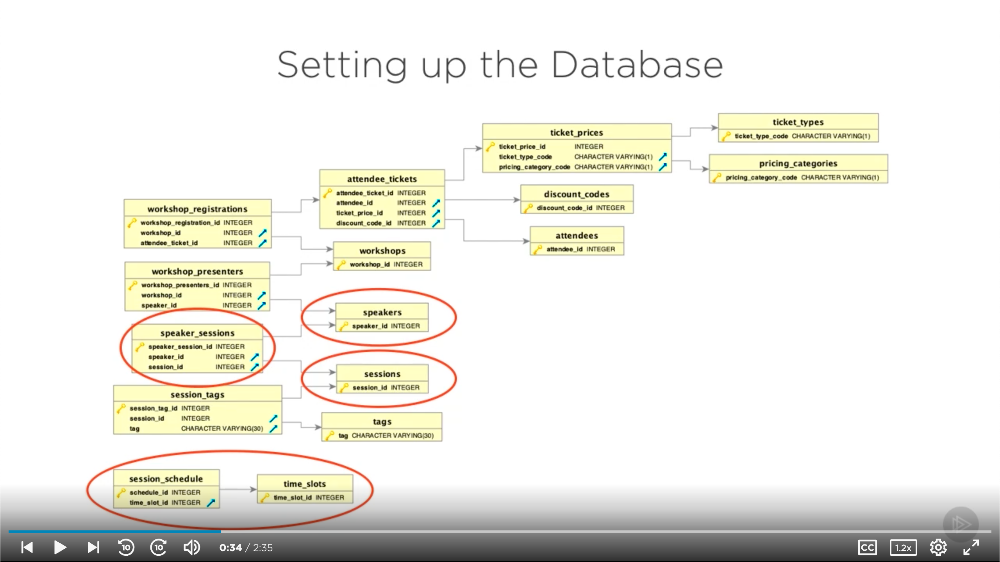

# [Spring Framework: Creating Your First Spring Boot Application](https://app.pluralsight.com/library/courses/creating-first-spring-boot-application) (Dan Bunker, 2019-10-31)

## Course Overview

### [Course Overview](https://app.pluralsight.com/player?course=creating-first-spring-boot-application&author=dan-bunker&name=93b7bf66-cc65-4884-803d-c159f169d0b6&clip=0&mode=live)

## Using Spring Boot to Create Applications

### [Introduction](https://app.pluralsight.com/player?course=creating-first-spring-boot-application&author=dan-bunker&name=1db3a0ad-cab9-46db-84fe-d7b033473655&clip=0&mode=live)

- Prerequisites
  - Java (at least Java 12)
  - IntelliJ (Community is alright)

### [What Is Spring Boot?](https://app.pluralsight.com/course-player?clipId=491b5cc0-bef1-4d46-90d9-7da8e777fa6d)

- Before Spring Boot, it could take days of development simply to get an app set up and talking to a database.
- Spring Boot
  - Opinionated framework
  - Rapid development
  - Stand alone app
    - Self-contained, suitable for cloud deployments

### [Demo: Creating a Spring Boot App with Spring Initializr](https://app.pluralsight.com/course-player?clipId=104fa981-df71-4342-9fd3-e748823e3ac4)

- One way to create a Spring Boot app:
  - [Spring Initializr](https://start.spring.io/)
- Example project
  - Maven Project
  - Java
  - Latest Spring Boot version
  - Group: `com.pluralsight`
  - Artifact: `conference-demo`
  - Dependencies: `Spring Web`
    - Spring MVC, REST API info
  - Click `Generate`: generates `conference-demo.zip`.

### [Demo: Importing and Setting up a Spring Boot App](https://app.pluralsight.com/course-player?clipId=b7bc9b61-098a-4bcc-84db-bee51013d9a2)

- Extract `conference-demo.zip`.
- Open IntelliJ.
  - Import `conference-demo`.
  - Maven project.
  - Leave defaults.
  - Choose or setup JDK.
  - Finish.

### [Demo: Overview of a Spring Boot App](https://app.pluralsight.com/course-player?clipId=b638e587-8ad0-475a-95b1-56f0023fcb64)

- Maven apps generally follow the same layout:
  - `pom.xml`
    - Dependencies (e.g., `org.springframework.boot`)
  - `src/main`
    - Java goes in `java`
      - `src/main/java/com.pluralsight.conferencedemo/ConferenceDemoApplication` is main entry point of application.
      - Note `@SpringBootApplication`
    - Property files, XML files, etc. go in `resources`
  - `src/test`
- Restructure our app and add some new files.
  - Right click on `com.pluralsight.conferencedemo` > `New` > `Package`
    - `com.pluralsight.conferencedemo.controllers`
      - Will hold API controllers
    - `com.pluralsight.conferencedemo.models`
      - Will hold JPA entities and other persistence info
    - `com.pluralsight.conferencedemo.repositories`
      - Will hold JPA repositories
    - `com.pluralsight.conferencedemo.services`
      - Will hold service- or logic-based code

### [Demo: Creating a Spring Boot App with IntelliJ](https://app.pluralsight.com/course-player?clipId=ac40d0a9-5570-42b3-8905-21d9834a650c)

- Alternate way to create a Spring Boot application (IntelliJ Ultimate)
  - Create New Project
  - Select `Spring Initializr` on the left menu

### [Demo: Using the Spring Boot CLI](https://app.pluralsight.com/course-player?clipId=c8d2df30-bff1-402a-bf90-7548ab984558)

- [Spring Boot CLI installation](https://docs.spring.io/spring-boot/docs/current/reference/html/getting-started.html#getting-started-installing-the-cli)

  - Suggested install: [sdkman](https://sdkman.io/)
    - `sdk install springboot`
  - Homebrew

    ```sh
    brew tap pivotal/tap
    brew install springboot
    ```

- Once installed

  ```sh
  spring
  spring help
  spring init # Another way to create a Spring Boot project
  spring run # Can run a Groovy-based Spring Boot project
  ```

### [Understanding Spring Boot Starters](https://app.pluralsight.com/course-player?clipId=90ec12ea-9d75-4acd-aa03-d879dbda8731)

- Starters are what make Spring Boot shine.
- A starter is a way to integrate a dependency on your project.
  - Simply declare a starter, and it will take care of getting all the right versions and dependencies in place.
- `pom.xml` > dependencies
  - 
  - We have 2 starters currently:
    - `spring-boot-starter-web`
    - `spring-boot-starter-test`
  - You don't have to specify a version when declaring a starter dependency.
    - The `spring-boot-starter-parent` declaration at the top declares the versions of all the possible dependencies.
      - Sometimes called the BOM (bill of materials).
      - Can see by right clicking > `Maven` > `Show Effective POM`

### [Summary](https://app.pluralsight.com/course-player?clipId=2e7c8e2a-6a08-41c8-a53b-aff752d920a7)

- What is Spring Boot? Simply, an opinionated rapid development framework.

## Building Apps with Spring Boot

### [Introduction](https://app.pluralsight.com/course-player?clipId=c2ec0a13-8324-466a-b309-0109a57f2c76)

- Our conference scheduling app will include:
  - Spring MVC
  - Spring Data JPA
  - JPA
  - A relational database (PostgreSQL)
- A full-stack Spring microservice app (though no GUI)

### [Application Overview](https://app.pluralsight.com/course-player?clipId=6759e7a8-d989-49e5-905b-20872aecbf97)

### [Setting up the Database](https://app.pluralsight.com/course-player?clipId=2e2b265c-fff4-497a-8d76-e5bfc0364761)

- Database ERD
  - 
- [github.com/dlbunker/ps-first-spring-boot-app](https://github.com/dlbunker/ps-first-spring-boot-app)

  - Can proceed with a local PostgreSQL instance or Docker.
  - Docker:

    - Install Docker

      ```sh
      # Install Docker
      brew install cask docker
      # Open Docker to create symbolic links
      open /Applications/Docker.app
      ```

    - Create & run Docker container; create database.

      ```sh
      # Create Docker container with PostgreSQL database.
      docker create --name postgres-demo -e POSTGRES_PASSWORD=Welcome -p 5432:5432 postgres:11.5-alpine
      # Start container
      docker start postgres-demo

      # Connect to psql prompt from Docker
      docker exec -it postgres-demo psql -U postgres

      # Create database
      create database conference_app;
      ```

    - Create tables & insert data

      ```sh
      cd ps-first-spring-boot-app/database/postgresql
      docker cp create_tables.sql postgres-demo:/create_tables.sql
      docker exec -it postgres-demo psql -d conference_app -f create_tables.sql -U postgres

      docker cp insert_data.sql postgres-demo:/insert_data.sql
      docker exec -it postgres-demo psql -d conference_app -f insert_data.sql -U postgres
      ```

    - Stop container

      ```sh
      # Stop container
      docker stop postgres-demo
      ```

    - Connection info:
      - JDBC URL: `jdbc:postgresql://localhost:5432/conference_app`
      - Username: `postgres`
      - Password: `Welcome`

- Recommended database client: [Postico](https://eggerapps.at/postico/)

  ```sh
  brew cask install postico
  ```

### [Demo: Connecting to the Database](https://app.pluralsight.com/course-player?clipId=1d370eee-b668-4cdc-abd9-1ba7f198544c)

- Need to add a starter dependency that will include the Spring Data JPA library, and then connect it to PostgreSQL.
- `pom.xml`

  - Add the following dependencies below `spring-boot-starter-web` (and import the Maven changes):

    ```xml
        <dependency>
          <groupId>org.springframework.boot</groupId>
          <artifactId>spring-boot-starter-data-jpa</artifactId>
        </dependency>

        <dependency>
          <groupId>org.postgresql</groupId>
          <artifactId>postgresql</artifactId>
          <scope>runtime</scope>
        </dependency>
    ```

- Tell Spring Boot the database connection string.

  - `src/main/resources/application.properties`

    ```properties
    spring.datasource.url=jdbc:postgresql://localhost:5432/conference_app
    spring.datasource.username=postgres
    spring.datasource.password=Welcome
    spring.jpa.database-platform=org.hibernate.dialect.PostgreSQLDialect
    spring.jpa.hibernate.ddl-auto=none
    spring.jpa.hibernate.show-sql=true
    ```

### [Demo: Creating JPA Models](https://app.pluralsight.com/course-player?clipId=d1dea5c6-6bae-41a0-88cf-752f27dd3519)

- Next step: Apply some JPA entities so we can talk to the database.
- Right click `src/main/java/com.pluralsight.conferencedemo/models` > New > Java Class

  - `Session.java`

    - Add annotation: `@Entity(name="sessions")`
    - Note that we're using plural `sessions` in the entity name because that is the name of our database table, whereas the class is singular because it will be one row or instance of that data.
    - 
    - Add default constructors to all entities.
      - Helps with serialization and deserialization (when plugging in controllers).
    - Add variables for our columns.
      - Keeping the case and spelling the same (i.e., snake_case vs. normal Java camelCase) as the database columns allows JPA to automatically bind to them.
        - Otherwise, we'd need to add an @Column annotation to each.
      - We need to add the `@Id` annotation to tell JPA which key is the primary key.
      - And `@GeneratedValue(strategy = GenerationType.IDENTITY)` tells JPA how the primary key gets populated on a new insert.
        - With `strategy = GenerationType.IDENTITY`, JPA will use the PostgreSQL-generated value.
      - Generate getters & setters.

    ```java
    package com.pluralsight.conferencedemo.models;

    import javax.persistence.Entity;
    import javax.persistence.GeneratedValue;
    import javax.persistence.GenerationType;
    import javax.persistence.Id;

    @Entity(name="sessions")
    public class Session {
        @Id
        @GeneratedValue(strategy = GenerationType.IDENTITY)
        private Long session_id;
        private String session_name;
        private String session_description;
        private Integer session_length;

        public Session() {}

        public Long getSession_id() {
            return session_id;
        }

        public void setSession_id(Long session_id) {
            this.session_id = session_id;
        }

        public String getSession_name() {
            return session_name;
        }

        public void setSession_name(String session_name) {
            this.session_name = session_name;
        }

        public String getSession_description() {
            return session_description;
        }

        public void setSession_description(String session_description) {
            this.session_description = session_description;
        }

        public Integer getSession_length() {
            return session_length;
        }

        public void setSession_length(Integer session_length) {
            this.session_length = session_length;
        }
    }
    ```

  - Add a `Speaker` entity:

    ```java
    package com.pluralsight.conferencedemo.models;

    import javax.persistence.Entity;
    import javax.persistence.GeneratedValue;
    import javax.persistence.GenerationType;
    import javax.persistence.Id;

    @Entity(name = "speakers")
    public class Speaker {
        @Id
        @GeneratedValue(strategy = GenerationType.IDENTITY)
        private Long speaker_id;

        private String first_name;
        private String last_name;
        private String title;
        private String company;
        private String speaker_bio;

        public Speaker() {}

        public Long getSpeaker_id() {
            return speaker_id;
        }

        public void setSpeaker_id(Long speaker_id) {
            this.speaker_id = speaker_id;
        }

        public String getFirst_name() {
            return first_name;
        }

        public void setFirst_name(String first_name) {
            this.first_name = first_name;
        }

        public String getLast_name() {
            return last_name;
        }

        public void setLast_name(String last_name) {
            this.last_name = last_name;
        }

        public String getTitle() {
            return title;
        }

        public void setTitle(String title) {
            this.title = title;
        }

        public String getCompany() {
            return company;
        }

        public void setCompany(String company) {
            this.company = company;
        }

        public String getSpeaker_bio() {
            return speaker_bio;
        }

        public void setSpeaker_bio(String speaker_bio) {
            this.speaker_bio = speaker_bio;
        }
    }
    ```

### [Demo: Working with JPA Relationships](https://app.pluralsight.com/course-player?clipId=5b55594b-84fe-43fd-9bd7-8a1158b0b1bc)

- Now we'll tie our Session and our Speaker together in a JPA relationship that will match their relationship in the database.
  - In the databse, they're connected by a union or join table. So we'll need a many-to-many relationship.
- We need to pick one side to be the owner or main definition point of the relationship. We'll use the `src/main/java/com.pluralsight.conference/models/Session` class.

  - Start by adding a `private List<Speaker> speakers;` list.
  - Add a getter and setter.
  - Then define the relationship.
    - `@ManyToMany`
      - Setting up a many-to-many relationship.
    - `@JoinTable`
      - Defines the join table and the foreign key columns.
  - Now JPA will set up the SQL the join automatically when calling the speakers attribute.

  ```java
  package com.pluralsight.conferencedemo.models;

  import javax.persistence.*;
  import java.util.List;

  @Entity(name = "sessions")
  public class Session {
      @Id
      @GeneratedValue(strategy = GenerationType.IDENTITY)
      private Long session_id;

      private String session_name;
      private String session_description;
      private Integer session_length;

      @ManyToMany
      @JoinTable(
              name = "session_speakers",
              joinColumns = @JoinColumn(name = "session_id"),
              inverseJoinColumns = @JoinColumn(name = "speaker_id")
      )
      private List<Speaker> speakers;

      public Session() {}

      public List<Speaker> getSpeakers() {
          return speakers;
      }

      public void setSpeakers(List<Speaker> speakers) {
          this.speakers = speakers;
      }

      public Long getSession_id() {
          return session_id;
      }

      public void setSession_id(Long session_id) {
          this.session_id = session_id;
      }

      public String getSession_name() {
          return session_name;
      }

      public void setSession_name(String session_name) {
          this.session_name = session_name;
      }

      public String getSession_description() {
          return session_description;
      }

      public void setSession_description(String session_description) {
          this.session_description = session_description;
      }

      public Integer getSession_length() {
          return session_length;
      }

      public void setSession_length(Integer session_length) {
          this.session_length = session_length;
      }
  }
  ```

- And in `Speaker`:

  - We need to define the many-to-many relationship here also (to make it bi-directional).
  - Since we defined the nature of the mapping on `Session`, we can just specify `@ManyToMany(mappedBy = "speakers")` here.

  ```java
  package com.pluralsight.conferencedemo.models;

  import javax.persistence.*;
  import java.util.List;

  @Entity(name = "speakers")
  public class Speaker {
      @Id
      @GeneratedValue(strategy = GenerationType.IDENTITY)
      private Long speaker_id;

      private String first_name;
      private String last_name;
      private String title;
      private String company;
      private String speaker_bio;

      @ManyToMany(mappedBy = "speakers")
      private List<Session> sessions;

      public Speaker() {}

      public List<Session> getSessions() {
          return sessions;
      }

      public void setSessions(List<Session> sessions) {
          this.sessions = sessions;
      }

      public Long getSpeaker_id() {
          return speaker_id;
      }

      public void setSpeaker_id(Long speaker_id) {
          this.speaker_id = speaker_id;
      }

      public String getFirst_name() {
          return first_name;
      }

      public void setFirst_name(String first_name) {
          this.first_name = first_name;
      }

      public String getLast_name() {
          return last_name;
      }

      public void setLast_name(String last_name) {
          this.last_name = last_name;
      }

      public String getTitle() {
          return title;
      }

      public void setTitle(String title) {
          this.title = title;
      }

      public String getCompany() {
          return company;
      }

      public void setCompany(String company) {
          this.company = company;
      }

      public String getSpeaker_bio() {
          return speaker_bio;
      }

      public void setSpeaker_bio(String speaker_bio) {
          this.speaker_bio = speaker_bio;
      }
  }
  ```

### [Demo: Working with Binary Data Types](https://app.pluralsight.com/course-player?clipId=81f08dde-217a-45ac-80c6-a7aaf8235039)

- In `Speaker` entity:

  - We need to handle binary photo data.
  - Add a `private byte[] speaker_photo;` property.
    - A byte array is well-suited for binary data in Java.
  - Generate getters and setters.
  - Add annotations:
    - `@Lob`
      - Large object. Binary data can get quite large. Providing this annotation helps JPA deal with the large data.
    - `@Type(type="org.hibernate.type.BinaryType")`
      - Helps Hibernate deal with binary data.
      - Hibernate is the JPA implementation we're using under the covers.
      - Without this annotation, we'd end up with an exception.

  ```java
  package com.pluralsight.conferencedemo.models;

  import org.hibernate.annotations.Type;

  import javax.persistence.*;
  import java.util.List;

  @Entity(name = "speakers")
  public class Speaker {
      @Id
      @GeneratedValue(strategy = GenerationType.IDENTITY)
      private Long speaker_id;

      private String first_name;
      private String last_name;
      private String title;
      private String company;
      private String speaker_bio;

      @Lob
      @Type(type="org.hibernate.type.BinaryType")
      private byte[] speaker_photo;

      @ManyToMany(mappedBy = "speakers")
      private List<Session> sessions;

      public Speaker() {}

      public byte[] getSpeaker_photo() {
          return speaker_photo;
      }

      public void setSpeaker_photo(byte[] speaker_photo) {
          this.speaker_photo = speaker_photo;
      }

      public List<Session> getSessions() {
          return sessions;
      }

      public void setSessions(List<Session> sessions) {
          this.sessions = sessions;
      }

      public Long getSpeaker_id() {
          return speaker_id;
      }

      public void setSpeaker_id(Long speaker_id) {
          this.speaker_id = speaker_id;
      }

      public String getFirst_name() {
          return first_name;
      }

      public void setFirst_name(String first_name) {
          this.first_name = first_name;
      }

      public String getLast_name() {
          return last_name;
      }

      public void setLast_name(String last_name) {
          this.last_name = last_name;
      }

      public String getTitle() {
          return title;
      }

      public void setTitle(String title) {
          this.title = title;
      }

      public String getCompany() {
          return company;
      }

      public void setCompany(String company) {
          this.company = company;
      }

      public String getSpeaker_bio() {
          return speaker_bio;
      }

      public void setSpeaker_bio(String speaker_bio) {
          this.speaker_bio = speaker_bio;
      }
  }
  ```

- Back in `src/main/resources/application.properties`, add `spring.jpa.properties.hibernate.jdbc.lob.non_contextual_creation=true`
  - Needed so the PostgreSQL JDBC driver can create Lob data correctly on the Java side.
  - Would encounter exceptions otherwise.

### [Demo: Creating JPA Repositories]()

### [Demo: Creating Spring API REST Controllers - Part 1]()

### [Demo: Creating Spring API REST Controllers - Part 2]()

### [Demo: Handling Serialization Issues and Running the App]()

### [Summary]()

## Working with Spring Boot Config and Environment Needs

### [Introduction]()

### [How to Customize and Override Spring Boot]()

### [Demo: Locating and Working with Config Files]()

### [Demo: How to Change Database Connections]()

### [Demo: How to Handle Different Environments]()

### [Demo: Setting Properties with YAML]()

### [Demo: How to Use Spring Properties in Code]()

### [Demo: Overriding Spring Boot with Java Config]()

### [Creating Your Own Auto-configuration Class]()

### [Summary]()

## Deploying Spring Boot Applications

### [Introduction]()

### [Spring Boot Containerless Architecture]()

### [Demo: Switching out the Spring Boot Embedded Container]()

### [Demo: Creating Executable JAR Deployments]()

### [Common Cloud Supported Platforms]()

### [Demo: Deploying Spring Boot to the Cloud]()

### [What About WAR Deployments?]()

### [Demo: Creating a Spring Boot 
WAR Deployment]()

### [Summary]()
