# [Spring Framework: Spring Boot Actuator](https://app.pluralsight.com/library/courses/spring-framework-spring-boot-actuator/table-of-contents)

## Course Overview

### [Course Overview](https://app.pluralsight.com/player?course=spring-framework-spring-boot-actuator&author=dustin-schultz&name=f581ec27-49b7-4668-8d50-6f543a3c71c7&clip=0&mode=live)

- Spring Boot Actuator allows you to run, monitor, and manage your Spring Boot applications in production.

## Using Actuator Endpoints to Monitor, Manage, and Introspect

### [Overview](https://app.pluralsight.com/course-player?clipId=e40169b0-5f1c-48ec-b0d2-a455db8fb63c)

### [What Is Spring Boot Actuator?](https://app.pluralsight.com/course-player?clipId=b61395de-61ca-421e-bc4a-cc8649560067)

- Demo app has 1 endpoint: `localhost:8080/todo/list`.
- With the built-in actuator health endpoint, it's easy to tell if the app is healthy or not.
  - `localhost:8080/actuator/health`
- Memory usage:
  - `localhost:8080/actuator/metrics/jvm.memory.used`
- Configuration values
  - `localhost:8080/actuator/configprops`

### [What Is an Actuator?](https://app.pluralsight.com/course-player?clipId=99309cd5-0e5a-45e2-aa0d-d7a61e9c9c75)

- An actuator is a component that is responsible for controlling a mechanism or system.
  - More broadly, an actuator is triggered by a signal and it generates an output.
- Built-in & production-ready features
  - auditevents
  - beans
  - caches
  - conditions
  - configprops
  - env
  - flyway
  - health
  - httptrace
  - info
  - integrationgraph
  - loggers
  - liquibase
  - metrics
  - mappings

### [What's Different between Spring Boot Actuator 1.x and 2.x?](https://app.pluralsight.com/course-player?clipId=fc326b2c-078e-4c95-aa54-6a9ee1f5d38d)

- Concepts are the same, but the API was improved.
  - 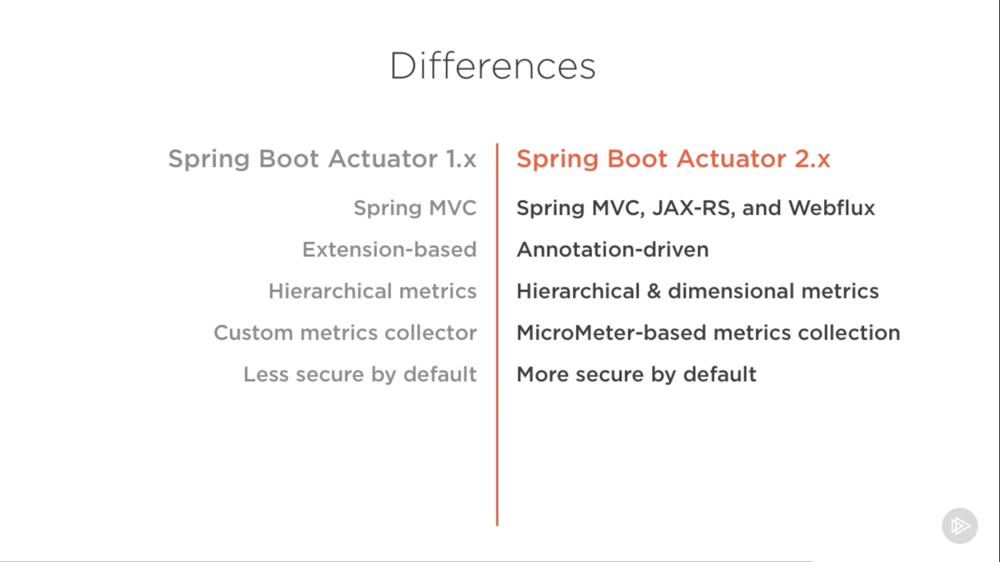

### [Getting Started Using Spring Boot Actuator](https://app.pluralsight.com/course-player?clipId=1ecfa182-9d42-435f-b798-295a3640363c)

- Only requirement: Add spring-boot-starter-actuator as a dependency.

### [Introducing Actuator Endpoints and How to Get the Demo Code](https://app.pluralsight.com/course-player?clipId=9fcd19a0-3180-4871-9836-f9dcf10ddbc4)

### [Getting Acquainted with the Demo Code](https://app.pluralsight.com/course-player?clipId=6509d62b-fdc6-4057-b122-a23d8386d686)

- Demo app: https://github.com/dustinschultz/todo-app

### [What Is an Actuator Endpoint?](https://app.pluralsight.com/course-player?clipId=13351ba9-7c1b-499f-a9e6-234f18449bdc)

### [Demo: Discovering the Built-in Actuator Endpoints](https://app.pluralsight.com/course-player?clipId=c9f4890a-f65f-427f-add2-d441303fb994)

- https://docs.spring.io/spring-boot/docs/current/reference/html/production-ready-features.html#production-ready-endpoints

### [Exploring the Most Common Endpoints and How They're Used](https://app.pluralsight.com/course-player?clipId=560601bb-8409-4ff8-822a-08c86c4915ec)

- Health (`/actuator/health`)
  - Probably most used endpoint.
  - Useful for checking the health of an application, especially with container management systems.
- Metrics (`/actuator/metrics`)
  - Being able to see inside a live production application.
  - Can get individual metrics or use it for supplying performance dashboards.
- Loggers (`/actuator/loggers`)
  - Can change log level of a running application - without restarting it (e.g., setting log level DEBUG in prod for additional detail, then turning it back off to avoid filling up logs).
- Configuration properties (`/actuator/configprops`)

### [Demo: Actuator Endpoints in Action](https://app.pluralsight.com/course-player?clipId=df0e32cc-3724-4bdb-96c9-ca2cc12903f0)

- `application.properties`
  - `management.endpoints.web.exposure.include=`
    - Can set as CSV list, or as a `*`. (Avoid exposing all in a production app due to security risk.)
- By default, all endpoints are available at `/actuator/{id}`
  - The `/actuator/` segment is configurable.

### [Taking a Deeper Look at the Most Commonly Used Endpoints](https://app.pluralsight.com/course-player?clipId=3b9d8b07-7c56-4c59-b986-35abe4cb56bc)

### [Deep Dive: Health Endpoint](https://app.pluralsight.com/course-player?clipId=25a86b7f-9fdf-4b5e-a49f-1bd4f1e45d2a)

- The health endpoint is an aggregation of several health checks.
  - Some are auto-configured by default.
  - Allows for easily adding custom health checks.
    - E.g., show health check for dependency.

### [Deep Dive: Metrics Endpoint](https://app.pluralsight.com/course-player?clipId=03c00b2b-31e9-495a-b34b-02436f3190dd)

- The metrics endpoint supports a large number of monitoring systems.
  - Supports both a push and a pull model.
  - Built-in core metrics.
    - JVM metrics
    - CPU metrics
  - Ability to add or customize metrics.

### [Summary](https://app.pluralsight.com/course-player?clipId=bccd7c10-af22-4132-b245-7bf7b652065d)

## Securing Actuator Endpoints and Creating Customizations

### [Overview](https://app.pluralsight.com/course-player?clipId=8f80db1e-f5a1-4751-ad39-023114da98d6)

### [Enabling and Disabling Actuator Endpoints](https://app.pluralsight.com/course-player?clipId=087b41d0-4802-4a4d-ac46-4b1808121d73)

- Each endpoint can be enabled or disabled.
  - Controls the creation of the endpoint, not whether it can be accessed.
- Format for enabling endpoints via application properties:
  - `management.endpoint.<ID>.enabled=true` (or `false` to disable)
- By default, all endpoints are enabled except the shutdown endpoint (which must be explicitly enabled).

  - Can switch to disabling all by default and enabling specific endpoints:

    ```properties
    management.endpoints.enabled-by-default=false
    management.endpoints.health.enabled=true
    management.endpoints.loggers.enabled=true
    management.endpoints.env.enabled=true
    ```

### [Exposing Actuator Endpoints](https://app.pluralsight.com/course-player?clipId=f6c47c28-3273-4b0a-9bdb-48bad9e40fbb)

- As of Spring Boot 2.0, endpoints must be explicitly exposed for consumption (e.g., via HTTP).
- 2 supported methods:
  - HTTP
  - JMX
- By default, all endpoints are automatically exposed via JMX, while only the `/health` and `/info` endpoints are exposed via HTTP.
- Be very careful exposing endpoints via HTTP.
  - It could expose sensitive data or operations.
- Format for exposing endpoints via application properties:
  - `management.endpoint.<PROTOCOL>.expose.include=`
    - PROTOCOL: `http` or `jmx`
    - To expose metrics over HTTP:
      - `management.endpoint.http.expose.include=metrics`
    - To exclude beans over JMX:
      - `management.endpoint.jmx.expose.exclude=beans`
    - Expose all HTTP endpoints:
      - `management.endpoint.http.expose.include=*`
        - Note: If using `.yaml` file, surround asterisk in quotes: `"*"`

### [Enabling vs. Exposing Endpoints](https://app.pluralsight.com/course-player?clipId=1c23b8ec-65c2-4d65-96a2-a3bf956c56f1)

- Enabling (related to efficiency: memory usage) != exposing (related to security)
  - 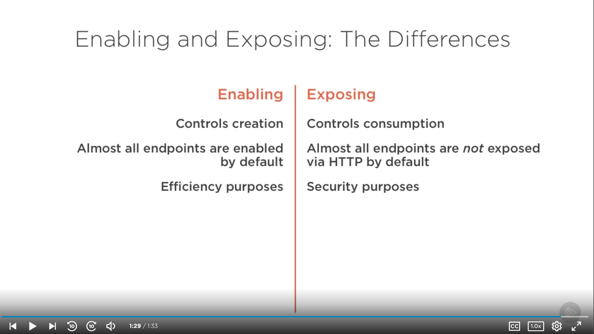

### [Demo: Enabling and Exposing Endpoints](https://app.pluralsight.com/course-player?clipId=2e6e440a-773f-4056-a77a-97e1134fefcd)

- Example: loggers is exposed but _not_ enabled, so it's not accessible.

  ```properties
  management.endpoint.loggers.enabled=false
  management.endpoints.web.exposure.include=beans,metrics,info,health,loggers
  ```

### [Securing Actuator Endpoints](https://app.pluralsight.com/course-player?clipId=bbee2900-143e-4fa5-81ec-b050aaa7ba02)

- If Spring Boot detects that Spring Security (`spring-boot-starter-security`) is on the classpath, it adds HTTP basic authentication to all endpoints.
  - Two exceptions:
    - Health
    - Info
  - When using Spring security, it generates a random string (printed to the console on startup) and the username `user`.
    - `spring.security.user.name` and `.password` to set specifically.
- To customize security:

```java
@Configuration(proxyBeanMethods = false)
public class ActuatorSecurity extends WebSecurityConfigurerAdapter {
  @Override
  protected void configure(HttpSecurity http) throws Exception {
    // Customizations go here.
    // Example: Require authorization in addition to authentication.
    http
    .requestMatcher(EndpointRequest.toAnyEndpoint())
    .authorizeRequest( (req) -> req.anyRequest().hasRole("ADMIN"));

    http.httpBasic();
  }
}
```

### [Customizing the Health Endpoint](https://app.pluralsight.com/course-player?clipId=7087c4b5-efdc-4abb-b904-0df903d4da31)

- Adding additional health checks:
  - Create and register a new bean that implements `HealthIndicator`.
    - Implement a `health()` method returning a `Health` object.

```java
@Component
public class FooServiceHealthIndicator implements HealthIndicator {
  @Override
  public Health health() {
    // Perform custom health check.

    // Healthy.
    return Health.up().build();

    // Unhealthy.
    // Can add additional details.
    // return Health.down()
    //           .withDetail("response_code", "...")
    //           .withDetail("response_ms", "...")
    //           .withDetail("num_retries", "...")
    //           .build();
  }
}
```

### [Customizing the Info Endpoint](https://app.pluralsight.com/player?course=spring-framework-spring-boot-actuator&author=dustin-schultz&name=9edb9ebe-502f-4cda-be00-b3ec6f1ad260&clip=7&mode=live)

- 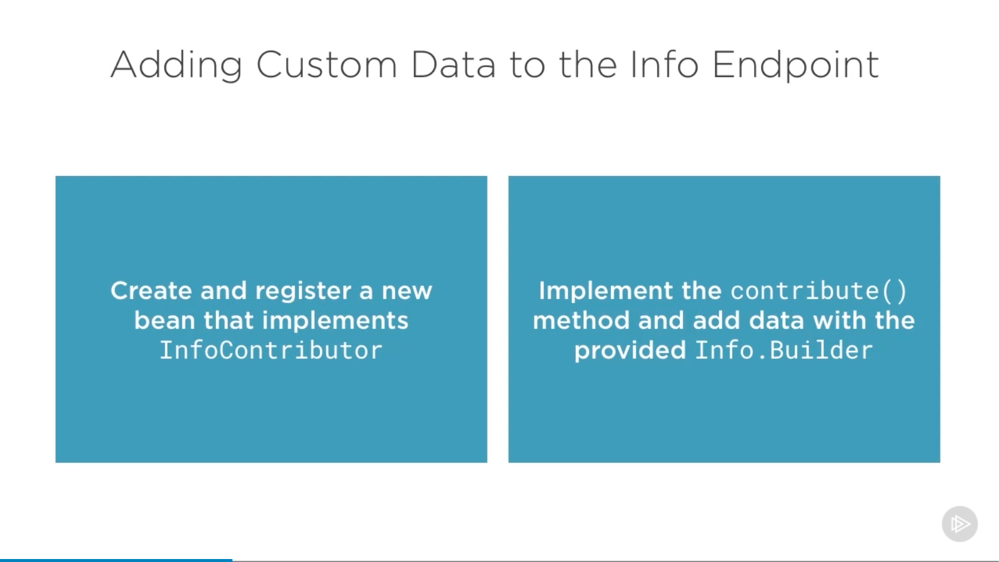
- 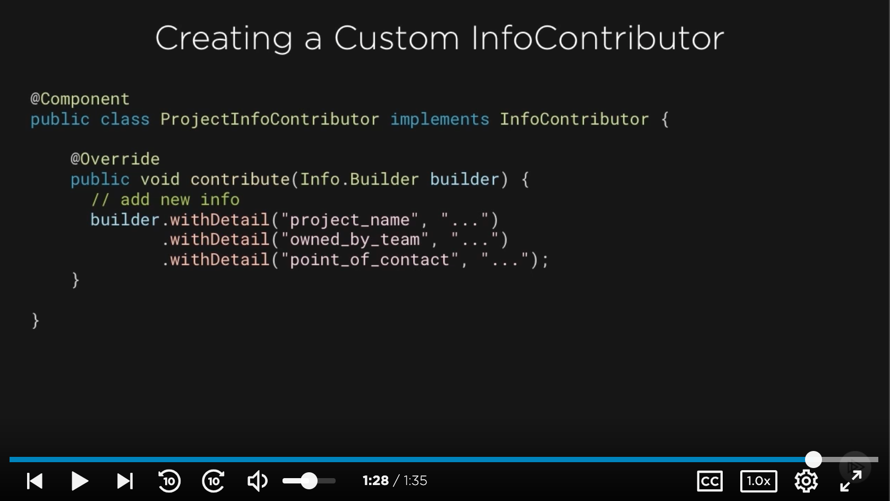
  - These details would be quite useful on a production dashboard (e.g., for identifying which microservices team to contact regarding an issue).

### [Customizing the Metrics Endpoint](https://app.pluralsight.com/course-player?clipId=ff6d6466-29a8-4ba0-9fbf-863d0ea69e5b)

- 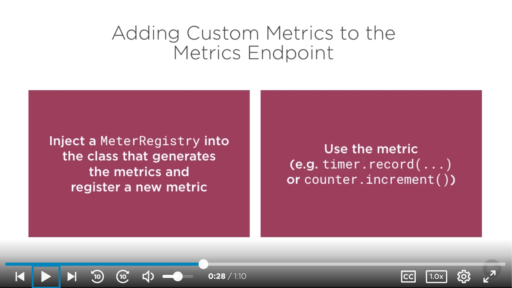
- 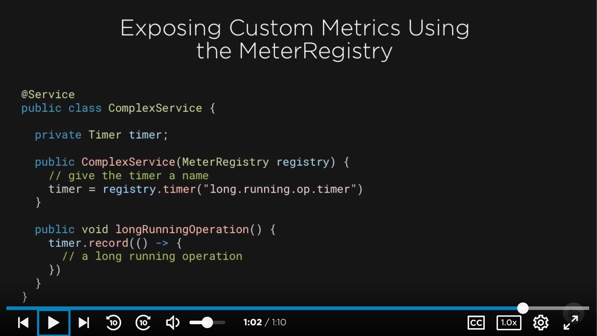

### [Demo: Writing a Custom Health Indicator](https://app.pluralsight.com/course-player?clipId=73f01ae1-7d80-4192-8573-1cbccae7fd07)

- MaxMemoryHealthIndicator
  - 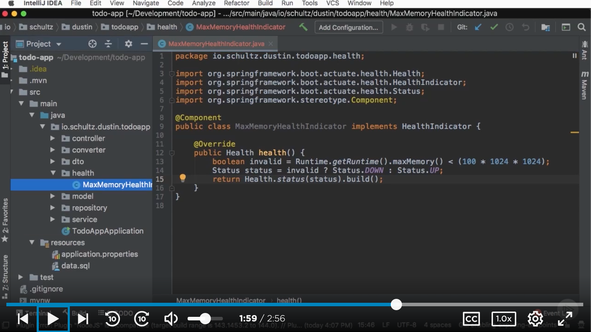
- Helpful to configure a property to see details in health endpoint call:
  - `management.endpoint.health.show-details=always` (but only set to `always` if endpoint is sufficiently secured)
- 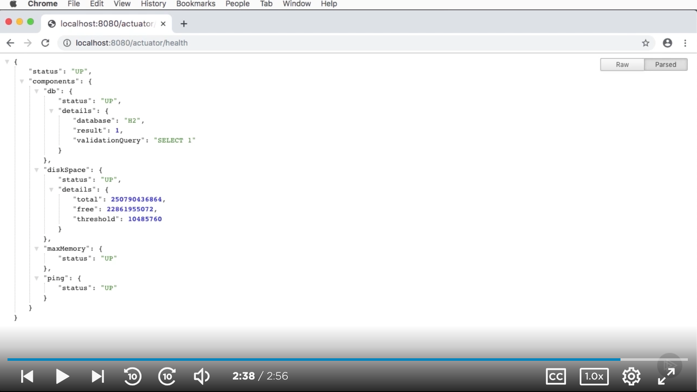
  - Note `maxMemory.status`

### [Creating Your Own Actuator Endpoints](https://app.pluralsight.com/course-player?clipId=c2e1356b-a99d-44d6-a1c2-3ef7cf85578e)

- 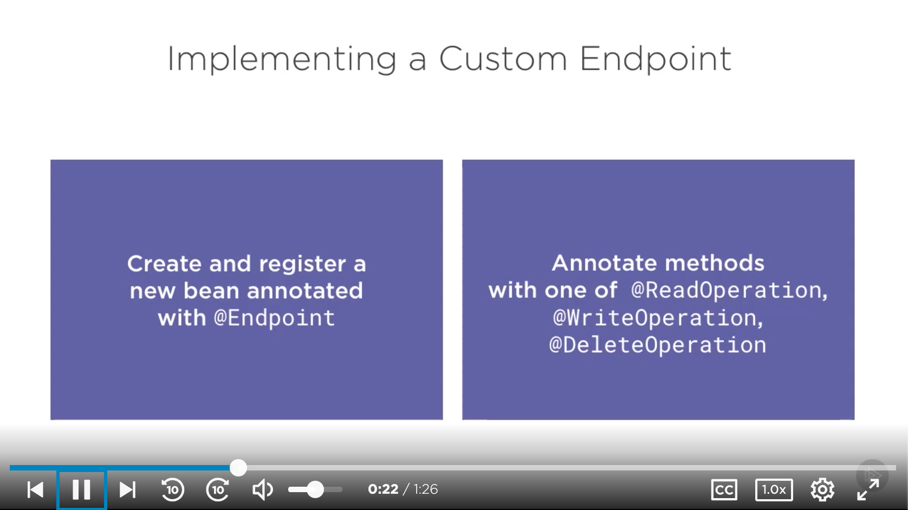
  - `@Endpoint`
  - `@ReadOperation`, `@WriteOperation`, `@DeleteOperation`
- 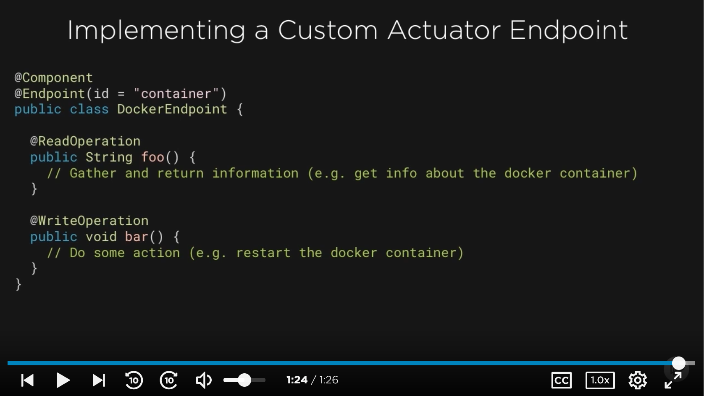

### [Demo: Implementing a Custom Actuator Endpoint](https://app.pluralsight.com/course-player?clipId=4ad4a4af-8b1c-4a1d-a0e8-7ce247b86804)

- Spring Boot Actuator has a built-in endpoint for checking health, but not readiness (whether the application is able to receive traffic).
- Invoked at `actuator/readiness` (when Spring sends the `ApplicationReadyEvent`)
  - 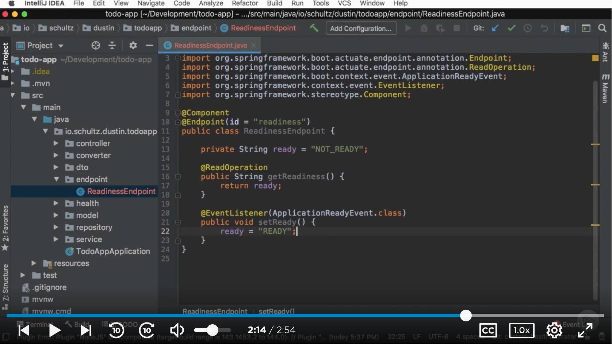
- Need to expose endpoint:
  - 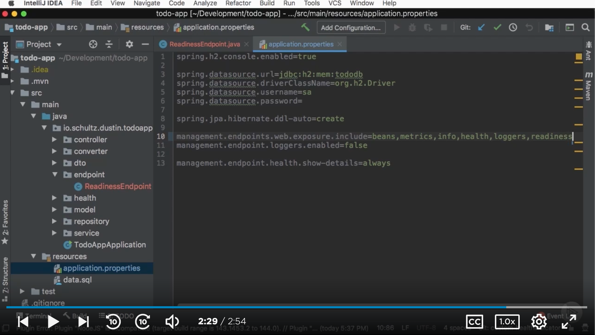
- 

### [Summary](https://app.pluralsight.com/course-player?clipId=3aa2a3ae-b730-4c89-bd45-e10d64a46d8a)
