# [Spring Framework: Spring Expression Language (SpEL)](https://app.pluralsight.com/library/courses/spring-framework-spel/table-of-contents)

## [Course Overview](https://app.pluralsight.com/player?course=spring-framework-spel&author=buddhini-samarakoddy&name=dc6de602-98cb-423e-b573-89071fd8dadf&clip=0&mode=live)

### Course Overview

## Getting to Know SpEL: Simple SpEL Expressions

### Module Overview

- Spring Expression Language enables developers to manipulate and query objects and object graphs at runtime &rarr; dynamic rewiring.
- Since Spring 3.0.
- Dynamic Bean Wiring
  - Dependency injection at runtime.
  - Example: Pick a bean or assign a value to a bean property at runtime, based on some condition.

### SpEL Overview

- 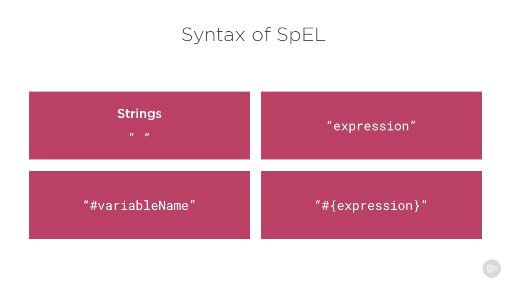
- 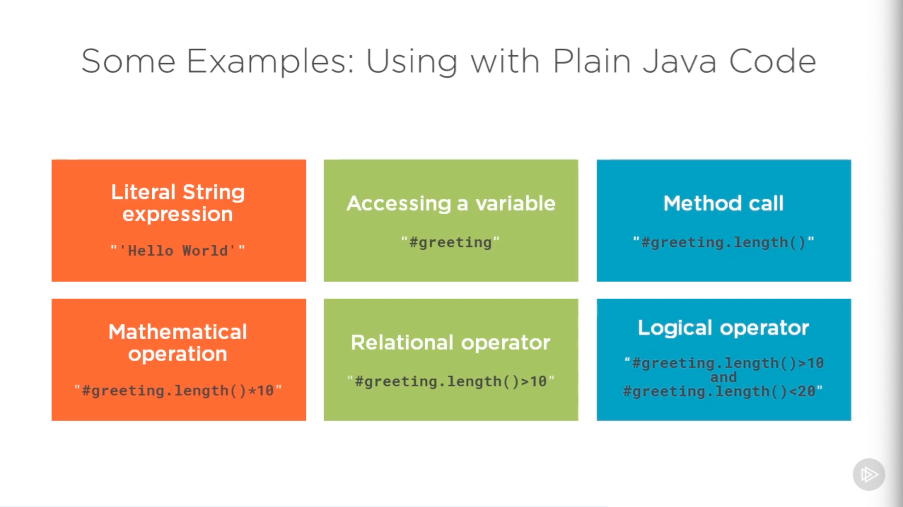
- 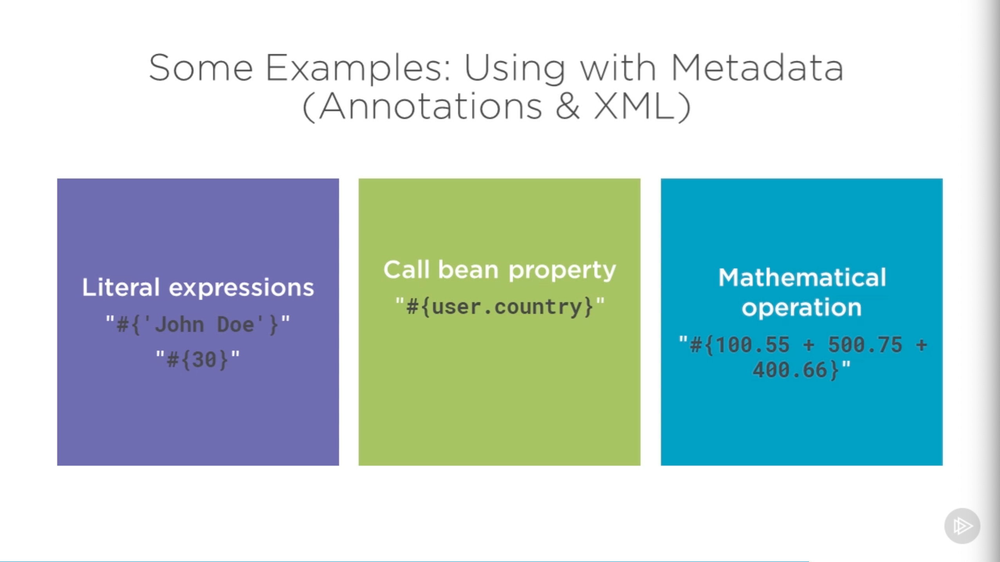
- SpEL can be used in plain Java code, but it's more likely to be used in metadata.
- 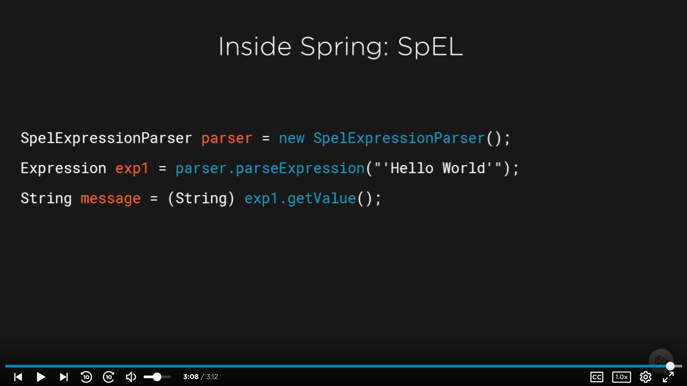

### Demo: Writing and Parsing Basic SpEL Expressions

- No special dependencies needed (just `spring-core`, `spring-context`). We'll use Spring Web Starter.
  - 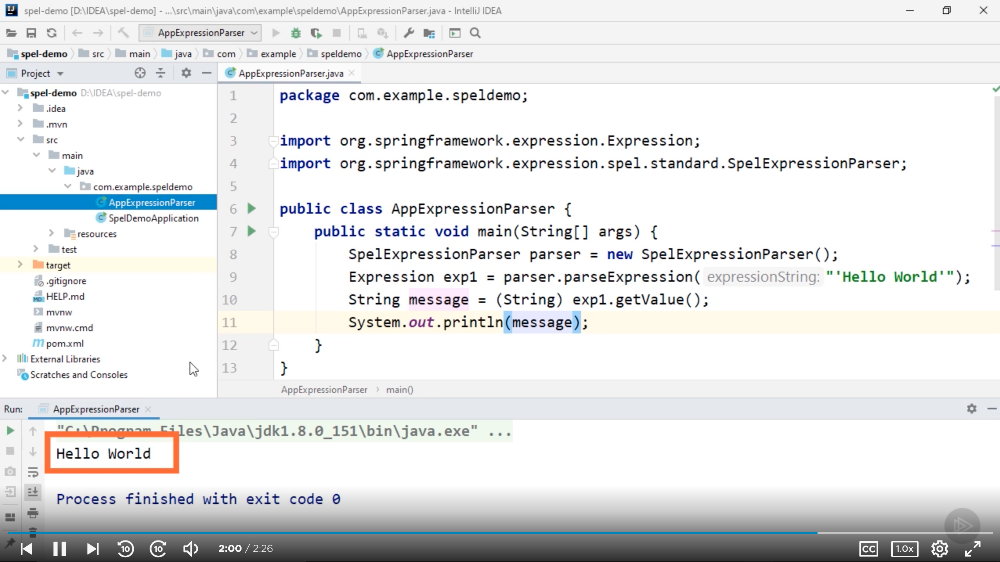

### Evaluation Context

- Uses reflection.
- 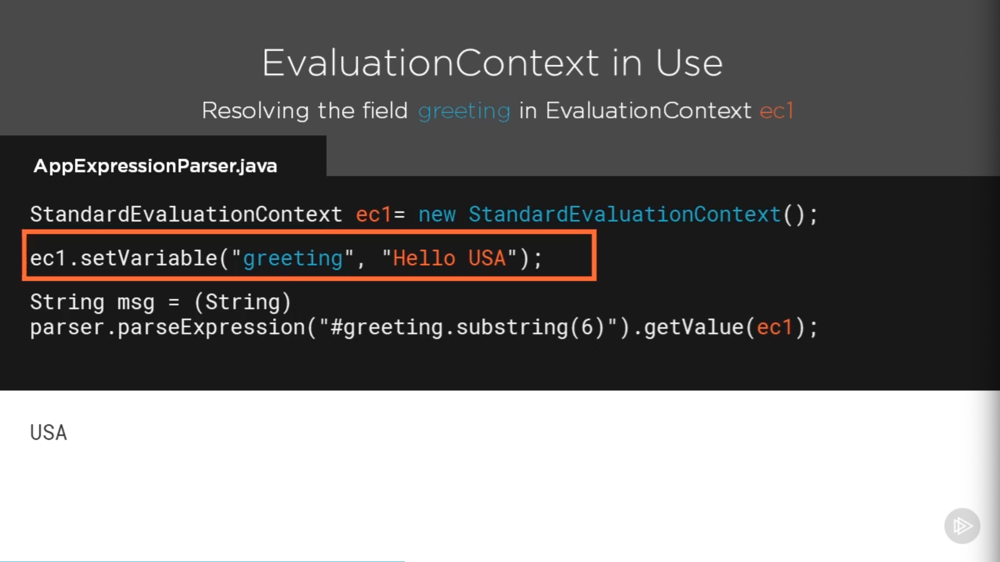

### Demo: Evaluation Context in Action

- 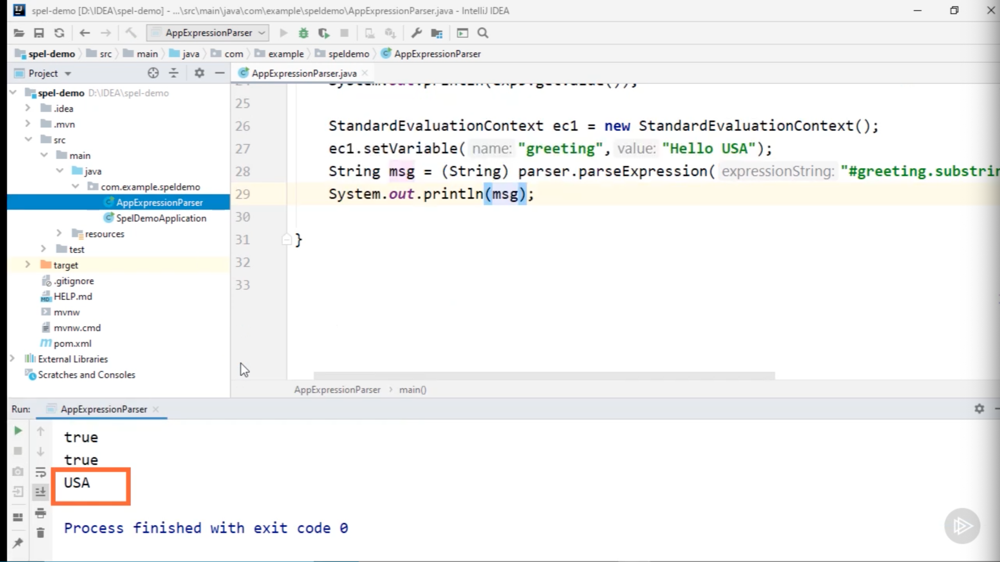
- 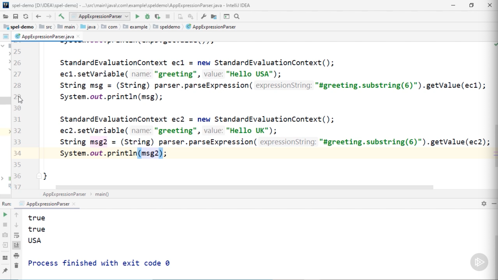
- `user` with getters and setters
  - 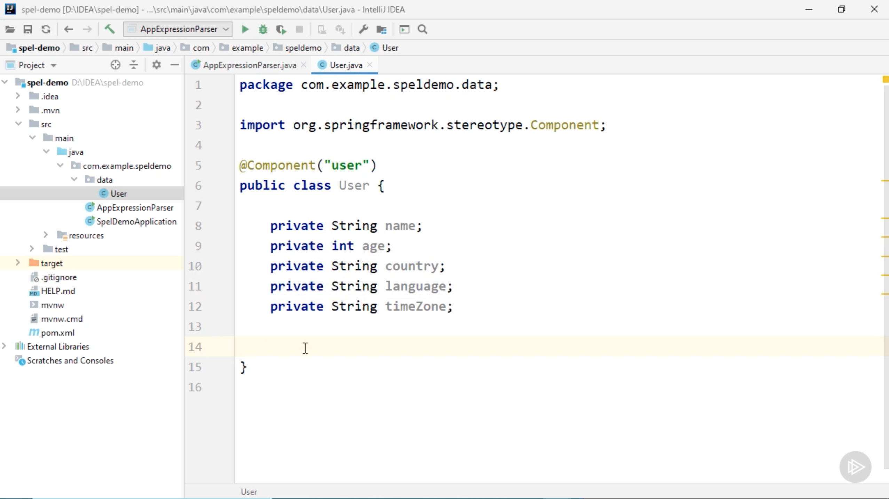
- 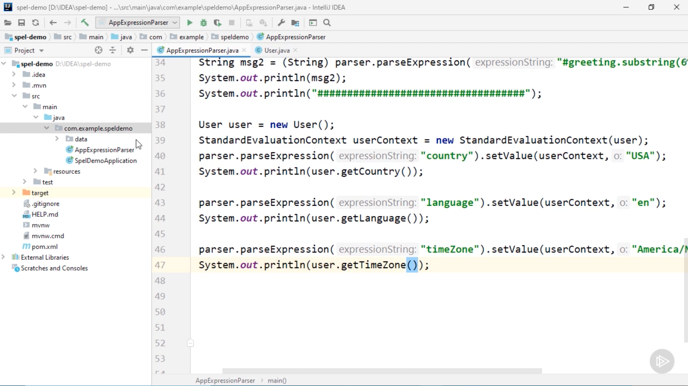

### The systemProperties Predefined Variable

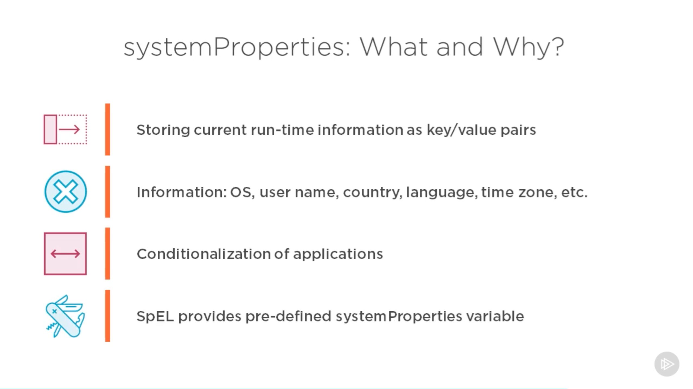

### Demo: Populating Bean Properties at Run Time Using systemProperties

- 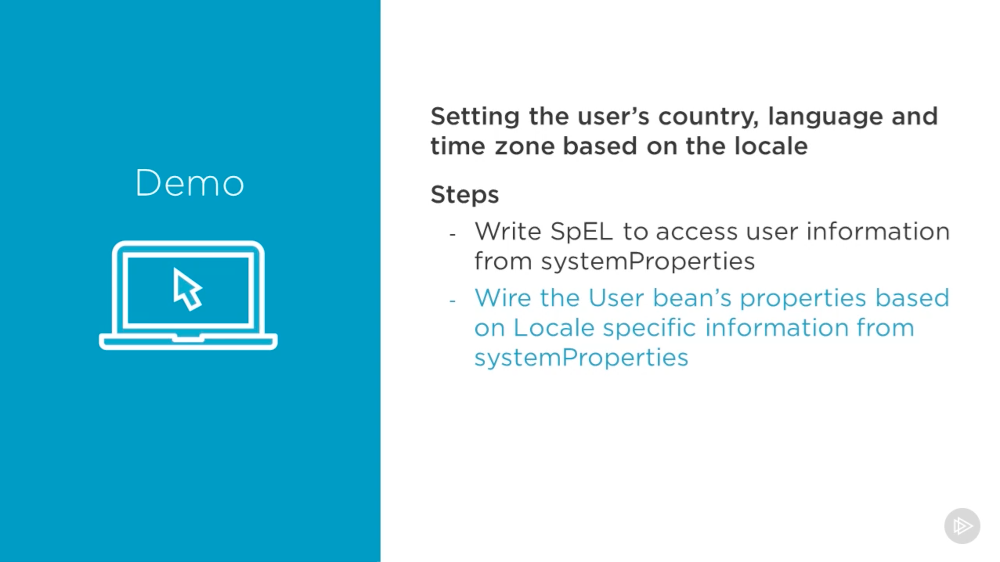
- 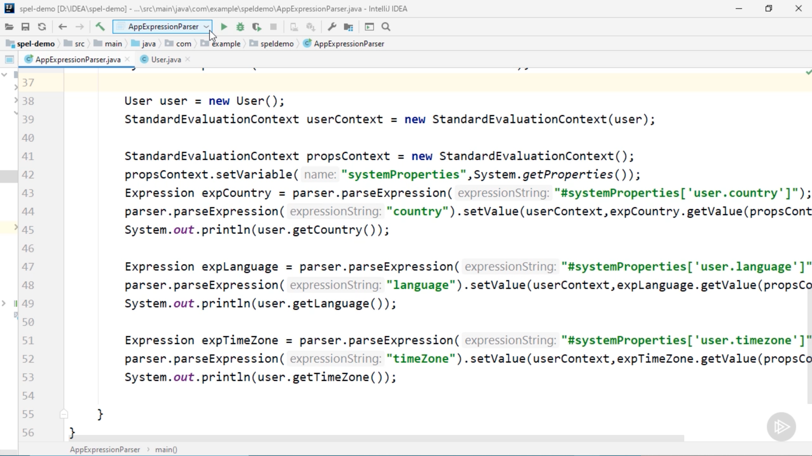
- 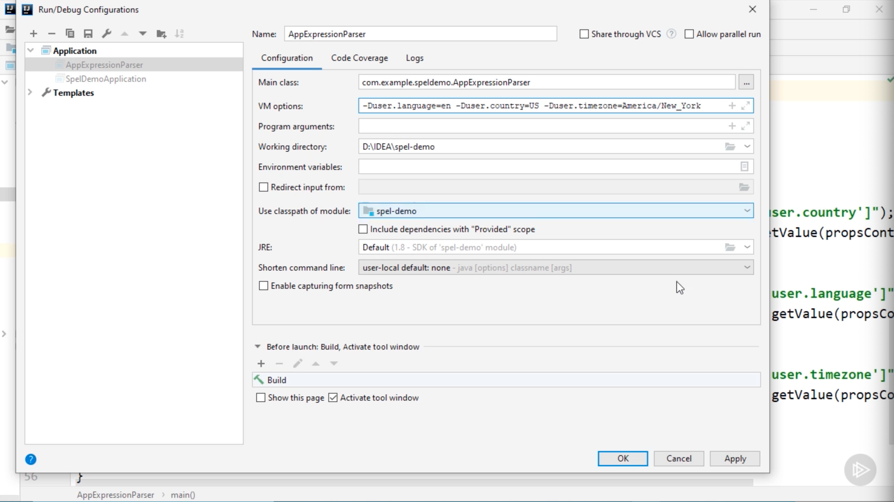

### Summary

## Leveraging the Power of SpEL: Advanced SpEL Expressions

### Module Overview

### The @Value Annotation

### Demo: Using SpEL with @Value Annotation

### Collection Manipulation with SpEL

### Demo: Collection Manipulation with SpEL in Action

### Expression Templates

### Demo: Expression Templates in Action

### Demo: Using SpEL with XML

### Typical Usages of SpEL

### Summary
