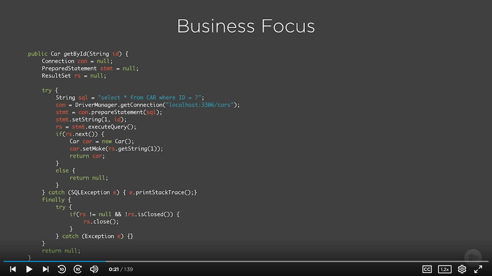
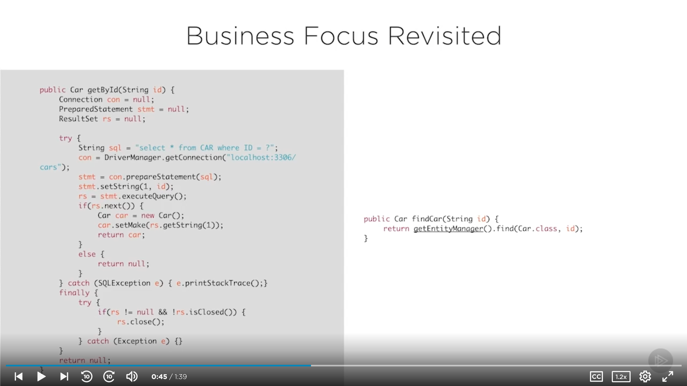
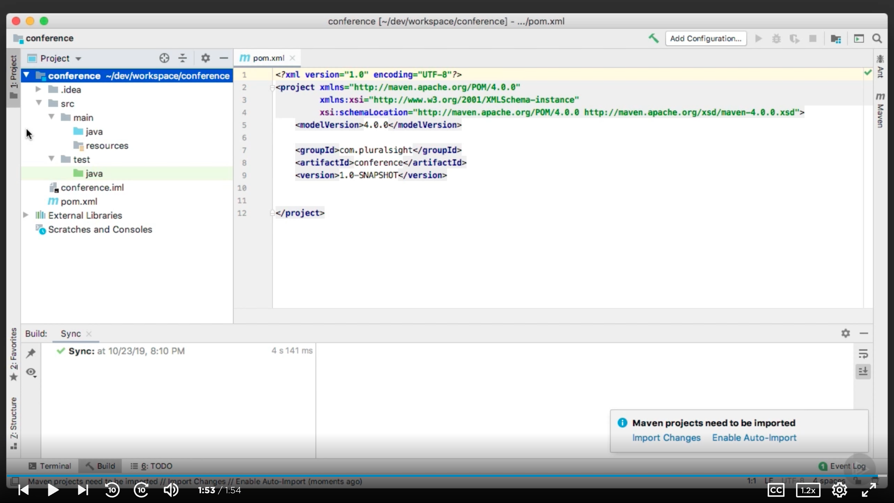
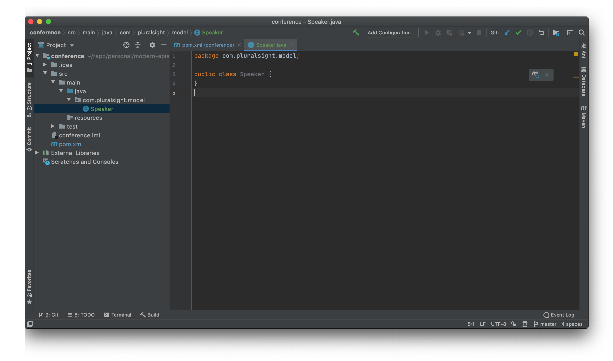
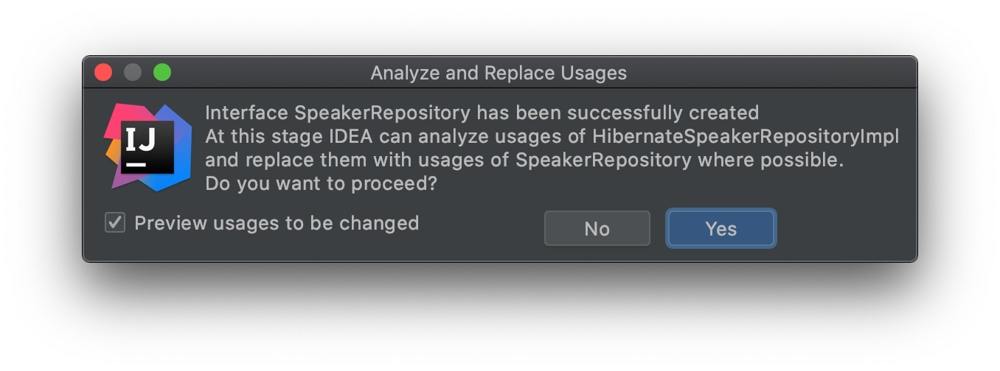
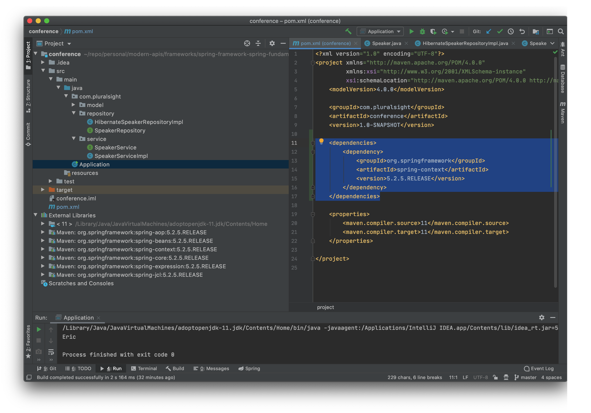
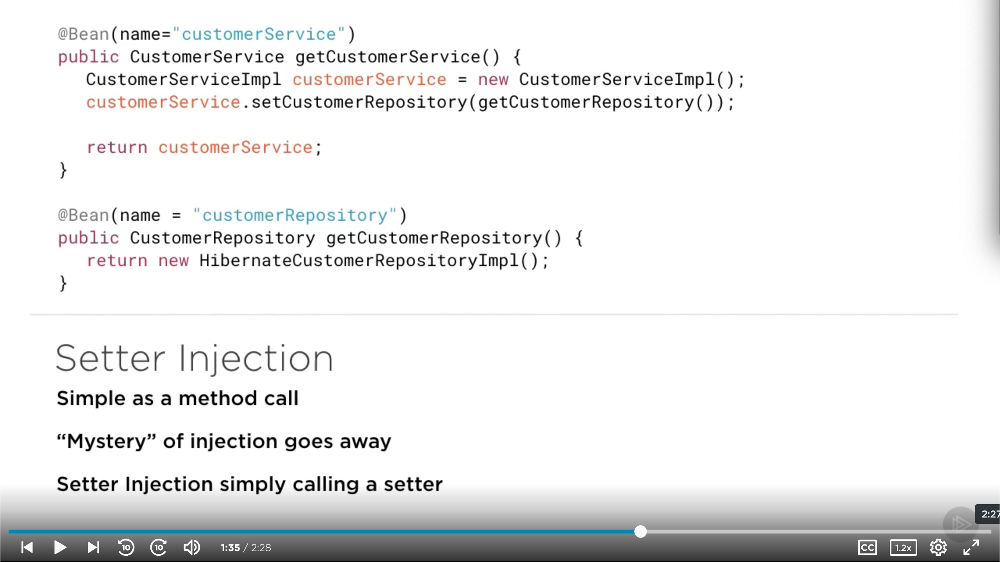
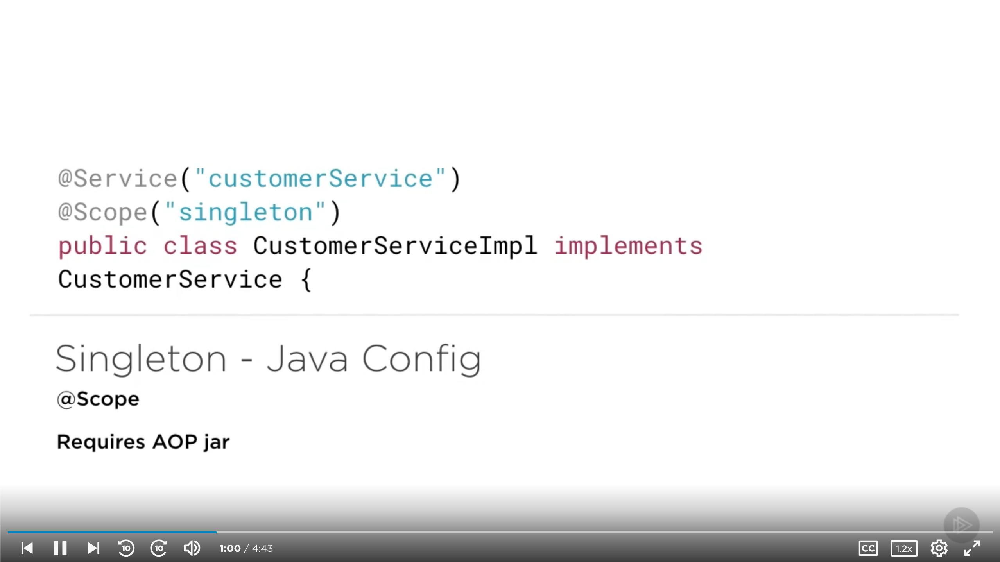

# [Spring Framework: Spring Fundamentals](https://app.pluralsight.com/library/courses/spring-framework-spring-fundamentals/table-of-contents) (Bryan Hansen, 2019-11-07)

## Course Overview

### [Course Overview](https://app.pluralsight.com/player?course=spring-framework-spring-fundamentals&author=bryan-hansen&name=1439a9c1-60c5-4956-a328-a28f8ede770a&clip=0&mode=live)

## What Is Spring?

### [Introduction](https://app.pluralsight.com/course-player?clipId=5791f49e-b50a-4bf7-8c12-b8f629f3db35)

### [What Is Spring?](https://app.pluralsight.com/course-player?clipId=dada1f08-0d6e-4b14-8b33-32ae34d8b659)

- Inversion of control container
- Dependency injection
- Java without Enterprise JavaBeans (EJBs).

### [Update](https://app.pluralsight.com/course-player?clipId=eb820f09-4649-4438-ac7e-503ffaa65145)

- Reduce complexity of JEE
  - Can be used with or without EJBs.
  - Enabled Java development without an application server.
  - Tomcat _isn't_ an application server, but a web server.
- Completely POJO-based
  - Any code written in Spring can be written without using Spring.
- Unobtrusive.
  - If Spring gets in the way, you're using it wrong.
- AOP/Proxies
  - Consolidate cross-cutting concerns.
- Best practices
  - Singletons, factories, abstract factories, template method, etc. are built-in.

### [The Problem](https://app.pluralsight.com/course-player?clipId=f5fbe426-a5f0-4807-acfa-000afc154c49)

- What problem is Spring trying to solve?
  - Increases testability
  - Increases maintainability
  - Helps with scalability
  - Adds decoupling (enabling caching layers, etc.)
  - Reduces code complexity
  - Puts the focus on the business, helping us get complex code done faster in a more testable, maintainable way.

### [Business Focus](https://app.pluralsight.com/course-player?clipId=644287f1-37c1-443f-8c60-34cccf6f1735)

- JDBC for a simple SELECT:
  - 
  - Rather than handling assignments, closing resources, etc., Spring can help us by injecting these into our code.

### [The Solution](https://app.pluralsight.com/course-player?clipId=30610e74-2f2e-4606-ae48-c501f8339223)

- What we're hoping to get from Spring:
  - We can remove configuration/lookup code.
  - Developers can focus on business needs.
  - Our code can focus on testing (much less hard-coding).
  - Helps us do annotation/XML0-based development.
  - Spring encourages development through interfaces.

### [Business Focus Revisited](https://app.pluralsight.com/course-player?clipId=755c7758-02da-4ba5-bd17-b319a7b66677)

- Database query with Spring (using Spring JDBC template code):
  - 
  - Spring is using a template method pattern

### [How It Works](https://app.pluralsight.com/course-player?clipId=3775f3b5-afd8-421b-9904-b908d15dc511)

- Everything is POJOs.
- Spring is basically a glorified HashMap: application context.
- Spring can also be used as a registry.

### [Demo: What We Are Building](https://app.pluralsight.com/course-player?clipId=3ac86b96-9191-439b-9038-bcae2c2c2874)

- Conference Registration App, focusing on the model and writing

### [Summary](https://app.pluralsight.com/course-player?clipId=b5389b55-5baa-40e4-9e89-41a1992a4600)

## Architecture and Project Setup

### [Sample App Intro](https://app.pluralsight.com/course-player?clipId=522ffd33-bcbe-4c8e-82f6-ba0f35722c1b)

### [Architecture](https://app.pluralsight.com/course-player?clipId=a71de5f3-b60c-462d-bef2-a554428f194f)

- Spring was developed to make existing tasks easier.
  - Before Spring, we used design patterns from JEE Blueprints.
    - They helped, but made things brittle.
    - Couldn't WORA: Write Once Run Anywhere.
    - And we ended up hard-coding a lot.

### [Prerequisites](https://app.pluralsight.com/course-player?clipId=18120043-179d-4e21-9b23-864e16190df4)

- Java

  - Using 11 in this course

  ```sh
  # https://mkyong.com/java/how-to-install-java-on-mac-osx/
  # https://github.com/AdoptOpenJDK/homebrew-openjdk
  brew tap adoptopenjdk/openjdk
  brew cask install adoptopenjdk11
  brew cask install adoptopenjdk14
  ## Add jdk function. To change Java versions, run `jdk 11`.
  cat <<\EOT >>~/.profile
  jdk() {
          version=$1
          export JAVA_HOME=$(/usr/libexec/java_home -v"$version");
          java -version
  }
  EOT
  source ~/.profile
  jdk 11
  java --version
  ```

- Maven

  ```sh
  # https://www.code2bits.com/how-to-install-maven-on-macos-using-homebrew/
  brew install maven
  mvn --version
  ```

  - Got output:

    ```txt
    For the system Java wrappers to find this JDK, symlink it with
      sudo ln -sfn /usr/local/opt/openjdk/libexec/openjdk.jdk /Library/Java/JavaVirtualMachines/openjdk.jdk

    openjdk is keg-only, which means it was not symlinked into /usr/local,
    because it shadows the macOS `java` wrapper.

    If you need to have openjdk first in your PATH run:
      echo 'export PATH="/usr/local/opt/openjdk/bin:$PATH"' >> ~/.zshrc

    For compilers to find openjdk you may need to set:
      export CPPFLAGS="-I/usr/local/opt/openjdk/include"
    ```

- IntelliJ

  ```sh
  brew cask install intellij-idea
  ```

- Tomcat

  - For sample app at the end.

  ```sh
  # https://medium.com/@fahimhossain_16989/installing-apache-tomcat-on-macos-mojave-using-homebrew-28ce039b4b2e
  brew install tomcat
  # brew services start tomcat
  # brew services stop tomcat
  ```

### [Sample App Setup](https://app.pluralsight.com/course-player?clipId=2bb860ad-969e-4e9b-a9be-e74eba0552ce)

- Open IntelliJ > Create New Project
  - Select Project SDK for Java 11
  - Select Maven on the left
  - Groupid: `com.pluralsight`
  - ArtifactID: `conference`
  - Project location: Choose a location (e.g., `~/dev/workspace/conference`)
- Base project:
  - 

### [Demo: Sample App pom.xml](https://app.pluralsight.com/course-player?clipId=1cb422dd-30cf-4fe3-80ae-d3f2bc41102a)

- We need to fix 1 thing in `pom.xml`: We need to add a specific build version for our app.

  - Before

    ```xml
    <?xml version="1.0" encoding="UTF-8"?>
    <project xmlns="http://maven.apache.org/POM/4.0.0"
            xmlns:xsi="http://www.w3.org/2001/XMLSchema-instance"
            xsi:schemaLocation="http://maven.apache.org/POM/4.0.0 http://maven.apache.org/xsd/maven-4.0.0.xsd">
        <modelVersion>4.0.0</modelVersion>

        <groupId>com.pluralsight</groupId>
        <artifactId>conference</artifactId>
        <version>1.0-SNAPSHOT</version>
    ```


    </project>
    ```

- After

  ```xml
  <?xml version="1.0" encoding="UTF-8"?>
  <project xmlns="http://maven.apache.org/POM/4.0.0"
          xmlns:xsi="http://www.w3.org/2001/XMLSchema-instance"
          xsi:schemaLocation="http://maven.apache.org/POM/4.0.0 http://maven.apache.org/xsd/maven-4.0.0.xsd">
      <modelVersion>4.0.0</modelVersion>

      <groupId>com.pluralsight</groupId>
      <artifactId>conference</artifactId>
      <version>1.0-SNAPSHOT</version>

      <build>
          <plugins>
              <plugin>
                  <groupId>org.apache.maven.plugins</groupId>
                  <artifactId>maven-compiler-plugin</artifactId>
                  <version>3.8.1</version>
                  <configuration>
                      <source>11</source>
                      <target>11</target>
                  </configuration>
              </plugin>
          </plugins>
      </build>

  </project>
  ```

  - Without doing this, we'll get a warning about Maven not supporting Java 5.

### [Demo: Sample App Add Model](https://app.pluralsight.com/course-player?clipId=a93ef48e-f755-4d7e-8885-e57743c550bf)

- Note: Looks like this sectionw as added to `pom.xml` before `<build></build>`:

  ```xml
      <dependencies>
          <dependency>
              <groupId>org.springframework</groupId>
              <artifactId>spring-context</artifactId>
              <version>5.2.0.RELEASE</version>
          </dependency>
      </dependencies>
  ```

- Navigate to `src/main/java`

  - Right click > New > Java Class
    - Note that by fully qualifying the name of the package structure we want, we can create a package here.
    - `com.pluralsight.model.Speaker`
      - 
  - Creates:

    ```java
    package com.pluralsight.model;

    public class Speaker {
    }
    ```

- In `Speaker`:

  ```java
  package com.pluralsight.model;

  public class Speaker {

    private String firstName;
    private String lastName;

    // Right click > generate > getter and setter for both
    public String getFirstName() {
      return firstName;
    }

    public void setFirstName(String firstName) {
      this.firstName = firstName;
    }

    public String getLastName() {
      return lastName;
    }

    public void setLastName(String lastName) {
      this.lastName = lastName;
    }
  }

  ```

### [Demo: Sample App Add Repository](https://app.pluralsight.com/course-player?clipId=99f141a3-7623-4367-8558-f039a791d1bd)

- Add a new Java class in `src/main/java`: `com.pluralsight.repository.HibernateSpeakerRepositoryImpl`

  - For now, we _do_ have 'implementation' in the name. That's a bit of a code smell. When this is all done, we'll be coding to an interface (and then we can swap out the interfaces dynamically).

  ```java
  package com.pluralsight.repository;

  import com.pluralsight.model.Speaker;

  import java.util.ArrayList;
  import java.util.List;

  public class HibernateSpeakerRepositoryImpl {

      public List<Speaker> findAll() {
          List<Speaker> speakers = new ArrayList<Speaker>();

          Speaker speaker = new Speaker();

          speaker.setFirstName("Eric");
          speaker.setLastName("Helander");

          speakers.add(speaker);

          return speakers;
      }

  }
  ```

  - A couple ways we could extract/create an interface. Easiest:
    - Right click > Refactor > Extract Interface
      - Interface name: `SpeakerRepository`
      - Leave package and target as-is
      - Select `findAll()` in order to form interface.
      - Select `Yes`.
        - 

- Resulting SpeakerRepository interface:

  ```java
  package com.pluralsight.repository;

  import com.pluralsight.model.Speaker;

  import java.util.List;

  public interface SpeakerRepository {
      List<Speaker> findAll();
  }
  ```

- Resulting `HibernateSpeakerRepositoryImpl`:

  ```java
  package com.pluralsight.repository;

  import com.pluralsight.model.Speaker;

  import java.util.ArrayList;
  import java.util.List;

  public class HibernateSpeakerRepositoryImpl implements SpeakerRepository {

      public List<Speaker> findAll() {
          List<Speaker> speakers = new ArrayList<Speaker>();

          Speaker speaker = new Speaker();

          speaker.setFirstName("Eric");
          speaker.setLastName("Helander");

          speakers.add(speaker);

          return speakers;
      }

  }
  ```

### [Demo: Sample App Service](https://app.pluralsight.com/course-player?clipId=a8d7a2fe-3c54-4a19-aa18-9ffe44c03845)

- Now we'll add a services (business logic) tier.
- Add a new Java class in `src/main/java`: `com.pluralsight.service.SpeakerServiceImpl`

  ```java
  package com.pluralsight.service;

  import com.pluralsight.model.Speaker;
  import com.pluralsight.repository.HibernateSpeakerRepositoryImpl;
  import com.pluralsight.repository.SpeakerRepository;

  import java.util.List;

  public class SpeakerServiceImpl {

      // Part of the problem we'll solve with Spring: We need to hardcode this for now.
      private SpeakerRepository repository = new HibernateSpeakerRepositoryImpl();

      public List<Speaker> findAll() {
          return repository.findAll();
      }
  }
  ```

- Extract a `SpeakerService` interface with `findAll()`.

  ```java
  package com.pluralsight.service;

  import com.pluralsight.model.Speaker;

  import java.util.List;

  public interface SpeakerService {
      List<Speaker> findAll();
  }
  ```

  ```java
  package com.pluralsight.service;

  import com.pluralsight.model.Speaker;
  import com.pluralsight.repository.HibernateSpeakerRepositoryImpl;
  import com.pluralsight.repository.SpeakerRepository;

  import java.util.List;

  public class SpeakerServiceImpl implements SpeakerService {

      private SpeakerRepository repository = new HibernateSpeakerRepositoryImpl();

      public List<Speaker> findAll() {
          return repository.findAll();
      }

  }
  ```

### [Demo: Sample App Run Application](https://app.pluralsight.com/course-player?clipId=43f5d03f-50de-4cbb-aed7-79bd990404fd)

- Add `src/main/java` Java class: `Application` (default package)

  ```java
  import com.pluralsight.service.SpeakerService;
  import com.pluralsight.service.SpeakerServiceImpl;

  public class Application {

      public static void main(String args[]) {
          SpeakerService service = new SpeakerServiceImpl();

          System.out.println(service.findAll().get(0).getFirstName());
      }
  }
  ```

- Right click on `main` > `Run Application.main()`
  - Note: [IntelliJ - Error:java: release version 5 not supported](https://dev.to/techgirl1908/intellij-error-java-release-version-5-not-supported-376)
  - Should see name output.

### [Configuration](https://app.pluralsight.com/course-player?clipId=00480c44-33e9-415a-8f55-f3fe19bc438e)

- Spring is all about removing configuration code from your application.
  - Configuration code makes things brittle (e.g., deploying to different environments).
  - Configuration codes makes tests difficult to write.
- We'll update our app to make use of:
  - Java configuration in Spring approach
  - Annotations in Spring
  - XML configuration method

### [Demo: Pain Points Walkthrough](https://app.pluralsight.com/course-player?clipId=73257dcf-954f-4a31-9e0b-aa9864a02a68)

- Pain points we're going to address:
  - `Application.java` has a hard-coded reference to `SpeakerServiceImpl`.
    - We could use a factory or abstract factory, but this is one of the things Spring handles for us.
  - `SpeakerServiceImpl` has a hard-coded reference to `HibernateSpeakerRepositoryImpl`.
  - `HibernateSpeakerRepositoryImpl` has stubbed-out code until our database is ready to go.
    - We should just be able to use a stub, and use Spring to load in the stubbed out class (and the swap it for the database when it's ready).

### [Spring Download](https://app.pluralsight.com/course-player?clipId=c244e469-2eda-471e-bcab-5de5cf22d298)

- Spring quite offering a direct download for the compiled jars.
- So Spring wants you to download their tools using Maven or Gradle to manage dependencies.

### [Demo: Spring Download Maven](https://app.pluralsight.com/course-player?clipId=e803f658-1cda-444b-a4cf-757f2d2aa989)

- In `pom.xml`, above `<build></build>` (referring to latest version from spring.io):

  ```xml
  <dependencies>
    <dependency>
      <groupId>org.springframework</groupId>
      <artifactId>spring-context</artifactId>
      <version>5.2.5.RELEASE</version>
    </dependency>
  </dependencies>
  ```

- Refresh Maven. If the import worked correctly, the Spring transitive dependencies should be visible.
  - 

### [Summary](https://app.pluralsight.com/course-player?clipId=610401a7-d1b6-4b96-9268-801b12d87ad9)

- Note that the XML configuration section of the course can help solidify the separation of concerns, etc.

## Spring Configuration Using Java

### [Java Configuration Introduction](https://app.pluralsight.com/course-player?clipId=07068cc4-42f8-4720-bb4e-56faa5734a02)

- We'll take the sample application from the previous module and wire it up using Java annotations and the Java configuration loader.
  - Java Configuration is the latest and preferred method for configuring Spring (vs. XML).
- Key point of Java configuration:
  - There's no `applicationContext.xml`
    - We still have a context; just not in XML.
    - Spring got push-back about people being XML developers instead of Java developers.
    - Though namespaces helped some.
  - Everything in Spring can be configured with Java.

### [Demo: Copy Project](https://app.pluralsight.com/course-player?clipId=320ceb74-ec74-4c09-b0c8-6588e96c9196)

- With IntelliJ, copying a project is easiest at the file system level (Finder, etc.).

  ```sh
  cp -r conference conference-java
  ```

- Then in IntelliJ, File > Open > `conference-java`
- Need to rename `conference.iml`
  - Right click > `Refactor` > `Rename` > `conference-java.iml`
- Change `artifactId` in `pom.xml` > `<artifactId>conference-java</artifactId>`
- Run `src/main/java/Application`
  - In the `Edit configuration` dialog:
    - `Use classpath of module`: `conference-java`
    - `JRE`: Likely best to choose a specific version (rather than default). E.g., 11.

### [Demo: App Config](https://app.pluralsight.com/course-player?clipId=5d8471d5-4d19-43b0-9680-2266392d40e7)

- To begin configuring out application, we want to create a file where we can bootstrap everything now.
- New Java class `src/main/java`: `AppConfig`

  - This is all we need to start bootstrapping our application - just a POJO.
    - Equivalent to the start of the application context in previous versions of Spring.

  ```java
  public class AppConfig {
  }
  ```

### [Demo: @Configuration](https://app.pluralsight.com/course-player?clipId=b785c658-e524-481d-bf8e-0074ef7baaa9)

- To start the configuration of our application, we begin with `@Configuration`.
  - It's a class-level annotation.
  - `@Configuration` replaces `applicationContext.xml`
  - Methods used in conjunction with the `@Bean` annotation are used to get instances of Spring Beans.
    - `@Bean` is a method-level annotation.
  - Spring doesn't care about class and method names. Spring just cares that something is annotated as a `@Bean` in an `@Configuration` class.
- In `AppConfig.java`:

  ```java
  import com.pluralsight.service.SpeakerService;
  import com.pluralsight.service.SpeakerServiceImpl;
  import org.springframework.context.annotation.Bean;
  import org.springframework.context.annotation.Configuration;

  // Signifies this file is to be used for configuration purposes.
  @Configuration
  public class AppConfig {

      // Create a bean. The name is optional; camelCase by convention.
      @Bean(name = "speakerService")
      public SpeakerService getSpeakerService() {
          return new SpeakerServiceImpl();

      }
  }
  ```

### [Setter Injection](https://app.pluralsight.com/course-player?clipId=58a23dfd-b35e-4e5f-b069-1382f967adb2)

- As simple as a method call - abstracts away the mystery of injection.
- Setter injection is simply a matter of calling a setter on a Bean. We call and get an instance of a _Bean_ from the Spring configuration.
  - 
  - Spring is still doing a lot of magic behind the scenes. Beans are singletons, and the method will only be executed the first time it's called.
    - This is key. Otherwise, it would create a new Bean every time we called it.

### [Demo: Setter Injection](https://app.pluralsight.com/course-player?clipId=4fb96d2d-dc84-416d-91d1-020d37f55c72)

- To add setter injection, we need to change a few things we have hard-coded.
- `SpeakerServiceImpl.java`:

  - Remove hard-coded instance of `= new HibernateSpeakerRepositoryImpl()`.
  - Add a setter where we can wire-up this configuration.
    - Right click > Generate > setter > `SpeakerRepository`.
      - Now we've configured the SpeakerRepository to be injected, rather than it being a hard-coded instance.

  ```java
  package com.pluralsight.service;

  import com.pluralsight.model.Speaker;
  import com.pluralsight.repository.HibernateSpeakerRepositoryImpl;
  import com.pluralsight.repository.SpeakerRepository;

  import java.util.List;

  public class SpeakerServiceImpl implements SpeakerService {

      private SpeakerRepository repository;

      public List<Speaker> findAll() {
          return repository.findAll();
      }

      public void setRepository(SpeakerRepository repository) {
          this.repository = repository;
      }
  }
  ```

- `AppConfig.java`

  - Create a new Bean for our SpeakerRepository
    - The names of our Beans get to be important in autowiring.

  ```java
  import com.pluralsight.repository.HibernateSpeakerRepositoryImpl;
  import com.pluralsight.repository.SpeakerRepository;
  import com.pluralsight.service.SpeakerService;
  import com.pluralsight.service.SpeakerServiceImpl;
  import org.springframework.context.annotation.Bean;
  import org.springframework.context.annotation.Configuration;

  @Configuration
  public class AppConfig {

      @Bean(name = "speakerService")
      public SpeakerService getSpeakerService() {
          SpeakerServiceImpl service = new SpeakerServiceImpl();
          service.setRepository(getSpeakerRepository());
          return service;
      }

      @Bean(name = "speakerRepository")
      public SpeakerRepository getSpeakerRepository() {
          return new HibernateSpeakerRepositoryImpl();
      }
  }
  ```

  - Our repository is injected through setter injection.
    - Why didn't we just create a new instance of `new HibernateSpeakerRepositoryImpl();` within `getSpeakerService()`?
      - Because SpeakerRepository is now created as a Bean: a singleton.

- Right now, though, our `Application` isn't set up for using Spring.

  ```java
  import com.pluralsight.service.SpeakerService;
  import com.pluralsight.service.SpeakerServiceImpl;
  import org.springframework.context.ApplicationContext;
  import org.springframework.context.annotation.AnnotationConfigApplicationContext;

  public class Application {

      public static void main(String args[]) {
          // Load Spring and our config.
          ApplicationContext appContext = new AnnotationConfigApplicationContext(AppConfig.class)

          // SpeakerService service = new SpeakerServiceImpl();
          SpeakerService service = appContext.getBean("speakerService", SpeakerService.class);

          System.out.println(service.findAll().get(0).getFirstName());
      }
  }
  ```

- So this will create a register with the two Beans we defined in AppConfig.
- Now nothing in our application is hard-coded; instead, it's managed by our configuration.

### [Constructor Injection](https://app.pluralsight.com/course-player?clipId=9ac67f3d-678b-4e6b-96ed-4849b95f19c8)

- Constructor injection is just like setter injection; instead of calling the setter, we call the defined constructor.
- Add a `SpeakerServiceImpl` constructor in `SpeakerServiceImpl.java`:

  ```java
  package com.pluralsight.service;

  import com.pluralsight.model.Speaker;
  import com.pluralsight.repository.HibernateSpeakerRepositoryImpl;
  import com.pluralsight.repository.SpeakerRepository;

  import java.util.List;

  public class SpeakerServiceImpl implements SpeakerService {

      private SpeakerRepository repository;

      public SpeakerServiceImpl (SpeakerRepository speakerRepository) {
          repository = speakerRepository;
      }

      public List<Speaker> findAll() {
          return repository.findAll();
      }

      public void setRepository(SpeakerRepository repository) {
          this.repository = repository;
      }
  }
  ```

- In `AppConfig.java`, inject the constructor:

  ```java
  import com.pluralsight.repository.HibernateSpeakerRepositoryImpl;
  import com.pluralsight.repository.SpeakerRepository;
  import com.pluralsight.service.SpeakerService;
  import com.pluralsight.service.SpeakerServiceImpl;
  import org.springframework.context.annotation.Bean;
  import org.springframework.context.annotation.Configuration;

  @Configuration
  public class AppConfig {

      @Bean(name = "speakerService")
      public SpeakerService getSpeakerService() {
  //         SpeakerServiceImpl service = new SpeakerServiceImpl();
  //         service.setRepository(getSpeakerRepository());
          SpeakerServiceImpl service = new SpeakerServiceImpl(getSpeakerRepository());
          return service;
      }

      @Bean(name = "speakerRepository")
      public SpeakerRepository getSpeakerRepository() {
          return new HibernateSpeakerRepositoryImpl();
      }
  }
  ```

- Common mistake:
  - Creating variables, trying to hold on to variables here, trying to create your own singleton, etc. But that's what Spring does for us.

### [Summary](https://app.pluralsight.com/course-player?clipId=415f0112-a3f1-4b46-b0e1-d5e91af096d0)

## Spring Scopes and Autowiring

### [Bean Scopes Introduction](https://app.pluralsight.com/player?course=spring-framework-spring-fundamentals&author=bryan-hansen&name=0fd7eb0d-ee98-4993-9381-496f6abe4450&clip=0&mode=live)

- Bean scopes (scopes of Beans) are quite important.
  - Scopes are _not the same as_ patterns, though Spring uses patterns.
    - Pluralsight: Design Patters in Java

### [Scopes](https://app.pluralsight.com/course-player?clipId=215c1346-decb-4a50-9352-f64fffdbad23)

- 5 scopes are available for us to configure in Spring
  - Valid in any configuration
    - Singleton
      - Default
      - This is usually what we want.
    - Prototype
      - New Bean per request.
      - We don't usually want this.
  - Valid only in web-aware Spring projects
    - Request
    - Session
    - Global

### [Singleton Java Config](https://app.pluralsight.com/course-player?clipId=cb4c4bfc-60e0-42e8-8605-8ac41622a4a8)

- Default bean scope inside of Spring
- One instance per Spring container or Spring context
  - Could _possibly_ have more than 1 Spring container in a JVM.
- When using Maven, scope is set with `@Scope`
  - 
- `AppConfig.java`:
  - Add `@Scope(value="singleton")` below `@Bean(name = "speakerService")`
  - Though using an enum is preferable
    - `@Scope(value=BeanDefinition.SCOPE_SINGLETON)`
- To test it: in `Application.java`:

  ```java
  import com.pluralsight.service.SpeakerService;
  import org.springframework.context.ApplicationContext;
  import org.springframework.context.annotation.AnnotationConfigApplicationContext;

  public class Application {

      public static void main(String args[]) {
          ApplicationContext appContext = new AnnotationConfigApplicationContext(AppConfig.class);
          SpeakerService service = appContext.getBean("speakerService", SpeakerService.class);
          System.out.println(service);
          System.out.println(service.findAll().get(0).getFirstName());
          SpeakerService service2 = appContext.getBean("speakerService", SpeakerService.class);
          // Prints out exact same object address
          System.out.println(service2);
      }
  }
  ```

### [Prototype Java Config](https://app.pluralsight.com/course-player?clipId=4f21a7ef-6866-4d33-a022-20cea9cc3ead)

- Prototype design pattern: Guaranteed unique instance per request.
  - The opposite of a singleton.
  - `@Scope(value="prototype")` (or `@Scope(value= BeanDefinition.SCOPE_PROTOTYPE)`).
  - Now we get a different object address.
    - A new unique request of the bean from the context.

### [Web Scopes](https://app.pluralsight.com/course-player?clipId=e14ab924-ba3b-4010-b5f1-24fed8f95fed)

- Covered more in Pluralsight: Introduction to Spring MVC course
- 3 web scopes
  - Request
    - Returns a bean per HTTP request.
      - Similar to prototype.
    - For the lifecycle of the HTTP request.
  - Session
    - Returns a single bean per HTTP session
    - Lives as long as the session lives.
  - GlobalSession
    - Returns a single bean per application.
    - Similar to a singleton, but for the life of the application on the server.

### [Autowired](https://app.pluralsight.com/course-player?clipId=e3e71c50-7283-4788-a62f-392a5ef9dfb4)

- Autowiring is where the most magic seems to be taking place.
- A prime example of _Convention over configuration_
- We just need to add a `@ComponentScan({"com.pluralsight"})` annotation to our config file.
  - `com.pluralsight`: Where to begin looking for autowired annotations.
  - Can mark autowired beans by name or instance type.

### [Demo: Autowired](https://app.pluralsight.com/course-player?clipId=aa960afc-3bf1-4ed8-bcab-d7f9ab52500f)

- To set up our application for autowiring:

  - `AppConfig.java`

    - Right now, still using constructor injection.
    - Comment it out, and switch back to the default no args constructor.

    ```java
    import com.pluralsight.repository.HibernateSpeakerRepositoryImpl;
    import com.pluralsight.repository.SpeakerRepository;
    import com.pluralsight.service.SpeakerService;
    import com.pluralsight.service.SpeakerServiceImpl;
    import org.springframework.beans.factory.config.BeanDefinition;
    import org.springframework.context.annotation.Bean;
    import org.springframework.context.annotation.Configuration;
    import org.springframework.context.annotation.Scope;

    @Configuration
    public class AppConfig {

        @Bean(name = "speakerService")
        @Scope(value= BeanDefinition.SCOPE_SINGLETON)
        public SpeakerService getSpeakerService() {
    //        SpeakerServiceImpl service = new SpeakerServiceImpl(getSpeakerRepository());
            SpeakerServiceImpl service = new SpeakerServiceImpl();
            return service;
        }

        @Bean(name = "speakerRepository")
        public SpeakerRepository getSpeakerRepository() {
            return new HibernateSpeakerRepositoryImpl();
        }
    }
    ```

  - `SpeakerServiceImpl.java`

    - Add back default no-args constructor (removed in a previous demo) and a few printlns.
    - Add `@Autowired` above `setRepository()`.
      - We're not wiring in the repository anywhere.
      - The SpeakerRepository bean is automatically injected into `setRepository()`.

    ```java
    package com.pluralsight.service;

    import com.pluralsight.model.Speaker;
    import com.pluralsight.repository.HibernateSpeakerRepositoryImpl;
    import com.pluralsight.repository.SpeakerRepository;

    import java.util.List;

    public class SpeakerServiceImpl implements SpeakerService {

        private SpeakerRepository repository;

        public SpeakerServiceImpl() {
            System.out.println("SpeakerServiceImpl no args constructor");
        }

        public SpeakerServiceImpl (SpeakerRepository speakerRepository) {
            System.out.println("SpeakerServiceImpl repository constructor");
            repository = speakerRepository;
        }

        public List<Speaker> findAll() {
            return repository.findAll();
        }

        @Autowired
        public void setRepository(SpeakerRepository repository) {
            System.out.println("SpeakerServiceImpl setter");
            this.repository = repository;
        }
    }
    ```

  - From running the application now:

    ```txt
    SpeakerServiceImpl no args constructor
    SpeakerServiceImpl setter
    Eric
    ```

  - What if we want to do constructor injection? We can do this with _fully autowiring our beans_, nor just per-method.

### [Stereotype Annotations](https://app.pluralsight.com/course-player?clipId=453f4f80-c51e-4ebc-bbdf-a54a54580ab3)

- Stereotypes
  - `@Component`
    - Same thing as `@Bean`
  - `@Repository`
    - Used to denote a class being used as a repository object.
    - Could technically just use `@Bean` or `@Component` everywhere.
  - `@Service`
    - Where you would put your business logic.
  - `@Controller`
    - Out of scope for what we're covering here. For web/microservices.
- Finish wiring up our application.

  - `AppConfig`.

    - Add `@ComponentScan`
      - Give it the string syntax for an array of the package structure we want to scan.
    - The `@Bean` annotation is only applicable at a method level, not a class level.

    ```java
    import com.pluralsight.repository.HibernateSpeakerRepositoryImpl;
    import com.pluralsight.repository.SpeakerRepository;
    import com.pluralsight.service.SpeakerService;
    import com.pluralsight.service.SpeakerServiceImpl;
    import org.springframework.beans.factory.config.BeanDefinition;
    import org.springframework.context.annotation.Bean;
    import org.springframework.context.annotation.ComponentScan;
    import org.springframework.context.annotation.Configuration;
    import org.springframework.context.annotation.Scope;

    @Configuration
    @ComponentScan({"com.pluralsight"})
    public class AppConfig {

        @Bean(name = "speakerService")
        @Scope(value= BeanDefinition.SCOPE_SINGLETON)
        public SpeakerService getSpeakerService() {
    //        SpeakerServiceImpl service = new SpeakerServiceImpl(getSpeakerRepository());
            SpeakerServiceImpl service = new SpeakerServiceImpl();
            return service;
        }

        @Bean(name = "speakerRepository")
        public SpeakerRepository getSpeakerRepository() {
            return new HibernateSpeakerRepositoryImpl();
        }
    }

    ```

  - `SpeakerServiceImpl.java`

    - Add `@Service("speakerService")

    ```java
    package com.pluralsight.service;

    import com.pluralsight.model.Speaker;
    import com.pluralsight.repository.HibernateSpeakerRepositoryImpl;
    import com.pluralsight.repository.SpeakerRepository;
    import org.springframework.beans.factory.annotation.Autowired;
    import org.springframework.stereotype.Service;

    import java.util.List;

    @Service("speakerService")
    public class SpeakerServiceImpl implements SpeakerService {

        private SpeakerRepository repository;

        public SpeakerServiceImpl() {
            System.out.println("SpeakerServiceImpl no args constructor");
        }

        public SpeakerServiceImpl (SpeakerRepository speakerRepository) {
            System.out.println("SpeakerServiceImpl repository constructor");
            repository = speakerRepository;
        }

        public List<Speaker> findAll() {
            return repository.findAll();
        }

        @Autowired
        public void setRepository(SpeakerRepository repository) {
            System.out.println("SpeakerServiceImpl setter");
            this.repository = repository;
        }
    }
    ```

  - `HibernateSpeakerRepositoryImpl.java` (implementation, not interface)

    - Add `@Repository("speakerRepository")

    ```java
    package com.pluralsight.repository;

    import com.pluralsight.model.Speaker;
    import org.springframework.stereotype.Repository;

    import java.util.ArrayList;
    import java.util.List;

    @Repository("speakerRepository")
    public class HibernateSpeakerRepositoryImpl implements SpeakerRepository {

        public List<Speaker> findAll() {
            List<Speaker> speakers = new ArrayList<Speaker>();

            Speaker speaker = new Speaker();

            speaker.setFirstName("Eric");
            speaker.setLastName("Helander");

            speakers.add(speaker);

            return speakers;
        }

    }
    ```

- So now we have an `@Repository`, `@Service`, and `@ComponentScan`
- And now we can comment out `getSpeakerService()` and `getSpeakerRepository()` from `AppConfig.java`:

  ```java
  import com.pluralsight.repository.HibernateSpeakerRepositoryImpl;
  import com.pluralsight.repository.SpeakerRepository;
  import com.pluralsight.service.SpeakerService;
  import com.pluralsight.service.SpeakerServiceImpl;
  import org.springframework.beans.factory.config.BeanDefinition;
  import org.springframework.context.annotation.Bean;
  import org.springframework.context.annotation.ComponentScan;
  import org.springframework.context.annotation.Configuration;
  import org.springframework.context.annotation.Scope;

  @Configuration
  @ComponentScan({"com.pluralsight"})
  public class AppConfig {
      /*
      @Bean(name = "speakerService")
      @Scope(value= BeanDefinition.SCOPE_SINGLETON)
      public SpeakerService getSpeakerService() {
  //        SpeakerServiceImpl service = new SpeakerServiceImpl(getSpeakerRepository());
          SpeakerServiceImpl service = new SpeakerServiceImpl();
          return service;
      }

      //    @Bean(name = "speakerRepository")
      public SpeakerRepository getSpeakerRepository() {
          return new HibernateSpeakerRepositoryImpl();
      }
      */
  }
  ```

- Run the app.

  - Calls no args constructor and SpeakerServiceImpl setter.
  - We can define scope at the class level.

  ```txt
  SpeakerServiceImpl no args constructor
  SpeakerServiceImpl setter
  Eric
  ```

- We can autowire constructor injection instead of setter injection:

  ```java
  package com.pluralsight.service;

  import com.pluralsight.model.Speaker;
  import com.pluralsight.repository.HibernateSpeakerRepositoryImpl;
  import com.pluralsight.repository.SpeakerRepository;
  import org.springframework.beans.factory.annotation.Autowired;
  import org.springframework.stereotype.Service;

  import java.util.List;

  @Service("speakerService")
  public class SpeakerServiceImpl implements SpeakerService {

      private SpeakerRepository repository;

      public SpeakerServiceImpl() {
          System.out.println("SpeakerServiceImpl no args constructor");
      }

      @Autowired
      public SpeakerServiceImpl (SpeakerRepository speakerRepository) {
          System.out.println("SpeakerServiceImpl repository constructor");
          repository = speakerRepository;
      }

      public List<Speaker> findAll() {
          return repository.findAll();
      }

      public void setRepository(SpeakerRepository repository) {
          System.out.println("SpeakerServiceImpl setter");
          this.repository = repository;
      }
  }
  ```

  ```txt
  SpeakerServiceImpl repository constructor
  Eric
  ```

### [Summary](https://app.pluralsight.com/course-player?clipId=012a08d3-245d-4844-ba57-477db400fc89)

## Spring Configuration Using XML

## Advanced Bean Configuration
