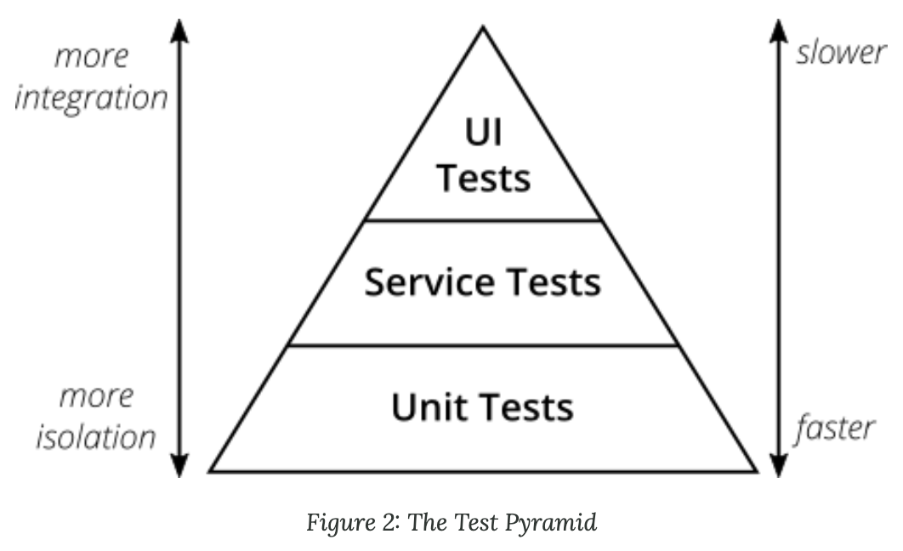

# [The Practical Test Pyramid](https://martinfowler.com/articles/practical-test-pyramid.html) (Ham Vocke, 2018-02-26)

- The Test Pyramid
  - From Mike Cohn in _Succeeding with Agile_
    - 
    - May be a bit simplistic/misleading.
  - 2 important take-aways:
    - Write tests with different granularity.
    - The more high-level you get, the fewer tests you should have.
  - Avoid the Test Ice Cream Cone: Nightmarish to maintain, prohibitively slow to run.
- Unit tests
  - Unit tests ensure the unit (subject under test) works as intended.
    - Definition of a _unit_ depends on the context.
  - Typically the greatest number of tests.
  - Types
    - Solitary unit tests
      - Stub all collaborators
    - Sociable unit tests
      - Allow interfacing with real collaborators
  - Test doubles
    - Replace objects used in production with an implementation specifically for testing.
    - [Types](https://martinfowler.com/bliki/TestDouble.html) (Martin Fowler, 2006-01-17)
      - Dummies
        - Objects that are passed around but not used (e.g., to fill parameter lists).
      - Fakes
        - Object that have working implementations (but take shortcuts not suitable for production).
      - Stubs
        - Provide canned responses to test calls.
      - Spies
        - Stubs that record information about how they were called.
      - Mocks
        - Pre-programmed with expectations, forming a specification of the calls they are expected to receive.
        - Throw an exception if unexpected calls are received.
    - Needing to test a private method is a code smell: The class is likely too complex.
  - What to test?
    - Rule of thumb: One test class per production class.
    - Test the public interface of the class.
    - Balance:
      - Test non-trivial code paths (happy paths & edge cases).
        - Don't test trivial code (i.e., getters/setters without conditional logic).
        - Going for 100% coverage isn't important.
      - Don't tie the tests too tightly to the implementation. Test observable behavior instead.
        - Minor refactoring shouldn't break the tests.
  - Test structure
    - A good structure:
      1. Set up the test data
      2. Call your method under test
      3. Assert that the expected results are returned.
    - Mnemonics:
      - Arrange, Act, Assert.
      - Given (setup), When (method call), Then (assertion)
- Integration tests
  - Integration tests test the integration of your application with the parts that live outside your application.
  - Even vaguer than "unit tests".
    - Entire application stack?
    - Testing one integration point at a time?
  - Write integration tests wherever you serialize or deserialize data:
    - Calls to services' REST APIs
    - Reading from/writing to databases
    - Calling other application's APIs
    - Reading from/writing to queues
    - Writing to filesystem
  - Narrow integration tests
    - Running external dependencies locally
    - However, this shelters us from knowing if the dependency changes in a breaking way.
      - Contract tests can help.
  - Broad integration tests
    - Integrating with a service over the network &rarr; slower, harder to write.
- Contract tests
  - Contract tests ensure the consumer and provider sides stick to the defined contract.
  - Types
    - Consumer-Driven Contract tests (CDC tests)
      - The consumers drive the implementation of a contract.
      - The consumers write tests; the provider fetches and runs these tests. Once all the tests pass, the provider knows all needs have been met.
        - Facilitates YAGNI.
        - Tests could be included in build pipeline.
      - One tool: [Pact](https://github.com/realestate-com-au/pact)
- UI Tests
  - "UI" tests often refer to testing a GUI (just one type of UI).
  - In Mike Cohn's terminology, UI tests and end-to-end tests are equivalent.
    - However, this is likely a conflation, since the UI can be tested in a non-end-to-end manner.
  - UI tests tend to test _behavior_ well, but are largely unable to determine if something 'looks good'.
    - Behavior: [Selenium](http://docs.seleniumhq.org/)
    - Design (screenshot comparison): [Galen](http://galenframework.com/)
- End-to-End Tests
  - End-to-end tests test a deployed application via its user interface.
  - E.g., [Selenium](http://docs.seleniumhq.org/) with [WebDriver](https://www.w3.org/TR/webdriver/)
  - End-to-end tests are notoriously flaky, producing many false positives (browser quirks, timing issues, animations, popup dialogs)
    - They run slowly are require significant maintenance.
  - Who's in charge of writing these tests, since they likely span multiple microservice teams?
    - Having a centralized QA team is an anti-pattern.
    - Perhaps a quality guild?
  - Only include a _bare minimum_ of end-to-end tests, focusing on the critical path(s) your users are likely to take.
  - Both Chromium and Firefox offer headless modes.
  - [REST-assured](https://github.com/rest-assured/rest-assured)
- Acceptance Tests
  - Sometimes referred to as functional tests.
  - Goal: Ensure software works correctly from a _user's_ perspective (rather than from a technical perspective).
- Exploratory Testing
  - Exploratory testing is manual testing that embraces the tester's freedom and creativity to discover quality issues in a running system.
- Putting tests in your deployment pipeline
  - Included tests in a deployment pipeline facilitates fast feedback.
    - Quicker, more numerous (unit) tests should be earlier in the pipeline; slower, broader tests should occur later.
- Avoid test duplication
  - Two rules of thumb
    1. If a high-level test finds an error, and there's no lower-level test failing, add a lower-level test.
    2. Push tests as far down the test pyramid as possible.
  - Delete tests that don't add value. Avoid test duplication, since these tests are expensive to maintain.
- Writing Clean Test Code
  1. Give test code the same level of care as production code.
  2. Test one condition per test.
  3. Follow a structure (arrange, act assert; given, when, then)
  4. Readability is important. Duplication is acceptable if it improves readability.
     - Balance DRY and DAMP (Descriptive And Meaningful Phrases)
  5. Follow the [Rule of Three](https://blog.codinghorror.com/rule-of-three/) for when to refactor.
     1. It's 3 times as difficult to build reusable components as single-use components.
     2. A reusable component should be tried out in 3 different applications before it's sufficiently general to be accepted into a reuse library.
