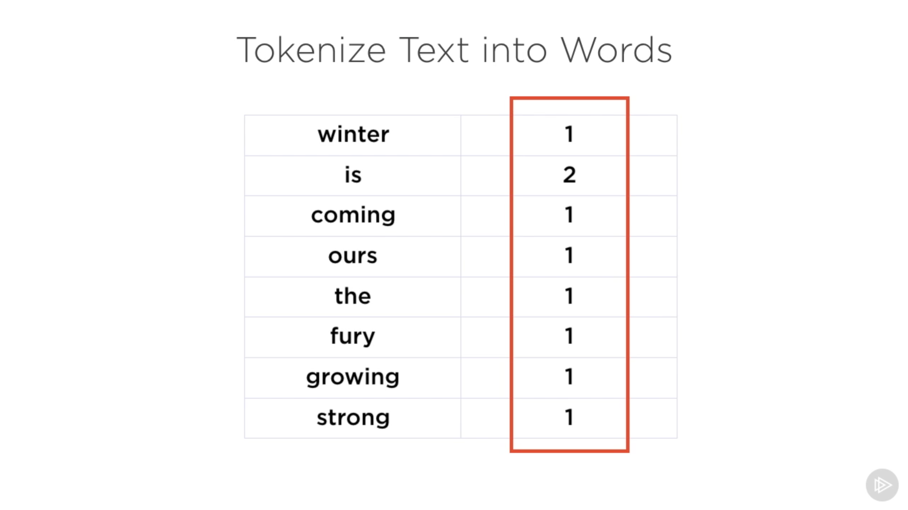

# [Searching and Analyzing Data with Elasticsearch: Getting Started](https://app.pluralsight.com/library/courses/elasticsearch-analyzing-data/description), Janani Ravi, 2017-06-16

## Course Overview

### [Course Overview](https://app.pluralsight.com/course-player?courseId=e017747e-2a89-4c3a-961d-8ff84a36b8b1)

## Introducing Elasticsearch

### [Pre-requisites and Course Overview](https://app.pluralsight.com/course-player?clipId=67213387-9d6e-47c9-bfab-fc68f6253499)

- Prerequisites
  - Familiarity with
    - command line
    - RESTful APIs
    - Distributed computing
  - Installation and setup
    - Latest version of Elasticsearch (5.4.0)
      - Requires Java 8

### [A Brief History of Search](https://app.pluralsight.com/course-player?clipId=eaf7cd59-877a-4119-8c03-7296c4d7a134)

- 1945
  - Vannevar Bush first talks of the need to index records
- 1970
  - Teh ARPANet network is created, laying the foundation of the modern Internet
- 1991
  - Tim Berners-Lee combines hypertext, TCP, and DNS to imagine WWW
- 1993
  - Primitive engines appear (linear search of URLs, very basic ranking)
- 1993
  - Excite improves search by using statistical analysis of word relationships
- 1994
  - Yahoo offers a directory of useful web pages (a portal)
- 1994
  - Lycos provides ranking relevance, prefix matching, and a search catalog
- 1994
  - Atlavista adds natural language queries and inbound link checking
- 1996
  - Inktomi pioneers the paid inclusion model
- 1997
  - ask.com adds natural language search and human editors for queries
- 1998
  - Google page rank appears
- Today
  - Google
  - Yahoo
  - Bing
  - Baidu
    - Popular in China
  - Naver
    - Popular in Korea

### [How Does Search Work?](https://app.pluralsight.com/course-player?clipId=deb378e0-3dc0-4f44-b467-5673dae154cf)

- Search objective
  - Find the most relevant documents based on search terms
- Behind the scenes:
  - Know of document's existence
  - Index the document for lookup
  - Must be able to determine document relevance
  - Retrieve documents ranked by relevance
- 4 main steps of a search algorithm
  - Web crawler
  - Inverted index
    - Mapping from a term to documents
    - Inverted: From term to document
  - Scoring
    - Relevance score
  - Search

### [The Inverted Index](https://app.pluralsight.com/course-player?clipId=42874118-5e10-4b53-82db-8097a45c8cb1)

- Simplistic example:
  - Documents:
    - House Stark
      - Winter is coming
    - House Baratheon
      - Ours is the fury
    - House Tyrell
      - Growing strong
  - Documents are crawled.
  - Documents are tokenized into words and normalized (lowercased with punctuation removed).
    - 
  - Word frequency is calculated, indicating the word occurrence throughout the corpus.
    - 
      - Sometimes called the dictionary
    - Along with the source documents
      - 
        - Sometimes called the posting list
  - Substring search:
    - n-grams
  - Words ending with:
    - Reverse words
  - Geographic
    - Geo-hashing
  - Phonetic matching
    - Metaphone
  - Meaning
    - Levenshtein automation
- In some form, the inverted index is at the heart of any search engine.

### [Lucene, an Open Source Search Library](https://app.pluralsight.com/course-player?clipId=2eb9f054-d306-44de-b2fe-2041fcb51367)

- Apache Lucene
  - High-performance searching library for full-text search engine.
  - Search engine only (no crawling, indexing, etc.)
  - Written in Java; ported to other languages
  - Nucleus of several technologies built around it
    - Solr
      - Search server
      - Good for enterprise search
    - Nutch
      - Web crawling and index parsing
    - CrateDB
      - Open source SQL distributed database
    - Elasticsearch
      - Distributed search and analytics engine that runs on Lucene
      - Written in Java

### [Introducing Elasticsearch](https://app.pluralsight.com/course-player?clipId=ae4497d1-0570-4088-af0e-626f6640cb81)

- Search & analytics engine
  - Query for documents
  - Run complex analysis and aggregations
- One of the most popular enterprise search engines
- Features
  - Distributed
    - Scales to thousands of nodes
    - Performance of search operations scales linearly with node count
  - High availability
    - Multiple copies of data are stored within the cluster
    - Every index is replicated
  - RESTful API
    - CRUD
    - Monitoring
    - Other operations
  - Powerful query DSL
    - Express complex queries simply
  - Schemaless
    - Indexed documents do not need to follow a schema
- Developed by Elastic
  - https://www.elastic.co/
    - Elasticsearch
    - Kibana
      - Visualization
    - Beats
      - Data shipper
      - Agent, sending data from machines
    - Logstash
      - Data processing pipeline
    - X-Pack
      - Monitoring
    - Cloud
      - Available as a service on AWS
- We'll use Curl.

### [Installing and Setting up Elasticsearch](https://app.pluralsight.com/course-player?clipId=64233860-b672-466e-82aa-1cff088cb7aa)

- 2 ways of working with Elasticsearch

  - As a service in the cloud (AWS)
    - 14-day free trial
  - On your local machine
    - We'll use this option
    - Latest version
      - As of the course creation: Version 5.4.0, requiring Java 8

- Default cluster and node names are applied.

  - To set upon startup (when running from `./bin/elasticsearch`):

    ```sh
    ./bin/elasticsearch -Ecluster.name=pluralsight_es -Enode.name=my_first_node
    ```

- Note:

  ```sh
  # Recommendation from Elastic: https://www.elastic.co/guide/en/elasticsearch/reference/current/brew.html
  # brew tap elastic/tap
  # brew install elastic/tap/elasticsearch-full
  # Though the following (from https://formulae.brew.sh/formula/elasticsearch) seems to work:
  brew install elasticsearch
  brew services start elasticsearch
  ```

### [Basic Concepts in Elasticsearch](https://app.pluralsight.com/course-player?clipId=6bfdcef2-b012-40f4-b831-535c85b3ad12)

- Near realtime search
  - Very low latency: ~1 second from the time the document is indexed until it becomes searchable.
- Distributed by nature
  - Runs on multiple machines (nodes) within a cluster.
  - Each node performs indexing.
  - All nodes participate in search and analysis operations.
  - Each node has a unique ID and name.
- Cluster
  - A collection of nodes that cooperate.
  - holds the entire indexed data.
  - Has a unique name.
    - Default: `elasticsearch`
- Nodes join a cluster using the cluster name.
- Documents
  - Divided into categories or types (logical groupings).
  - These different types make up an index.
- Index
  - Collection of similar documents.
    - Inverted index data structure.
  - Identified by a name.
  - Can have any number of indices.
    - Design an index based on broad, top-level categories.
  - Document types are user-defined grouping semantics
  - Documents with the same fields belong to one type.
- Document
  - A container of text that needs to be searchable.
  - Expressed in JSON.
  - All documents reside within an index.
  - All documents are assigned to a type within an index.
  - Documents may be too large to store on a single node (or it may be too slow).
  - Solution: Split documents across multiple machines.
    - Sharding your data. Each node contains 1 shard of the data.
    - Allows searching in parallel across multiple nodes.
- Replicas
  - Replicas enable high availability.
  - Each shard has a corresponding replica.
    - A shard can be replicated 0 or more times.
  - Searching multiple replicas enable scaling search volume/throughput.
  - By default: An index in Elasticsearch has 5 shards and 1 replica (so every shard has 1 backup copy).

### [Monitoring the Health of the Cluster](https://app.pluralsight.com/course-player?clipId=58c3f752-3be8-4cfc-9f15-51500592891f)

- localhost:9200

## Executing CRUD Operations Using the Elasticsearch APIs

### [Introducing the cURL Command Line Utility]()

### [Creating Indices]()

### [Adding Documents to an Index]()

### [Retrieving Whole and Partial Documents]()

### [Updating Whole and Partial Documents]()

### [Deleting Documents and Indices]()

### [Performing Bulk Operations on Documents]()

### [Bulk Indexing of Documents from a JSON File]()

## Executing Search Requests Using Elasticsearch Query DSL

### [Recap: How Search Works]()

### [The Query and Filter Context]()

### [Setting up Fake Data for Queries]()

### [Search Using Query Params]()

### [Search Using the Request Body]()

### [Source Filtering Document Contents]()

### [Full Text Searches]()

### [The TF/IDF Algorithm for Relevance]()

### [Queries with Common Terms]()

### [Boolean Compund Queries]()

### [Term Queries and the Boost Parameter]()

### [Search Using the Filter Context]()

## Executing Analytical Queries Through Aggregations

### [Types of Aggregations]()

### [Implementing Metric Aggregations]()

### [The Cardinality Aggregation]()

### [Implementing Bucketing Aggregations]()

### [Multi-level Nested Aggregations]()

### [The Filter and Filters Bucketing Aggregations]()
