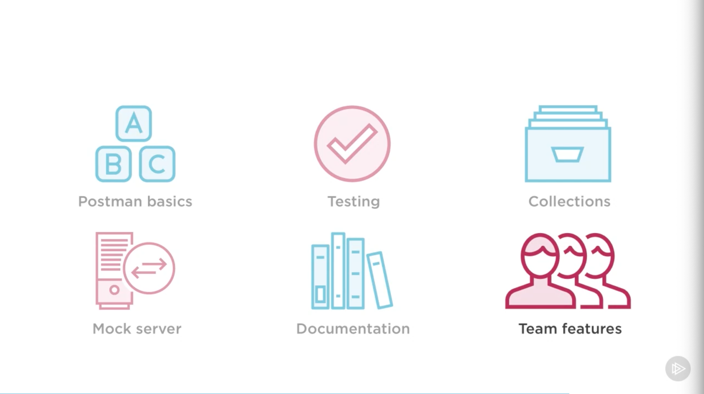

# [Postman Fundamentals, Nate Taylor, 2020-04-17](https://app.pluralsight.com/library/courses/postman-fundamentals/table-of-contents)

## Course Overview

### Course Overview

- 

## Setting the Stage

### Setting the Stage

### Getting Started: Postman

- Install Postman
  - Chrome app
    - chrome://apps &rarr; Webstore &rarr; Postman
    - Enables access to Postman across all machines using Chrome
  - Standalone
    - https://www.getpostman.com

### Getting Started: API

- Install Git
  - https://git-scm.com/downloads
    Install Node.js (with default options)
  - https://nodejs.org
- Clone course project
  - git clone https://github.com/taylonr/postman
- Run `npm install` in the project.

### The Path Ahead

- 

## Postman Basics

### Postman Basics

- Run `npm run start:dev`
  - Runs on 3000

### GETting Books

- Navigate to http://localhost:3000/landing
- Launch Postman
- GET `localhost:3000/books` with the header, `G-TOKEN`: `ROM831ESV`
  - Defaults to `Pretty` view; can display `Raw` data.
  - Note: Shows `Status: 200 OK`
    - Hover for info.
  - `Time`: 89 ms
  - `Size`: 3.68 KB
    - Hover: Can see body, header
- GET `localhost:3000/books/1`
- GET `localhost:3000/books/search`
  - Params:
    - `title`: `waste`
    - Note: Updates query string
  - Params:
    - `author`: `a`
    - Note: Can uncheck individual params.
- Add a new tab.
  - GET `localhost:3000/books` with the header, `G-TOKEN`: `ROM831ESV`
  - Next to `Send`, use dropdown to select `Send and Download` to save the response.

### Adding a New Item to Inventory

- POST `localhost:3000/books`
  - Headers
    - `G-TOKEN`: `ROM831ESV`
    - `Content-Type`: `application/json`
  - Body as `raw`
- (again)

```json
{
  "title": "You Are What You Love: The Spiritual Power of Habit",
  "author": "James K.A. Smith",
  "isbn": "158743380X",
  "releaseDate": "2016-03-05"
}
```

### History

- DELETE `localhost:3000/books/6`, with `G-TOKEN` header `ROM831ESV`.
  - Returns `401 Unauthorized`.
- `Authorization` tab &rarr; Basic Auth
  -

### Authorization

-

### Preset Headers

### Environments

### Import

### Proxy

### Generating Code

### Sync

### Summary

## Testing Requests

### Testing Requests

### Meet the API Team

### Pre-built Tests

### Test Syntax

### Basic Tests

### Using Other Libraries

### Summary

## Collections

### Collections

### Using Tests on the Front End

### Creating Collections

### Collection Runner

### Using Variables

### Pre-request Scripts

### Data Files

### Initializing Test Data

### Refactor: Loop Over Users

### Refactor: Loop Over Wishlists

### Scenario Tear Down

### Running Your Refactored Collection

### Executing Tests

### Testing from the Command Line

### Summary

## Mock Server

### Mock Server

### Faking out Data

### First Mock

### Additional Responses

### Mocking a Feature

### Mocking Response Codes

### Postman Matching Algorithm

### Summary

## Documentation

### Documentation

### The Need for Documentation

### Documenting a Collection

### Detailed Request Documentation

### Publishing Documentation

### Custom Theme

### Recap

## Team Tools

### Team Tools

### Setting up Postman Pro

### Sharing Collections

### Postman Integrations

### Pro API

### Course Review
