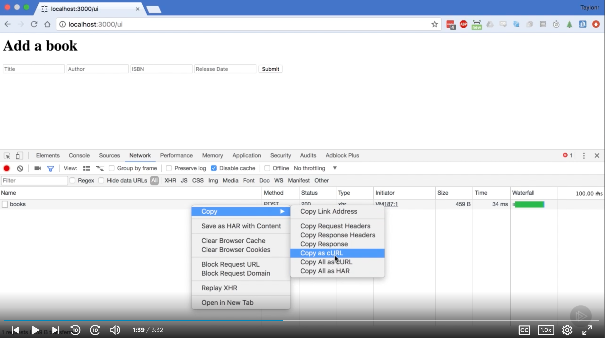

# [Postman Fundamentals, Nate Taylor, 2020-04-17](https://app.pluralsight.com/library/courses/postman-fundamentals/table-of-contents)

## Course Overview

### Course Overview

- 

## Setting the Stage

### Setting the Stage

### Getting Started: Postman

- Install Postman
  - Chrome app
    - chrome://apps &rarr; Webstore &rarr; Postman
    - Enables access to Postman across all machines using Chrome
  - Standalone
    - https://www.getpostman.com

### Getting Started: API

- Install Git
  - https://git-scm.com/downloads
    Install Node.js (with default options)
  - https://nodejs.org
- Clone course project
  - git clone https://github.com/taylonr/postman
- Run `npm install` in the project.

### The Path Ahead

- 

## Postman Basics

### Postman Basics

- Run `npm run start:dev`
  - Runs on 3000

### GETting Books

- Navigate to http://localhost:3000/landing
- Launch Postman
- GET `localhost:3000/books` with the header, `G-TOKEN`: `ROM831ESV`
  - Defaults to `Pretty` view; can display `Raw` data.
  - Note: Shows `Status: 200 OK`
    - Hover for info.
  - `Time`: 89 ms
  - `Size`: 3.68 KB
    - Hover: Can see body, header
- GET `localhost:3000/books/1`
- GET `localhost:3000/books/search`
  - Params:
    - `title`: `waste`
    - Note: Updates query string
  - Params:
    - `author`: `a`
    - Note: Can uncheck individual params.
- Add a new tab.
  - GET `localhost:3000/books` with the header, `G-TOKEN`: `ROM831ESV`
  - Next to `Send`, use dropdown to select `Send and Download` to save the response.

### Adding a New Item to Inventory

- POST `localhost:3000/books`
  - Headers
    - `G-TOKEN`: `ROM831ESV`
    - `Content-Type`: `application/json`
  - Body as `raw`
- (again)

```json
{
  "title": "You Are What You Love: The Spiritual Power of Habit",
  "author": "James K.A. Smith",
  "isbn": "158743380X",
  "releaseDate": "2016-03-05"
}
```

### History

### Authorization

- DELETE `localhost:3000/books/6`, with `G-TOKEN` header `ROM831ESV`.
  - Returns `401 Unauthorized`.
- `Authorization` tab &rarr; Basic Auth
  - Username: `admin`
  - Password: `admin`
- Note that an `Authorization` header was added.
  - Key: `Authorization`
  - Value: `Basic YWRtaW46YWRtaW4=` (base64-encoded `admin` and `admin`)
- Now it returns a 204 (nothing to return). Book 6 was deleted.

### Preset Headers

- If you re-use tabs, the headers will be preset.
- But if you open a new tab, you have to re-supply the headers.
- Postman provides a way to
- Headers > Presets > Manage Presets
  - Add Header Preset
    - 
    - 

### Environments

- What if you need different values by environment?
- Run the test environment in a new terminal: `npm run start:test`
  - Launches a new instance at localhost:3030.
- We can control parts of the URL via environments.
  - We're not currently in an environment.
    - 
  - Manage Environments
    - 
    - 
    - Can copy, download, or delete
      - 
      - Download: Can save, share, import.
  - Supply `host` environment variable in URL via `{{host}}`, use preset `Library` headers, and select an environment.
    - 
    - 
  - Note `Environment quick look`
    - 
  - Team (pro) version: Can share environments with team members.

### Import

- Navigate to http://localhost:3000/ui
- Open up devtools > Network
- Add a book
  - 
- Right click on request > `Copy` > `Copy as cURL`

  - 

    ```sh
    curl 'http://localhost:3000/books' \
      -H 'Connection: keep-alive' \
      -H 'Accept: */*' \
      -H 'g-token: ROM831ESV' \
      -H 'cache-control: no-cache' \
      -H 'Content-Type: application/json' \
      -H 'Origin: http://localhost:3000' \
      -H 'Sec-Fetch-Site: same-origin' \
      -H 'Sec-Fetch-Mode: cors' \
      -H 'Sec-Fetch-Dest: empty' \
      -H 'Referer: http://localhost:3000/ui' \
      -H 'Accept-Language: en-US,en;q=0.9' \
      -H 'dnt: 1' \
      --data-binary '{"title":"The Bruised Reed","author":"Richard Sibbes","isbn":"0851518404","releaseDate":"1994-03-01"}' \
      --compressed
    ```

  - In Postman: `Import` > `Paste Raw Text`
    - Can be quite helpful when debugging API calls.
    - 

### Proxy

- Another way to generate/capture requests
- Postman > `Capture API requests with Postman`
  - 
  - Proxy Settings
    - Port the proxy wil run on and where to store requests
      - 
      - Click `Connect
    - Can filter requests
      - 
- Get IP address for local computer (e.g., `ipconfig getifaddr en0`)
  - Then we can use this machine as a proxy from a different device (e.g., 192.168.0.10:5555)
  - Could troubleshoot requests from an app, etc.
- (Turn proxy off.)

### Generating Code

- 

### Sync

- Syncing information across multiple Postman instances
- `Sign In`
  - 
- Once signed in, Postman will sync (presets, environments, etc.) across multiple computers.

### Summary

## Testing Requests

### Testing Requests

### Meet the API Team

### Pre-built Tests

- 
- 
- 
- 
- 
- Multiple tests can be performed on a single request/response combination.

### Test Syntax

- 
- `pm` works like a Postman namespace.
- `test()` takes 2 parameters
  - Test name
  - Function
    - Body: Verifies data
    - Can mentally prepend 'expect'
  - `info`
    - Information about script being executed (e.g., request ID)
  - pm.globals
  - pm.environment
  - Response
    - assertions
      - have.status
      - have.header
      - have.body
      - have.jsonBody
  - https://learning.postman.com/docs/writing-scripts/

### Basic Tests

- 

  ```js
  pm.test('Status code is 200', function () {
    pm.response.to.have.status(200);
  });

  pm.test('Status code name has string', function () {
    pm.response.to.have.status('OK');
  });

  pm.test('Returns 8 books', function () {
    const books = pm.response.json();
    pm.expect(books.length).to.equal(8);
  });

  pm.test('All books should have a title', function () {
    const books = pm.response.json();
    pm.expect(
      books.every((book) => {
        return book.title !== undefined;
      }),
    ).to.be.true;
  });

  const titleIsDefined = (book) => {
    return book.title !== undefined;
  };

  pm.test('All books should have a title, more concise', function () {
    const books = pm.response.json();
    pm.expect(books.every(titleIsDefined)).to.be.true;
  });
  ```

### Using Other Libraries

- Example: Use moment.js to verify creation timestamp.

- POST http://localhost:3000/books

  ```json
  {
    "title": "The Drama of Doctrine",
    "author": "Kevin Vanhoozer",
    "publicationDate": "2005-08-02",
    "isbn": "064223273"
  }
  ```

- 

  ```js
  const moment = require('moment');

  pm.test('Create date is equal to today', function () {
    const data = pm.response.json();

    pm.expect(moment(data.createdAt).format('MM/DD/YYYY')).to.equal(
      moment().format('MM/DD/YYYY'),
    );
  });
  ```

- Lodash is already exposed via a global `_`. E.g.:

  ```js
  const moment = require('moment');

  pm.test('Create date is equal to today', function () {
    // const data = pm.response.json();
    const data = _.result(pm, 'response.json');

    pm.expect(moment(data.createdAt).format('MM/DD/YYYY')).to.equal(
      moment().format('MM/DD/YYYY'),
    );
  });
  ```

- Available libraries
  - 
  - Note that Postman is limited to these (or [these](https://postman-quick-reference-guide.readthedocs.io/en/latest/libraries.html)) libraries.
  - Available Node.js modules:
    - 

### Summary

## Collections

### Collections

### Using Tests on the Front End

### Creating Collections

### Collection Runner

### Using Variables

### Pre-request Scripts

### Data Files

### Initializing Test Data

### Refactor: Loop Over Users

### Refactor: Loop Over Wishlists

### Scenario Tear Down

### Running Your Refactored Collection

### Executing Tests

### Testing from the Command Line

### Summary

## Mock Server

### Mock Server

### Faking out Data

### First Mock

### Additional Responses

### Mocking a Feature

### Mocking Response Codes

### Postman Matching Algorithm

### Summary

## Documentation

### Documentation

### The Need for Documentation

### Documenting a Collection

### Detailed Request Documentation

### Publishing Documentation

### Custom Theme

### Recap

## Team Tools

### Team Tools

### Setting up Postman Pro

### Sharing Collections

### Postman Integrations

### Pro API

### Course Review
